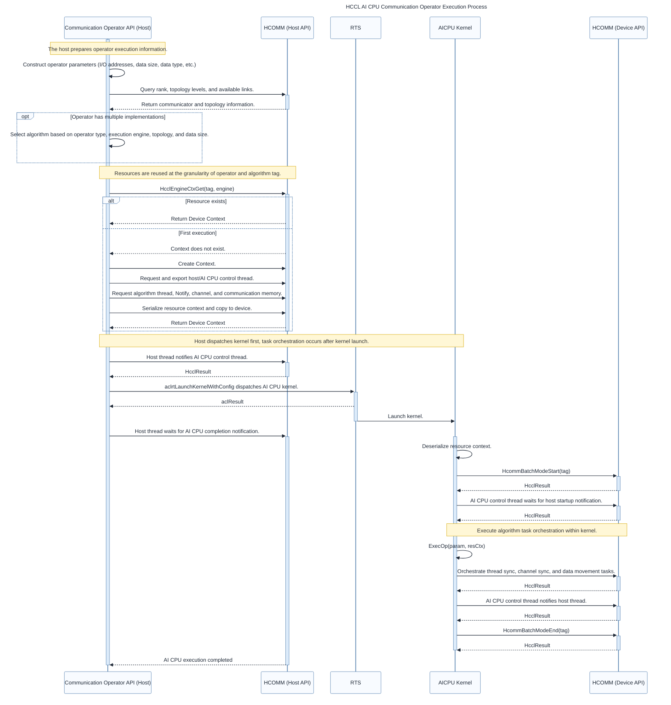

# Overall Process

<!-- md-trans-meta sourceCommit=4bce6591eb0a4898412343ee53a224437de00bfe translatedAt=2026-08-11T07:05:35.687Z pushedAt=2026-08-20T11:39:14.561Z -->

The development and execution of HCCL AI CPU communication operators are divided into two phases: preparation on the host and execution on the AI CPU. The host is responsible for parsing the topology, selecting algorithms, allocating resources, and delivering AI CPU kernels. After the kernel is launched, the AI CPU performs task orchestration based on the resource context. Therefore, **kernel delivery occurs first, and task orchestration follows**.

The main responsibilities of each phase are as follows:

1. **Define the operator API**: Specify the input and output, data size, data type, communicator, execution stream, and other information.
2. **Query topology information**: Obtain the number of ranks, topology levels, intra-level connections, and available links to provide a basis for algorithm selection and resource computation.
3. **Select algorithms**: Select a registered algorithm implementation based on conditions such as the operator type, execution engine, topology, data size, and data type. This step can be omitted for custom operators that have only one fixed implementation.
4. **Create resources**: Compute and allocate threads, Notify resources, channels, communication memory, and resource context, and copy the context required for AI CPU execution to the device.
5. **Dispatch kernels**: The host establishes a startup synchronization relationship with the AI CPU control thread, and then dispatches the AI CPU kernel to the execution stream.
6. **Orchestrate tasks**: After the AI CPU kernel starts and obtains the resource context, it calls the algorithm execution logic to orchestrate operations such as thread synchronization, channel synchronization, and data movement onto the corresponding threads.
7. **Complete synchronization**: After the AI CPU completes orchestration, it notifies the host. The host waits for this notification to ensure the execution order between the communication task and the service flow.
