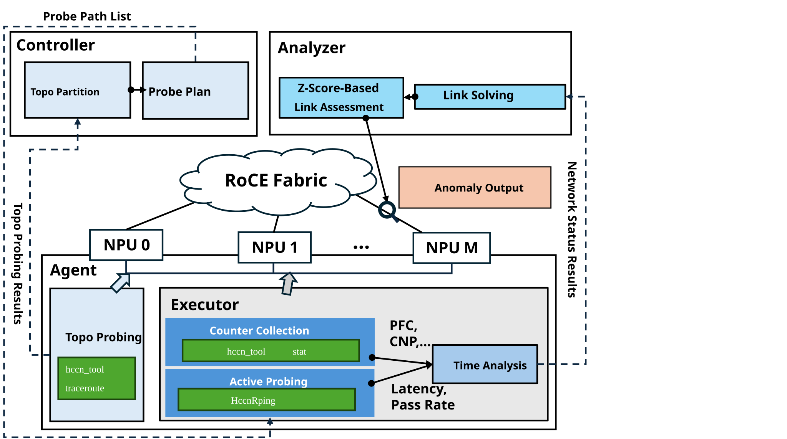
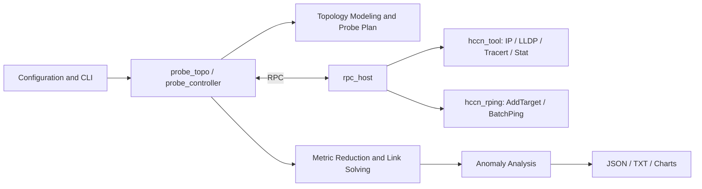
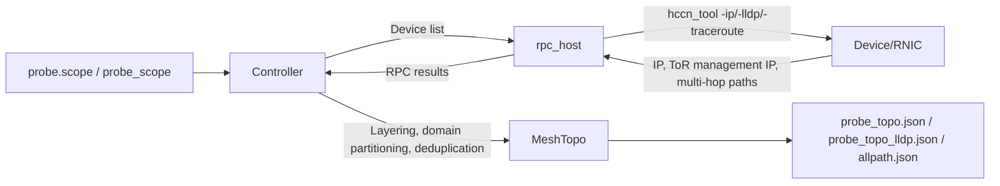
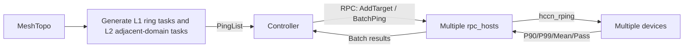
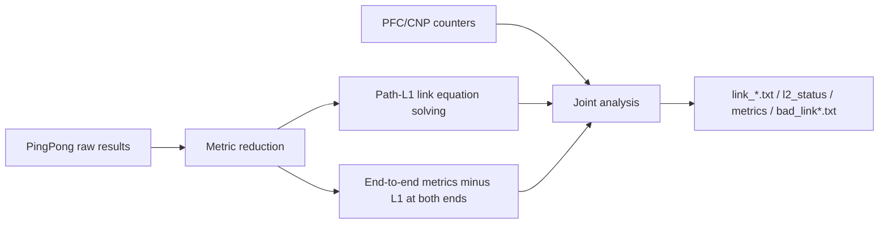

# RFC: Topology-Based Cluster Communication Rapid Sub-Health Monitoring

- Start date: 2026-06-01
- Revision dates: 2026-07-13, 2026-08-10
- RFC PR number: 2491
- Related issues: 249, 261
- Status: accept

## Summary

This RFC proposes a "layered, domain-based minimum-cost network probing + link-level fault localization" scheme for RoCE lossless clusters. The system identifies relationships among devices, hosts, ToR/Leaf switches, and upper-level network domains through topology discovery. It uses solvable ring-path sets within each domain and constructs probing tasks between adjacent domains on demand. The system then combines HCCN PingPong path latency and pass rates with RNIC PFC and CNP counters to produce L1 link metrics, L2 path metrics, and abnormal link candidates.

This document defines the target design and user contract for this feature. Items that have not yet been validated in production or aligned with the implementation are explicitly marked as "release gate" or "to be confirmed" and are not considered capabilities of the current version.

## 1. Background and Motivation

### 1.1 Problem

A stable, high-speed network is the foundation of HCCL performance. Link jitter, congestion, intra-host bottlenecks, and configuration deviations cause long-tail latency in collective communication, training job slowdowns, and even interruptions. Existing monitoring approaches have the following limitations:

1. Full PingMesh probing scales quadratically with cluster size, resulting in high overhead.
2. Only end-to-end latency or packet loss is observed, making it impossible to attribute anomalies to specific access links.
3. Static thresholds do not adapt to different scales, layers, and load phases, leading to high false-positive rates.
4. A single control node collects data serially, which easily creates a control-plane bottleneck in large-scale clusters.

### 1.2 Four Problem Categories to Address

| ID | Problem | Approach in This Scheme |
| --- | --- | --- |
| Q1 | Complex topology awareness | Discover observable layers and local meshes of Spine-Leaf, HammingMesh, and 3D-Torus topologies based on Tracert and LLDP |
| Q2 | Network metric collection | Generate a solvable minimum probing set; collect P90/P99/Mean latency, pass rates, and PFC/CNP counters |
| Q3 | Anomaly analysis and localization | Solve path-link equations for L1; output cross-domain path metrics after subtracting access link metrics for L2; apply time-series anomaly detection |
| Q4 | Large-scale adaptability | Use layered, domain-based design with parallel host execution and control-plane aggregation to avoid global full-mesh probing |

### 1.3 Use Cases

- During large-scale distributed training, assist in locating latency jitter, throughput drops, and communication long-tail issues in collective communication operations such as AllReduce and RingAllReduce.
- In RoCE networks, detect link flapping, congestion, switch or NPU packet loss, and hash collisions.
- Perform network baseline checks before training jobs start, or run continuous low-frequency inspections during job execution.

### 1.4 Non-Goals

- Do not replace switch telemetry, NMS, or alerting platforms.
- Do not directly modify the HCCL/HCOMM data plane, QP creation process, or communication topology of training jobs.
- The current version does not guarantee unique localization of all L2 anomalies to a single physical switch link. L2 output provides path-level or communication-pair-level candidates first.

## 2. Glossary

| Term | Definition |
| --- | --- |
| Device / NPU | An accelerator that participates in HCCL communication and has HCCN/RNIC ports |
| Host | A server node that manages one or more devices and runs `rpc_host` |
| Controller | A central control node that runs `probe_topo`, `probe_controller`, and deployment scripts |
| Leaf / ToR | The top-of-rack switch to which devices connect; this document treats both as the same access-layer concept |
| L1 link | The access link from a device/RNIC to its directly connected Leaf/ToR; the current implementation can resolve this to link level through path equations |
| L2 path | The network segment between two different Leaf/ToR domains. The current implementation computes "end-to-end P99 latency minus the resolved L1 values at both ends" and does not correspond to a single physical link |
| Mesh | A group of nodes or sub-domains that share a parent network structure at the same network layer and can be modeled with a local path set |
| Probe path | A Tracert or PingPong path from a source device to a destination device using a specified source port |
| PingList | The set of PingPong tasks that the controller distributes to each source device; each element contains a source IP, destination IP, and source port |
| Sub-health | A state in which the network remains connected but latency, pass rates, or congestion counters persistently deviate from the same-layer baseline and have affected or may affect service performance |
| Slow fault | A fault that does not manifest as a complete outage but instead shows persistent or intermittent high latency, low throughput, retransmissions, or congestion |
| Long tail | A condition in which high-percentile latency such as P99 is significantly higher than the mean or median, causing synchronous collective communication to be slowed by the slowest path |
| 3σ | An anomaly threshold constructed as `μ + 3σ` using the mean `μ` and standard deviation `σ` of a time-domain or spatial-domain baseline |
| Turn | One complete cycle of PingPong sampling, metric reduction, link solving, and anomaly detection |

## 3. Overall Architecture and Data Flow

### 3.1 Two-Layer Architecture



The system consists of two layers:

- Controller layer: Parses configurations, discovers topology, generates the PingList, distributes tasks in parallel, aggregates results, solves link metrics, and produces artifacts.
- Host layer: Runs `rpc_host`, calls `hccn_tool` and `hccn_rping` to execute device-side probing, collects RNIC counters, and returns results through RPC.

The module relationships are summarized as follows:



### 3.2 Topology Discovery Flow



### 3.3 Network Probing Flow



### 3.4 Anomaly Localization Flow



The data direction is uniformly `Device → Host → Controller → Artifacts`; control commands and task distribution flow in the opposite direction.

## 4. Interface Design (User-Facing)

### 4.1 Build and Environment

```bash
cd <repo_dir>

export THIRDLIB_ROOT=/usr/local/third_lib
export ASCEND_HOME_PATH=/usr/local/Ascend
export ASCEND_CANN_PATH=/usr/local/Ascend/ascend-toolkit/latest/aarch64-linux
source "$THIRDLIB_ROOT/share/disp_probe/third_party/env.sh"

cmake -S . -B build \
  -DTHIRDLIB_ROOT="$THIRDLIB_ROOT" \
  -DCMAKE_BUILD_TYPE=Release
cmake --build build -j"$(nproc)"
```

### 4.2 Configuration File

The user uses a JSON file to describe the deployment topology, probe scope, and runtime parameters. `schema_version=2` is the current recommended format; the default `schema_version` or `schema_version=1` remains backward compatible with the legacy format.

```json
{
  "schema_version": 2,
  "controller": "node-01",
  "deploy": {
    "default_ssh_port": 22,
    "default_timeout": 5,
    "to_path": "~/disp_probe",
    "from_path": "."
  },
  "hosts": [
    {
      "id": "node-01",
      "ip": "10.90.15.67",
      "user": "root",
      "ssh_key": "/root/.ssh/id_ed25519"
    },
    {
      "id": "node-02",
      "ip": "10.90.15.69",
      "user": "root",
      "password_env": "NODE_02_PASS"
    }
  ],
  "probe": {
    "scope": {
      "node-01": {"device_range": [0, 3]},
      "node-02": {"devices": [4, 5, 6, 7]}
    },
    "topology": {
      "sport_begin": 49152,
      "sport_count": 32,
      "tree_probe_sport_count": 1,
      "topology_optimized": true,
      "l2_path_aware": true,
      "output_subdir": "",
      "allpath_output": "allpath.json",
      "l2_path_output": "l2_fullmesh_path.json"
    },
    "pingpong": {
      "times": 50,
      "turns": 1000,
      "payload_len": 12,
      "interval_ms": 1
    }
  }
}
```

| Field | Type/Default | Description and Constraints |
| --- | --- | --- |
| `schema_version` | int / `1` | Configuration format version; defaults to v1 if absent; `2` enables the current recommended format |
| `controller` | string / required (v2) | The controller node host ID; must reference `hosts[].id` |
| `hosts` | array / required (v2) | Host inventory; `id` is a stable identifier and `ip` is the connection address; both must be unique |
| `hosts[].user` | string / `root` | SSH login user |
| `hosts[].ssh_key` | string / nullable | SSH private key path; backward compatible with the legacy name `key_filename`. When configured together with `password_env`, the SSH connection receives the private key path and attempts key/agent/local key authentication first |
| `hosts[].password_env` | string / nullable | Reads the SSH password from an environment variable to avoid writing plaintext in the configuration. When configured together with `ssh_key`, this password is passed to SSH for password authentication or as an encrypted private key passphrase; it also serves as the `su` fallback password when `su_password` is not configured |
| `deploy.default_ssh_port` | int / `22` | SSH port |
| `deploy.default_timeout` | int / `5` | Dispatcher SSH connection timeout in seconds |
| `deploy.control_topo` | array/object / nullable | The host tree for distribution and remote execution; in v2, host IDs can be used and are resolved to IPs during parsing |
| `deploy.to_path` | string / required | Remote deployment root directory; `~` is expanded for the control user |
| `deploy.from_path` | string / `"."` | Local source path; used as the default local sync source directory for the Dispatcher |
| `probe.scope` | object / required (v2) | The unique probe scope; keys are host IDs; values can be `{"device_range":[begin,end]}` or `{"devices":[...]}` |
| `probe.topology.sport_begin` | positive int / `49152` | Optional; Tracert source port start value |
| `probe.topology.sport_count` | positive int / `1` | Optional; number of source ports per directed pair for cross-domain multi-path coverage |
| `probe.topology.tree_probe_sport_count` | positive int / `1` | Optional; number of source ports per pair during ring-topology skeleton discovery |
| `probe.topology.topology_optimized` | bool / `true` | Optional; `true` uses adjacent-domain same-slot ring coverage; `false` uses cross-domain full-mesh Tracert |
| `probe.topology.l2_path_aware` | bool / `true` | Optional; whether to generate additional L2 path discovery artifacts between adjacent L1 domains |
| `probe.topology.output_subdir` | string / `""` | Optional; a relative directory under `output/`; must not be an absolute path and must not contain `.`, `..`, or empty path segments |
| `probe.topology.allpath_output` | filename / `allpath.json` | Optional; cross-domain path JSON filename; must not contain parent directory references |
| `probe.topology.l2_path_output` | filename / `l2_fullmesh_path.json` | Optional; L2 path JSON filename; must not contain parent directory references |
| `probe.pingpong.times` | positive int / `50` | Optional; number of samples per PingPong task per turn |
| `probe.pingpong.turns` | positive int / `1000` | Optional; number of PingPong turns; the actual cycle also includes execution, RPC, and solving time |
| `probe.pingpong.payload_len` | int / `12` | Optional; HCCN Rping payload size in bytes, range `1-1500`. Each target independently generates random bytes of the specified length during AddTarget; the payload is not treated as a string |
| `probe.pingpong.interval_ms` | positive int / `1` | Optional; HCCN Rping probe interval in milliseconds |

The v1-compatible format continues to support the legacy `deploy.host_to_user_pair`, `deploy.controller`, `probe_scope`, `probe_topo.tracert`, and `probe_controller.pingpong` fields. The compatibility mapping is as follows:

| v1 Field | v2 Field | Description |
| --- | --- | --- |
| `deploy.host_to_user_pair` | `hosts[]` | Host IP, user, and password/key configuration migrated to the host inventory; v2 uses `hosts[].id` as a stable reference |
| `deploy.controller` | `controller` | v1 uses a controller node IP-to-user mapping; v2 uses the controller node host ID |
| `deploy.host_to_key_filename` | `hosts[].ssh_key` | v2 consolidates private key paths into the corresponding host entry |
| `probe_scope` | `probe.scope` | v1 keys are host management IPs; v2 keys are host IDs and support `device_range` or explicit `devices` |
| `probe_topo.tracert` | `probe.topology` | Tracert topology discovery parameters remain compatible; field name prefix adjusted |
| `probe_controller.pingpong` | `probe.pingpong` | PingPong probe parameters remain compatible; field name prefix adjusted |

In v2, `probe.scope` is required; `probe.topology` and `probe.pingpong` are optional and use the default parameters from the table above when omitted. Run `./run.sh migrate-config old.json new.json` to generate a v2 configuration template.

### 4.3 CLI and Execution Order

#### 4.3.1 `rpc_host`

| Parameter | Description |
| --- | --- |
| `-f, --file <PATH>` | Control JSON, default `./control_json/910b2_info.json` |
| `-d, --dev <IFACE>` | Host management network interface name |
| `-i, --ip <IP>` | Host management IP |
| `-p, --port <PORT>` | RPC listening port |
| `--pingpong-local-log` | Save local PingPong result logs on each host; disabled by default |
| `--pingpong-log-dir <PATH>` | Local log root directory, default `/root/output` |

#### 4.3.2 `probe_topo`

| Parameter | Description |
| --- | --- |
| `-f, --file <PATH>` | Control JSON; execute topology discovery and generate topology artifacts |

#### 4.3.3 `probe_controller`

| Parameter | Description |
| --- | --- |
| `-f, --file <PATH>` | Control JSON |
| `--print-pingpong-plan` | Print the task plan only; do not distribute the PingList or execute PingPong |
| `--l1-only` | Probe and solve L1 only; disable L2 FullMesh tasks and L2 output |
| `--no-metrics` | Disable PFC/CNP counter collection |

Recommended execution order:

```bash
# Terminal 0: Clean up residual processes, distribute binaries and configuration, start rpc_host
./run.sh deploy

# Optional: Enable NPU-side PingPong local logging when starting rpc_host
./run.sh deploy --pingpong-log /root/output

# Equivalent expanded steps:
python3 ./dispatcher/exec_realtime_cmd.py "ps aux | grep 'rpc_host' | grep -v grep | tr ' ' '\n' | grep -E '^[0-9]+$' | tr '\n' ' ' | xargs -r kill"

python3 ./dispatcher/disp_file_scp.py './build/rpc_host' './bin/rpc_host'
python3 ./dispatcher/disp_file_scp.py \
  './control_json/910b2_info.json' './control_json/910b2_info.json'

python3 ./dispatcher/exec_realtime_cmd.py -l \
  './bin/rpc_host -f ./control_json/910b2_info.json'

# Terminal 1: Discover topology
./build/probe_topo -f ./control_json/910b2_info.json

# Terminal 1: Continuous probing and analysis
./build/probe_controller -f ./control_json/910b2_info.json
```

`disp_file_scp.py` recursively determines distribution targets based on `deploy.control_topo`; only when this field is empty does it use all hosts from `host_to_user_pair`.

### 4.4 Artifact Contract

#### 4.4.1 Topology Discovery Artifacts

| Artifact | Format | Content |
| --- | --- | --- |
| `output/<subdir>/probe_topo.json` | JSON | Network layers and mesh skeleton discovered by ring Tracert |
| `output/<subdir>/probe_topo_lldp.json` | JSON | L1 domain topology aggregated by LLDP management IP; the default topology input for `probe_controller` |
| `output/<subdir>/allpath.json` | JSON | Cross-domain pairs, port samples, multi-hop IPs, empty paths, and unique path statistics |
| `output/<subdir>/l2_fullmesh_path.json` | JSON | L2 path discovery results between adjacent L1 domains; generated only when `l2_path_aware=true` |

The topology JSON uses `status` to indicate device count completeness: `complete` when the number of discovered devices matches the probe scope configuration (v2 `probe.scope` or v1 `probe_scope`); `incomplete` when they do not match. The JSON also records `configured_device_count`, `discovered_device_count`, the configured device list, and the discovered device IP list. Completeness compares only device counts and does not change `status` based on LLDP domain count, empty path rate, or path coverage rate.

#### 4.4.2 Network Status Artifacts

```text
output/<time>/
├── link_lat.txt
├── link_pass_rate.txt
├── bad_link.txt
├── bad_link_candidate.txt
├── l2_status/
│   ├── l2_path_lat.txt
│   └── l2_path_passrate.txt
└── metrics/
    ├── mac_tx_pfc_pkt_num.txt
    ├── mac_rx_pfc_pkt_num.txt
    ├── roce_tx_cnp_pkt_num.txt
    └── roce_rx_cnp_pkt_num.txt
```

| Artifact | Format Contract |
| --- | --- |
| `link_lat.txt` | The first row contains fixed-width L1 link column names `[device_ip-tor_ip]`; each subsequent row contains floating-point latency values for one turn |
| `link_pass_rate.txt` | Column order matches `link_lat.txt`; value range target is `[0,1]` |
| `bad_link.txt` | Text alerts; each row contains alert type, link endpoints, latency, and pass rate; multiple links can appear separately in the same turn |
| `bad_link_candidate.txt` | Latency candidate events; written when either the time-domain or spatial-domain 3σ condition exceeds the threshold for 3 consecutive valid turns; not equivalent to a persistent alert |
| `l2_path_lat.txt` | Tab-separated: `turn, task_index, tag, from_label, from_ip, to_label, to_ip, src_sport, l2_path_lat` |
| `l2_path_passrate.txt` | Tab-separated; the last column is `pass_rate`; remaining fields are the same as above |
| `metrics/*.txt` | CSV: `time,port,value,valid`; `port` is formatted as `<host>_dev<id>`. When all four counter fields are parsed successfully, `valid=true`; when a key is missing, a value is non-numeric, or a command fails, the value is set to `0` as a placeholder and `valid=false`; the sampling interval is approximately 1 second |

Run `python3 ./plot/topo_plot.py` and `python3 ./plot/status_plot.py --input-dir "output/<time>"` to generate topology and status charts. Charts are derived artifacts; JSON/TXT/CSV are the stable data interfaces.

## 5. External Dependencies

### 5.1 Runtime Interfaces Within the Ecosystem

| Dependency/Interface | Invocation | Purpose | Input Convention | Output and Parsing Convention | Stability Source | Known Limitations |
| --- | --- | --- | --- | --- | --- | --- |
| HCCN Device IP | `hccn_tool -i <dev> -ip -g` | Maps device ID to HCCN IP | `<dev>` is the local non-negative device ID | Parse tool output line by line and extract valid IPs; missing or format changes are treated as query failures for that device | Assumed based on current CANN tool implementation | Text format has no versioned schema |
| LLDP Neighbor | `hccn_tool -i <dev> -lldp -g` | Obtain the directly connected Leaf/ToR management IP | Same as above | Extract the switch management IP; null values are assigned to the `unknown:<device>` domain | Assumed based on current implementation | Domain partitioning is unreliable when LLDP is disabled or permissions are insufficient |
| Tracert | `hccn_tool -i <dev> -traceroute ... -sport <port>` | Obtain multi-hop paths | Source device, destination IP, source port | Return an ordered multi-hop IP list; an empty list indicates a failed sample; single-hop results are padded at the controller to preserve path shape | Assumed based on current implementation | TC/DSCP and return-direction port controllability are limited; ECMP coverage depends on source port hashing |
| RNIC Stat | `hccn_tool -i <dev> -stat -g` | Obtain cumulative PFC/CNP counters | Device ID | Parse `mac_tx_pfc_pkt_num`, `mac_rx_pfc_pkt_num`, `roce_tx_cnp_pkt_num`, and `roce_rx_cnp_pkt_num` as `key:value`; the RPC line carries a validity flag; the controller outputs `valid=true/false` | Assumed based on current implementation | When any target key is missing, the value is not an unsigned integer, or the command fails, the entire row has `valid=false`; the value `0` is a placeholder only and is excluded from joint analysis |
| HCCN Rping Initialization | `HccnRpingInit/Deinit` | Initialize the probe context for each device | Local device ID | The return code must indicate success before probing can proceed | CANN/HCCL headers and libraries | The runtime environment must provide a matching version of `libhccl*` |
| HCCN Rping Target Configuration | `HccnRpingAddTarget` | Distribute destination IP, source/return ports | Target IP, source port, receive port, and other parameters | The return code maps to RPC success/failure | Same as above | Target count and port resource limits must be verified per version |
| HCCN Rping Batch Probing | `HccnRpingBatchPingStart/Stop/GetResult/GetPayload` | Execute PingPong and obtain statistics | Device, task set, `times` | Normalized to a `uint64_t` array of `[P90Lat, P99Lat, Mean, Pass]` | Same as above | The raw latency unit must be confirmed by the interface version and documented in the release documentation; current logs display values in ms |

These interfaces are all runtime dependencies on the host. The project does not modify the HCCL/HCOMM data plane and remains consistent with the HCCL-HCOMM decoupling principle; however, the C++ build still requires CANN/HCCL/ACL headers and link libraries and cannot be described as "completely free of compile-time dependencies."

### 5.2 General Third-Party Libraries

| Dependency | Version | Purpose | License | Dependency Stage |
| --- | --- | --- | --- | --- |
| CLI11 | 2.5.0 | C++ CLI parsing | BSD-3-Clause | Compile-time, header-only |
| nlohmann_json | 3.12.0 | JSON configuration and artifacts | MIT | Compile-time, header-only |
| Eigen | 3.4.0 | SVD link equation solving | MPL-2.0 | Compile-time, header-only |
| rpclib | 2.3.0 | Controller-Host RPC | MIT | Compile-time static linking + runtime communication |
| fmt | 12.0.0 | Optional formatting support | MIT | Optional, compile-time |
| spdlog | 1.15.3 | Optional logging support | MIT | Optional, compile-time |
| paramiko | 5.0.0 | Dispatcher SSH | LGPL-2.1-or-later | Python runtime |
| scp | 0.15.0 | File distribution | LGPL-2.1-or-later | Python runtime |
| matplotlib | 3.9.4 | Chart plotting | PSF-based | Python plotting runtime |

Release packages must generate third-party notices from `third_party/manifest.json`, `third_party/python/requirements.txt`, and the actual installed package metadata. If versions or licenses are inconsistent, the release build audit result takes precedence.

## 6. Key Algorithm Design

### 6.1 Layered Domain Partitioning and L1/L2 Definitions

1. Use device IPs and ring Tracert to identify the network layer skeleton.
2. Use LLDP management IPs to aggregate devices into their directly connected Leaf/ToR domains.
3. Define the edges from in-domain devices to the Leaf/ToR as L1 links.
4. Define the remaining network segments between different Leaf/ToR domains as L2 paths. The current design provides only path-level candidates for L2 and does not guarantee unique physical link localization.

### 6.2 Minimum-Cost Topology Probing

Let the cluster have `D` L1 domains in total, where domain `i` has `n_i` devices, the total device count is `N=Σn_i`, and each pair uses `s` source port samples.

- Skeleton discovery: All devices form a directed ring; each device probes the next device. The number of paths is approximately `N × tree_probe_sport_count`, which is `O(N)`.
- Optimized cross-domain coverage: Each domain connects only to the same slot in the next domain. The number of pairs is approximately `Σ min(n_i,n_(i+1))`, and the number of paths is multiplied by `sport_count`. With uniform domain sizes, this is approximately `N × s`, which is `O(Ns)`.
- Non-optimized cross-domain coverage: All devices in different domains form a directed full mesh. The number of pairs is `Σ_{i≠j} n_i n_j = N²-Σn_i²`, which is worst case `O(N²s)`.
- L1 PingPong: Each domain generates tasks based on solvable rings. With uniform domain sizes, this is approximately `O(N)` pairs.
- Current L2 PingPong: Adjacent domains form a ring, and FullMesh is executed between adjacent domains. The number of tasks is `Σ n_i n_(i+1)`; with uniform domain size `k`, this is `Dk²=Nk`. This is not strictly `O(N)`, so the task volume must be reviewed with `--print-pingpong-plan` before deployment, and `--l1-only` should be used when necessary.

"Minimum cost" refers to reducing the number of paths under the constraint that the target link equations remain identifiable. It does not claim that the entire process always has linear complexity.

### 6.3 PingPong Metric Reduction

The raw arrays returned by the host map to the controller metric enumerations as follows:

| Raw `PingpongResult` | Index | Controller `PingpongMetric` | Processing |
| --- | --- | --- | --- |
| `P90Lat` | 0 | `P90Lat` | Convert to `float` |
| `P99Lat` | 1 | `P99Lat` | Convert to `float` |
| `Mean` | 2 | `MeanLat` | Convert to `float`; renamed to avoid confusion with statistical mean |
| `Pass` | 3 | `LogPassRate` | Compute `log2(pass/times)` |
| `Size` | 4 | None | Enumeration sentinel indicating the array field count; not an observed metric |

The pass rate is solved in the log domain:

```text
r_path = pass / times
b_path = log2(r_path)
b_path = Σ log2(r_link)
```

Boundary conventions:

- `times <= 0`: Configuration or invocation error; fail immediately.
- `pass > times`: Data anomaly; the sample is marked invalid and excluded from solving; validation must be implemented before release.
- `pass = 0`: Mathematically `-∞`. The current implementation uses `-1e10` as a finite sentinel for solving; the target implementation should also carry `all_lost=true`, output a final pass rate of `0`, and prevent the sentinel from being misinterpreted as a comparable normal value.
- Missing fields in the raw array: Latency returns `NaN`; the pass rate is currently handled as `pass=0`. The target implementation should uniformly mark such samples as invalid.

### 6.4 L1 Link Solving

Build linear equations for each path sample:

```text
A × x = b
```

- `A[m,n]` indicates whether path `m` traverses L1 link `n`.
- For latency, `b` is the path P99 latency and `x` is the link latency.
- For pass rate, `b` is the `log2` value of the path pass rate; after solving, `exp2` recovers the link pass rate.
- Use Eigen `BDCSVD` to compute the least-squares solution.

The probe plan must ensure that the columns corresponding to target links are identifiable. If the matrix rank is insufficient, the condition number is too large, the input contains invalid samples, or the solution is clearly out of bounds, the link results for that turn must be marked as `NaN/invalid` and no definitive fault conclusion is produced. The current implementation performs SVD rank and condition number checks and returns `NaN` when these checks fail.

### 6.5 L2 Path Metrics

The current L2 latency calculation is:

```text
l2_path_lat = end_to_end_p99 - src_l1_lat - dst_l1_lat
```

When L1 at either end is unsolvable, the output is `NaN`. The L2 pass rate directly uses the end-to-end pair pass rate and does not yet subtract the L1 pass rates at both ends; therefore, the artifact name uses `l2_path_passrate` rather than `l2_link_passrate`.

### 6.6 Anomaly Detection

The target anomaly detection handles latency and pass rate separately. Latency anomalies use two baselines: the time-domain baseline maintains historical statistics per L1 link, and the spatial-domain baseline maintains statistics across all valid L1 links in the same topology layer for the current turn.

1. Exclude `NaN`, all-lost sentinels, and samples in known maintenance windows.
2. Time-domain baseline: For each L1 link, compute the mean `μ_t` and standard deviation `σ_t` using historical valid turns. The current implementation uses cumulative historical statistics; a rolling window or median/MAD can be adopted later.
3. Spatial-domain baseline: Compute the mean `μ_s` and standard deviation `σ_s` across all valid L1 link latencies in the same topology layer for the current turn. Links are no longer filtered by IP string or specific network segment.
4. Latency alert condition: Both `latency > μ_t + 3σ_t` and `latency > μ_s + 3σ_s` must be satisfied simultaneously. After the condition is met for 3 consecutive valid turns, write to `bad_link.txt`.
5. Pass rate anomaly condition: `pass_rate < 0.99`; write an alert immediately when the condition is met. The threshold will be made configurable later.
6. Latency candidate events: When either the time-domain or spatial-domain 3σ condition exceeds the threshold for 3 consecutive valid turns, write to `bad_link_candidate.txt` without generating a persistent alert.
7. PFC/CNP counters are currently collected and stored only and do not participate in alert confidence determination. In the future, when counters increase simultaneously, they can raise the confidence of congestion-type anomalies, but counters are never used as the sole alert condition.

The current code uses mean and standard deviation to maintain L1 link time-domain and spatial-domain baselines.

## 7. Internal Module Implementation

### 7.1 Directory and Responsibilities

```text
disp_probe-main/
├── control_json/       # User configuration samples
├── dispatcher/         # SSH/SCP distribution and remote execution
├── docs/               # RFC, user, and environment documentation
├── plot/               # Topology and status visualization
├── scripts/            # System and third-party dependency installation
├── src/
│   ├── probe_topo.cpp          # Topology discovery entry point
│   ├── probe_controller.cpp    # Probing, solving, and analysis entry point
│   ├── rpc_host.cpp            # Host RPC service
│   └── util/
│       ├── helper/             # Workflow coordination, PingList, equation solving
│       ├── topo/               # Configuration, control topology, MeshTopo
│       ├── tool/               # Tracert, PingPong, metric collection
│       ├── rpc_call/           # RPC proxy
│       └── file_path/          # Working directory management
└── third_party/        # Dependency manifest
```

### 7.2 Cross-Module Contracts

The RFC retains only signatures that cross module or process boundaries; purely internal getters and setters are not listed.

```cpp
using PingpongRawResult =
    std::vector<std::vector<std::vector<uint64_t>>>; // device -> task -> metric
using PingpongMetricMatrix =
    std::vector<std::vector<float>>;                 // device -> task
using LinkMetricVector = std::vector<float>;         // link_global_id -> value

using HccnDeviceIpListParallel =
    std::function<std::vector<std::vector<std::string>>(
        const std::vector<std::string>& control_devices,
        const std::vector<int>& device_counts)>;

MeshTopo& probe_topo_ring();
MeshTopo& probe_topo();
std::map<std::string, std::vector<std::tuple<std::string, std::string, int>>>&
get_pinglist();
void set_pinglist(const PingList& pinglist);
PingpongRawResult get_pingpong_res(int times);
PingpongMetricMatrix reduce_pingpong_res(
    const PingpongRawResult&, PingpongMetric, int times);
LinkMetricVector solve_pingpong_res(
    const PingpongMetricMatrix&, const PingList&);
```

Differences between `probe_topo_ring()` and `probe_topo()`:

| Interface | Behavior | Use Case |
| --- | --- | --- |
| `probe_topo_ring()` | Executes only `gen_topo()` to generate the layer/mesh skeleton from ring Tracert | New configuration path; `probe_topo.cpp` subsequently supplements artifacts with LLDP and explicit cross-domain probing |
| `probe_topo()` | Executes `gen_topo()`, in-domain `mesh_full_trace()`, `gen_pinglist()`, supplementary Tracert, and link ID assignment | Legacy configuration compatibility path or when a complete solving state must be constructed in one pass |

Host RPC boundary:

```cpp
std::vector<std::vector<std::vector<std::string>>>
tracert_ports_multi_by_src_ip_with_sport_begin(
    std::string src_dev_ip,
    std::vector<std::string> targets,
    std::vector<int> port_num,
    int sport_begin);

int pinglist_insert_muti(
    std::string src_dev_ip,
    std::vector<std::string> target_dev_ips,
    std::vector<int> src_ports,
    std::vector<int> return_ports,
    int rx_num);

std::vector<std::vector<uint64_t>>
ud_pingpong_tx_muti(std::string src_dev_ip, int times);

std::vector<std::string> get_metrics_counter_name();
std::vector<std::vector<uint64_t>> get_metrics_counter_value();
```

### 7.3 `metrics_collector` and Analysis Module Responsibilities

- `metrics_collector`: Calls `hccn_tool -stat -g` every second and parses four types of cumulative PFC/CNP counters. The in-memory queue retains up to 100 rows and is cleared after the controller pulls the data. Read errors are currently swallowed and zero values are written; the target implementation should return a validity status and error reason.
- Analysis logic (in `probe_controller.cpp`): Maintains time-domain and spatial-domain baselines, detects latency/pass-rate anomalies, and outputs `bad_link.txt` and `bad_link_candidate.txt`. PFC/CNP counters are currently collected and stored only and do not participate in alert confidence determination.

## 8. Impact Analysis

### 8.1 Production Intrusion Impact

| Resource | Impact Source | Control Measures |
| --- | --- | --- |
| NPU/RNIC | HCCN Rping initialization, AddTarget, probe packet transmission and reception | Limit per-device task count and `times`; run `--print-pingpong-plan` before deployment; support `--l1-only` |
| Network bandwidth | Tracert and PingPong packets | Topology discovery runs at low frequency; status probing is domain-partitioned; configure probe intervals; stop sending when budget is exceeded |
| Collective communication latency | Probe traffic competes with production traffic for queues, hash paths, and port resources | A/B validation; gradual rollout; avoid full topology discovery during peak business hours |
| Host CPU/memory | RPC, SSH, result aggregation, 1-second counter polling | Host-level parallelism; counter queue capped at 100; monitor controller/host CPU and RSS |
| File system | Long-turn text artifacts grow continuously | Rotate by time directory; apply retention policies and compression; configure disk quotas before release |

### 8.2 Further Evaluation

For each RNIC, assuming 500 B probe packets are sent every 1 ms per turn over a 100 Gbps network, the bandwidth utilization is less than one thousandth. The scheme is further validated through multi-host hccl_test to demonstrate that the impact of probe traffic on hccl task completion time is less than 1%. The default probe cycle sends probe packets every 1 ms for `turns` consecutive turns, with `times` samples per turn.

### 8.3 Failure Modes and Degradation

| Failure Mode | Detection | Handling and Degradation | Artifact Semantics |
| --- | --- | --- | --- |
| Tracert failure/empty path | Empty hop list, timeout, or non-zero status returned | Retry limited times for the pair/port; if still failing, mark as unmeasured rather than guessing the path; terminate topology release when the empty path rate exceeds the threshold | `allpath.json` records empty samples and statistics |
| RPC timeout | Client exception or no response | Isolate the single host; other hosts continue; exponential backoff retry; do not treat timeouts as packet loss | Corresponding samples are `invalid` |
| Partial host unreachability | SSH/RPC health check failure | Remove from the current turn scope and report coverage; if matrix identifiability is compromised, stop link solving | Output the missing host list |
| Incomplete topology discovery | Discovered device count does not match the probe scope configuration count | `probe_topo` writes diagnostic artifacts and stops subsequent LLDP/path probing; `probe_controller` refuses to execute PingPong and alerting | Topology marked `status=incomplete`; configured and discovered counts recorded; LLDP domain or path coverage completeness is no longer checked |
| Counter read error | Missing key, non-numeric value, or command failure | Sample marked `valid=false`; excluded from joint analysis; the main probe flow continues | `metrics/*.txt` writes `value=0,valid=false`, distinguishable from genuine `value=0,valid=true` |
| PingPong total packet loss | `pass=0` | Generate a connectivity candidate alert directly; use a sentinel in the log domain but do not compare it as a normal value | Final pass rate is 0 with `all_lost` flag |
| Insufficient equation rank / ill-conditioned | Rank and condition number checks | Do not output definitive link localization; add probe paths or degrade to path-level alerts | Link values are `NaN/invalid` |
| Output file not writable | File open/write failure | Terminate the current controller run to avoid probing without artifacts | Process exits with non-zero code |
| Controller exit | Process signal or exception | Stop distributing tasks; host services can remain for reconnection; cleanup policies are managed by operations | Turns already written to disk are retained |

### 8.4 Overhead Model

Let:

- `P`: Number of directed PingPong tasks per turn;
- `times`: Number of packets per task per turn;
- `B_req`, `B_rsp`: Average request and response bytes on the wire, including protocol overhead;
- `T_cycle`: Turn cycle in seconds;
- `C_link`: Port line rate in bit/s.

The cluster-wide average probe bandwidth is estimated as:

```text
BW_cluster = P × times × (B_req + B_rsp) × 8 / T_cycle
```

The average utilization for a single device `d` is:

```text
Util_d = P_d × times × (B_req + B_rsp) × 8 / (T_cycle × C_link)
```

### 8.5 Security and Operations Impact

- The Dispatcher uses SSH/SCP, and the configuration may contain plaintext passwords. In production environments, prefer private keys and restrict configuration file permissions.
- `hccn_tool` and device operations may require elevated privileges. Use least-privilege accounts and command allowlists.
- The RPC interface does not define authentication or encryption in this document and must be deployed in a controlled management network. A separate security design is required before use across security domains.

## 9. Compatibility, Feature Toggles, and Gradual Rollout

### 9.1 Compatibility

- The tool runs as an independent process and does not modify training processes or HCCL/HCOMM interfaces.
- The current recommended configuration uses `schema_version=2`, `hosts[]`, and `probe.scope` as required contracts; `probe.topology` and `probe.pingpong` are optional parameter groups. The default `schema_version` or `schema_version=1` remains backward compatible with the `probe_scope + probe_topo.tracert + probe_controller.pingpong` format. When an entire probe configuration group is missing, the legacy ranktable path is preserved, but no new capabilities are added.
- Once JSON/TXT artifacts are consumed by external systems, new fields must remain backward compatible. Breaking changes must upgrade the schema or filename.

### 9.2 Feature Toggles

| Toggle | Effect | Recommended Scenario |
| --- | --- | --- |
| Do not start `probe_controller` | Completely disable continuous probing | Default off / rollback |
| `--print-pingpong-plan` | Review the plan only; no network probing | Pre-deployment capacity check |
| `--l1-only` | Disable L2 FullMesh | Initial rollout, bandwidth-constrained environments, or excessive L2 tasks |
| `--no-metrics` | Disable PFC/CNP collection | `hccn_tool -stat` is unstable or permissions are insufficient |
| `topology_optimized=true` | Use low-overhead cross-domain coverage | Default production mode |
| `l2_path_aware=false` | Do not generate additional L2 path discovery tasks | When only L1 is of interest |

A unified top-level `feature_enabled` flag and configurable turn interval should be added in the future. The current version controls behavior through process startup and the toggles listed above.

### 9.3 Gradual Rollout Strategy

Lab environment with 2 hosts and 16 devices: Validate interfaces, artifacts, and fault injection.

## 10. Test Plan

### 10.1 Objective-Use Case Mapping

| Use Case | Problem/Criteria | Scenario and Checkpoints | Level |
| --- | --- | --- | --- |
| T1 Configuration Parsing | Q1, compatibility | Required fields, defaults, duplicate devices, range strings, illegal output paths | UT |
| T2 Topology Modeling | Q1, topology completeness | Control topology, multiple LLDP domains, unknown LLDP, JSON round-trip, and exception access | UT |
| T3 Probe Plan Scale | Q4, bandwidth threshold | Validate L1 ring, L2 adjacent-domain FullMesh task formulas, and task deduplication | UT |
| T4 Metric Reduction | Q2 | P90/P99/Mean mapping; `times<=0`, `pass=0`, `pass>times`, missing fields | UT |
| T5 Equation Solving | Q3, localization accuracy | Solvable, overdetermined, rank-deficient, and NaN inputs | UT |
| T6 Counter Anomaly | Q2/Q3 | Missing key, illegal value, device ID normalization, counter increment and reset/wraparound | UT |

### 10.2 UT Integration

The current repository uses CMake `BUILD_TESTS` and CTest. There is no available root-level `build.sh -u/-s` entry point. The RFC follows the repository as it stands:

```bash
cmake -S . -B build-test \
  -DTHIRDLIB_ROOT="$THIRDLIB_ROOT" \
  -DBUILD_TESTS=ON \
  -DCMAKE_BUILD_TYPE=Debug
cmake --build build-test -j"$(nproc)"
ctest --test-dir build-test --output-on-failure -L UT
```

T1, T2, T3, T4, T5, and T6 are implemented under `tests/` and registered by `tests/CMakeLists.txt` with the CTest `UT` label. The tests do not depend on real NPUs, RPC hosts, or switches and can run in any development environment that satisfies the compilation dependencies. If the project later restores a unified `build.sh -u/-s`, it should wrap the CMake/CTest flow above rather than creating a separate test system.

## 11. Risks and Mitigations

| Risk | Impact | Mitigation | Status |
| --- | --- | --- | --- |
| `traffic_tc/dscp` takes effect only on the source side; return-direction TC/DSCP and source port are uncontrollable | Probe paths diverge from production paths, potentially causing false packet-loss or latency measurements | Drive interface capabilities through Issue 261; mark confidence levels and use multi-source-port and production A/B calibration until resolved | Known, being tracked |
| L2 is currently path-level rather than physical-link-level | Cannot uniquely locate a specific edge between Spine and Leaf | Name artifacts as "path"; output Top-10 pairs and paths; combine with switch telemetry for secondary localization | Mitigated but capability is limited |
| Simple Z-Score-based anomaly analysis is sensitive to non-stationary, heavy-tailed distributions | False positives or false negatives | Latency requires 3 consecutive turns and layered baselines; pass rate below threshold triggers immediate alert; evaluate MAD/quantile approaches | Currently using mean/standard deviation + 3σ for latency detection, validated on 16 devices; larger topologies require further validation |

## 12. Alternatives

| Approach | Probe Overhead | Localization Accuracy | Implementation/Deployment Complexity | RoCE Compatibility | Conclusion |
| --- | --- | --- | --- | --- | --- |
| R-pingmesh | Moderate; depends on Traceroute with simulated service five-tuples | Can observe paths closer to production traffic | High; depends on eBPF and requires five-tuple extraction at RDMA QP creation | If RoCE five-tuple generation moves to user space, kernel-side extraction becomes difficult | Not adopted for now |
| NetBouncer | Depends on probe frequency | Path/device-level | Requires special packet processing | Depends on IP-in-IP; not suitable for the current RoCE environment | Not adopted |
| RDMA Pingmesh | `O(N²)` for full mesh | End-to-end anomalies visible; link localization limited | Moderate | Native RDMA/RoCE, but large-scale probe cycles are long | Baseline comparison only |
| This scheme | L1 near `O(N)`; L2 currently adjacent-domain FullMesh `Σn_i n_(i+1)` | L1 link-level; L2 path/pair-level | Medium-high; requires topology discovery, RPC, solving, and analysis | Uses HCCN/Rping, designed for the current Ascend RoCE environment | Recommended for continued development |

## 13. Open Questions

Items that are already known and have mitigations are listed in Section 11 and are not repeated here.

| ID | Question | Decision Needed |
| --- | --- | --- |
| O1 | Whether L2 must be further localized from pair-level to physical switch link | If needed, introduce switch telemetry or other information for further identification |
| O2 | Whether anomaly baselines should use mean/3σ or median/MAD | Decide the specific metric to adopt based on actual deployment conditions |
| O3 | RPC authentication, encryption, and version negotiation | Confirm that the system is limited to controlled management networks, or add an independent security design |
| O4 | `hccn_rping` raw latency unit, AddTarget limit, and CANN version compatibility matrix | Fix through upstream interface documentation or a versioned adaptation layer; confirm that hccn_tool-related UT test cases pass before use |

## Review Record

- PR 2491 first-round feedback: Direction acknowledged; requested chapter restructuring, impact analysis supplement, user/external dependency contract supplement, algorithm boundary clarification, and test mapping.
- This revision: Addressed each first-round comment item by item.
