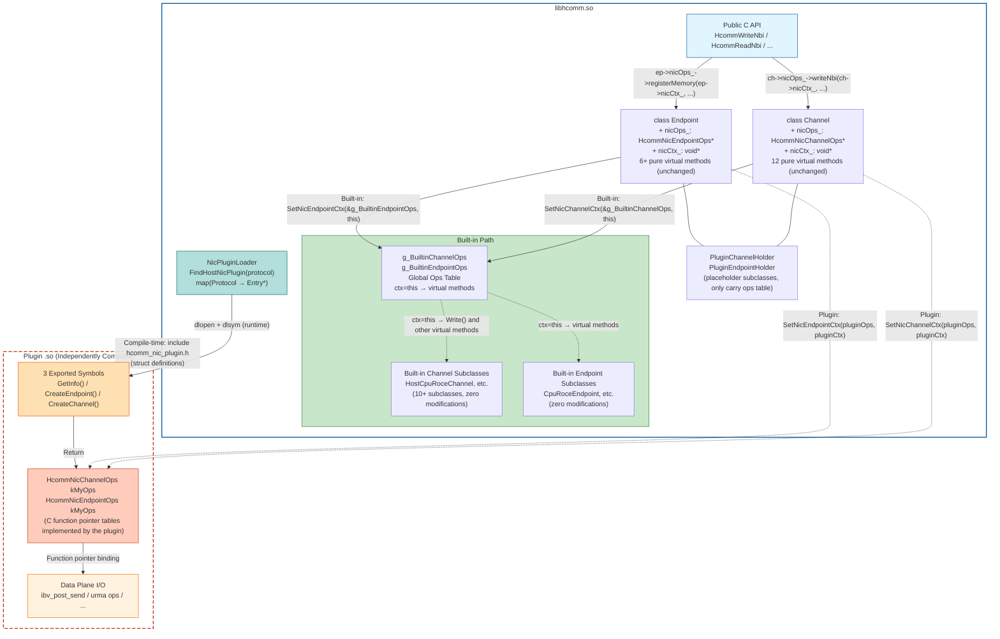
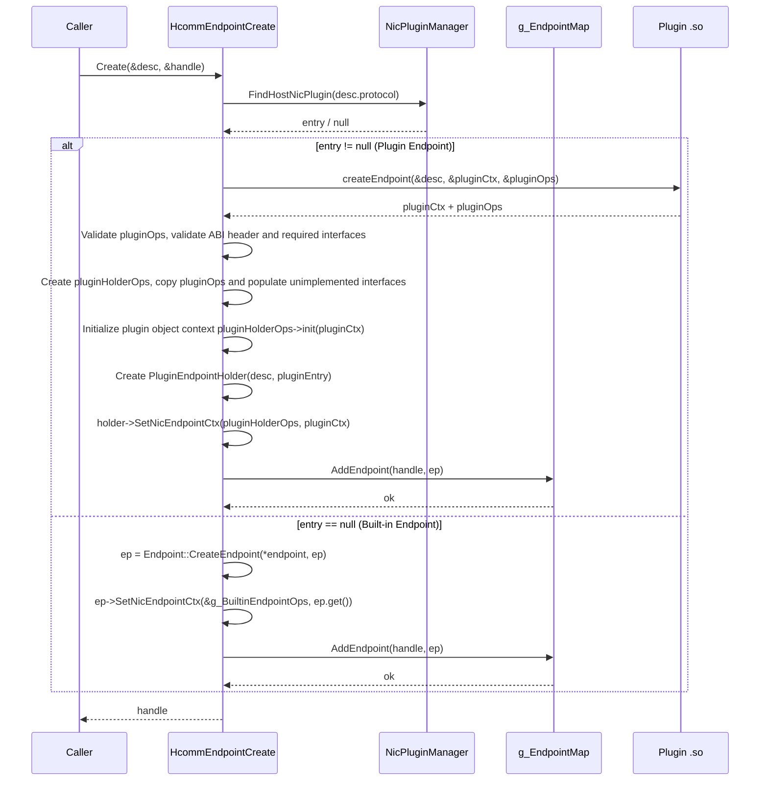
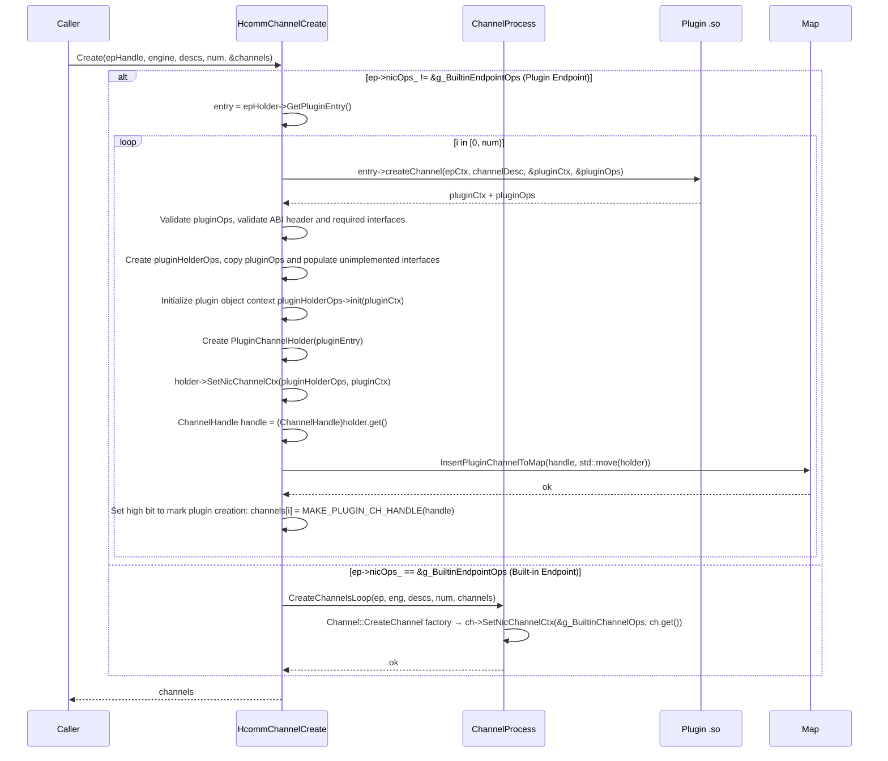
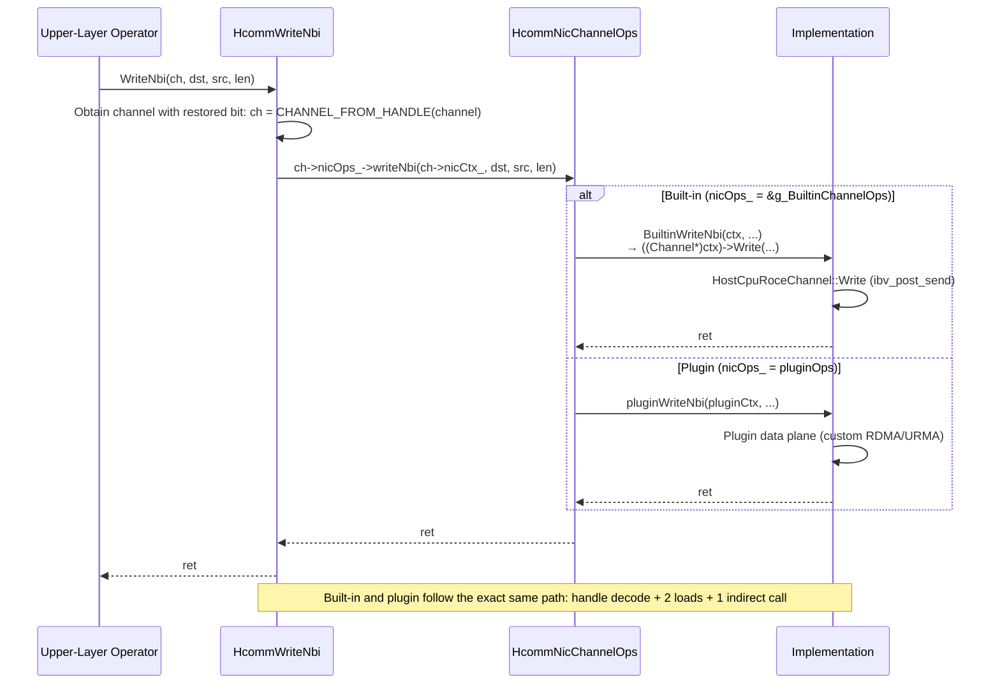
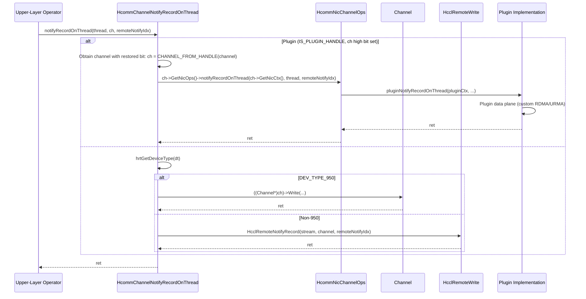
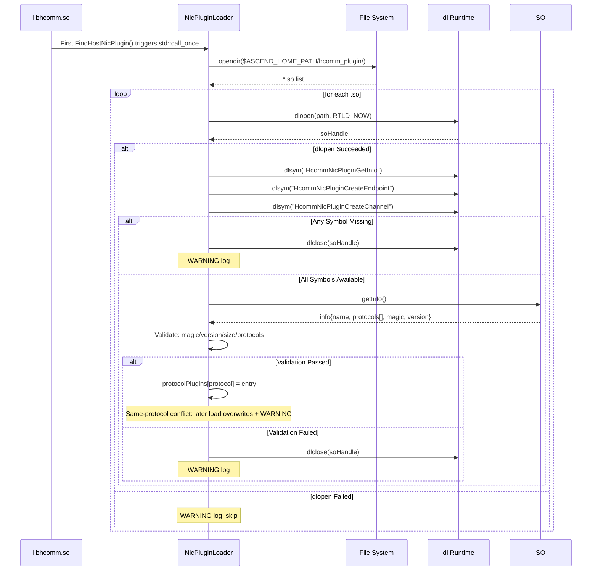

# RFC: Host NIC Plugin Mechanism

- Start Date: 2026-08-14
- RFC PR Number: 4610
- Status: accept

---

## 1. Summary

Add a Host NIC (Network Interface Card) plugin mechanism to HCOMM that allows developers to replace built-in protocol implementations or extend new communication protocols as standalone `.so` files without modifying the original HCOMM source code.

This design embeds a C function pointer table (ops table) into the `Channel` / `Endpoint` base classes. The corresponding ops table and ctx context are populated at creation time, and calls are dispatched directly through C function pointers at runtime.

---

## 2. Background and Motivation

The communication protocol types currently supported by HCOMM (HCCS, RoCE, PCIe, SIO, UB series, and so on) are all implemented as built-in modules. Adding a new NIC protocol requires modifying the protocol enumeration and internal implementation, which leads to the following issues:

- External developers cannot contribute new NIC support without modifying the HCOMM source code
- Built-in code is coupled with third-party code, which hinders community collaboration
- The barrier to experimenting with new protocols is high because a deep understanding of the internal HCOMM architecture is required

### 2.1 Target Scenarios

| Scenario | Description | Typical Use Case |
|----------|-------------|-----------------|
| **Protocol Replacement** | Replace the built-in implementation of a specific protocol in HCOMM | `COMM_PROTOCOL_ROCE` → custom optimized version |
| **Protocol Extension** | A hardware vendor registers a brand-new protocol number for a new RNIC | `COMM_PROTOCOL_CUSTOM_BASE + 0` → new NIC driver |
| **Performance Experimentation** | Rapidly validate a new communication backend in the `experimental/` directory | Custom URMA variant without touching the main branch code |

---

## 3. Design Goals and Non-Goals

### 3.1 Design Goals

| # | Goal | Description |
|---|------|-------------|
| G1 | Protocol Replacement | The plugin takes over an existing built-in protocol number; the built-in implementation no longer participates |
| G2 | Protocol Extension | The plugin registers a new protocol number (≥ `COMM_PROTOCOL_CUSTOM_BASE`) to implement a brand-new communication backend |
| G3 | Zero-Branch Dispatch for Interfaces | Except for some data-plane interfaces that are not exclusive to the 950 series, all other interfaces use zero-branch dispatch |
| G4 | Bind Ops Table at Creation Time | The Endpoint / Channel is populated with a C ops table at creation time, and runtime calls go directly through C function pointers |
| G5 | Independent Build | Gated by `ENABLE_EXPERIMENTAL`; the plugin .so is compiled and distributed independently without linking `libhcomm.so` |
| G6 | Optimal Performance | For data-plane Channel dispatch, Type 1 interfaces share the same overhead path for both built-in and plugin; Type 2 built-in interfaces use the legacy path |
| G7 | One Plugin per Protocol | Only one plugin binary is supported per communication protocol; a later-loaded plugin overwrites an earlier one |

### 3.2 Non-Goals

| # | Description |
|---|-------------|
| N1 | A single plugin taking over multiple different protocols is not supported |
| N2 | No modifications to any public header files under the `include/` directory |
| N3 | No modifications to the implementation code of any built-in Channel/Endpoint subclasses |
| N4 | Runtime unloading or hot-updating of plugins is not supported |

---

## 4. Overall Architecture

### 4.1 Architecture Overview

The core idea is to embed two fields in the `Channel` / `Endpoint` base classes: `nicOps_` (ops table pointer) and `nicCtx_` (ctx parameter). These fields are populated at creation time, and all runtime calls are unified through C function pointer invocations. The built-in implementation is integrated into the same mechanism through the `g_BuiltinChannelOps` / `g_BuiltinEndpointOps` wrapper function tables. The plugin implementation is output when `CreateEndpoint` and `CreateChannel` are called through `dlopen`-loaded symbols. The calling layer does not need to distinguish between built-in and plugin for most interfaces.

### 4.2 Protocol Replacement vs. Protocol Extension

Both modes share the same mechanism. The only difference is whether the protocol number registered by the plugin conflicts with a built-in protocol:

| Mode | Protocol Number | Behavior |
|------|----------------|----------|
| **Replacement** | All non-RESERVED built-in enumeration values < `COMM_PROTOCOL_CUSTOM_BASE` (1000) | The plugin mapping table is hit during Endpoint creation, and the plugin path is used; the built-in Endpoint factory is not called |
| **Extension** | Custom protocol numbers ≥ `COMM_PROTOCOL_CUSTOM_BASE` (1000) | The framework has no built-in implementation; only the plugin path is used during Endpoint creation, and the built-in path returns an error because the protocol number is unrecognized |

- The plugin declares its supported protocol number set (up to 4) in the `protocols[]` array returned by `HcommNicPluginGetInfo()`.
- COMM_PROTOCOL_CUSTOM_BASE=1000 is defined in nic_plugin_manager.h and serves as the boundary constant for plugin protocol numbers. The CommProtocol field carries custom values ≥1000 with int32_t semantics.

### 4.3 Layered Architecture

```text
┌──────────────────────────────────────────────────────────────────┐
│ include/hcomm_res.h / include/hcomm_primitives.h (Public API)    │
├──────────────────────────────────────────────────────────────────┤
│ Calling Layer                                                     │
│   HcommWriteNbi(ch, ...) {                                       │
│       auto* ch = CHANNEL_FROM_HANDLE(channel);                   │
│         return ch->GetNicOps()->writeNbi(ch->GetNicCtx(), ...);  │
│   }                                                              │
│   HcommMemReg(ep, ...) {                                         │
│       auto endpoint = GetEndpointMap().GetEndpoint(ep);          │
│        return endpoint->GetNicOps()->registerMemory(             │
│        endpoint->GetNicCtx(), ...);                              │
│   }                                                              │
├──────────────────────────────────────────────────────────────────┤
│ Channel / Endpoint Base Classes (2 new public fields each)       │
│   class Channel {                                                │
│       HcommNicChannelOps *nicOps_{nullptr};                      │
│       void               *nicCtx_{nullptr};                      │
│   };                                                             │
├──────────────────────────────────────────────────────────────────┤
│ Injection at Creation Time                                        │
│   Built-in: ch->nicOps_ = &g_BuiltinChannelOps;  ch->nicCtx_ = ch;   │
│   Plugin:   ch->nicOps_ = pluginOps;         ch->nicCtx_ = pluginCtx │
├────────────────────────────────────────── ───────────────────────┤
│ g_BuiltinChannelOps (Global Ops Table)                            │
│   .writeNbi = ctx → ((Channel*)ctx)->Write(...)                  │
└──────────────────────────────────────────────────────────────────┘
```

### 4.4 Logical View



**Connection Description**:

| Line Type | Meaning |
|-----------|---------|
| Solid arrow `-->` | Data dispatch flow / strong dependency |
| Dashed arrow `-.->` | Injection at creation time / internal forwarding |
| Dotted line `-.-` | Compile-time dependency (plugin .so includes `hcomm_nic_plugin.h`) |

**Core Relationships**:

| Relationship | Direction | Description |
|---------------|-----------|-------------|
| API → Base Class | Dispatch | All `HcommXxx` functions uniformly go through `ch->nicOps_->xxx(ch->nicCtx_, ...) or ep->nicOps_->xxx(ep->nicCtx_, ...)` |
| Base Class → Ops Table | Hold | `nicOps_` points to `g_BuiltinXxxOps` (built-in) or `pluginOps` (plugin), mutually exclusive |
| Built-in Ops → Subclass | Forward | Built-in wrapper function, `ctx = Channel*` → `Write()` virtual method |
| Plugin Ops → Implementation | Bind | Function pointers are bound to plugin data-plane I/O logic |
| Loader → SO Symbols | Load | `dlopen` + `dlsym` to obtain 3 exported function pointers |
| SO Symbols → Ops Table | Return | `CreateEndpoint/CreateChannel` return the ops table populated by the plugin |

#### 4.4.1 Module Responsibilities and Relationships

| Side | Module | Responsibility | Relationship |
|------|--------|---------------|--------------|
| **libhcomm.so** | Public C API Layer | `include/` external interface declarations, unchanged | Caller entry point, directly converted to ops table calls |
| **libhcomm.so** | C Ops Table Definition | `hcomm_nic_plugin.h`, defines `HcommNicChannelOps` / `HcommNicEndpointOps` structs | Serves as both the built-in ops table type for libhcomm.so and the only header file dependency for plugin .so compilation |
| **libhcomm.so** | Channel / Endpoint Base Classes | `nicOps_` + `nicCtx_` pointer fields + `SetNic***Ctx()` setter | The ops table pointer is populated at creation time; `nicOps_` is immutable once set. The plugin-side ctx is opaque |
| **libhcomm.so** | Built-in Ops Table | `g_BuiltinChannelOps` / `g_BuiltinEndpointOps` global tables | Shared by all built-in subclasses; `ctx = this`; wrapper functions forward to virtual methods |
| **libhcomm.so** | Channel / Endpoint Subclasses | 10+ built-in subclasses require zero modifications; new `PluginXxxHolder` placeholder subclasses are added | Placeholder subclasses only carry the ops table and are stored in the global Map; data-plane logic is fully delegated to the ops table |
| **libhcomm.so** | Plugin Framework Layer | `NicPluginLoader`: loads .so, validates, and maps protocols | Serves only the creation path; no coupling with the Map |
| **Plugin .so** | Exported Symbols | `GetInfo()` / `CreateEndpoint()` / `CreateChannel()` — 3 C symbols | Discovered and invoked by libhcomm.so through `dlopen`/`dlsym` at runtime |
| **Plugin .so** | Plugin Ops Table | `HcommNicChannelOps` / `HcommNicEndpointOps` populated by the plugin | During Endpoint/Channel creation, the framework fills the plugin's ops table pointer into the base class `nicOps_` field; subsequent dispatch calls go directly through this pointer |
| **Plugin .so** | Plugin Data-Plane Implementation | Actual I/O logic for RDMA write/read/notify and so on | Ops table function pointers are bound to specific implementations (such as `ibv_post_send`), running in the caller's thread context |

#### 4.4.2 Boundaries and Dependencies

```text
libhcomm.so                             Plugin .so
┌──────────────────────┐               ┌──────────────────────────┐
│                      │   dlopen/dlsym (runtime)                  │
│  NicPluginLoader     │────────────────▶│ 3 Exported Symbols        │
│                      │                 │                          │
│  g_EndpointMap       │  Holds ops      │                          │
│  g_ChannelMap   ─────│──▶ PluginHolder──│▶ Ops Table (func ptrs)  │
│                      │   (placeholder   │   ├─ registerMemory      │
│                      │    subclass)     │   ├─ writeNbi            │
│                      │                 │   ├─ readNbi             │
│                      │                 │   └─ ...                 │
│                      │                 │         │                │
│  g_BuiltinXxxOps      │  Statically      │         ▼                │
│  (also implements     │  populated at    │   Data Plane I/O         │
│   the same ops table) │  compile time    │   ibv_post_send, etc.   │
│                      │                 │                          │
│  ← Compile-time dep. ─│── hcomm_nic_plugin.h ──│▶ Compile-time incl.│
│  (shared struct defs) │                 │                          │
└──────────────────────┘               └──────────────────────────┘

Key Boundaries:
  ▸ The plugin .so depends only on hcomm_nic_plugin.h (pure C struct definitions) at compile time and does not link libhcomm.so
  ▸ libhcomm.so loads the plugin .so at runtime through dlopen and obtains function pointers through dlsym
  ▸ Both sides interoperate through the same HcommNicChannelOps / HcommNicEndpointOps table
  ▸ The plugin ctx is completely opaque to libhcomm.so — libhcomm.so only passes the nicCtx_ pointer without parsing its contents
  ▸ g_Builtin***Ops in libhcomm.so and the plugin ops table are mutually exclusive: a Channel/Endpoint object holds only one of them
```

### 4.5 Overall Module Sequence

```mermaid
sequenceDiagram
    participant App as Upper-Layer Application
    participant API as HCOMM C API
    participant Base as Channel/Endpoint Base Class
    participant Ops as C Ops Table
    participant Builtin as Built-in Implementation
    participant Mgr as NicPluginManager
    participant SO as Plugin .so
    
    Note over App,SO: ═══ Creation Phase: Endpoint / Channel ═══

    App->>API: HcommEndpointCreate(&desc, &handle)
    API->>Mgr: std::call_once triggers LoadAllNicPlugins()
    Mgr->>SO: dlopen + dlsym (GetInfo / CreateEndpoint / CreateChannel)
    SO-->>Mgr: Plugin metadata + creation function pointers
    Mgr->>Mgr: Validate + register into ProtocolPlugins map

    API->>Mgr: FindHostNicPlugin(desc.protocol)

    alt Plugin Hit
        Mgr-->>API: entry
        API->>SO: createEndpoint(&desc, &ctx, &ops)
        SO-->>API: pluginCtx + EndpointOps
        API->>Base: ep->SetNicEndpointCtx(pluginOps, pluginCtx)
    else Not Hit
        Mgr-->>API: null
        API->>Builtin: Endpoint::CreateEndpoint(desc)
        API->>Base: ep->SetNicEndpointCtx(&g_BuiltinEndpointOps, ep)
    end

    App->>API: HcommChannelCreate(epHandle, ...)
    API->>Base: Is ep->nicOps_ a plugin ops?

    alt Plugin Endpoint
        API->>SO: createChannel(epCtx, &desc, &chCtx, &chOps)
        SO-->>API: chCtx + ChannelOps
        API->>Base: ch->SetNicChannelCtx(chOps, chCtx)
    else Built-in Endpoint
        API->>Builtin: Channel::CreateChannel factory
        API->>Base: ch->SetNicChannelCtx(&g_BuiltinChannelOps, ch)
    end

    Note over App,SO: ═══ Invocation Phase: Zero-Branch Data-Plane Dispatch ═══

    App->>API: HcommWriteNbi(ch, dst, src, len)
    API->>Base: ch = (Channel*)ch
    API->>Ops: ch->nicOps_->writeNbi(ch->nicCtx_, dst, src, len)

    alt Built-in Channel
        Ops->>Builtin: BuiltinWriteNbi(ctx, ...) → Channel::Write(...)
        Builtin-->>Ops: ret
    else Plugin Channel
        Ops->>SO: pluginWriteNbi(pluginCtx, ...)
        SO-->>Ops: ret
    end

    Ops-->>API: ret
    API-->>App: ret

    Note over API,SO: Zero-branch data-plane dispatch applies only to 950-series exclusive interfaces; non-950-series exclusive interfaces use the legacy path
```

## 5. Detailed Design

### 5.1 Core Data Structures

#### 5.1.1 C ABI Interface Specification

##### Version Number and Metadata

```c
#define HCOMM_NIC_PLUGIN_INFO_VERSION       1U
#define HCOMM_NIC_CHANNEL_OPS_VERSION       1U
#define HCOMM_NIC_ENDPOINT_OPS_VERSION      1U

typedef struct {
    CommAbiHeader header;       // version / magic / size / reserved
    const char *name;           // plugin name
    uint32_t protocolCount;     // number of protocols
    CommProtocol protocols[HCOMM_NIC_PLUGIN_MAX_PROTOCOLS]; // up to 4
    uint64_t reserved[8];       // reserved for extension
} HcommNicPluginInfo;
```

**Validation Rules**:

- `header.magicWord` must equal `HCOMM_NIC_PLUGIN_INFO_MAGIC_WORD`
- `header.size` is rejected when it is less than `offsetof(HcommNicPluginInfo, protocols) + sizeof(protocols)`
- Each value in `protocols[]` must be either a non-RESERVED built-in enumeration value < `COMM_PROTOCOL_CUSTOM_BASE`, or a value ≥ `COMM_PROTOCOL_CUSTOM_BASE`
- COMM_PROTOCOL_CUSTOM_BASE=1000 is defined in nic_plugin_manager.h and serves as the boundary constant for plugin protocol numbers. The CommProtocol field carries custom values ≥1000 with int32_t semantics.

##### Channel Ops Table

```c
typedef struct {
    CommAbiHeader header;
    int32_t (*init)(void* ctx);
    int32_t (*destroy)(void* ctx);

    int32_t (*getStatus)(void* ctx, int32_t* status);

    int32_t (*writeNbi)(void* ctx, void* dst, const void* src, uint64_t len);
    int32_t (*writeNbiOnThread)(void* ctx, ThreadHandle thread, void* dst, const void* src, uint64_t len);
    int32_t (*writeOnThread)(void* ctx, ThreadHandle thread, void* dst, const void* src, uint64_t len);
    int32_t (*writeWithNotifyNbi)(void* ctx, void* dst, const void* src, uint64_t len, uint32_t remoteNotifyIdx);
    int32_t (*writeWithNotifyNbiOnThread)(
        void* ctx, ThreadHandle thread, void* dst, const void* src, uint64_t len, uint32_t remoteNotifyIdx);
    int32_t (*writeWithNotifyOnThread)(
        void* ctx, ThreadHandle thread, void* dst, const void* src, uint64_t len, uint32_t remoteNotifyIdx);
    int32_t (*writeReduceOnThread)(
        void* ctx, ThreadHandle thread, void* dst, const void* src, uint64_t count, HcommDataType dataType,
        HcommReduceOp reduceOp);
    int32_t (*writeReduceWithNotifyOnThread)(
        void* ctx, ThreadHandle thread, void* dst, const void* src, uint64_t count, HcommDataType dataType,
        HcommReduceOp reduceOp, uint32_t remoteNotifyIdx);

    int32_t (*readNbi)(void* ctx, void* dst, const void* src, uint64_t len);
    int32_t (*readNbiOnThread)(void* ctx, ThreadHandle thread, void* dst, const void* src, uint64_t len);
    int32_t (*readOnThread)(void* ctx, ThreadHandle thread, void* dst, const void* src, uint64_t len);
    int32_t (*readReduceOnThread)(
        void* ctx, ThreadHandle thread, void* dst, const void* src, uint64_t count, HcommDataType dataType,
        HcommReduceOp reduceOp);

    int32_t (*notifyRecord)(void* ctx, uint32_t remoteNotifyIdx);
    int32_t (*notifyRecordOnThread)(void* ctx, ThreadHandle thread, uint32_t remoteNotifyIdx);
    int32_t (*notifyWait)(void* ctx, uint32_t localNotifyIdx, uint32_t timeOut);
    int32_t (*notifyWaitOnThread)(void* ctx, ThreadHandle thread, uint32_t localNotifyIdx, uint32_t timeOut);
    int32_t (*notifyWaitOnThreadWithDefaultTimeout)(void* ctx, ThreadHandle thread, uint32_t localNotifyIdx);

    int32_t (*batchTransferOnThread)(
        void* ctx, ThreadHandle thread, const HcommBatchTransferDesc* transferDescs, uint32_t transferDescNum);

    int32_t (*fence)(void* ctx);
    int32_t (*fenceOnThread)(void* ctx, ThreadHandle thread);
    int32_t (*drainOnThread)(void* ctx, ThreadHandle thread);
} HcommNicChannelOps;
```

**Required Interface for Plugins**: The plugin must implement the destroy interface to release the channel object created by the plugin.

**API Mapping**:

| Ops Entry                                | Corresponding Public API                         | Description |
| ---------------------------------------- | ------------------------------------------------ | ----------- |
| `destroy`                                | `HcommChannelDestroy`                            | The public API is a batch interface; the framework calls the corresponding ops entry for each channel |
| `getStatus`                              | `HcommChannelGetStatus`                          | The public API is a batch interface; the framework calls the corresponding ops entry for each channel |
| `writeNbi`                               | `HcommWriteNbi`                                  |   |
| `writeNbiOnThread`                       | `HcommWriteNbiOnThread`                          |   |
| `writeOnThread`                          | `HcommWriteOnThread`                             |   |
| `writeWithNotifyNbi`                     | `HcommWriteWithNotifyNbi`                        |   |
| `writeWithNotifyNbiOnThread`             | `HcommWriteWithNotifyNbiOnThread`                |   |
| `writeWithNotifyOnThread`                | `HcommWriteWithNotifyOnThread`                   |   |
| `writeReduceOnThread`                    | `HcommWriteReduceOnThread`                       |   |
| `writeReduceWithNotifyOnThread`          | `HcommWriteReduceWithNotifyOnThread`             |   |
| `readNbi`                                | `HcommReadNbi`                                   |   |
| `readNbiOnThread`                        | `HcommReadNbiOnThread`                           |   |
| `readOnThread`                           | `HcommReadOnThread`                              |   |
| `readReduceOnThread`                     | `HcommReadReduceOnThread`                        |   |
| `notifyRecord`                           | `HcommNotifyRecord`                              |   |
| `notifyRecordOnThread`                   | `HcommNotifyRecordOnThread`                      |   |
| `notifyWait`                             | `HcommNotifyWait`                                |   |
| `notifyWaitOnThread`                     | `HcommNotifyWaitOnThread`                        |   |
| `notifyWaitOnThreadWithDefaultTimeout`   | `HcommNotifyWaitOnThreadWithDefaultTimeout`      |   |
| `batchTransferOnThread`                  | `HcommBatchTransferOnThread`                     |   |
| `fence`                                  | `HcommFence`                                     |   |
| `fenceOnThread`                          | `HcommFenceOnThread`                             |   |
| `drainOnThread`                          | `HcommChannelDrainOnThread`                      |   |

##### Endpoint Ops Table

```c
typedef struct {
    CommAbiHeader header;
    int32_t (*init)(void* ctx);
    int32_t (*destroy)(void* ctx);

    int32_t (*registerMemory)(void* ctx, const CommMem* mem, const char* tag, void** handle);
    int32_t (*unregisterMemory)(void* ctx, void* handle);
    int32_t (*memoryExport)(void* ctx, void* handle, void** desc, uint32_t* descLen);
    int32_t (*memoryImport)(void* ctx, const void* desc, uint32_t descLen, CommMem* outMem);
    int32_t (*memoryUnimport)(void* ctx, const void* desc, uint32_t descLen);
    int32_t (*getListenPort)(void* ctx, uint32_t* port);
} HcommNicEndpointOps;
```

**API Mapping**:

| Ops Entry | Corresponding Public API |
|-----------|-------------------------|
| `destroy` | `HcommEndpointDestroy` |
| `registerMemory` | `HcommMemReg` |
| `unregisterMemory` | `HcommMemUnreg` |
| `memoryExport` | `HcommMemExport` |
| `memoryImport` | `HcommMemImport` |
| `memoryUnimport` | `HcommMemUnimport` |
| `getListenPort` | `HcommEndpointGetListenPort` |

**Required Interface for Plugins**: The plugin must implement the destroy interface to release the endpoint object created by the plugin.

##### Exported Symbols

```c
typedef const HcommNicPluginInfo *(*HcommNicPluginGetInfoFunc)(void);

typedef int32_t (*HcommNicPluginCreateEndpointFunc)(
    const EndpointDesc *endpointDesc,
    void **outCtx, HcommNicEndpointOps **outOps);

typedef int32_t (*HcommNicPluginCreateChannelFunc)(
    void *epCtx, const HcommChannelDesc *channelDesc,
    void **outCtx, HcommNicChannelOps **outOps);

// The 3 C symbols that the plugin must export
const HcommNicPluginInfo *HcommNicPluginGetInfo(void);
int32_t HcommNicPluginCreateEndpoint(const EndpointDesc *desc,
                                      void **outCtx, HcommNicEndpointOps **outOps);
int32_t HcommNicPluginCreateChannel(void *epCtx, const HcommChannelDesc *desc,
                                     void **outCtx, HcommNicChannelOps **outOps);
```

#### 5.1.2 New Fields in the Channel Base Class

**File**: `src/base_comm/resources/endpoint_pairs/channels/channel.h`

```cpp
class Channel {
protected:
    // ==== New nicOps_ and nicCtx_ ====
   HcommNicChannelOps* nicOps_{nullptr};
   void* nicCtx_{nullptr};    
public:
  // ==== New set/get methods ====
    void SetNicChannelCtx(HcommNicChannelOps* nicOps, void* nicCtx)
    {
        nicOps_ = nicOps;
        nicCtx_ = nicCtx;
    }
    HcommNicChannelOps* GetNicOps() const { return nicOps_; }
    void* GetNicCtx() const { return nicCtx_; }
};
```

**Boundary Constraints**:

- `nicOps_` is set once at creation time and is read-only at runtime; it is immutable
- `nicCtx_` is `this` for built-in, and a private opaque context allocated by the plugin for plugin
- The new fields are located at the end of the class with a default value of `nullptr`; the memory layout of existing subclasses remains unchanged
- The new interfaces are non-virtual and do not affect the vtable

#### 5.1.3 New Fields in the Endpoint Base Class

**File**: `src/base_comm/resources/endpoints/endpoint.h` (same pattern as Channel)

```cpp
class Endpoint {
protected:
    // ==== New nicOps_ and nicCtx_ ====
   HcommNicEndpointOps* nicOps_{nullptr};
   void* nicCtx_{nullptr};    
public:
  // ==== New set/get methods ====
    void SetNicEndpointCtx(HcommNicEndpointOps* nicOps, void* nicCtx)
    {
        nicOps_ = nicOps;
        nicCtx_ = nicCtx;
    }
    HcommNicEndpointOps* GetNicOps() const { return nicOps_; }
    void* GetNicCtx() const { return nicCtx_; }
};
```

#### 5.1.4 Plugin Registry and Plugin Subclasses

```cpp
struct NicPluginEntry {
    void *soHandle;                                  // dlopen handle
    const HcommNicPluginInfo *info;                  // plugin metadata
    HcommNicPluginCreateEndpointFunc createEndpoint;  // V1 creation function
    HcommNicPluginCreateChannelFunc createChannel;    // V1 creation function
};

// Global singleton, protocol number → plugin entry
std::unordered_map<CommProtocol, const NicPluginEntry *> &ProtocolPlugins();

// Placeholder subclasses (new): pure virtual method implementations return NOT_SUPPORT (data plane does not go through vtable; the dispatch layer uses the ops table); used only to carry object lifetime in the Map
class PluginEndpointHolder : public Endpoint {
    explicit PluginEndpointHolder(const EndpointDesc& endpointDesc, const NicPluginEntry* pluginEntry)
        : Endpoint(endpointDesc),
          pluginEntry_(pluginEntry)
    {}
    ~PluginEndpointHolder() override { DestroyNicPluginOpsAndCtx(nicOps_, nicCtx_); }

    const NicPluginEntry* GetPluginEntry() const { return pluginEntry_; }
    // Pure virtual method implementation returns NOT_SUPPORT
    HcclResult RegisterMemory(HcommMem mem, const char* memTag, void** memHandle) override
    {
        (void)mem;
        (void)memTag;
        (void)memHandle;
        return HCCL_E_NOT_SUPPORT;
    }
};
class PluginChannelHolder : public Channel {
    explicit PluginChannelHolder(const NicPluginEntry* pluginEntry) : pluginEntry_(pluginEntry) {}
    ~PluginChannelHolder() override { DestroyNicPluginOpsAndCtx(nicOps_, nicCtx_); }

    const NicPluginEntry* GetPluginEntry() const { return pluginEntry_; }
    // Pure virtual method implementation returns NOT_SUPPORT
    HcclResult Write(void* dst, const void* src, uint64_t len) override
    {
        (void)dst;
        (void)src;
        (void)len;
        return HCCL_E_NOT_SUPPORT;
    }
};

// When the plugin placeholder subclass PluginEndpointHolder/PluginChannelHolder is released, call the plugin destroy function to destroy the plugin nicCtx object
template <typename Ops>
void DestroyNicPluginOpsAndCtx(Ops*& nicOps, void* nicCtx)
{
    if (nicOps != nullptr) {
        if (nicOps->destroy != nullptr) {
            int32_t ret = nicOps->destroy(nicCtx);
            if (ret != HCCL_SUCCESS) {
                HCCL_WARNING("[%s] plugin destroy failed, ret[%d].", __func__, ret);
            }
        }
        delete nicOps;
        nicOps = nullptr;
    }
}
```

### 5.2 Built-in Ops Table Implementation

#### 5.2.1 g_BuiltinChannelOps

**File**: `src/base_comm/resources/endpoint_pairs/channels/builtin_channel_ops.h`

```c
// Built-in implementation wrapper function
inline int32_t BuiltinWriteWithNotifyNbiOnThread(
    void* ctx, ThreadHandle thread, void* dst, const void* src, uint64_t len, uint32_t remoteNotifyIdx)
{
    HCCL_INFO(
        "[%s] START. thread[0x%llx], channel[0x%llx], dst[0x%llx], src[0x%llx], len[%llu], remoteNotifyIdx[%u].",
        __func__, thread, ctx, dst, src, len, remoteNotifyIdx);

    (void)thread;
    CHK_PTR_NULL(src);
    CHK_PTR_NULL(dst);
    HcclResult ret = HCCL_SUCCESS;
    DevType devType;
    CHK_RET(hrtGetDeviceType(devType));
    if (devType == DevType::DEV_TYPE_950 || devType == DevType::DEV_TYPE_960 || thread == 0) {
        auto* const channelPtr = reinterpret_cast<hcomm::Channel*>(ctx);
        CHK_PTR_NULL(channelPtr);
        ret = channelPtr->WriteWithNotify(dst, src, len, remoteNotifyIdx);
    } else {
        ret = HCCL_E_NOT_SUPPORT;
    }
    CHK_PRT_RET(
        ret != HCCL_SUCCESS,
        HCCL_ERROR(
            "[%s] FAIL. thread[0x%llx], channel[0x%llx], dst[0x%llx], src[0x%llx], len[%llu], remoteNotifyIdx[%u].",
            __func__, thread, ctx, dst, src, len, remoteNotifyIdx),
        ret);
    HCCL_INFO("[%s] SUCCESS.", __func__);
    return HCCL_SUCCESS;
}
// ... Other interfaces for built-in implementation follow the same pattern

inline HcommNicChannelOps g_BuiltinChannelOps = {
    {HCOMM_NIC_CHANNEL_OPS_VERSION, HCOMM_NIC_CHANNEL_OPS_MAGIC_WORD, sizeof(HcommNicChannelOps), 0},
    BuiltinChannelInit,                                        // init
    BuiltinChannelDestroy,                                     // destroy
    BuiltinGetStatus,                                          // getStatus
    BuiltinWriteNbi,                                           // writeNbi
    BuiltinWriteNbiOnThread,                                   // writeNbiOnThread
    hcomm::DefaultChannelWriteOnThread,                        // writeOnThread
    BuiltinWriteWithNotifyNbi,                                 // writeWithNotifyNbi
    BuiltinWriteWithNotifyNbiOnThread,                         // writeWithNotifyNbiOnThread
    hcomm::DefaultChannelWriteWithNotifyOnThread,              // writeWithNotifyOnThread
    hcomm::DefaultChannelWriteReduceOnThread,                  // writeReduceOnThread
    hcomm::DefaultChannelWriteReduceWithNotifyOnThread,        // writeReduceWithNotifyOnThread
    BuiltinReadNbi,                                            // readNbi
    BuiltinReadNbiOnThread,                                    // readNbiOnThread
    hcomm::DefaultChannelReadOnThread,                         // readOnThread
    hcomm::DefaultChannelReadReduceOnThread,                   // readReduceOnThread
    BuiltinNotifyRecord,                                       // notifyRecord
    BuiltinNotifyRecordOnThread,                               // notifyRecordOnThread
    BuiltinNotifyWait,                                         // notifyWait
    BuiltinNotifyWaitOnThread,                                 // notifyWaitOnThread
    hcomm::DefaultChannelNotifyWaitOnThreadWithDefaultTimeout, // notifyWaitOnThreadWithDefaultTimeout
    hcomm::DefaultChannelBatchTransferOnThread,                // batchTransferOnThread
    BuiltinFence,                                              // fence
    BuiltinFenceOnThread,                                      // fenceOnThread
    hcomm::DefaultChannelDrainOnThread,                        // drainOnThread
};
```

**Design Points**:

- 1. The public APIs corresponding to Channel ops entries differ in product support. They are divided into two categories: APIs that support only the 950 series and APIs that also support non-950 series products. For APIs that support only the 950 series, wrapper functions must be implemented. For APIs that also support non-950 series products, unified dispatch is not possible due to flow differences, so wrapper functions are not implemented. For such interfaces, the dispatch point must distinguish between plugin and non-plugin scenarios.
- 2. For interfaces without wrapper functions, default interfaces are populated to avoid null pointer call exceptions at the dispatch point.

#### 5.2.2 g_BuiltinEndpointOps

**File**: `src/base_comm/resources/endpoints/builtin_endpoint_ops.h`

```c
// Built-in implementation wrapper function
inline int32_t BuiltinRegisterMemory(void* ctx, const CommMem* mem, const char* tag, void** handle)
{
    CHK_PTR_NULL(mem);
    CHK_PTR_NULL(handle);
    EXCEPTION_HANDLE_BEGIN(void) HcommResMgrInit();
    EndpointHandle epHandle = reinterpret_cast<EndpointHandle>(ctx);
    HCCL_INFO("[%s] START. endpointHandle[0x%llx].", __func__, epHandle);
    auto endpoint = GetEndpointMap().GetEndpoint(epHandle);
    CHK_PRT_RET(
        endpoint == nullptr, HCCL_ERROR("[%s] endpoint not found, endpointHandle[0x%llx]", __func__, epHandle),
        HCCL_E_NOT_FOUND);
    CHK_RET(RefreshEndpointContext(endpoint->GetEndpointDesc()));
    CHK_RET(endpoint->RegisterMemory(*mem, tag, handle));

    EXCEPTION_HANDLE_END
    return HCCL_SUCCESS;
}
// ... Other interfaces for built-in implementation follow the same pattern

inline HcommNicEndpointOps g_BuiltinEndpointOps = {
    {HCOMM_NIC_ENDPOINT_OPS_VERSION, HCOMM_NIC_ENDPOINT_OPS_MAGIC_WORD, sizeof(HcommNicEndpointOps), 0},
    BuiltinEndpointInit,     // init
    BuiltinEndpointDestroy,  // destroy
    BuiltinRegisterMemory,   // registerMemory
    BuiltinUnregisterMemory, // unregisterMemory
    BuiltinMemoryExport,     // memoryExport
    BuiltinMemoryImport,     // memoryImport
    BuiltinMemoryUnimport,   // memoryUnimport
    BuiltinGetListenPort,    // getListenPort
};
```

### 5.3 Creation Path

#### 5.3.1 Endpoint Creation

```c
HcommResult HcommEndpointCreate(const EndpointDesc *endpoint, EndpointHandle *handle) {
// Shows the distinction between plugin and built-in; context is omitted
    ...
    if (endpoint->loc.locType == ENDPOINT_LOC_TYPE_HOST) {
     const NicPluginEntry* pluginEntry = FindHostNicPlugin(endpoint->protocol);
     if (pluginEntry != nullptr) {
         return CreatePluginEndpointHolder(endpoint, pluginEntry, endpointHandle);
     }
 }
    ...
    CHK_RET(CreateBuiltinEndpoint(endpoint, endpointHandle));
 ...
}
```

**Ops Population**:

- Built-in path: `Endpoint::CreateEndpoint(*endpoint, ep)` → `ep->SetNicEndpointCtx(&g_BuiltinEndpointOps, ep.get())` → store into `g_EndpointMap`
- Plugin path: `pluginEntry->createEndpoint(endpoint, &pluginCtx, &pluginOps)` → validate pluginOps → create `pluginHolderOps`, copy pluginOps and populate unimplemented interfaces → create `PluginEndpointHolder` → `holder->SetNicEndpointCtx(pluginHolderOps, pluginCtx)` → store into `g_EndpointMap`

#### 5.3.2 Channel Creation

```c
HcommResult HcommChannelCreate(
    EndpointHandle endpointHandle, CommEngine engine, HcommChannelDesc* channelDescs, uint32_t channelNum,
    ChannelHandle* channels)
{
 // Shows the distinction between plugin and built-in; context is omitted
    ...
    auto endpoint = GetEndpointMap().GetEndpoint(endpointHandle);
    if (endpoint != nullptr && endpoint->GetNicOps() != nullptr && endpoint->GetNicOps() != &g_BuiltinEndpointOps) {
        CHK_RET(
            static_cast<HcclResult>(CreatePluginChannels(endpoint, channelDescFinals.data(), channelNum, channels)));
        return HCCL_SUCCESS;
    }
   ...
    CHK_RET(ChannelProcess::CreateChannelsLoop(
        endpointHandle, engine, channelDescFinals.data(), channelNum, targetChannels));
    CHK_RET(
        ChannelProcess::PrepareUserChannels(targetChannels, channels, channelDescFinals.data(), channelNum, engine));
    ...
}
```

**Ops Population**:

- Built-in path: `Channel::CreateChannel` factory → `ch->SetNicChannelCtx(&g_BuiltinChannelOps, ch.get())` → store into `g_ChannelMap`
- Plugin path: `pluginEntry->createChannel(epCtx, channelDesc, &pluginCtx, &pluginOps)` → validate pluginOps → create `pluginHolderOps`, copy pluginOps and populate unimplemented interfaces → create `PluginChannelHolder` → `holder->SetNicChannelCtx(pluginHolderOps, pluginCtx)` → store into `g_ChannelMap`

#### 5.3.3 Decision Points in the Creation Path

| Decision Point | Location | Frequency | Method |
|---------------|----------|-----------|--------|
| Whether to enable plugin | `HcommEndpointCreate` | Once per Endpoint creation | `NicPluginEntry* pluginEntry = FindHostNicPlugin(endpoint->protocol)`, whether the plugin supports the corresponding protocol |
| Whether it is a plugin endpoint | `HcommChannelCreate` | Once per Channel creation | `endpoint->GetNicOps() != &g_BuiltinEndpointOps`, whether the endpoint was created by a plugin |

The creation path is not a hot path, so the branching overhead is negligible.

### 5.4 Dispatch Path

> **Core Principle**: Among the public API interfaces corresponding to channel ops entries, interfaces that support non-950 series products require an additional plugin check. Other dispatch functions do not contain any `if/else`, `#ifdef`, or tag-bit checks.

#### 5.4.1 Channel Dispatch Type 1

```c
int32_t HcommWriteNbi(ChannelHandle channel, void* dst, const void* src, uint64_t len)
{
    auto* ch = CHANNEL_FROM_HANDLE(channel);
    CHK_PTR_NULL(ch);
    // No distinction between plugin and built-in
    return ch->GetNicOps()->writeNbi(ch->GetNicCtx(), dst, src, len);
}
```

#### 5.4.2 Channel Dispatch Type 2

```c
int32_t HcommWriteOnThread(ThreadHandle thread, ChannelHandle channel, void* dst, const void* src, uint64_t len)
{
    if (IS_PLUGIN_HANDLE(channel)) {
  // Plugin scenario
        auto* ch = CHANNEL_FROM_HANDLE(channel);
        CHK_PTR_NULL(ch);
        return ch->GetNicOps()->writeOnThread(ch->GetNicCtx(), thread, dst, src, len);
    }
    // Built-in scenario
    ...
    HcclResult ret = HcclRemoteWrite(stream, reinterpret_cast<void*>(channel), &rmtBuf, &locBuf);
    ...
}
```

#### 5.4.3 Endpoint Dispatch

```c
HcommResult
HcommMemReg(EndpointHandle endpointHandle, const char* memTag, const CommMem* mem, HcommMemHandle* memHandle)
{
    auto endpoint = GetEndpointMap().GetEndpoint(endpointHandle);
    CHK_PRT_RET(
        endpoint == nullptr, HCCL_ERROR("[%s] endpoint not found, endpointHandle[%p]", __func__, endpointHandle),
        HCCL_E_NOT_FOUND);
 // No distinction between plugin and built-in
    return static_cast<HcclResult>(endpoint->GetNicOps()->registerMemory(
        endpoint->GetNicCtx(), mem, memTag, reinterpret_cast<void**>(memHandle)));
}
```

### 5.5 Plugin Discovery and Loading

- **Trigger Timing**: `std::call_once` is executed when the first endpoint is created
- **Default Path**: `opendir($ASCEND_HOME_PATH/hcomm_plugin/)` → each `*.so`

Loading flow for a single .so:

```text
dlopen(path, RTLD_NOW)
  ├─ Failure → WARNING log, skip
  └─ Success →
       dlsym("HcommNicPluginGetInfo")
       dlsym("HcommNicPluginCreateEndpoint")
       dlsym("HcommNicPluginCreateChannel")
       getInfo() → validate magic / version / size / protocols[]
       ├─ Pass → protocolPlugins[p] = entry (later load overwrites + WARNING)
       └─ Failure → dlclose, WARNING log
```

**Lifecycle**: `dlclose` is not called after `dlopen`; the plugin has process-level singleton lifecycle. Runtime unloading is not supported. When the same protocol conflicts, the later-loaded plugin overwrites the earlier one, and a WARNING log is recorded.

---

## 6. Key Interaction Flows

### 6.1 Endpoint Creation



### 6.2 Channel Creation



### 6.3 Data-Plane Invocation (Zero-Branch)



### 6.4 Data-Plane Invocation (Branch Decision)



### 6.5 Plugin Loading



---

## 7. Plugin Development Guide

### 7.1 Directory Structure

```text
experimental/base_comm/nic_plugin/<my_plugin>/
├── CMakeLists.txt            # Independent build; does not link libhcomm.so
└── src/
    └── my_plugin.c           # 3 exported functions + ops table implementation
```

### 7.2 Three Required Exported Symbols

```c
// 1. Return plugin metadata
const HcommNicPluginInfo *HcommNicPluginGetInfo(void) {
    static const HcommNicPluginInfo info = {
        .header = {
            .magicWord = HCOMM_NIC_PLUGIN_INFO_MAGIC_WORD,
            .version   = HCOMM_NIC_PLUGIN_INFO_VERSION,
            .size      = sizeof(HcommNicPluginInfo),
            .reserved  = 0,
        },
        .name          = "my_plugin",
        .protocolCount = 1,
        .protocols     = {COMM_PROTOCOL_ROCE},  // Replacement mode
        // or .protocols = {COMM_PROTOCOL_CUSTOM_BASE + 0},  // Extension mode
    };
    return &info;
}

// 2. Create Endpoint
int32_t HcommNicPluginCreateEndpoint(const EndpointDesc *desc,
                                      void **outCtx, HcommNicEndpointOps **outOps) {
    MyEndpointCtx *ctx = malloc(sizeof(MyEndpointCtx));
    // Initialize ctx...
    *outCtx = ctx;
    *outOps = &kMyEndpointOps;  // HcommNicEndpointOps table implemented by the plugin
    return 0;
}

// 3. Create Channel
int32_t HcommNicPluginCreateChannel(void *epCtx, const HcommChannelDesc *desc,
                                     void **outCtx, HcommNicChannelOps **outOps) {
    MyChannelCtx *ctx = malloc(sizeof(MyChannelCtx));
    // Initialize ctx (establish connections, exchange memory information, etc.)...
    *outCtx = ctx;
    *outOps = &kMyChannelOps;  // HcommNicChannelOps table implemented by the plugin
    return 0;
}
```

### 7.3 Implement the Ops Table

```c
// ---- HcommNicEndpointOps ----
static int32_t RegisterMemory(void *ctx, const CommMem *mem,
                                   const char *tag, void **handle) {
    // Implement memory registration (e.g., ibv_reg_mr / urma_reg_mr)
    return 0;
}
static int32_t UnregisterMemory(void *ctx, void *handle) {
    // Implement memory unregistration
    return 0;
}
// ... memoryExport, memoryImport, memoryUnimport, init, destroy follow the same pattern

static HcommNicEndpointOps kMyEndpointOps = {
 {HCOMM_NIC_ENDPOINT_OPS_VERSION, HCOMM_NIC_ENDPOINT_OPS_MAGIC_WORD,    sizeof(HcommNicEndpointOps), 0},
 InitEndpoint,     // init
 DestroyEndpoint,  // destroy
 RegisterMemory,   // registerMemory
 UnregisterMemory, // unregisterMemory
 MemoryExport,     // memoryExport
 MemoryImport,     // memoryImport
 MemoryUnimport,   // memoryUnimport
 GetListenPort,    // getListenPort
};

// ---- HcommNicChannelOps ----
// Implement data-plane entries as needed; destroy must be implemented
static int32_t WriteNbi(void *ctx, void *dst, const void *src, uint64_t len) {
    MyChannelCtx *ch = (MyChannelCtx*)ctx;
    // Implement data write operations (e.g., ibv_post_send)
    return 0;
}

static HcommNicChannelOps kMyChannelOps = {
 {HCOMM_NIC_CHANNEL_OPS_VERSION, HCOMM_NIC_CHANNEL_OPS_MAGIC_WORD,  sizeof(HcommNicChannelOps), 0},
 InitChannel,                // init
 DestroyChannel,             // destroy
 GetStatus,                  // getStatus
 WriteNbi,                   // writeNbi
 WriteNbiOnThread,           // writeNbiOnThread
 nullptr,                    // writeOnThread
 WriteWithNotifyNbi,         // writeWithNotifyNbi
 WriteWithNotifyNbiOnThread, // writeWithNotifyNbiOnThread
 nullptr,                    // writeWithNotifyOnThread
 nullptr,                    // writeReduceOnThread
 nullptr,                    // writeReduceWithNotifyOnThread
 ReadNbi,                    // readNbi
 ReadNbiOnThread,            // readNbiOnThread
 nullptr,                    // readOnThread
 nullptr,                    // readReduceOnThread
 NotifyRecord,               // notifyRecord
 NotifyRecordOnThread,       // notifyRecordOnThread
 NotifyWait,                 // notifyWait
 NotifyWaitOnThread,         // notifyWaitOnThread
 nullptr,                    // notifyWaitOnThreadWithDefaultTimeout
 nullptr,                    // batchTransferOnThread
 Fence,                      // fence
 FenceOnThread,              // fenceOnThread
 nullptr,                    // drainOnThread
};
```

### 7.4 Build and Deployment

```bash
# 1. Build
cd experimental/base_comm/nic_plugin/<my_plugin>
mkdir build && cd build
cmake .. && make -j

# CMakeLists.txt key points:
# - Do not link libhcomm.so
# - Align compilation options with the hcomm_nic_plugin.h header file path
# - Generate a .so file (e.g., libmy_plugin.so)

# 2. Deploy
cp build/libmy_plugin.so ${ASCEND_HOME_PATH}/hcomm_plugin/

# 3. Verify
# Restart the process and check for the "[NicPlugin] protocol[X] is handled by plugin[my_plugin]" message in the log

# 4. Debug (alternative path)
export HCOMM_NIC_PLUGIN_SO=/path/to/build/libmy_plugin.so
```

### 7.5 Protocol Number Selection

| Category | Protocol Number Range | Description |
|----------|----------------------|-------------|
| Built-in Protocol | All non-RESERVED built-in enumeration values < `COMM_PROTOCOL_CUSTOM_BASE` (1000) | Replacement mode: overwrite the built-in implementation |
| Custom Protocol | ≥ `COMM_PROTOCOL_CUSTOM_BASE` (1000) | Extension mode: add a new protocol |

The `protocols[]` array returned by `HcommNicPluginGetInfo()` can contain both built-in protocol numbers (replacement) and custom protocol numbers (extension), with a maximum of 4 entries.

---

## 8. Performance Analysis

### 8.1 Call Chain Overhead

```text
Built-in and plugin share the same call path:
  and  rsi, ~HCOMM_PLUGIN_HANDLE_FLAG  ; handle decode (1 cycle)
  test  rsi, rsi  ; null check (parallel, 0 extra)
  mov  rax, [rsi+ nicOps_offs]   ; load nicOps_ (4 cycles)
  mov  rdi, [rsi + nicCtx_offs]   ; load nicCtx_ (parallel, 0 extra)
  call [rax + writeNbi_offs]      ; load writeNbi (4 cycles) + indirect call (1-2 cycles)
                                    ; callee: BuiltinWriteNbi 
                                    ; Total: ~10-11 cycles (all loads hit L1, indirect call hits BTB)
```

---

## 9. Edge Cases

| Scenario | Handling Strategy |
|----------|------------------|
| Some ops table entries are NULL | The interfaces to be implemented are divided into two categories: (1) Interfaces that the plugin must implement (destroy) — the framework performs strict validation. (2) Interfaces that the plugin is not required to implement — the plugin can fill NULL for such interfaces, and the framework populates default implementations. Default implementation return values have two types: a. For the init interface, return SUCCESS. b. For other interfaces, return NOT_SUPPORT. |
| Multiple plugins conflict on the same protocol | Load in filename lexicographic order; later load overwrites earlier load with a WARNING log |
| Plugin .so fails to load | `dlclose` releases the handle, WARNING log is recorded, and processing continues with the next .so |

---

## 10. Constraints and Limitations

| # | Constraint | Type | Description |
|---|-----------|------|-------------|
| C1 | `nicOps_` is immutable | Design Constraint | Set once at creation time; read-only at runtime |
| C2 | Plugin only for HOST endpoints | Runtime Constraint | `ENDPOINT_LOC_TYPE_HOST` |
| C3 | Process-level lifecycle | Runtime Constraint | No `dlclose`; the OS reclaims resources on process exit |
| C4 | One plugin per protocol | Design Constraint | `ProtocolPlugins` is a 1:1 mapping |
| C5 | No modifications to built-in subclasses | Design Constraint | 10+ subclasses require zero modifications |
| C6 | Public API unchanged | Compatibility Constraint | Zero changes to `include/` |
| C7 | Op thread safety guaranteed by the plugin | Design Constraint | The plugin must ensure that ops can be called concurrently by multiple threads; the framework does not perform serialization |

---

## 11. Compatibility

- **API**: `include/hcomm_primitives.h`, `include/hcomm_res.h`, `include/hcomm_res_defs.h` — zero changes
- **ABI**: `src/base_comm/primitives/api_c_adpt/nic_plugin/hcomm_nic_plugin.h` — this path is stable as part of the SDK; plugin builds must configure it as an include path
- **Build**: Behavior is equivalent to the original version when `ENABLE_EXPERIMENTAL=OFF`

---

## 12. Test Plan

| Level | Content | Method |
|-------|---------|--------|
| Unit | ABI signature stability | Verify that exported symbol types remain unchanged |
| Unit | `NicPluginLoader` loading/validation/mapping/conflict | Full coverage with mock .so |
| Unit | `g_BuiltinChannelOps` / `g_BuiltinEndpointOps` wrapper functions | Verify forwarding correctness |
| Integration | Plugin Endpoint → Channel → Write/Read/Notify/Fence | Experimental RoCE/UB plugin + UT |
| Integration | Extended protocol (custom protocol number) end-to-end | Mock new protocol plugin |
| Integration | Built-in path regression | Built-in channels function normally with `ENABLE_EXPERIMENTAL=ON` |

---

## 13. Risk Assessment

| Risk | Level | Mitigation |
|------|-------|-----------|
| New fields in the base class affect existing subclass ABI | Low | Non-virtual fields at the end of the protected section, default `nullptr`; UT covers all subclasses |
| `g_Builtin**Ops` duplicated across .o files | Low | Inline definition in header file |
| Plugin .so load failure affects built-in channels | Very Low | Early return within `std::call_once` |
| `nicOps_` is NULL when dispatched | Very Low | The creation flow ensures that every object is populated with an ops table; UT provides coverage |

---

## 14. Alternatives

| Approach | Advantages | Disadvantages | Conclusion |
|----------|-----------|---------------|-----------|
| Entry-level tag-bit branch dispatch | Minimal changes | 30+ hot-path branches | Not adopted |
| C++ virtual function adapter subclass | No base class changes | Virtual function overhead | Not adopted |
| C ops table embedded in base class | Zero branching | Requires base class modification (non-invasive) | Adopted |

---

## 15. Open Questions

| Number | Question | Description |
|--------|----------|-------------|
| O1 | Whether runtime unloading or updating of plugins is needed | Not currently supported |
| O2 | Conflict arbitration strategy for one plugin per protocol | Currently, the later-loaded plugin overwrites the earlier one |

---

## 16. Review Records

The review process takes place in the PR comment section. For detailed review comments, refer to the corresponding PR comments.
