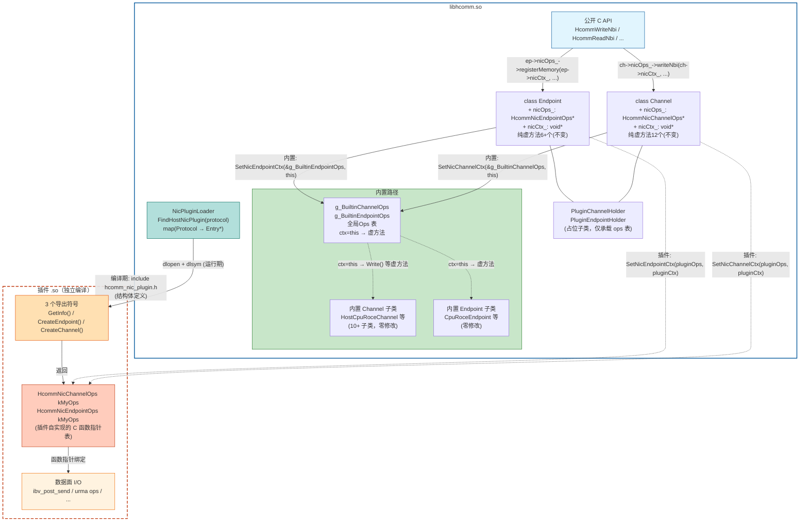
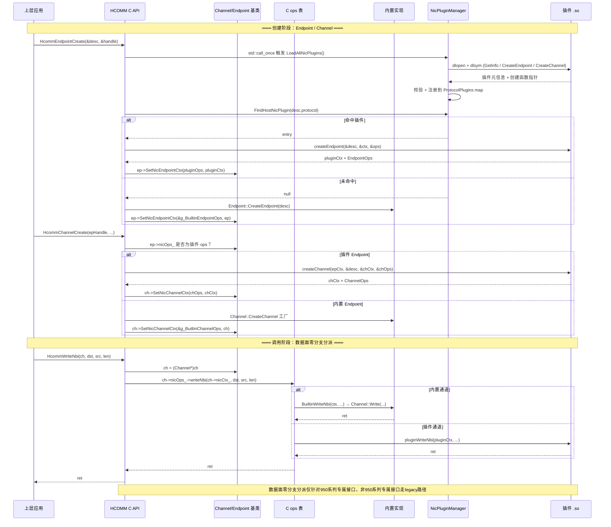
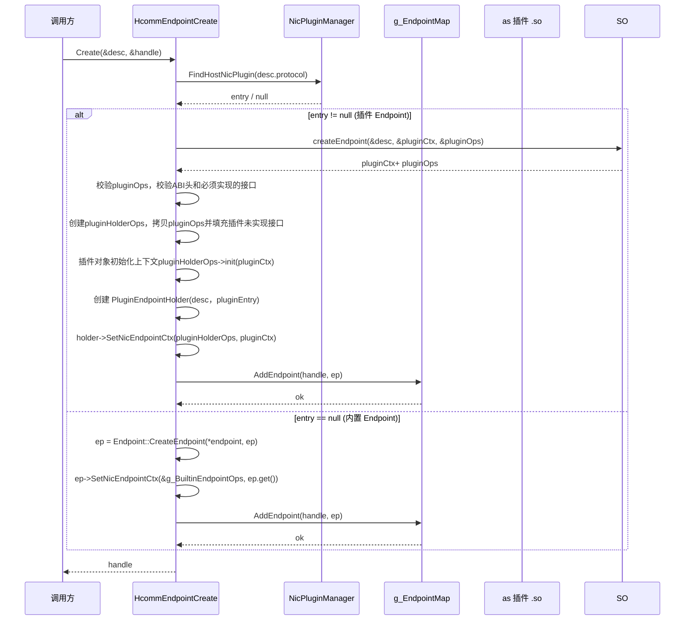
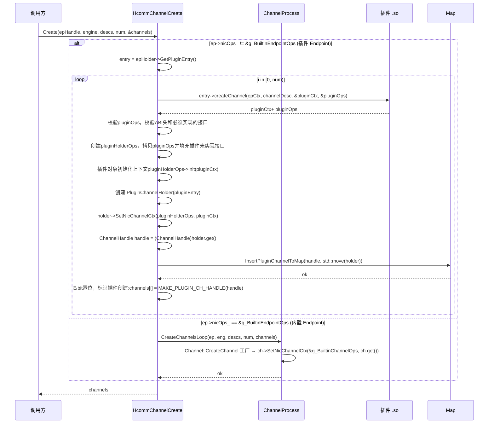
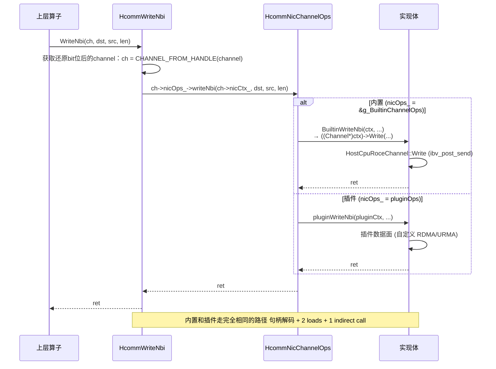
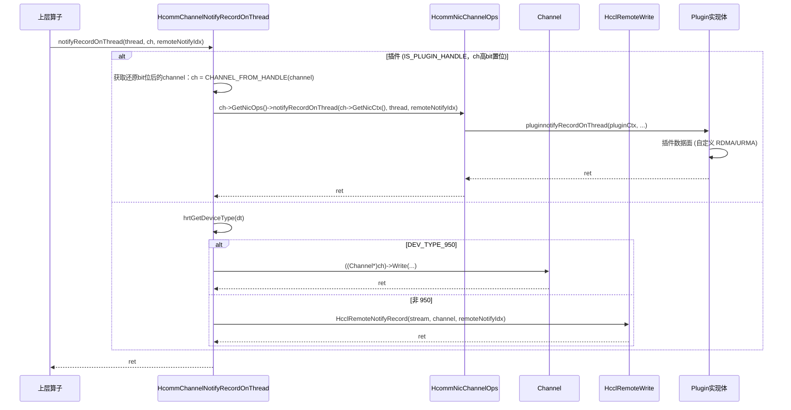
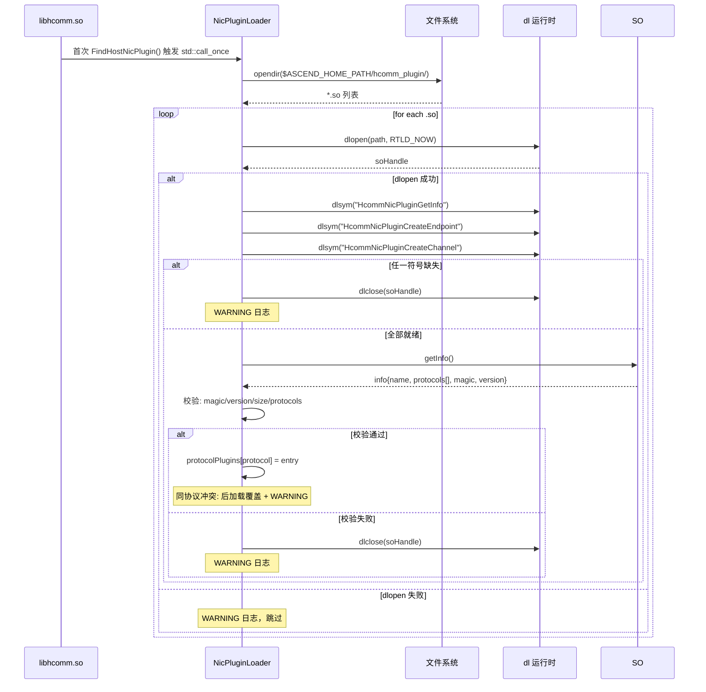

# RFC: Host 网卡插件机制

- 起始日期：2026-08-14
- RFC PR编号：4610
- 状态：accept

---

## 1. 概要

为 HCOMM 增加 Host 网卡（NIC）插件机制，允许开发者以独立 `.so` 文件形式替换内置协议实现或拓展全新通信协议，无需修改 HCOMM 原始代码。

采用 C 函数指针表（ops table）嵌入 `Channel` / `Endpoint` 基类，创建时填入对应的 ops 表 + ctx 上下文，调用时通过 C 函数指针直接分派。

---

## 2. 背景与动机

HCOMM 当前支持的通信协议类型（HCCS、RoCE、PCIe、SIO、UB 系列等）均以内置方式实现。每增加一种新网卡协议需修改协议枚举和内部实现，导致：

- 外部开发者无法在不修改 HCOMM 源码的情况下贡献新网卡支持
- 内置代码与第三方代码耦合，不利于社区协作
- 实验新协议的门槛高，需要深度理解 HCOMM 内部架构

### 2.1 目标场景

| 场景 | 说明 | 典型用例 |
|------|------|---------|
| **协议替换** | 替换HCOMM内置不同协议的实现 | `COMM_PROTOCOL_ROCE` → 自定义优化版 |
| **协议拓展** | 硬件厂商为新型 RNIC 注册一个全新协议号 | `COMM_PROTOCOL_CUSTOM_BASE + 0` → 新网卡驱动 |
| **性能实验** | 在 `experimental/` 目录快速验证新通信后端 | 自建 URMA 变体，不碰主分支代码 |

---

## 3. 设计目标与非目标

### 3.1 设计目标

| # | 目标 | 说明 |
|---|------|------|
| G1 | 协议替换 | 插件接管现有内置协议号，内置实现不再参与 |
| G2 | 协议拓展 | 插件注册新协议号（≥ `COMM_PROTOCOL_CUSTOM_BASE`），实现全新的通信后端 |
| G3 | 接口零分支分派 | 除部分数据面非950系列专属接口外，其他接口零分支分派 |
| G4 | 创建时绑定 ops 表 | Endpoint / Channel 创建时填入 C ops 表，运行时直接 C 函数指针调用 |
| G5 | 独立构建 | `ENABLE_EXPERIMENTAL` 门控，插件 .so 独立编译发布，不链接 `libhcomm.so` |
| G6 | 极致性能 | 数据面Channel分派路径Type 1 接口内置与插件走相同开销路径；Type 2 内置走 legacy 路径 |
| G7 | 单协议单插件 | 同一通信协议仅支持一个插件二进制，后加载覆盖先加载 |

### 3.2 非目标

| # | 说明 |
|---|------|
| N1 | 不支持一款插件同时接管多个不同协议 |
| N2 | 不修改 `include/` 目录下的任何公开头文件 |
| N3 | 不修改任何内置 Channel/Endpoint 子类的实现代码 |
| N4 | 不支持运行时卸载或热更新插件 |

---

## 4. 总体架构

### 4.1 架构概览

核心思路：在 `Channel` / `Endpoint` 基类中嵌入两个字段 —— `nicOps_`（ops 表指针）和 `nicCtx_`（ctx 参数）。创建时填入，运行时统一走 C 函数指针调用。内置实现通过 `g_BuiltinChannelOps` / `g_BuiltinEndpointOps` 包装函数表接入同一机制，插件实现通过 `dlopen` 加载的CreateEndpoint和CreateChannel调用时输出。调用层大部分接口无需区分内置与插件。

### 4.2 协议替换 vs 协议拓展

两种模式共享同一套机制，区别仅在于插件注册的协议号是否与内置协议冲突：

| 模式 | 协议号 | 行为 |
|------|--------|------|
| **替换** | < `COMM_PROTOCOL_CUSTOM_BASE` (1000) 的所有非 RESERVED 内置枚举值 | 创建 Endpoint 时查插件映射表命中，走插件路径；内置 Endpoint 工厂不被调用 |
| **拓展** | ≥ `COMM_PROTOCOL_CUSTOM_BASE` (1000) 的自定义协议号 | 框架无内置实现，创建 Endpoint 时仅插件路径，内置路径因协议号不识别直接返回错误 |

- 插件在 `HcommNicPluginGetInfo()` 返回的 `protocols[]` 数组中声明自己支持的协议号集合（最多 4 个）。
- COMM_PROTOCOL_CUSTOM_BASE=1000 定义于 nic_plugin_manager.h，是插件协议号分界常量；CommProtocol 字段以 int32_t 语义承载 ≥1000 的自定义值。

### 4.3 分层架构

```text
┌──────────────────────────────────────────────────────────────────┐
│ include/hcomm_res.h / include/hcomm_primitives.h(公开API)        │
├──────────────────────────────────────────────────────────────────┤
│ 调用层                                                            │
│   HcommWriteNbi(ch, ...) {                                       │
│       auto* ch = CHANNEL_FROM_HANDLE(channel);                   │
│         return ch->GetNicOps()->writeNbi(ch->GetNicCtx(), ...);  │
│   }                                                              │
│   HcommMemReg(ep, ...) {                                         │
│       auto endpoint = GetEndpointMap().GetEndpoint(ep);          │
│        return endpoint->GetNicOps()->registerMemory(             │
│        endpoint->GetNicCtx(), ...);                              │
│   }                                                              │
├──────────────────────────────────────────────────────────────────┤
│ Channel / Endpoint 基类（各新增 2 个 public 字段）                 │
│   class Channel {                                                │
│       HcommNicChannelOps *nicOps_{nullptr};                      │
│       void               *nicCtx_{nullptr};                      │
│   };                                                             │
├──────────────────────────────────────────────────────────────────┤
│ 创建时注入                                                        │
│   内置: ch->nicOps_ = &g_BuiltinChannelOps;  ch->nicCtx_ = ch;   │
│   插件: ch->nicOps_ = pluginOps;         ch->nicCtx_ = pluginCtx │
├────────────────────────────────────────── ───────────────────────┤
│ g_BuiltinChannelOps（全局Ops表）                                  │
│   .writeNbi = ctx → ((Channel*)ctx)->Write(...)                  │
└──────────────────────────────────────────────────────────────────┘
```

### 4.4 逻辑视图



**连线说明**：

| 线条类型 | 含义 |
|---------|------|
| 实线箭头 `-->` | 数据分派流 / 强依赖 |
| 虚线箭头 `-.->` | 创建时注入 / 内部转发 |
| 双点线 `-.-` | 编译期依赖（插件 .so include `hcomm_nic_plugin.h`） |

**核心关系**：

| 关系 | 方向 | 说明 |
|------|------|------|
| API → 基类 | 分派 | 所有 `HcommXxx` 函数统一走 `ch->nicOps_->xxx(ch->nicCtx_, ...)或ep->nicOps_->xxx(ep->nicCtx_, ...)` |
| 基类 → ops 表 | 持有 | `nicOps_` 指向 `g_BuiltinXxxOps`（内置）或 `pluginOps`（插件），互斥 |
| 内置 ops → 子类 | 转发 | 内置包装函数，`ctx = Channel*` → `Write()` 虚方法 |
| 插件 ops → 实现 | 绑定 | 函数指针绑定到插件数据面 I/O 逻辑 |
| Loader → so 符号 | 加载 | `dlopen` + `dlsym` 获取 3 个导出函数指针 |
| so 符号 → ops 表 | 返回 | `CreateEndpoint/CreateChannel` 返回插件填充的 ops 表 |

#### 4.4.1 模块职责与关系表

| 所在侧 | 模块 | 职责 | 关系 |
|--------|------|------|------|
| **libhcomm.so** | 公开 C API 层 | `include/` 对外接口声明，不变 | 调用方入口，直接转为 ops 表调用 |
| **libhcomm.so** | C ops 表定义 | `hcomm_nic_plugin.h`，定义 `HcommNicChannelOps` / `HcommNicEndpointOps` 结构体 | 既是 libhcomm.so 的内置 ops 表类型，也是插件 .so 编译时依赖的唯一头文件 |
| **libhcomm.so** | Channel / Endpoint 基类 | `nicOps_` + `nicCtx_` 指针字段 + `SetNic***Ctx()` setter | 创建时填入 ops 表指针；`nicOps_` 一经设置不可变。插件侧的 ctx 不透明 |
| **libhcomm.so** | 内置 ops 表 | `g_BuiltinChannelOps` / `g_BuiltinEndpointOps` 全局表 | 所有内置子类共享；`ctx = this`；包装函数转发到虚方法` |
| **libhcomm.so** | Channel / Endpoint 子类 | 内置 10+ 子类零修改；新增 `PluginXxxHolder` 占位子类 | 占位子类仅承载 ops 表并存入全局 Map，数据面逻辑完全由 ops 表代理 |
| **libhcomm.so** | 插件框架层 | `NicPluginLoader`：加载 .so、校验、协议映射 | 仅服务创建路径；与 Map 无耦合 |
| **插件 .so** | 导出符号 | `GetInfo()` / `CreateEndpoint()` / `CreateChannel()` 3 个 C 符号 | 由 libhcomm.so 通过 `dlopen`/`dlsym` 在运行期发现并调用 |
| **插件 .so** | 插件 ops 表 | 插件自行填充的 `HcommNicChannelOps` / `HcommNicEndpointOps` | 创建 Endpoint/Channel 时，框架将插件的 ops 表指针填入基类 `nicOps_` 字段，后续分派直接通过该指针调用 |
| **插件 .so** | 插件数据面实现 | RDMA write/read/notify 等实际 I/O 逻辑 | ops 表函数指针绑定到具体实现（如 `ibv_post_send`），运行在调用方线程上下文 |

#### 4.4.2 边界与依赖关系

```text
libhcomm.so                             插件 .so
┌──────────────────────┐               ┌──────────────────────────┐
│                      │   dlopen/dlsym(运行期)                    │
│  NicPluginLoader     │────────────────▶│ 3 个导出符号               │
│                      │                 │                          │
│  g_EndpointMap       │  持有 ops 表指针  │                          │
│  g_ChannelMap   ─────│──▶ PluginHolder──│▶ ops 表 (函数指针表)      │
│                      │   (占位子类)     │   ├─ registerMemory      │
│                      │                 │   ├─ writeNbi            │
│                      │                 │   ├─ readNbi             │
│                      │                 │   └─ ...                 │
│                      │                 │         │                │
│  g_BuiltinXxxOps      │  编译期静态填充    │         ▼                │
│  (此处也实现同一 ops 表) │                 │   数据面 I/O              │
│                      │                 │   ibv_post_send 等       │
│                      │                 │                          │
│  ← 编译期依赖 ────────│── hcomm_nic_plugin.h ──│▶ 编译期 include   │
│  (双方共享结构体定义)   │                 │                          │
└──────────────────────┘               └──────────────────────────┘

关键边界：
  ▸ 插件 .so 编译期仅依赖 hcomm_nic_plugin.h（纯 C 结构体定义），不链接 libhcomm.so
  ▸ libhcomm.so 运行期通过 dlopen 加载插件 .so，通过 dlsym 获取函数指针
  ▸ 双方通过同一张 HcommNicChannelOps / HcommNicEndpointOps 表完成对接
  ▸ 插件 ctx 对 libhcomm.so 完全不透明——libhcomm.so 只传递 nicCtx_ 指针，不解析内容
  ▸ libhcomm.so 的 g_Builtin***Ops 与插件 ops 表互斥：一个 Channel/Endpoint对象只持有其中一个
```

### 4.5 整体模块时序



## 5. 详细设计

### 5.1 核心数据结构

#### 5.1.1 C ABI 接口规范

##### 版本号与元信息

```c
#define HCOMM_NIC_PLUGIN_INFO_VERSION       1U
#define HCOMM_NIC_CHANNEL_OPS_VERSION       1U
#define HCOMM_NIC_ENDPOINT_OPS_VERSION      1U

typedef struct {
    CommAbiHeader header;       // version / magic / size / reserved
    const char *name;           // 插件名称
    uint32_t protocolCount;     // 协议数量
    CommProtocol protocols[HCOMM_NIC_PLUGIN_MAX_PROTOCOLS]; // 最多 4 个
    uint64_t reserved[8];       // 预留扩展
} HcommNicPluginInfo;
```

**校验规则**：

- `header.magicWord` 必须等于 `HCOMM_NIC_PLUGIN_INFO_MAGIC_WORD`
- `header.size` 小于 `offsetof(HcommNicPluginInfo, protocols) + sizeof(protocols)` 时拒绝
- `protocols[]` 中每个值必须为 < `COMM_PROTOCOL_CUSTOM_BASE` 的所有非 RESERVED 内置枚举值，或 ≥`COMM_PROTOCOL_CUSTOM_BASE`的值
- COMM_PROTOCOL_CUSTOM_BASE=1000 定义于 nic_plugin_manager.h，是插件协议号分界常量；CommProtocol 字段以 int32_t 语义承载 ≥1000 的自定义值。

##### Channel ops 表

```c
typedef struct {
    CommAbiHeader header;
    int32_t (*init)(void* ctx);
    int32_t (*destroy)(void* ctx);

    int32_t (*getStatus)(void* ctx, int32_t* status);

    int32_t (*writeNbi)(void* ctx, void* dst, const void* src, uint64_t len);
    int32_t (*writeNbiOnThread)(void* ctx, ThreadHandle thread, void* dst, const void* src, uint64_t len);
    int32_t (*writeOnThread)(void* ctx, ThreadHandle thread, void* dst, const void* src, uint64_t len);
    int32_t (*writeWithNotifyNbi)(void* ctx, void* dst, const void* src, uint64_t len, uint32_t remoteNotifyIdx);
    int32_t (*writeWithNotifyNbiOnThread)(
        void* ctx, ThreadHandle thread, void* dst, const void* src, uint64_t len, uint32_t remoteNotifyIdx);
    int32_t (*writeWithNotifyOnThread)(
        void* ctx, ThreadHandle thread, void* dst, const void* src, uint64_t len, uint32_t remoteNotifyIdx);
    int32_t (*writeReduceOnThread)(
        void* ctx, ThreadHandle thread, void* dst, const void* src, uint64_t count, HcommDataType dataType,
        HcommReduceOp reduceOp);
    int32_t (*writeReduceWithNotifyOnThread)(
        void* ctx, ThreadHandle thread, void* dst, const void* src, uint64_t count, HcommDataType dataType,
        HcommReduceOp reduceOp, uint32_t remoteNotifyIdx);

    int32_t (*readNbi)(void* ctx, void* dst, const void* src, uint64_t len);
    int32_t (*readNbiOnThread)(void* ctx, ThreadHandle thread, void* dst, const void* src, uint64_t len);
    int32_t (*readOnThread)(void* ctx, ThreadHandle thread, void* dst, const void* src, uint64_t len);
    int32_t (*readReduceOnThread)(
        void* ctx, ThreadHandle thread, void* dst, const void* src, uint64_t count, HcommDataType dataType,
        HcommReduceOp reduceOp);

    int32_t (*notifyRecord)(void* ctx, uint32_t remoteNotifyIdx);
    int32_t (*notifyRecordOnThread)(void* ctx, ThreadHandle thread, uint32_t remoteNotifyIdx);
    int32_t (*notifyWait)(void* ctx, uint32_t localNotifyIdx, uint32_t timeOut);
    int32_t (*notifyWaitOnThread)(void* ctx, ThreadHandle thread, uint32_t localNotifyIdx, uint32_t timeOut);
    int32_t (*notifyWaitOnThreadWithDefaultTimeout)(void* ctx, ThreadHandle thread, uint32_t localNotifyIdx);

    int32_t (*batchTransferOnThread)(
        void* ctx, ThreadHandle thread, const HcommBatchTransferDesc* transferDescs, uint32_t transferDescNum);

    int32_t (*fence)(void* ctx);
    int32_t (*fenceOnThread)(void* ctx, ThreadHandle thread);
    int32_t (*drainOnThread)(void* ctx, ThreadHandle thread);
} HcommNicChannelOps;
```

**插件必须实现的接口**：插件需要实现destroy接口，用于释放插件创建的channel对象。

**API 映射**：

| ops 条目                               | 对应公开 API                                | 说明  |
| -------------------------------------- | ------------------------------------------- | ----------------------------------------- |
| `destroy`                              | `HcommChannelDestroy`                       | 公开 API 为批量接口，框架逐个 channel 调用对应 ops 条目  |
| `getStatus`                            | `HcommChannelGetStatus`                     |  公开 API 为批量接口，框架逐个 channel 调用对应 ops 条目 |
| `writeNbi`                             | `HcommWriteNbi`                             |   |
| `writeNbiOnThread`                     | `HcommWriteNbiOnThread`                     |   |
| `writeOnThread`                        | `HcommWriteOnThread`                        |   |
| `writeWithNotifyNbi`                   | `HcommWriteWithNotifyNbi`                   |   |
| `writeWithNotifyNbiOnThread`           | `HcommWriteWithNotifyNbiOnThread`           |   |
| `writeWithNotifyOnThread`              | `HcommWriteWithNotifyOnThread`              |   |
| `writeReduceOnThread`                  | `HcommWriteReduceOnThread`                  |   |
| `writeReduceWithNotifyOnThread`        | `HcommWriteReduceWithNotifyOnThread`        |   |
| `readNbi`                              | `HcommReadNbi`                              |   |
| `readNbiOnThread`                      | `HcommReadNbiOnThread`                      |   |
| `readOnThread`                         | `HcommReadOnThread`                         |   |
| `readReduceOnThread`                   | `HcommReadReduceOnThread`                   |   |
| `notifyRecord`                         | `HcommNotifyRecord`                         |   |
| `notifyRecordOnThread`                 | `HcommNotifyRecordOnThread`                 |   |
| `notifyWait`                           | `HcommNotifyWait`                           |   |
| `notifyWaitOnThread`                   | `HcommNotifyWaitOnThread`                   |   |
| `notifyWaitOnThreadWithDefaultTimeout` | `HcommNotifyWaitOnThreadWithDefaultTimeout` |   |
| `batchTransferOnThread`                | `HcommBatchTransferOnThread`                |   |
| `fence`                                | `HcommFence`                                |   |
| `fenceOnThread`                        | `HcommFenceOnThread`                        |   |
| `drainOnThread`                        | `HcommChannelDrainOnThread`                 |   |

##### Endpoint ops 表

```c
typedef struct {
    CommAbiHeader header;
    int32_t (*init)(void* ctx);
    int32_t (*destroy)(void* ctx);

    int32_t (*registerMemory)(void* ctx, const CommMem* mem, const char* tag, void** handle);
    int32_t (*unregisterMemory)(void* ctx, void* handle);
    int32_t (*memoryExport)(void* ctx, void* handle, void** desc, uint32_t* descLen);
    int32_t (*memoryImport)(void* ctx, const void* desc, uint32_t descLen, CommMem* outMem);
    int32_t (*memoryUnimport)(void* ctx, const void* desc, uint32_t descLen);
    int32_t (*getListenPort)(void* ctx, uint32_t* port);
} HcommNicEndpointOps;
```

**API 映射**：

| ops 条目 | 对应公开 API |
|---------|-------------|
| `destroy` | ```HcommEndpointDestroy``` |
| `registerMemory` | ``HcommMemReg`` |
| `unregisterMemory` | ``HcommMemUnreg`` |
| `memoryExport` | ``HcommMemExport`` |
| `memoryImport` | ``HcommMemImport`` |
| `memoryUnimport` | ``HcommMemUnimport`` |
| `getListenPort` | ``HcommEndpointGetListenPort`` |

**插件必须实现的接口**：插件需要实现destroy接口，用于释放插件创建的endpoint对象。

##### 导出符号

```c
typedef const HcommNicPluginInfo *(*HcommNicPluginGetInfoFunc)(void);

typedef int32_t (*HcommNicPluginCreateEndpointFunc)(
    const EndpointDesc *endpointDesc,
    void **outCtx, HcommNicEndpointOps **outOps);

typedef int32_t (*HcommNicPluginCreateChannelFunc)(
    void *epCtx, const HcommChannelDesc *channelDesc,
    void **outCtx, HcommNicChannelOps **outOps);

// 插件必须导出的 3 个 C 符号
const HcommNicPluginInfo *HcommNicPluginGetInfo(void);
int32_t HcommNicPluginCreateEndpoint(const EndpointDesc *desc,
                                      void **outCtx, HcommNicEndpointOps **outOps);
int32_t HcommNicPluginCreateChannel(void *epCtx, const HcommChannelDesc *desc,
                                     void **outCtx, HcommNicChannelOps **outOps);
```

#### 5.1.2 Channel 基类新增字段

**文件**：`src/base_comm/resources/endpoint_pairs/channels/channel.h`

```cpp
class Channel {
protected:
    // ==== 新增nicOps_和nicCtx_ ====
   HcommNicChannelOps* nicOps_{nullptr};
   void* nicCtx_{nullptr};    
public:
  // ==== 新增set/get方法====
   void SetNicChannelCtx(HcommNicChannelOps* nicOps, void* nicCtx)
   {
       nicOps_ = nicOps;
       nicCtx_ = nicCtx;
   }
   HcommNicChannelOps* GetNicOps() const { return nicOps_; }
   void* GetNicCtx() const { return nicCtx_; }
};
```

**边界约束**：

- `nicOps_` 创建时 set 一次，运行时只读，不可变
- `nicCtx_` 内置 = `this`，插件 = 插件分配的私有不透明上下文
- 新增字段位于类末尾区域，默认值 `nullptr`，已有子类内存布局不变
- 新增接口为非虚接口，不影响 vtable

#### 5.1.3 Endpoint 基类新增字段

**文件**：`src/base_comm/resources/endpoints/endpoint.h`（与 Channel 同模式）

```cpp
class Endpoint {
protected:
    // ==== 新增nicOps_和nicCtx_ ====
   HcommNicEndpointOps* nicOps_{nullptr};
   void* nicCtx_{nullptr};    
public:
  // ==== 新增set/get方法====
    void SetNicEndpointCtx(HcommNicEndpointOps* nicOps, void* nicCtx)
    {
        nicOps_ = nicOps;
        nicCtx_ = nicCtx;
    }
    HcommNicEndpointOps* GetNicOps() const { return nicOps_; }
    void* GetNicCtx() const { return nicCtx_; }
};
```

#### 5.1.4 插件注册表与插件子类

```cpp
struct NicPluginEntry {
    void *soHandle;                                  // dlopen 句柄
    const HcommNicPluginInfo *info;                  // 插件元信息
    HcommNicPluginCreateEndpointFunc createEndpoint;  // V1 创建函数
    HcommNicPluginCreateChannelFunc createChannel;    // V1 创建函数
};

// 全局单例，协议号 → 插件条目
std::unordered_map<CommProtocol, const NicPluginEntry *> &ProtocolPlugins();

// 占位子类（新增），其纯虚方法实现为返回 NOT_SUPPORT（数据面不经 vtable，由分派层走 ops 表）；仅用于在 Map 中承载对象生命周期
class PluginEndpointHolder : public Endpoint {
    explicit PluginEndpointHolder(const EndpointDesc& endpointDesc, const NicPluginEntry* pluginEntry)
        : Endpoint(endpointDesc),
          pluginEntry_(pluginEntry)
    {}
    ~PluginEndpointHolder() override { DestroyNicPluginOpsAndCtx(nicOps_, nicCtx_); }

    const NicPluginEntry* GetPluginEntry() const { return pluginEntry_; }
    // 纯虚方法实现为返回 NOT_SUPPORT
    HcclResult RegisterMemory(HcommMem mem, const char* memTag, void** memHandle) override
    {
        (void)mem;
        (void)memTag;
        (void)memHandle;
        return HCCL_E_NOT_SUPPORT;
    }
};
class PluginChannelHolder : public Channel {
    explicit PluginChannelHolder(const NicPluginEntry* pluginEntry) : pluginEntry_(pluginEntry) {}
    ~PluginChannelHolder() override { DestroyNicPluginOpsAndCtx(nicOps_, nicCtx_); }

    const NicPluginEntry* GetPluginEntry() const { return pluginEntry_; }
    // 纯虚方法实现为返回 NOT_SUPPORT
    HcclResult Write(void* dst, const void* src, uint64_t len) override
    {
        (void)dst;
        (void)src;
        (void)len;
        return HCCL_E_NOT_SUPPORT;
    }
};

// 插件占位子类PluginEndpointHolder/PluginChannelHolder 释放时，调用插件destroy函数销毁插件nicCtx对象
template <typename Ops>
void DestroyNicPluginOpsAndCtx(Ops*& nicOps, void* nicCtx)
{
    if (nicOps != nullptr) {
        if (nicOps->destroy != nullptr) {
            int32_t ret = nicOps->destroy(nicCtx);
            if (ret != HCCL_SUCCESS) {
                HCCL_WARNING("[%s] plugin destroy failed, ret[%d].", __func__, ret);
            }
        }
        delete nicOps;
        nicOps = nullptr;
    }
}
```

### 5.2 内置 ops 表的实现

#### 5.2.1 g_BuiltinChannelOps

**文件**：`src/base_comm/resources/endpoint_pairs/channels/builtin_channel_ops.h`

```c
// 内置实现包装函数
inline int32_t BuiltinWriteWithNotifyNbiOnThread(
    void* ctx, ThreadHandle thread, void* dst, const void* src, uint64_t len, uint32_t remoteNotifyIdx)
{
    HCCL_INFO(
        "[%s] START. thread[0x%llx], channel[0x%llx], dst[0x%llx], src[0x%llx], len[%llu], remoteNotifyIdx[%u].",
        __func__, thread, ctx, dst, src, len, remoteNotifyIdx);

    (void)thread;
    CHK_PTR_NULL(src);
    CHK_PTR_NULL(dst);
    HcclResult ret = HCCL_SUCCESS;
    DevType devType;
    CHK_RET(hrtGetDeviceType(devType));
    if (devType == DevType::DEV_TYPE_950 || devType == DevType::DEV_TYPE_960 || thread == 0) {
        auto* const channelPtr = reinterpret_cast<hcomm::Channel*>(ctx);
        CHK_PTR_NULL(channelPtr);
        ret = channelPtr->WriteWithNotify(dst, src, len, remoteNotifyIdx);
    } else {
        ret = HCCL_E_NOT_SUPPORT;
    }
    CHK_PRT_RET(
        ret != HCCL_SUCCESS,
        HCCL_ERROR(
            "[%s] FAIL. thread[0x%llx], channel[0x%llx], dst[0x%llx], src[0x%llx], len[%llu], remoteNotifyIdx[%u].",
            __func__, thread, ctx, dst, src, len, remoteNotifyIdx),
        ret);
    HCCL_INFO("[%s] SUCCESS.", __func__);
    return HCCL_SUCCESS;
}
// ... 其他针对内置实现的接口同理

inline HcommNicChannelOps g_BuiltinChannelOps = {
    {HCOMM_NIC_CHANNEL_OPS_VERSION, HCOMM_NIC_CHANNEL_OPS_MAGIC_WORD, sizeof(HcommNicChannelOps), 0},
    BuiltinChannelInit,                                        // init
    BuiltinChannelDestroy,                                     // destroy
    BuiltinGetStatus,                                          // getStatus
    BuiltinWriteNbi,                                           // writeNbi
    BuiltinWriteNbiOnThread,                                   // writeNbiOnThread
    hcomm::DefaultChannelWriteOnThread,                        // writeOnThread
    BuiltinWriteWithNotifyNbi,                                 // writeWithNotifyNbi
    BuiltinWriteWithNotifyNbiOnThread,                         // writeWithNotifyNbiOnThread
    hcomm::DefaultChannelWriteWithNotifyOnThread,              // writeWithNotifyOnThread
    hcomm::DefaultChannelWriteReduceOnThread,                  // writeReduceOnThread
    hcomm::DefaultChannelWriteReduceWithNotifyOnThread,        // writeReduceWithNotifyOnThread
    BuiltinReadNbi,                                            // readNbi
    BuiltinReadNbiOnThread,                                    // readNbiOnThread
    hcomm::DefaultChannelReadOnThread,                         // readOnThread
    hcomm::DefaultChannelReadReduceOnThread,                   // readReduceOnThread
    BuiltinNotifyRecord,                                       // notifyRecord
    BuiltinNotifyRecordOnThread,                               // notifyRecordOnThread
    BuiltinNotifyWait,                                         // notifyWait
    BuiltinNotifyWaitOnThread,                                 // notifyWaitOnThread
    hcomm::DefaultChannelNotifyWaitOnThreadWithDefaultTimeout, // notifyWaitOnThreadWithDefaultTimeout
    hcomm::DefaultChannelBatchTransferOnThread,                // batchTransferOnThread
    BuiltinFence,                                              // fence
    BuiltinFenceOnThread,                                      // fenceOnThread
    hcomm::DefaultChannelDrainOnThread,                        // drainOnThread
};
```

**设计要点**：

- 1、Channel ops表中对应的公开API产品支持情况存在差异，将其划分为两类，仅950系列支持的API，非950系列也支持的API。对于仅950系列支持的API，需要实现包装函数，其他非950系列也支持的API由于流程存在差异，无法统一机制分派，故不实现包装函数，对于此类接口，需要在分派处进行是否插件场景的区分。
- 2、对于不实现包装函数的接口，填充默认接口，避免分派处空指针调用异常。

#### 5.2.2 g_BuiltinEndpointOps

**文件**：`src/base_comm/resources/endpoints/builtin_endpoint_ops.h`

```c
// 内置实现包装函数
inline int32_t BuiltinRegisterMemory(void* ctx, const CommMem* mem, const char* tag, void** handle)
{
    CHK_PTR_NULL(mem);
    CHK_PTR_NULL(handle);
    EXCEPTION_HANDLE_BEGIN(void) HcommResMgrInit();
    EndpointHandle epHandle = reinterpret_cast<EndpointHandle>(ctx);
    HCCL_INFO("[%s] START. endpointHandle[0x%llx].", __func__, epHandle);
    auto endpoint = GetEndpointMap().GetEndpoint(epHandle);
    CHK_PRT_RET(
        endpoint == nullptr, HCCL_ERROR("[%s] endpoint not found, endpointHandle[0x%llx]", __func__, epHandle),
        HCCL_E_NOT_FOUND);
    CHK_RET(RefreshEndpointContext(endpoint->GetEndpointDesc()));
    CHK_RET(endpoint->RegisterMemory(*mem, tag, handle));

    EXCEPTION_HANDLE_END
    return HCCL_SUCCESS;
}
// ... 其他针对内置实现的接口同理

inline HcommNicEndpointOps g_BuiltinEndpointOps = {
    {HCOMM_NIC_ENDPOINT_OPS_VERSION, HCOMM_NIC_ENDPOINT_OPS_MAGIC_WORD, sizeof(HcommNicEndpointOps), 0},
    BuiltinEndpointInit,     // init
    BuiltinEndpointDestroy,  // destroy
    BuiltinRegisterMemory,   // registerMemory
    BuiltinUnregisterMemory, // unregisterMemory
    BuiltinMemoryExport,     // memoryExport
    BuiltinMemoryImport,     // memoryImport
    BuiltinMemoryUnimport,   // memoryUnimport
    BuiltinGetListenPort,    // getListenPort
};
```

### 5.3 创建路径

#### 5.3.1 Endpoint 创建

```c
HcommResult HcommEndpointCreate(const EndpointDesc *endpoint, EndpointHandle *handle) {
// 展示区分插件和内置，省略上下文
    ...
    if (endpoint->loc.locType == ENDPOINT_LOC_TYPE_HOST) {
     const NicPluginEntry* pluginEntry = FindHostNicPlugin(endpoint->protocol);
     if (pluginEntry != nullptr) {
         return CreatePluginEndpointHolder(endpoint, pluginEntry, endpointHandle);
     }
 }
    ...
    CHK_RET(CreateBuiltinEndpoint(endpoint, endpointHandle));
 ...
}
```

**ops 填入**：

- 内置路径：``Endpoint::CreateEndpoint(*endpoint, ep)`` → `ep->SetNicEndpointCtx(&g_BuiltinEndpointOps, ep.get())`→ 存入`g_EndpointMap`
- 插件路径：``pluginEntry->createEndpoint(endpoint, &pluginCtx, &pluginOps)`` → 校验 pluginOps→创建`pluginHolderOps`，拷贝pluginOps并填充插件未实现接口→ 创建 `PluginEndpointHolder`→ ``holder->SetNicEndpointCtx(pluginHolderOps, pluginCtx)`` → 存入`g_EndpointMap`

#### 5.3.2 Channel 创建

```c
HcommResult HcommChannelCreate(
    EndpointHandle endpointHandle, CommEngine engine, HcommChannelDesc* channelDescs, uint32_t channelNum,
    ChannelHandle* channels)
{
 // 展示区分插件和内置，省略上下文
    ...
    auto endpoint = GetEndpointMap().GetEndpoint(endpointHandle);
    if (endpoint != nullptr && endpoint->GetNicOps() != nullptr && endpoint->GetNicOps() != &g_BuiltinEndpointOps) {
        CHK_RET(
            static_cast<HcclResult>(CreatePluginChannels(endpoint, channelDescFinals.data(), channelNum, channels)));
        return HCCL_SUCCESS;
    }
   ...
    CHK_RET(ChannelProcess::CreateChannelsLoop(
        endpointHandle, engine, channelDescFinals.data(), channelNum, targetChannels));
    CHK_RET(
        ChannelProcess::PrepareUserChannels(targetChannels, channels, channelDescFinals.data(), channelNum, engine));
    ...
}
```

**ops 填入**：

- 内置路径：`Channel::CreateChannel` 工厂 → `ch->SetNicChannelCtx(&g_BuiltinChannelOps, ch.get())`→ 存入`g_ChannelMap`
- 插件路径：`pluginEntry->createChannel(epCtx, channelDesc, &pluginCtx, &pluginOps)` →校验 pluginOps→创建`pluginHolderOps`，拷贝pluginOps并填充插件未实现接口→ 创建 `PluginChannelHolder`→`holder->SetNicChannelCtx(pluginHolderOps, pluginCtx)`→ 存入`g_ChannelMap`

#### 5.3.3 创建路径中的判断点

| 判断点 | 位置 | 执行频率 | 判断方式 |
|--------|------|---------|---------|
| 是否启用插件 | `HcommEndpointCreate` | 每个 Endpoint 创建 1 次 | `NicPluginEntry* pluginEntry = FindHostNicPlugin(endpoint->protocol)` ,插件是否支持对应协议|
| 是否为 plugin endpoint | `HcommChannelCreate` | 每个 Channel 创建 1 次 | `endpoint->GetNicOps() != &g_BuiltinEndpointOps` ，endpoint是否是插件创建|

创建路径非热路径，分支开销可忽略。

### 5.4 分派路径

> **核心原则**：对于channel ops对应的公开API接口中支持非950系列产品的接口需要额外判断是否插件，其他的分派函数不包含任何 `if/else`、`#ifdef` 或 tag-bit 判断。

#### 5.4.1 Channel分派类型1

```c
int32_t HcommWriteNbi(ChannelHandle channel, void* dst, const void* src, uint64_t len)
{
    auto* ch = CHANNEL_FROM_HANDLE(channel);
    CHK_PTR_NULL(ch);
    // 不区分插件还是内置
    return ch->GetNicOps()->writeNbi(ch->GetNicCtx(), dst, src, len);
}
```

#### 5.4.2 Channel分派类型2

```c
int32_t HcommWriteOnThread(ThreadHandle thread, ChannelHandle channel, void* dst, const void* src, uint64_t len)
{
    if (IS_PLUGIN_HANDLE(channel)) {
  // 插件场景
        auto* ch = CHANNEL_FROM_HANDLE(channel);
        CHK_PTR_NULL(ch);
        return ch->GetNicOps()->writeOnThread(ch->GetNicCtx(), thread, dst, src, len);
    }
    // 内置场景
    ...
    HcclResult ret = HcclRemoteWrite(stream, reinterpret_cast<void*>(channel), &rmtBuf, &locBuf);
    ...
}
```

#### 5.4.3 Endpoint分派

```c
HcommResult
HcommMemReg(EndpointHandle endpointHandle, const char* memTag, const CommMem* mem, HcommMemHandle* memHandle)
{
    auto endpoint = GetEndpointMap().GetEndpoint(endpointHandle);
    CHK_PRT_RET(
        endpoint == nullptr, HCCL_ERROR("[%s] endpoint not found, endpointHandle[%p]", __func__, endpointHandle),
        HCCL_E_NOT_FOUND);
 // 不区分插件还是内置
    return static_cast<HcclResult>(endpoint->GetNicOps()->registerMemory(
        endpoint->GetNicCtx(), mem, memTag, reinterpret_cast<void**>(memHandle)));
}
```

### 5.5 插件发现与加载

- **触发时机**：`std::call_once` 在首次创建endpoint 时执行
- **默认路径**：`opendir($ASCEND_HOME_PATH/hcomm_plugin/)` → 逐个 `*.so`

单个 .so 加载流程：

```text
dlopen(path, RTLD_NOW)
  ├─ 失败 → WARNING 日志，跳过
  └─ 成功 →
       dlsym("HcommNicPluginGetInfo")
       dlsym("HcommNicPluginCreateEndpoint")
       dlsym("HcommNicPluginCreateChannel")
       getInfo() → 校验 magic / version / size / protocols[]
       ├─ 通过 → protocolPlugins[p] = entry（后加载覆盖 + WARNING）
       └─ 失败 → dlclose，WARNING 日志
```

**生命周期**：`dlopen` 之后不调用 `dlclose`，进程级单例。不支持运行时卸载。同协议冲突时后加载覆盖，WARNING 日志进行记录。

---

## 6. 关键交互流程

### 6.1 Endpoint 创建



### 6.2 Channel 创建



### 6.3 数据面调用（零分支）



### 6.4 数据面调用（分支判断）



### 6.5 插件加载



---

## 7. 插件开发指南

### 7.1 目录结构

```text
experimental/base_comm/nic_plugin/<my_plugin>/
├── CMakeLists.txt            # 独立构建，不链接 libhcomm.so
└── src/
    └── my_plugin.c           # 3 个导出函数 + ops 表实现
```

### 7.2 必须实现的 3 个导出符号

```c
// 1. 返回插件元信息
const HcommNicPluginInfo *HcommNicPluginGetInfo(void) {
    static const HcommNicPluginInfo info = {
        .header = {
            .magicWord = HCOMM_NIC_PLUGIN_INFO_MAGIC_WORD,
            .version   = HCOMM_NIC_PLUGIN_INFO_VERSION,
            .size      = sizeof(HcommNicPluginInfo),
            .reserved  = 0,
        },
        .name          = "my_plugin",
        .protocolCount = 1,
        .protocols     = {COMM_PROTOCOL_ROCE},  // 替换模式
        // 或 .protocols = {COMM_PROTOCOL_CUSTOM_BASE + 0},  // 拓展模式
    };
    return &info;
}

// 2. 创建 Endpoint
int32_t HcommNicPluginCreateEndpoint(const EndpointDesc *desc,
                                      void **outCtx, HcommNicEndpointOps **outOps) {
    MyEndpointCtx *ctx = malloc(sizeof(MyEndpointCtx));
    // 初始化 ctx...
    *outCtx = ctx;
    *outOps = &kMyEndpointOps;  // 插件自实现的 HcommNicEndpointOps 表
    return 0;
}

// 3. 创建 Channel
int32_t HcommNicPluginCreateChannel(void *epCtx, const HcommChannelDesc *desc,
                                     void **outCtx, HcommNicChannelOps **outOps) {
    MyChannelCtx *ctx = malloc(sizeof(MyChannelCtx));
    // 初始化 ctx（建立连接、交换内存信息等）...
    *outCtx = ctx;
    *outOps = &kMyChannelOps;  // 插件自实现的 HcommNicChannelOps 表
    return 0;
}
```

### 7.3 实现 ops 表

```c
// ---- HcommNicEndpointOps ----
static int32_t RegisterMemory(void *ctx, const CommMem *mem,
                                   const char *tag, void **handle) {
    // 实现内存注册（如 ibv_reg_mr / urma_reg_mr）
    return 0;
}
static int32_t UnregisterMemory(void *ctx, void *handle) {
    // 实现内存反注册
    return 0;
}
// ... memoryExport, memoryImport, memoryUnimport, init, destroy 同理

static HcommNicEndpointOps kMyEndpointOps = {
 {HCOMM_NIC_ENDPOINT_OPS_VERSION, HCOMM_NIC_ENDPOINT_OPS_MAGIC_WORD,    sizeof(HcommNicEndpointOps), 0},
 InitEndpoint,     // init
 DestroyEndpoint,  // destroy
 RegisterMemory,   // registerMemory
 UnregisterMemory, // unregisterMemory
 MemoryExport,     // memoryExport
 MemoryImport,     // memoryImport
 MemoryUnimport,   // memoryUnimport
 GetListenPort,    // getListenPort
};

// ---- HcommNicChannelOps ----
// 按需实现数据面条目，destroy必须要实现
static int32_t WriteNbi(void *ctx, void *dst, const void *src, uint64_t len) {
    MyChannelCtx *ch = (MyChannelCtx*)ctx;
    // 实现数据写操作（如 ibv_post_send 等）
    return 0;
}

static HcommNicChannelOps kMyChannelOps = {
 {HCOMM_NIC_CHANNEL_OPS_VERSION, HCOMM_NIC_CHANNEL_OPS_MAGIC_WORD,  sizeof(HcommNicChannelOps), 0},
 InitChannel,                // init
 DestroyChannel,             // destroy
 GetStatus,                  // getStatus
 WriteNbi,                   // writeNbi
 WriteNbiOnThread,           // writeNbiOnThread
 nullptr,                    // writeOnThread
 WriteWithNotifyNbi,         // writeWithNotifyNbi
 WriteWithNotifyNbiOnThread, // writeWithNotifyNbiOnThread
 nullptr,                    // writeWithNotifyOnThread
 nullptr,                    // writeReduceOnThread
 nullptr,                    // writeReduceWithNotifyOnThread
 ReadNbi,                    // readNbi
 ReadNbiOnThread,            // readNbiOnThread
 nullptr,                    // readOnThread
 nullptr,                    // readReduceOnThread
 NotifyRecord,               // notifyRecord
 NotifyRecordOnThread,       // notifyRecordOnThread
 NotifyWait,                 // notifyWait
 NotifyWaitOnThread,         // notifyWaitOnThread
 nullptr,                    // notifyWaitOnThreadWithDefaultTimeout
 nullptr,                    // batchTransferOnThread
 Fence,                      // fence
 FenceOnThread,              // fenceOnThread
 nullptr,                    // drainOnThread
};
```

### 7.4 构建与部署

```bash
# 1. 构建
cd experimental/base_comm/nic_plugin/<my_plugin>
mkdir build && cd build
cmake .. && make -j

# CMakeLists.txt 要点：
# - 不链接 libhcomm.so
# - 编译选项与 hcomm_nic_plugin.h 头文件路径对齐
# - 生成 .so 文件（如 libmy_plugin.so）

# 2. 部署
cp build/libmy_plugin.so ${ASCEND_HOME_PATH}/hcomm_plugin/

# 3. 验证
# 重启进程，检查日志中 "[NicPlugin] protocol[X] is handled by plugin[my_plugin]" 信息

# 4. 调试（备选路径）
export HCOMM_NIC_PLUGIN_SO=/path/to/build/libmy_plugin.so
```

### 7.5 协议号选取

| 类别 | 协议号范围 | 说明 |
|------|----------|------|
| 内置协议 | < `COMM_PROTOCOL_CUSTOM_BASE` (1000) 的所有非 RESERVED 内置枚举值| 替换模式：覆盖内置实现 |
| 自定义协议 | ≥  `COMM_PROTOCOL_CUSTOM_BASE` (1000)| 拓展模式：新增协议 |

`HcommNicPluginGetInfo()` 返回的 `protocols[]` 可同时包含内置协议号（替换）和自定义协议号（拓展），最多 4 个。

---

## 8. 性能分析

### 8.1 调用链开销

```text
内置、插件调用路径相同:
  and  rsi, ~HCOMM_PLUGIN_HANDLE_FLAG  ;句柄解码（1 cycle）
  test  rsi, rsi  ;判空（parallel, 0 extra）
  mov  rax, [rsi+ nicOps_offs]   ; load nicOps_ (4 cycle)
  mov  rdi, [rsi + nicCtx_offs]   ; load nicCtx_ (parallel, 0 extra)
  call [rax + writeNbi_offs]      ; load writeNbi(4 cycle) + indirect call (1-2 cycles)
                                   ; callee: BuiltinWriteNbi 
                                   ; 总计: ~10-11 cycles（load均L1命中，间接调用BTB命中）
```

---

## 9. 边界场景

| 场景 | 处理策略 |
|------|---------|
| 插件 ops 表部分条目为 NULL | ops待实现接口分为两类：（1）插件必须要实现接口（destroy），框架进行强校验（2）不要求插件实现接口，对于此类接口插件可以填充NULL，框架会填充默认实现，默认实现返回值有两种：a、对于init接口，返回SUCCESS b、对于其他接口，返回NOT_SUPPORT |
| 同一协议多插件冲突 | 按文件名字典序加载，后加载覆盖先加载，WARNING 日志 |
| 插件 .so 加载失败 | `dlclose` 释放句柄，WARNING 日志，继续处理下一个 so |

---

## 10. 约束与限制

| # | 约束 | 类型 | 说明 |
|---|------|------|------|
| C1 | `nicOps_` 不可变 | 设计约束 | 创建时 set 一次，运行时只读 |
| C2 | 插件仅在 HOST endpoint | 运行期约束 | `ENDPOINT_LOC_TYPE_HOST` |
| C3 | 进程级生命周期 | 运行期约束 | 不 `dlclose`；进程退出时 OS 回收 |
| C4 | 单协议单插件 | 设计约束 | `ProtocolPlugins` 为 1:1 映射 |
| C5 | 不修改内置子类 | 设计约束 | 10+ 子类零修改 |
| C6 | 公开 API 不变 | 兼容性约束 | `include/` 零改动 |
| C7 | Op 线程安全由插件保证 | 设计约束 | 插件需保证ops可被多线程并发调用，框架不做串行化控制 |

---

## 11. 兼容性

- **API**：`include/hcomm_primitives.h`、`include/hcomm_res.h`、`include/hcomm_res_defs.h` 零改动
- **ABI**：`src/base_comm/primitives/api_c_adpt/nic_plugin/hcomm_nic_plugin.h`，该路径作为 SDK 一部分对外稳定，插件构建须配置为 include 路径
- **构建**：`ENABLE_EXPERIMENTAL=OFF` 时行为等价原版本

---

## 12. 测试方案

| 层级 | 内容 | 方法 |
|------|------|------|
| 单元 | ABI 签名稳定性 | 验证导出符号类型不变 |
| 单元 | `NicPluginLoader` 加载/校验/映射/冲突 | mock .so 全覆盖 |
| 单元 | `g_BuiltinChannelOps` / `g_BuiltinEndpointOps` 包装函数 | 验证转发正确性 |
| 集成 | 插件 Endpoint → Channel → Write/Read/Notify/Fence | experimental RoCE/UB 插件 + UT |
| 集成 | 拓展协议（自定义协议号）端到端 | mock 新协议插件 |
| 集成 | 内置路径回归 | `ENABLE_EXPERIMENTAL=ON` 内置通道正常 |

---

## 13. 风险评估

| 风险 | 等级 | 应对 |
|------|------|------|
| 基类新增字段影响已有子类 ABI | 低 | protect末尾非虚字段，默认 `nullptr`；UT 覆盖所有子类 |
| `g_Builtin**Ops` 跨 .o 重复 | 低 | h文件中inline定义 |
| 插件 so 加载失败影响内置通道 | 极低 | `std::call_once` 内早期 return |
| `nicOps_` 为 NULL 时被分派 | 极低 | 创建流程保证每对象都填入 ops 表；UT 覆盖 |

---

## 14. 替代方案

| 方案 | 优点 | 缺点 | 结论 |
|------|------|------|------|
| 入口级 tag-bit 分支分发 | 改动最小 | 30+ 处热路径分支 | 不采用 |
| C++ 虚函数适配器子类 | 不改基类 | 虚函数开销 | 不采用 |
| C ops 表嵌入基类 | 零分支 | 需修改基类（非侵入式） | 采用 |

---

## 15. 开放问题

| 编号 | 问题 | 说明 |
| --- | --- | --- |
| O1 | 是否需要运行时卸载或更新插件 | 当前不支持 |
| O2 | 单协议单插件的冲突仲裁策略 | 当前后加载的进行覆盖 |

---

## 16. 评审记录

评审过程在 PR 评论区进行，详细评审意见请参阅对应的 PR 评论。
