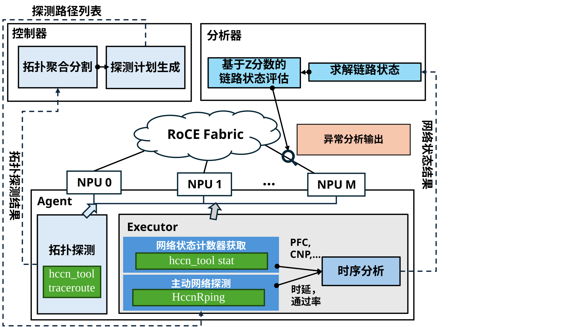

# Topology based CCL Monitor
本工具面向 RoCE 无损集群的通信亚健康监测。通过拓扑发现生成低开销探测任务，结合 HCCN PingPong 时延/通过率与 RNIC PFC、CNP 计数器，输出 L1 接入链路、L2 跨域路径指标及异常链路候选，适用于训练前网络检查和训练期间持续巡检。



## 主要能力

- 基于 Tracert 和 LLDP 发现 Device、Host、ToR/Leaf 及跨域拓扑。
- 采用分层分域、环形路径集合降低大规模集群探测开销。
- 采集 P90/P99/Mean 时延、通过率及 PFC/CNP 计数器。
- 求解 L1 链路指标，生成 L2 路径指标和异常候选。
- 支持拓扑图、链路状态图及原始 JSON/TXT/CSV 结果输出。

系统由两部分组成：控制节点运行 `probe_topo`、`probe_controller` 和部署脚本；各目标 Host 运行 `rpc_host`，负责调用 HCCN 接口完成 NPU 侧探测。

## 环境与构建

运行环境需要提供匹配版本的 Ascend CANN/HCCL/ACL，并支持 Ubuntu 或 EulerOS/openEuler。首先设置安装路径：

```bash
export THIRDLIB_ROOT=/usr/local/third_lib
export ASCEND_HOME_PATH=/usr/local/Ascend
export ASCEND_CANN_PATH=/usr/local/Ascend/ascend-toolkit/latest/aarch64-linux
```

安装系统依赖（二选一）和第三方库：

```bash
# Ubuntu
sudo ./install.sh --install-system-packages --system ubuntu

# EulerOS/openEuler
sudo ./install.sh --install-system-packages --system euleros

sudo -E ./install.sh --prefix "$THIRDLIB_ROOT" --jobs "$(nproc)" --strict-prereq
```

编译项目：

```bash
source "$THIRDLIB_ROOT/share/disp_probe/third_party/env.sh"

cmake -S . -B build \
  -DTHIRDLIB_ROOT="$THIRDLIB_ROOT" \
  -DCMAKE_BUILD_TYPE=Release
cmake --build build -j"$(nproc)"
```

主要产物为 `build/rpc_host`、`build/probe_topo` 和 `build/probe_controller`。

## 配置

运行前编辑 `control_json/910b2_info.json`，重点配置：

- `schema_version`：新配置使用 `2`；缺省或 `1` 仍按旧格式兼容解析。
- `hosts`：主机身份数组，`id` 是稳定引用名，`ip` 是连接地址，登录推荐使用 `ssh_key`，密码可用 `password_env` 从环境读取。
- `ssh_key` 与 `password_env` 同时配置时，SSH 优先尝试密钥/Agent/本地 Key 认证；`password_env` 读取的密码用于密码认证、加密私钥口令，且在未配置 `su_password` 时作为 `su` 备用密码。
- `controller`：控制节点 host id，例如 `"node-01"`。
- `probe.scope`：按 host id 配置探测 Device，可用 `{"device_range": [0, 7]}` 或 `{"devices": [0, 1, 3, 5]}`。
- `probe.topology` / `probe.pingpong`：拓扑发现和持续探测参数。

旧配置可用迁移命令生成 v2 模板：

```bash
./run.sh migrate-config ./control_json/old.json ./control_json/new.json
```

同一份配置文件需要分发到所有目标 Host。配置文件可能包含密码和私钥路径，应设置为仅属主可读写：

```bash
chmod 600 ./control_json/910b2_info.json
```

配置格式和字段约束见仓内权威 RFC [配置文件](../../docs/zh/rfcs/0001-topology-based-ccl-monitor.md#42-配置文件)。

## 快速运行

运行前请先按“配置”章节修改 `control_json/910b2_info.json`。

以下命令在项目根目录执行。Terminal 0 用于远程部署和启动 Host 服务，Terminal 1 用于拓扑发现与持续监测。

```bash
# Terminal 0：清理残留、分发程序和配置、启动 rpc_host
./run.sh deploy

# 可选：启动 rpc_host 时开启 NPU 侧 PingPong 本地日志
./run.sh deploy --pingpong-log /root/output
```

新开终端后，重新设置“环境与构建”中的变量并加载 `env.sh`，再执行：

```bash
# Terminal 1：获取拓扑
./run.sh topo

# 可选：获取拓扑后立即绘图
./run.sh topo --plot

# 开启 HCCN PingPong、指标求解和异常分析
./run.sh probe
```

`probe_controller` 常用选项：

| 选项 | 作用 |
| --- | --- |
| `--print-pingpong-plan` | 仅打印探测计划，不执行探测 |
| `--l1-only` | 仅探测和求解 L1，关闭 L2 输出 |
| `--no-metrics` | 关闭 PFC/CNP 计数器采集 |

## 输出与可视化

拓扑发现结果位于 `output/`，主要包括 `probe_topo.json`、`probe_topo_lldp.json`、`allpath.json`，开启 L2 路径发现时还会生成 `l2_fullmesh_path.json`。

持续监测结果位于 `output/<时间>/`：

- `link_lat.txt`、`link_pass_rate.txt`：L1 链路时延和通过率。
- `l2_status/`：L2 路径时延和通过率。
- `metrics/`：PFC/CNP 计数器。
- `bad_link.txt`：持续性异常告警。
- `bad_link_candidate.txt`：时延候选事件。

生成拓扑图和最近一次监测状态图：

```bash
python3 ./plot/topo_plot.py
python3 ./plot/status_plot.py
```

也可以指定监测结果目录：

```bash
python3 ./plot/status_plot.py --input-dir "output/<时间>"
```

## 详细文档

- [方案设计与接口契约](../../docs/zh/rfcs/0001-topology-based-ccl-monitor.md)
- [用户运行手册](docs/用户运行v1.0.md)
- [系统环境与构建](docs/系统环境v1.0.md)
