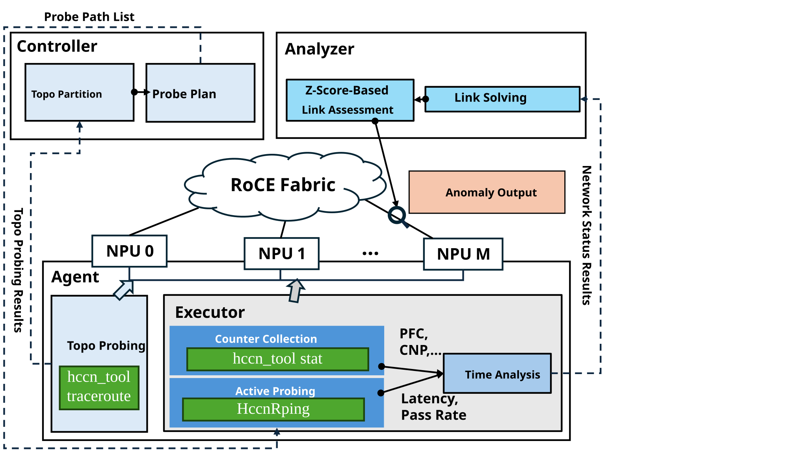

# Topology-Based CCL Monitor

This tool monitors communication sub-health in RoCE lossless clusters. It generates low-overhead probing tasks through topology discovery, combines HCCN PingPong latency and pass rates with RNIC PFC and CNP counters, and outputs L1 access link metrics, L2 cross-domain path metrics, and abnormal link candidates. It is suitable for pre-training network checks and continuous inspection during training.



## Key Capabilities

- Discover device, host, ToR/Leaf, and cross-domain topologies based on Tracert and LLDP.
- Use layered, domain-based design with ring-path sets to reduce probing overhead in large-scale clusters.
- Collect P90/P99/Mean latency, pass rates, and PFC/CNP counters.
- Solve L1 link metrics and generate L2 path metrics and anomaly candidates.
- Support topology charts, link status charts, and raw JSON/TXT/CSV result output.

The system consists of two parts: the controller node runs `probe_topo`, `probe_controller`, and deployment scripts; each target host runs `rpc_host`, which calls HCCN interfaces to perform NPU-side probing.

## Environment and Build

The runtime environment must provide a matching version of Ascend CANN/HCCL/ACL and support Ubuntu or EulerOS/openEuler. First, set the installation paths:

```bash
export THIRDLIB_ROOT=/usr/local/third_lib
export ASCEND_HOME_PATH=/usr/local/Ascend
export ASCEND_CANN_PATH=/usr/local/Ascend/ascend-toolkit/latest/aarch64-linux
```

Install system dependencies (choose one) and third-party libraries:

```bash
# Ubuntu
sudo ./install.sh --install-system-packages --system ubuntu

# EulerOS/openEuler
sudo ./install.sh --install-system-packages --system euleros

sudo -E ./install.sh --prefix "$THIRDLIB_ROOT" --jobs "$(nproc)" --strict-prereq
```

Build the project:

```bash
source "$THIRDLIB_ROOT/share/disp_probe/third_party/env.sh"

cmake -S . -B build \
  -DTHIRDLIB_ROOT="$THIRDLIB_ROOT" \
  -DCMAKE_BUILD_TYPE=Release
cmake --build build -j"$(nproc)"
```

The main artifacts are `build/rpc_host`, `build/probe_topo`, and `build/probe_controller`.

## Configuration

Before running, edit `control_json/910b2_info.json` and focus on the following settings:

- `schema_version`: Use `2` for new configurations; the default or `1` remains backward compatible with the legacy format.
- `hosts`: An array of host identities. `id` is a stable reference name and `ip` is the connection address. For login, `ssh_key` is recommended; passwords can be read from the environment using `password_env`.
- When `ssh_key` and `password_env` are configured together, SSH attempts key/agent/local key authentication first; the password read by `password_env` is used for password authentication, encrypted private key passphrase, and as the `su` fallback password when `su_password` is not configured.
- `controller`: The controller node host ID, for example `"node-01"`.
- `probe.scope`: Configure probe devices by host ID using `{"device_range": [0, 7]}` or `{"devices": [0, 1, 3, 5]}`.
- `probe.topology` / `probe.pingpong`: Topology discovery and continuous probing parameters.

Use the migration command to generate a v2 template from a legacy configuration:

```bash
./run.sh migrate-config ./control_json/old.json ./control_json/new.json
```

The same configuration file must be distributed to all target hosts. The configuration file may contain passwords and private key paths and should be set to owner read/write only:

```bash
chmod 600 ./control_json/910b2_info.json
```

For the configuration format and field constraints, refer to the authoritative RFC in this repository: [Configuration File](../../docs/zh/rfcs/0001-topology-based-ccl-monitor.md#42-配置文件).

## Quick Start

Before running, edit `control_json/910b2_info.json` as described in the "Configuration" section.

Run the following commands from the project root directory. Terminal 0 is used for remote deployment and starting the host service. Terminal 1 is used for topology discovery and continuous monitoring.

```bash
# Terminal 0: Clean up residual processes, distribute binaries and configuration, start rpc_host
./run.sh deploy

# Optional: Enable NPU-side PingPong local logging when starting rpc_host
./run.sh deploy --pingpong-log /root/output
```

Open a new terminal, reset the variables from "Environment and Build", load `env.sh`, and then run:

```bash
# Terminal 1: Discover topology
./run.sh topo

# Optional: Generate topology charts immediately after discovery
./run.sh topo --plot

# Start HCCN PingPong, metric solving, and anomaly analysis
./run.sh probe
```

Common `probe_controller` options:

| Option | Description |
| --- | --- |
| `--print-pingpong-plan` | Print the probe plan only; do not execute probing |
| `--l1-only` | Probe and solve L1 only; disable L2 output |
| `--no-metrics` | Disable PFC/CNP counter collection |

## Output and Visualization

Topology discovery results are located in `output/` and include `probe_topo.json`, `probe_topo_lldp.json`, and `allpath.json`. When L2 path discovery is enabled, `l2_fullmesh_path.json` is also generated.

Continuous monitoring results are located in `output/<time>/`:

- `link_lat.txt`, `link_pass_rate.txt`: L1 link latency and pass rate.
- `l2_status/`: L2 path latency and pass rate.
- `metrics/`: PFC/CNP counters.
- `bad_link.txt`: Persistent anomaly alerts.
- `bad_link_candidate.txt`: Latency candidate events.

Generate topology charts and the most recent monitoring status charts:

```bash
python3 ./plot/topo_plot.py
python3 ./plot/status_plot.py
```

You can also specify a monitoring result directory:

```bash
python3 ./plot/status_plot.py --input-dir "output/<time>"
```

## Detailed Documentation

- [Design and Interface Contract](../../docs/zh/rfcs/0001-topology-based-ccl-monitor.md)
- [User Execution Guide](docs/user_execution.md)
- [System Environment and Build](docs/system_environment.md)
