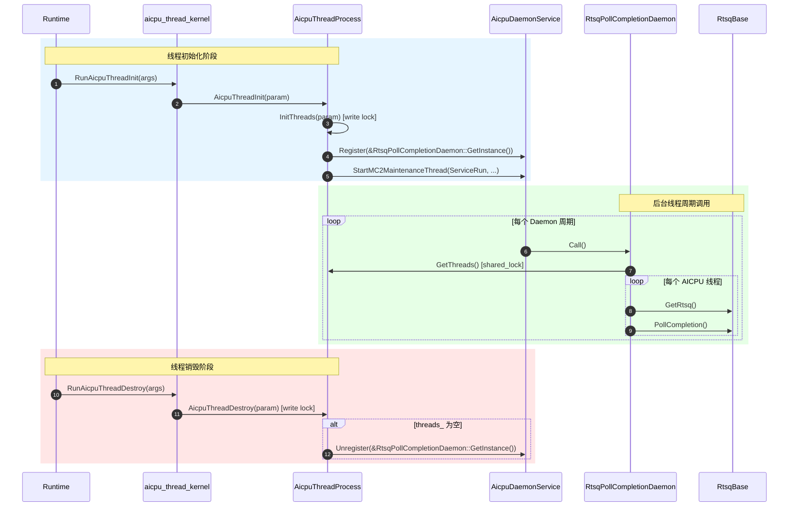

# AICPU Thread Device 模块说明

---

## 功能描述

本模块位于 `base_comm/resources/comm_engine_res/threads/device/`（L3 层），提供 AICPU 设备侧线程的生命周期管理与后台守护功能。

核心能力：

1. **线程生命周期管理**（`AicpuThreadProcess`）：管理 AICPU 线程的初始化、销毁、补充通知，维护全局线程列表及读写锁。
2. **线程入口接口**（`aicpu_thread_kernel.h`）：声明 `extern "C"` 可见的线程入口函数，供 runtime 调用。
3. **RTSQ 完成轮询守护**（`RtsqPollCompletionDaemon`）：后台线程周期性轮询所有 AICPU 线程的 RTSQ 完成事件，推进 CI。

---

## 目录描述

```text
device/
├── CMakeLists.txt              # 将模块源文件加入 ccl_kernel 目标
├── aicpu_thread_kernel.h       # extern "C" 线程入口声明（RunAicpuThreadInit 等）
├── aicpu_thread_kernel.cc      # 线程入口实现，委托给 AicpuThreadProcess
├── aicpu_thread_process.h      # 线程管理类声明（静态方法 + 静态成员）
├── aicpu_thread_process.cc     # 线程管理实现（Init/Destroy/BackgroundThread）
├── aicpu_rtsq_poll_daemon.h    # RTSQ 轮询守护类声明（单例，继承 Hccl::DaemonFunc）
└── aicpu_rtsq_poll_daemon.cc   # Call() 实现：遍历线程 → PollCompletion
```

**目录特征**：

- 位于 `base_comm/resources/comm_engine_res/threads/device/`，隶属 L3 层；
- `AicpuThreadProcess` 的静态线程列表 `threads_` 被 `RtsqPollCompletionDaemon` 遍历；
- 依赖外部：`aicpu_daemon_service.h`（守护服务）、`stream_lite.h`（RTSQ 访问）、`daemon_func.h`（基类）。

---

## 接口描述

### AicpuThreadProcess

| 接口 | 说明 |
|------|------|
| `static HcclResult InitThreads(ThreadMgrAicpuParam* param)` | 创建并注册 AICPU 线程，返回线程句柄数组。 |
| `static HcclResult AicpuThreadInit(ThreadMgrAicpuParam* param)` | 线程初始化入口（设设备、初始化线程、启动后台线程）。 |
| `static HcclResult AicpuThreadDestroy(ThreadMgrAicpuParam* param)` | 销毁指定线程，线程列表清空时停止后台线程。 |
| `static HcclResult AicpuThreadSupplementNotify(ThreadMgrAicpuParam* param)` | 补充通知线程。 |
| `static const std::vector<std::shared_ptr<hccl::Thread>>& GetThreads()` | 获取当前已注册的线程列表（需持读锁）。 |
| `static std::shared_mutex& GetMutex()` | 获取线程列表读写锁。 |

### aicpu_thread_kernel.h（extern "C" 入口）

| 接口 | 说明 |
|------|------|
| `RunAicpuIndOpThreadInit(void* args)` | 独立算子线程初始化入口。 |
| `RunAicpuIndOpNotify(void* args)` | 独立算子通知入口。 |
| `RunAicpuThreadInit(void* args)` | AICPU 线程初始化入口，委托 `AicpuThreadProcess::AicpuThreadInit`。 |
| `RunAicpuThreadDestroy(void* args)` | AICPU 线程销毁入口，委托 `AicpuThreadProcess::AicpuThreadDestroy`。 |
| `RunAicpuThreadSupplementNotify(void* args)` | 补充通知入口，委托 `AicpuThreadProcess::AicpuThreadSupplementNotify`。 |

### RtsqPollCompletionDaemon

| 接口 | 说明 |
|------|------|
| `static RtsqPollCompletionDaemon& GetInstance()` | 获取单例引用。 |
| `void Call() override` | 守护周期调用入口：遍历 `AicpuThreadProcess::GetThreads()`，对每个线程的 RTSQ 执行 `PollCompletion()`。 |

### Daemon 注册与注销

| 时机 | 调用方 | 操作 |
|------|--------|------|
| 线程初始化 | `AicpuThreadProcess::InitBackGroundThread()` | `AicpuDaemonService::Register(&RtsqPollCompletionDaemon::GetInstance())` |
| 最后一个线程销毁 | `AicpuThreadProcess::StopBackGroundThread()` | `AicpuDaemonService::Unregister(&RtsqPollCompletionDaemon::GetInstance())` |

注册后，`AicpuDaemonService::ServiceRun` 在后台线程中周期性调用 `Call()`。后台线程由 `StartMC2MaintenanceThread`（runtime 弱符号）启动，多个 Daemon 共享同一个后台线程。

---

## 调用周期



---

## 使用限制

| 类别 | 约束 |
|------|------|
| **平台依赖** | 仅 `DEV_TYPE_950` / `DEV_TYPE_960` 设备启用后台线程（`AicpuThreadInit` 中判断设备类型）。 |
| **线程模型** | Daemon `Call()` 在 `StartMC2MaintenanceThread` 启动的后台线程中执行，与数据面线程分离。 |
| **并发安全** | `AicpuThreadProcess::mutex_`（`shared_mutex`）保护 `threads_` 列表；`Call()` 中持读锁遍历，`Init/Destroy` 中持写锁修改。 |
| **后台线程启停** | `InitBackGroundThread` 由 `daemonFuncRegistered_` 守护，幂等；`StopBackGroundThread` 在最后一个线程销毁时注销 Daemon，但不停止后台线程本身（背景线程由 runtime 管理）。 |
| **层级归属** | L3（`base_comm`），与 L2 层 `CollRtsqPollCompletionDaemon` 功能对称，区别在于遍历线程的来源不同（`AicpuThreadProcess` vs `CollCommAicpuMgr`）。 |
| **依赖方向** | 依赖 `aicpu_daemon_service.h`、`stream_lite.h`、`daemon_func.h`，均为 L3 层或更底层，符合分层依赖方向约束。 |
