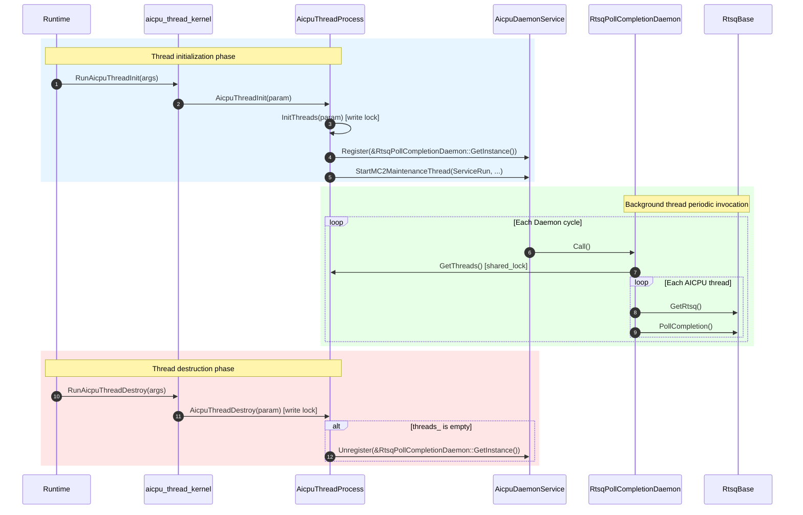

# AICPU Thread Device Module Description

---

## Function Description

This module is located at `base_comm/resources/comm_engine_res/threads/device/` (L3 layer), providing AICPU device-side thread lifecycle management and background daemon functionality.

Core capabilities:

1. **Thread lifecycle management** (`AicpuThreadProcess`): Manages AICPU thread initialization, destruction, and supplementary notification; maintains the global thread list and read-write lock.
2. **Thread entry interfaces** (`aicpu_thread_kernel.h`): Declares `extern "C"` visible thread entry functions for runtime invocation.
3. **RTSQ completion polling daemon** (`RtsqPollCompletionDaemon`): A background thread periodically polls all AICPU threads' RTSQ completion events to advance CI.

---

## Directory Description

```text
device/
├── CMakeLists.txt              # Adds module source files to the ccl_kernel target
├── aicpu_thread_kernel.h       # extern "C" thread entry declarations (RunAicpuThreadInit, etc.)
├── aicpu_thread_kernel.cc      # Thread entry implementation, delegates to AicpuThreadProcess
├── aicpu_thread_process.h      # Thread management class declaration (static methods + static members)
├── aicpu_thread_process.cc     # Thread management implementation (Init/Destroy/BackgroundThread)
├── aicpu_rtsq_poll_daemon.h    # RTSQ polling daemon class declaration (singleton, inherits Hccl::DaemonFunc)
└── aicpu_rtsq_poll_daemon.cc   # Call() implementation: iterate threads → PollCompletion
```

**Directory features**:

- Located in `base_comm/resources/comm_engine_res/threads/device/`, belongs to the L3 layer;
- `AicpuThreadProcess`'s static thread list `threads_` is iterated by `RtsqPollCompletionDaemon`;
- External dependencies: `aicpu_daemon_service.h` (daemon service), `stream_lite.h` (RTSQ access), `daemon_func.h` (base class).

---

## Interface Description

### AicpuThreadProcess

| Interface | Description |
|-----------|-------------|
| `static HcclResult InitThreads(ThreadMgrAicpuParam* param)` | Creates and registers AICPU threads, returns thread handle array. |
| `static HcclResult AicpuThreadInit(ThreadMgrAicpuParam* param)` | Thread initialization entry (sets device, initializes threads, starts background thread). |
| `static HcclResult AicpuThreadDestroy(ThreadMgrAicpuParam* param)` | Destroys specified threads; stops background thread when thread list is empty. |
| `static HcclResult AicpuThreadSupplementNotify(ThreadMgrAicpuParam* param)` | Supplementary notification for threads. |
| `static const std::vector<std::shared_ptr<hccl::Thread>>& GetThreads()` | Returns the currently registered thread list (requires read lock). |
| `static std::shared_mutex& GetMutex()` | Returns the thread list read-write lock. |

### aicpu_thread_kernel.h (extern "C" entry points)

| Interface | Description |
|-----------|-------------|
| `RunAicpuIndOpThreadInit(void* args)` | Independent operator thread initialization entry. |
| `RunAicpuIndOpNotify(void* args)` | Independent operator notification entry. |
| `RunAicpuThreadInit(void* args)` | AICPU thread initialization entry, delegates to `AicpuThreadProcess::AicpuThreadInit`. |
| `RunAicpuThreadDestroy(void* args)` | AICPU thread destruction entry, delegates to `AicpuThreadProcess::AicpuThreadDestroy`. |
| `RunAicpuThreadSupplementNotify(void* args)` | Supplementary notification entry, delegates to `AicpuThreadProcess::AicpuThreadSupplementNotify`. |

### RtsqPollCompletionDaemon

| Interface | Description |
|-----------|-------------|
| `static RtsqPollCompletionDaemon& GetInstance()` | Returns the singleton reference. |
| `void Call() override` | Daemon cycle entry point: iterates `AicpuThreadProcess::GetThreads()`, calls `PollCompletion()` on each thread's RTSQ. |

### Daemon Registration and Unregistration

| Timing | Caller | Operation |
|--------|--------|-----------|
| Thread initialization | `AicpuThreadProcess::InitBackGroundThread()` | `AicpuDaemonService::Register(&RtsqPollCompletionDaemon::GetInstance())` |
| Last thread destruction | `AicpuThreadProcess::StopBackGroundThread()` | `AicpuDaemonService::Unregister(&RtsqPollCompletionDaemon::GetInstance())` |

After registration, `AicpuDaemonService::ServiceRun` periodically calls `Call()` in a background thread. The background thread is started by `StartMC2MaintenanceThread` (runtime weak symbol), shared across multiple Daemons.

---

## Call Cycle



---

## Usage Constraints

| Category | Constraint |
|----------|------------|
| **Platform dependency** | Background thread only enabled on `DEV_TYPE_950` / `DEV_TYPE_960` devices (checked in `AicpuThreadInit`). |
| **Threading model** | Daemon `Call()` executes in the background thread started by `StartMC2MaintenanceThread`, separated from data-plane threads. |
| **Concurrency safety** | `AicpuThreadProcess::mutex_` (`shared_mutex`) protects `threads_`; `Call()` holds read lock during iteration, `Init/Destroy` hold write lock during modification. |
| **Background thread start/stop** | `InitBackGroundThread` is guarded by `daemonFuncRegistered_`, idempotent; `StopBackGroundThread` unregisters the Daemon when the last thread is destroyed, but does not stop the background thread itself (managed by runtime). |
| **Layer attribution** | L3 (`base_comm`), symmetric with the L2-layer `CollRtsqPollCompletionDaemon`; the difference is the source of thread enumeration (`AicpuThreadProcess` vs `CollCommAicpuMgr`). |
| **Dependency direction** | Depends on `aicpu_daemon_service.h`, `stream_lite.h`, `daemon_func.h`, all at L3 layer or lower, complying with layered dependency direction constraints. |
