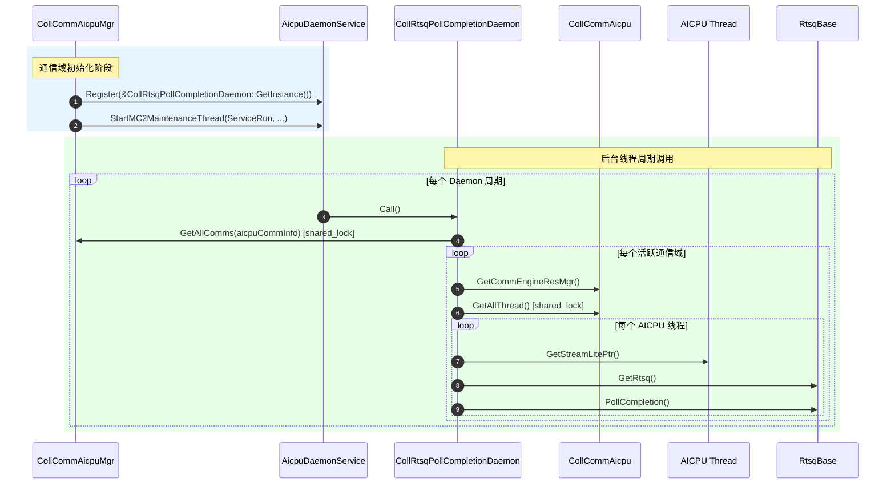

# CollRtsqPollCompletionDaemon RTSQ完成轮询守护模块说明

---

## 功能描述

`CollRtsqPollCompletionDaemon` 是 HCOMM 在 `coll_communicator_mgr/dfx/rtsq_poll/` 路径下的 AICPU RTSQ 完成轮询守护模块（L2 层），用于 **在集合通信域（Communicator）运行期间，由后台线程周期性地轮询所有通信域关联的 AICPU Stream 的 RTSQ 完成事件，推进 CI（Consumer Index）**。

核心能力：

1. **遍历通信域**：通过 `CollCommAicpuMgr::GetAllComms` 获取所有已注册的 `CollCommAicpu` 实例。
2. **状态过滤**：跳过 `INVALID` 和 `SUSPENDING` 状态的通信域，仅对活跃通信域执行轮询。
3. **线程级轮询**：对每个通信域的 `CommEngineResAicpuMgr` 持有的全部 AICPU 线程，获取其 `StreamLite` 的 `RtsqBase`，调用 `PollCompletion()` 推进 CI。
4. **读写锁保护**：通过 `CollCommAicpuMgr` 的 `shared_mutex` 和 `CommEngineResAicpuMgr` 的 `ThreadMutex` 两级读锁，确保轮询期间通信域和线程列表不被并发修改。

模块属于 DFX（Design For X）范畴，是 AICPU 软件轮询 CI 机制在 L2 层的入口。

---

## 目录描述

```text
rtsq_poll/
├── CMakeLists.txt                          # 顶层构建脚本，仅 add_subdirectory(aicpu)
└── aicpu/
    ├── CMakeLists.txt                      # 将 coll_rtsq_poll_completion_daemon.cc 加入 ccl_kernel 目标
    ├── coll_rtsq_poll_completion_daemon.h  # 类声明（单例，继承 Hccl::DaemonFunc）
    └── coll_rtsq_poll_completion_daemon.cc  # Call() 实现：遍历通信域 → 遍历线程 → PollCompletion
```

**目录特征**：

- 位于 `coll_communicator_mgr/dfx/rtsq_poll/`，隶属 L2 层 DFX 功能；
- 单例实例通过 `CollCommAicpuMgr::InitBackGroundThread` 注册到 `AicpuDaemonService`；
- 依赖外部：`daemon_func.h`（基类）、`coll_comm_aicpu_mgr.h`（通信域管理）、`stream_lite.h`（RTSQ 访问）。

---

## 接口描述

### 公共接口

| 接口 | 说明 |
|------|------|
| `static CollRtsqPollCompletionDaemon& GetInstance()` | 获取单例引用。 |
| `void Call() override` | 守护周期调用入口：遍历所有活跃通信域的 AICPU 线程，对每个线程的 RTSQ 执行 `PollCompletion()`。 |

### Daemon 注册与注销

| 时机 | 调用方 | 操作 |
|------|--------|------|
| 通信域初始化 | `CollCommAicpuMgr::InitBackGroundThread(devId)` | `AicpuDaemonService::Register(&CollRtsqPollCompletionDaemon::GetInstance())` |

注册后，`AicpuDaemonService::ServiceRun` 在后台线程中周期性调用 `Call()`。后台线程由 `StartMC2MaintenanceThread`（runtime 弱符号）启动，多个 Daemon 共享同一个后台线程。

> **注意**：本模块无显式 `Unregister` 调用，Daemon 生命周期与进程一致。

---

## 调用周期



---

## 使用限制

| 类别 | 约束 |
|------|------|
| **平台依赖** | 仅 `DEV_TYPE_950` / `DEV_TYPE_960` 设备启用（由 `CollCommAicpuMgr::InitBackGroundThread` 调用时机决定）。 |
| **线程模型** | Daemon `Call()` 在 `StartMC2MaintenanceThread` 启动的后台线程中执行，与数据面线程分离。 |
| **并发安全** | 通过 `CollCommAicpuMgr` 的 `shared_mutex`（通信域级）和 `CommEngineResAicpuMgr` 的 `ThreadMutex`（线程级）两级读锁保护，确保遍历期间列表不被修改。 |
| **状态过滤** | `INVALID` 和 `SUSPENDING` 状态的通信域被跳过，不执行轮询。 |
| **层级归属** | L2（`coll_communicator_mgr`），与 L3 层 `RtsqPollCompletionDaemon` 功能对称，区别在于遍历通信域的来源不同（`CollCommAicpuMgr` vs `AicpuThreadProcess`）。 |
| **依赖方向** | 依赖 L3 层 `stream_lite.h`（RTSQ 访问）和 `daemon_func.h`（基类），符合分层依赖方向约束。 |
