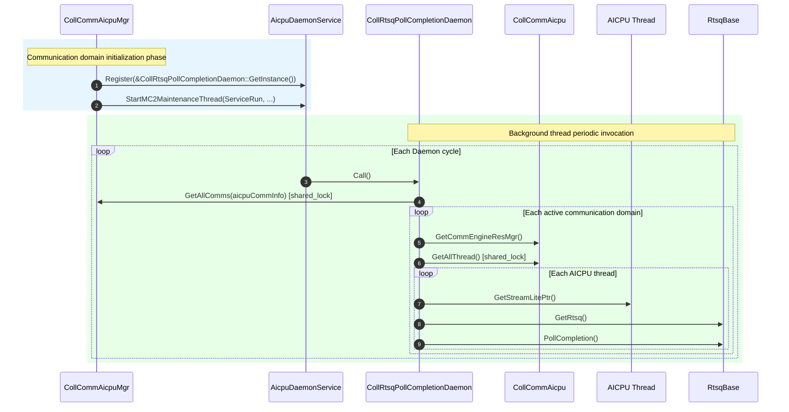

# CollRtsqPollCompletionDaemon RTSQ Completion Polling Daemon Module Description

---

## Function Description

`CollRtsqPollCompletionDaemon` is the AICPU RTSQ completion polling daemon module of HCOMM under the `coll_communicator_mgr/dfx/rtsq_poll/` path (L2 layer), used for **periodically polling the RTSQ completion events of all AICPU Streams associated with collective communication domains (Communicators) during runtime, via a background thread, to advance the CI (Consumer Index)**.

Core capabilities:

1. **Enumerate communication domains**: Obtains all registered `CollCommAicpu` instances via `CollCommAicpuMgr::GetAllComms`.
2. **Status filtering**: Skips communication domains in `INVALID` and `SUSPENDING` states, only polls active communication domains.
3. **Thread-level polling**: For each communication domain's `CommEngineResAicpuMgr`, iterates all AICPU threads, obtains the `StreamLite`'s `RtsqBase`, and calls `PollCompletion()` to advance CI.
4. **Read-write lock protection**: Uses two-level read locks (`CollCommAicpuMgr`'s `shared_mutex` and `CommEngineResAicpuMgr`'s `ThreadMutex`) to ensure that communication domains and thread lists are not concurrently modified during polling.

The module belongs to the DFX (Design For X) category and is the L2-layer entry point for the AICPU software CI polling mechanism.

---

## Directory Description

```text
rtsq_poll/
├── CMakeLists.txt                          # Top-level build script, only add_subdirectory(aicpu)
└── aicpu/
    ├── CMakeLists.txt                      # Adds coll_rtsq_poll_completion_daemon.cc to the ccl_kernel target
    ├── coll_rtsq_poll_completion_daemon.h  # Class declaration (singleton, inherits Hccl::DaemonFunc)
    └── coll_rtsq_poll_completion_daemon.cc  # Call() implementation: enumerate domains → enumerate threads → PollCompletion
```

**Directory features**:

- Located in `coll_communicator_mgr/dfx/rtsq_poll/`, belongs to L2-layer DFX functionality;
- Singleton instance registered to `AicpuDaemonService` via `CollCommAicpuMgr::InitBackGroundThread`;
- External dependencies: `daemon_func.h` (base class), `coll_comm_aicpu_mgr.h` (communication domain manager), `stream_lite.h` (RTSQ access).

---

## Interface Description

### Public Interfaces

| Interface | Description |
|-----------|-------------|
| `static CollRtsqPollCompletionDaemon& GetInstance()` | Returns the singleton reference. |
| `void Call() override` | Daemon cycle entry point: iterates all active communication domains' AICPU threads, calls `PollCompletion()` on each thread's RTSQ. |

### Daemon Registration and Unregistration

| Timing | Caller | Operation |
|--------|--------|-----------|
| Communication domain initialization | `CollCommAicpuMgr::InitBackGroundThread(devId)` | `AicpuDaemonService::Register(&CollRtsqPollCompletionDaemon::GetInstance())` |

After registration, `AicpuDaemonService::ServiceRun` periodically calls `Call()` in a background thread. The background thread is started by `StartMC2MaintenanceThread` (runtime weak symbol), shared across multiple Daemons.

> **Note**: This module has no explicit `Unregister` call; the Daemon lifecycle matches the process lifecycle.

---

## Call Cycle



---

## Usage Constraints

| Category | Constraint |
|----------|------------|
| **Platform dependency** | Only enabled on `DEV_TYPE_950` / `DEV_TYPE_960` devices (determined by `CollCommAicpuMgr::InitBackGroundThread` invocation timing). |
| **Threading model** | Daemon `Call()` executes in the background thread started by `StartMC2MaintenanceThread`, separated from data-plane threads. |
| **Concurrency safety** | Protected by two-level read locks: `CollCommAicpuMgr`'s `shared_mutex` (domain-level) and `CommEngineResAicpuMgr`'s `ThreadMutex` (thread-level), ensuring lists are not modified during iteration. |
| **Status filtering** | Communication domains in `INVALID` and `SUSPENDING` states are skipped. |
| **Layer attribution** | L2 (`coll_communicator_mgr`), symmetric with the L3-layer `RtsqPollCompletionDaemon`; the difference is the source of communication domain enumeration (`CollCommAicpuMgr` vs `AicpuThreadProcess`). |
| **Dependency direction** | Depends on L3-layer `stream_lite.h` (RTSQ access) and `daemon_func.h` (base class), complying with layered dependency direction constraints. |
