# Checker Quick Start Guide

This document introduces the basic concepts and processing flow of Checker. The [Error Code FAQ](faq/modules/checker_faq.md) covers specific scenarios organized by error code.

[toc]

## 1 What Is Checker

Checker is a static verification tool. It does not intervene in operator execution. Instead, it reads the records left after operator execution, rebuilds the execution graph, and performs static analysis to determine whether the operator execution is logically correct.

- Checker input: operator information + task data from each rank + CCU instruction sequence
- Checker output: verification result (pass/fail) + error log

---

## 2 Checker Overall Flow

### 2.1 Key Terminology

| Term | Description |
|------|------|
| Communicator | A group of communication members that defines the communication scope |
| Communication Member | Commonly called a rank. It is the smallest logical entity that participates in communication. Each rank receives a unique identifier, namely `rankId` |
| Communication Operator | A single collective communication operation, such as `AllReduce` or `AllGather`. Communication operators typically adopt different algorithm implementations based on network topology, data volume, and hardware resources |
| Task | The core data structure of Checker. It describes a record of one atomic operation on a given rank, such as memory transfer, Reduce, or memory copy |
| Task Graph | The core data structure of Checker. It represents the task nodes generated by an operator execution and their dependency relationships |
| Node | Each node on the task graph corresponds to one task |
| Stream | A queue that executes tasks in order within a rank. Each task records its queue membership using `streamId` |
| Task Type | Different task types serve different purposes, such as memory transfer, Reduce, or synchronization |

### 2.2 Checker Processing Flow

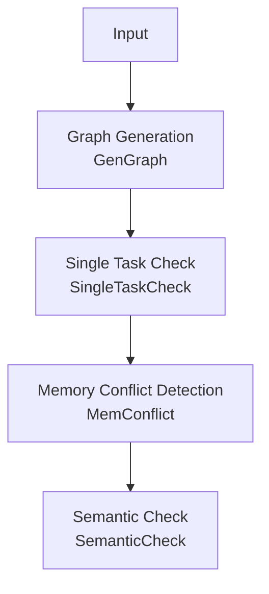

| Phase | Purpose |
|------|------|
| Graph Generation | Generate the task graph from Checker input. In CCU mode, convert CCU instructions into a task graph |
| Single Task Check | Check whether the memory range of each task is valid and verify the head-tail structure of slave streams |
| Memory Conflict Detection | Check whether unprotected memory overlap exists between concurrent tasks |
| Semantic Check | Simulate the operator execution process and verify whether the final output matches the expected operator result |

---

## 3 Task Graph

The task graph is the core data structure of Checker. It represents the task nodes generated by an operator execution and their dependency relationships. The task graph is generated during the graph generation phase based on Checker input.

### 3.1 Nodes and Edges

Each node on the task graph corresponds to one task and has a specific task type that indicates the exact operation the node performs. Common types are listed below:

| Task Type | Description | Core Fields |
|---|---|---|
| `TRANS_MEM` | Memory data transfer | `srcRankId`, `srcOffset`<br>`dstRankId`, `dstOffset`<br>`len`, `type` |
| `BATCH_TRANS_MEM` | Batch memory data transfer. One node contains multiple `(src -> dst)` transfer pairs | `srcs[]`<br>`dsts[]` |
| `REDUCE` | Data reduction | `srcRankId`, `srcOffset`<br>`dstRankId`, `dstOffset`<br>`type`, `dataCount`, `dataType`, `reduceOp` |
| `BATCH_REDUCE` | Batch data reduction. One node contains multiple `(src -> dst)` reduction pairs | `srcs[][]`<br>`dsts[]`<br>`dataType`, `reduceOp` |
| `RECORD` / `WAIT` | Synchronization tasks. They represent sending a synchronization signal and waiting for a synchronization signal respectively | `srcRankId` (sender)<br>`dstRankId` (waiter)<br>`notifyId` |

In addition to the real execution tasks above, the task graph also includes two virtual boundary node types: `START` and `END`. They do not correspond to actual data transfer or computation actions. They mainly mark the boundaries of the main graph, subgraphs, and Loop structures.

| Virtual Node Type | Supported `boundaryType` | Description |
|---|---|---|
| `START` | `MAIN_GRAPH`, `CCU_SUB_GRAPH`, `AIV_SUB_GRAPH`, `LOOP` | Start boundary node. It marks the entry of the entire task graph, or the start position of a CCU/AIV subgraph or Loop segment |
| `END` | `CCU_SUB_GRAPH`, `AIV_SUB_GRAPH`, `LOOP` | End boundary node. It marks the end position of a CCU/AIV subgraph or Loop segment and collects all tail nodes within that boundary |

Edges represent the execution order between nodes. The tail node of a directed edge always executes after the head node. Edges fall into two categories:

| Edge Type | Description |
|--------|------|
| Sequential Edge | A dependency edge that connects tasks in execution order within the same stream. In the sample below, `rank0/stream0` has two tasks executed in sequence, and `rank1/stream0` has three tasks executed in sequence |
| Synchronization Edge | A dependency edge between synchronization task nodes. In the sample below, the `WAIT` node must wait for the signal from the `RECORD` node before it continues. A directed edge from `RECORD` to `WAIT` represents this dependency |

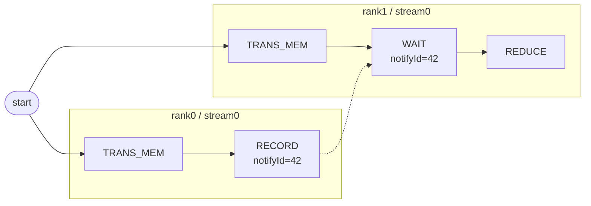

### 3.2 Task Graph Samples

#### 3.2.1 AICPU Mode

In AICPU mode, the task graph typically consists of `RECORD`, `WAIT`, and `TRANS_MEM` nodes. Below is a typical 2-rank `AllGather` sample where each rank contains two streams. Sequential edges within each stream follow the actual execution sequence. Dashed lines represent `RECORD` to `WAIT` synchronization dependencies.

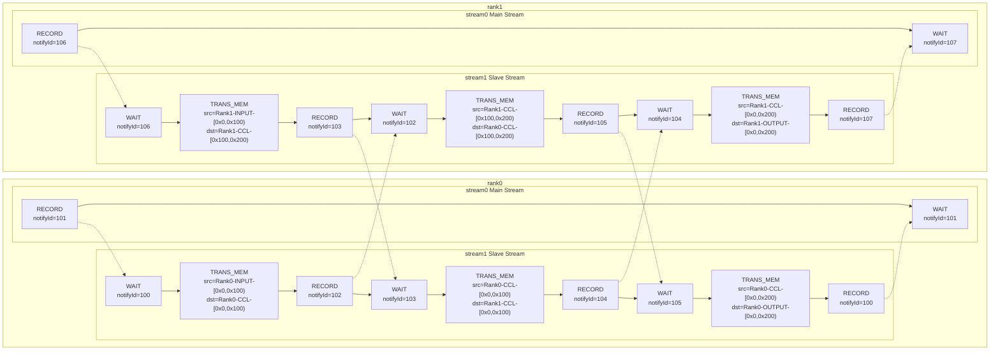

#### 3.2.2 CCU Mode

In CCU mode, Checker expands CCU instructions into a CCU subgraph. The sample below follows a 2-rank `AllReduce` data flow. It omits synchronization operations outside the CCU subgraph and retains only the task sequence inside the CCU subgraph. CCU uses synchronization fields `cke` / `mask` instead of `notifyId`. The intermediate buffer uses the CCU `MS` type.

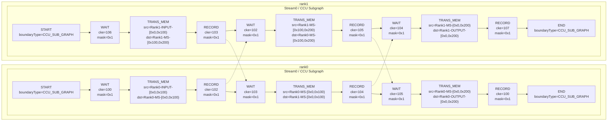

#### 3.2.3 Simple Graphviz Visualization

Checker provides a task graph export feature that outputs the task graph as a Graphviz `.dot` file.

The exported content includes not only the node list but also debugging information embedded directly into the graph:

- Nodes are arranged by `rank / stream` for easy observation of sequential relationships on the same execution queue
- Solid lines represent normal dependency edges. Dashed lines represent `RECORD -> WAIT` synchronization dependency edges
- Node labels include the task type, `nodeId`, position information, and key fields such as memory slices, `notifyId`, or `cke/mask`

Usage instructions:

- Checker automatically exports the `.dot` file after graph generation completes. No extra switch is needed
- After a successful export, search for `[GraphvizDot]` in the log. The log prints the final output path, typically `hccl_vm_install/data/`
- The output file name format is `TaskGraph_YYYYMMDDHHMMSS.dot`

> After obtaining the `.dot` file, use a `Microsoft VS Code` plugin such as `Graphviz Interactive Preview` for interactive browsing.

---

## 4. Single Task Check

This phase checks whether the memory range of each task is valid and verifies the head-tail structure of slave streams.

### 4.1 Memory Range (MemSlice)

The most important information in memory transfer and reduction tasks is the memory range (MemSlice). A memory range consists of the following fields:

```text
MemSlice = { rankId, type, offset, len }
```

- `rankId` indicates which rank the memory belongs to
- `type` indicates the memory type

  | Memory Type | Purpose |
  |----------|------|
  | INPUT | Operator input BUFFER |
  | OUTPUT | Operator output BUFFER |
  | CCL | CCL_BUFFER |
  | MS_CCU | CCU MS |

- `offset` and `len` together define the memory access range
  - `offset` indicates the start address of the current access within the memory segment
  - `len` indicates the length of the current memory access
  - The access range uses a half-open representation: `[offset, offset + length)` is the memory segment for the current access

The validation points for a single task memory range are as follows:

- `offset + length` must not overflow the `uint64` upper bound. Otherwise an error is reported.
- Multiple MemSlice entries within the same task must not have overlapping ranges under the same `(rankId, memType)`. Otherwise an error is reported.

    ```mermaid
    gantt
        title MemSlice Range Comparison
        dateFormat x
        axisFormat %L
        tickInterval 100millisecond

        section Valid (no overlap)
        Slice A  0x000-0x400 : 0, 400
        Slice B  0x400-0x800 : 400, 800

        section Invalid (overlap)
        Slice A  0x000-0x600 : crit, 0, 600
        Slice B  0x400-0x800 : crit, 400, 800
    ```

- Different `type` values represent independent address spaces. The same `offset` under different `type` values does not count as overlap.
- `offset + length` must not exceed the boundary of the current `type` address space.

    ```mermaid
    gantt
        title MemSlice Boundary Check
        dateFormat x
        axisFormat %L
        tickInterval 100millisecond

        section Valid (within bounds)
        Type Space [0x000,0x800) : 0, 800
        MemSlice   [0x200,0x500) : 200, 500

        section Invalid (out of bounds)
        Type Space [0x000,0x800) : 0, 800
        MemSlice   [0x600,0x900) : crit, 600, 900
    ```

### 4.2 Slave Stream Structure Check

A slave stream executes auxiliary tasks for the operator, such as data pre-fetching. In the HCCL programming model, the main stream triggers a slave stream through a synchronization task `RECORD -> WAIT`. After the slave stream completes, it notifies the main stream through another synchronization task pair. Therefore the slave stream must satisfy a fixed head-tail structure: the first task is `WAIT` and the last task is `RECORD`.

The diagram below shows an error sample. The highlighted nodes are violation nodes:

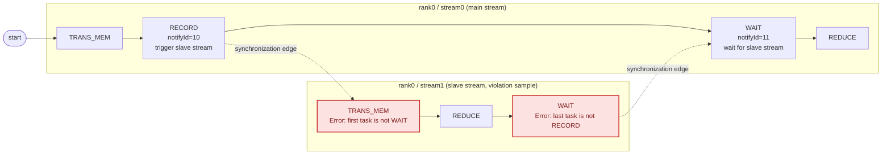

---

## 5. Memory Conflict Check

This phase checks whether the task graph contains possible memory conflicts. A memory conflict occurs when multiple memory operations access the same memory segment at the same time and at least one operation is a write. When a memory conflict occurs, the value of the conflicting memory segment is nondeterministic. This causes precision issues in collective communication operators.

### 5.1 Memory Conflict Criteria

Two memory access task nodes are flagged as a memory conflict when all three conditions below are met:

1. The two nodes may execute concurrently (no path exists between them on the task graph)
2. Their accessed memory address ranges overlap
3. At least one operation is a write

Checker efficiently validates every pair of memory access task nodes to guarantee no missed reports.

### 5.2 Memory Conflict Sample

The diagram below shows a task graph sample with a memory conflict:

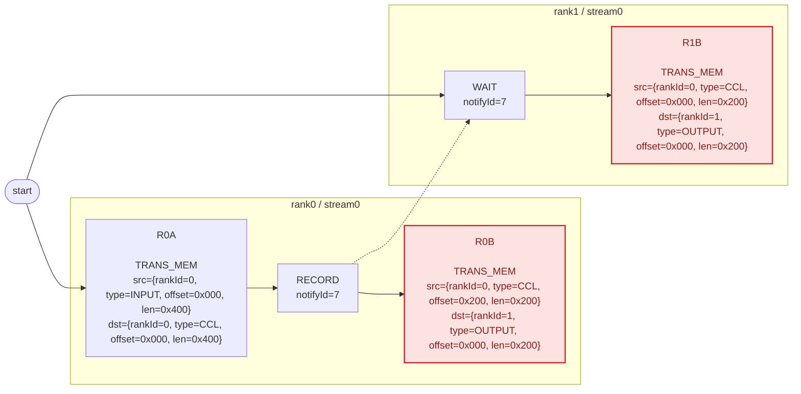

- `R0A` and `R0B` execute sequentially on the same stream. They do not meet the concurrent execution condition, so no memory conflict occurs
- `R0A` and `R1B` have their execution order constrained by synchronization nodes: `R0A -> R0RECORD -> R1WAIT -> R1B`. So no memory conflict occurs
- `R0B` and `R1B` can execute concurrently, and their write memory `dst` ranges fully overlap. Therefore a memory conflict exists

### 5.3 Conflict Log Interpretation

The error log format for memory conflict checks is as follows:

```text
[ErrorCode: 302] Two tasks may access the same memory range in parallel, and at least one access is a write.
  Conflict memory : rank 0 OUTPUT
  Overlap range    : [0x0,0xc80)
  Conflict task 1:
    node 17, action=write
    access range : [0x0,0xc80)
    task         : [TaskTransMem] node=17, rank=1, stream=0, queue=0, protocol=SDMA, src=rank 1 CCL [0x0,0xc80), dst=rank 0 OUTPUT [0x0,0xc80)
  Conflict task 2:
    node 23, action=write
    access range : [0x0,0xc80)
    task         : [TaskTransMem] node=23, rank=2, stream=0, queue=0, protocol=SDMA, src=rank 2 CCL [0x0,0xc80), dst=rank 0 OUTPUT [0x0,0xc80)
```

Log field descriptions:

| Field | Meaning |
|----|------|
| `[ErrorCode: 302]` | Memory conflict error code, corresponding to `MEMCONFLICT_DETECTED` |
| `Conflict memory : rank X TYPE` | The memory location where the conflict occurs |
| `Overlap range : [start,end)` | The address range where the two accesses truly overlap |
| `Conflict task 1 / Conflict task 2` | The two accesses determined to be concurrently executable with overlapping addresses |
| `node X, action=read/write` | The node ID on the task graph and the read/write type of the current access. A conflict is reported as long as at least one of the two accesses is a `write` |
| `access range : [start,end)` | The full address range covered by this access. It may differ from the `Overlap range` |
| `task :` | Detailed task information (task type, node ID, position, src/dst memory ranges, and so on) |

---

## 6. Semantic Check

The semantic check phase traverses the task graph in topological order, simulates the operator execution process, and verifies whether the final output matches the expected operator result.

### 6.1 BufferSemantic

During semantic checking, Checker maintains a data source record for each memory segment:

```text
BufferSemantic = {
  startAddr:  Memory range start address (offset)
  size:       Memory range length (len)
  srcBufs:    Source set. Each item is {rankId, bufferType, srcAddr}
  isReduce:   Whether the operation is a Reduce
  reduceType: Reduce operation type SUM/MAX/MIN/...
}
```

The `srcBufs` field records the data source of the memory. The `bufferType` field indicates the source buffer type, such as `INPUT`, `OUTPUT`, or `CCL`.

When each node executes, it translates each `(src -> dst)` pair into one of two operations below, then writes back to the target address space. `(src -> dst)` represents a transfer or reduction pair from a source address to a target address:

| TaskType | Operation | Behavior |
|----------|------|------|
| `TRANS_MEM` / `BATCH_TRANS_MEM` | overwrite | Clear the existing semantics in the target range first, then copy the source semantics |
| `REDUCE` / `BATCH_REDUCE` | reduce | Require the target range to be pre-filled with semantics. Otherwise an error is reported. Then append the new source into `srcBufs` and set `isReduce=true` |

### 6.2 Expected OUTPUT for Each Operator

The goal of semantic checking is to determine whether the `OUTPUT` of each rank matches the expectation of the current operator. The expectations for different operators are listed below:

| Operator | Expected OUTPUT Semantics |
|------|----------------|
| AllReduce | The OUTPUT of each rank is the reduce result of all rank INPUTs |
| AllGather | The OUTPUT of each rank is the ordered concatenation of all rank INPUTs |
| ReduceScatter | The OUTPUT of each rank is the shard assigned to that rank after the global reduce |
| AllGatherV | Same as AllGather, but the contribution size from each rank differs |
| ReduceScatterV | Same as ReduceScatter, but the shard size for each rank differs |
| Send/Recv | The OUTPUT of the target rank equals the INPUT of the source rank. Single source with no reduce |
| BatchSendRecv | Multiple Send/Recv pairs execute simultaneously |
| Broadcast | The OUTPUT of all ranks equals the INPUT of the root rank |
| Reduce | Only the OUTPUT of the root rank is the reduce result of all rank INPUTs |
| All2All | `OUTPUT[i]` of each rank equals `INPUT[this rank offset]` of `rank i` |

The diagrams below use 2-rank collective communication operators as samples to show the expected `OUTPUT` for each operator:

**AllReduce**

```mermaid
gantt
    title AllReduce (2-rank)
    dateFormat x
    axisFormat %L
    tickInterval 100millisecond

    section rank0.INPUT
    rank0.INPUT : 0, 100

    section rank1.INPUT
    rank1.INPUT : 0, 100

    section rank0.OUTPUT
    rank0.INPUT + rank1.INPUT : 0, 100

    section rank1.OUTPUT
    rank0.INPUT + rank1.INPUT : 0, 100
```

**AllGather / AllGatherV**

```mermaid
gantt
    title AllGather (2-rank)
    dateFormat x
    axisFormat %L
    tickInterval 100millisecond

    section rank0.INPUT
    rank0.INPUT : 0, 100

    section rank1.INPUT
    rank1.INPUT : 0, 100

    section rank0.OUTPUT
    rank0.INPUT : 0, 100
    rank1.INPUT : 100, 200

    section rank1.OUTPUT
    rank0.INPUT : 0, 100
    rank1.INPUT : 100, 200
```

The semantics of `AllGatherV` match the diagram above, except the contribution length from each rank may differ.

**ReduceScatter / ReduceScatterV**

```mermaid
gantt
    title ReduceScatter (2-rank, shard Len=100)
    dateFormat x
    axisFormat %L
    tickInterval 100millisecond

    section rank0.INPUT
    rank0.INPUT1 : 0, 50
    rank0.INPUT2 : 50, 100

    section rank1.INPUT
    rank1.INPUT1 : 0, 50
    rank1.INPUT2 : 50, 100

    section rank0.OUTPUT
    rank0.INPUT1 + rank1.INPUT1 : 0, 50

    section rank1.OUTPUT
    rank0.INPUT2 + rank1.INPUT2 : 50, 100
```

The semantics of `ReduceScatterV` match the diagram above, except the output shard length for each rank may differ.

**Send/Recv**

```mermaid
gantt
    title Send/Recv (2-rank, src=0, dst=1)
    dateFormat x
    axisFormat %L
    tickInterval 100millisecond

    section rank0.INPUT
    rank0.INPUT : 0, 100

    section rank1.INPUT
    None: 0,0

    section rank0.OUTPUT
    None: 0,0

    section rank1.OUTPUT
    rank0.INPUT : 0, 100
```

**BatchSendRecv**

```mermaid
gantt
    title BatchSendRecv (2-rank)
    dateFormat x
    axisFormat %L
    tickInterval 100millisecond

    section rank0.INPUT
    rank0.INPUT : 0, 100

    section rank1.INPUT
    rank1.INPUT : 0, 100

    section rank0.OUTPUT
    rank1.INPUT : 0, 100

    section rank1.OUTPUT
    rank0.INPUT : 0, 100
```

**Broadcast**

```mermaid
gantt
    title Broadcast (2-rank, root=0)
    dateFormat x
    axisFormat %L
    tickInterval 100millisecond

    section rank0.INPUT
    rank0.INPUT : 0, 100

    section rank1.INPUT
    None: 0,0

    section rank0.OUTPUT
    rank0.INPUT : 0, 100

    section rank1.OUTPUT
    rank0.INPUT : 0, 100
```

**Reduce**

```mermaid
gantt
    title Reduce (2-rank, root=0, SUM)
    dateFormat x
    axisFormat %L
    tickInterval 100millisecond

    section rank0.INPUT
    rank0.INPUT : 0, 100

    section rank1.INPUT
    rank1.INPUT : 0, 100

    section rank0.OUTPUT
    rank0.INPUT + rank1.INPUT : 0, 100

    section rank1.OUTPUT
    None: 0,0
```

**All2All**

```mermaid
gantt
    title All2All (2-rank)
    dateFormat x
    axisFormat %L
    tickInterval 100millisecond

    section rank0.INPUT
    rank0.INPUT1 : 0, 100
    rank0.INPUT2 : 100, 200

    section rank1.INPUT
    rank1.INPUT1 : 0, 100
    rank1.INPUT2 : 100, 200

    section rank0.OUTPUT
    rank0.INPUT1 : 0, 100
    rank1.INPUT1 : 100, 200

    section rank1.OUTPUT
    rank0.INPUT2 : 0, 100
    rank1.INPUT2 : 100, 200
```

### 6.3 Final Verification Flow

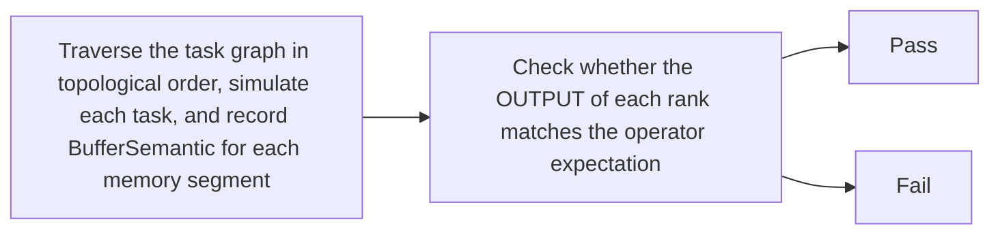

Take 4-rank `AllReduce` as a sample:

```text
rank0.OUTPUT[0,L) expectation:
  sources    = { rank0.INPUT, rank1.INPUT, rank2.INPUT, rank3.INPUT }
  reduceType = SUM

Assume sources is missing rank3.INPUT:
  actualSourceRankCount=3, expectedRankSize=4 -> check fails
```

### 6.4 Semantic Propagation Sample

Take 2-rank `AllGather` (each rank INPUT size is 100 bytes) as a sample to illustrate the semantic propagation process.

**Initial State**

The INPUT of each rank already has its own initial semantics (the source points to itself):

```text
rank0.INPUT[0, 100):  srcBufs = { (rank0, INPUT, 0) }
rank1.INPUT[0, 100):  srcBufs = { (rank1, INPUT, 0) }
rank0.OUTPUT:         empty
rank1.OUTPUT:         empty
```

**Propagation Process**

The diagram below shows the semantic filling process for rank0.OUTPUT. Each arrow represents one overwrite operation: read the semantics from the source buffer and write them to the corresponding range of the target buffer.

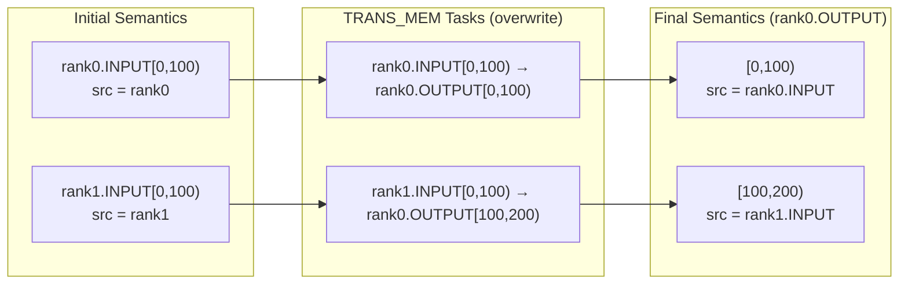

The propagation process for rank1.OUTPUT follows the same pattern. Eventually the OUTPUT of both ranks is fully filled with correct sources, and the check passes.

**Range Splitting**

If the write range does not align with existing semantic boundaries, Checker splits the existing semantics first and then overwrites. For instance, rank0.OUTPUT[0,100) already has a full-range semantic, and a write to [35,65) occurs:

```mermaid
gantt
    title Range Splitting Diagram
    dateFormat x
    axisFormat %L
    tickInterval 100millisecond

    section Before Write
    rank0.OUTPUT[0,100) src=rank0.INPUT : 0, 100

    section After Write
    [0,35) keep original semantics : 0, 35
    [35,65) replace with new source :crit, 35, 65
    [65,100) keep original semantics : 65, 100
```

Before the write, the original semantic block is split at offset 35 and 65. The range [35,65) is replaced with the new source. The remaining parts stay unchanged.

### 6.5 Two Root Causes of Semantic Errors

Semantic check failures fall into two categories:

- **Missing Data**: The OUTPUT range is not written to, or is written incompletely (missing head, fragmented, or missing tail).
- **Incorrect Data Source**: The OUTPUT is fully written, but the source rank, offset, or reduce type does not match the expectation.

When troubleshooting, determine the problem type first. For missing data, check whether the task arrangement lacks a transfer. For incorrect data source, check whether the src/dst addresses and reduceOp are correct.

### 6.6 Error Log Interpretation

```text
[ErrorCode: 407] AllGather output range [0x1000,0x1400) for rank 3 should come from rank 4, but it actually comes from rank 5.
Current result range detail:
  range=[0x1000,0x1400), size=0x400, sourceCount=1
  sources:
    - sourceRank=5, sourceBufferType=INPUT, sourceAddr=0x0
```

Log field descriptions:

| Line | Meaning |
|----|------|
| Line 1 | Error code and main error message. `407` indicates a final output source attribute error. `output range [0x1000,0x1400) for rank 3` identifies the output rank and range with the error. `should come from rank 4, but it actually comes from rank 5` indicates the expected source rank differs from the actual source rank |
| `Current result range detail` | The full semantic expansion of this output range to assist further investigation |
| `range / size / sourceCount` | The address range, length, and source count of the current output semantic block |
| `sources` | The source list for the current range. Each item includes the source rank, source buffer type, and source address |

---

## 7. Terminology Quick Reference

| Term | Description |
|------|------|
| Communicator | A group of communication members that defines the communication scope |
| Communication Member | Commonly called a rank. It is the smallest logical entity that participates in communication. Each rank receives a unique identifier, namely `rankId` |
| Communication Operator | A single collective communication operation, such as `AllReduce` or `AllGather`. Communication operators typically adopt different algorithm implementations based on network topology, data volume, and hardware resources |
| Task | The core data structure of Checker. It describes a record of one atomic operation on a given rank, such as memory transfer, Reduce, or memory copy |
| Task Graph | The core data structure of Checker. It represents the task nodes generated by an operator execution and their dependency relationships |
| Node | Each node on the task graph corresponds to one task |
| Stream | A queue that executes tasks in order within a rank. Each task records its queue membership using `streamId` |
| Task Type | Different task types serve different purposes, such as memory transfer, Reduce, or synchronization |
| Queue | The internal serial instruction queue of CCU |
| MemSlice | Memory access range `{rankId, type, offset, len}` |
| Slave Stream | An auxiliary stream that executes secondary tasks. It requires `WAIT` as the first task and `RECORD` as the last task |
| `RECORD` / `WAIT` | A paired set of synchronization tasks. They represent sending a synchronization signal and waiting for a synchronization signal respectively |
| Synchronization Edge | A cross-stream or cross-rank execution dependency established by `RECORD -> WAIT` |
| Memory Conflict | Multiple memory operations access the same memory segment at the same time, and at least one operation is a write |
| BufferSemantic | A key data structure in the semantic check phase. It records where a memory segment data originates |
| `reduceType` | The reduction type in semantics, such as `SUM`, `MAX`, or `MIN`. It describes how multi-source data is merged |
| OUTPUT Expectation | The correct semantic definition that the final output of a communication operator must satisfy. It is used for the final comparison against actual results |
