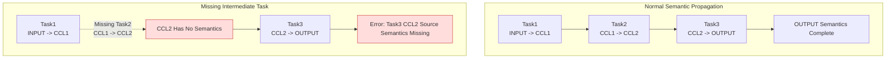

```mermaid
---
config:
  gantt:
    displayMode: compact
---
gantt
    title Target Buffer
    dateFormat x
    axisFormat 0x%L
    tickInterval 100millisecond
    todayMarker off

    section Address Layout
    0x000-0x100 Existing Data :done, blk0, 0, 100ms
    0x100-0x200 Gap   :crit, hole, 100, 100ms
    0x200-0x300 Existing Data :done, blk1, 200, 100ms
```

# Checker Error Code FAQ

---

## Module: Checker

### Submodule: Graph Generation Phase

---

#### FAQ-CHK101

**Title:** Graph generation translation failure

**Error Code:**

```text
GRAPH_TRANSLATE_FAILED (101)
```

**Key Log:**

```text
[GenGraph] [ErrorCode: 101] Failed to convert one task into a graph node, taskIndex=128, ret=1, taskMeta=taskType=0, rankId=3, streamId=7, srcRankId=3, dstRankId=4, src=[0x0,0x400), dst=[0x1000,0x1400), protocol=1
```

**Problem Description:** The graph generation phase cannot translate the input task meta into an internal graph node. This issue commonly occurs when the task type lacks support or the field combination does not satisfy translation conditions.

**Troubleshooting Guide:**

```text
[Possible Causes]
1. The `taskType` has no corresponding translation implementation.
2. Fields such as `rankId`, `streamId`, offset, or length are abnormal.
3. The upstream-generated task meta itself has problems.

[Troubleshooting Steps]
Typical error points:
1. A normal task meta cannot translate into a graph node: locate the task by `taskIndex` in the original task list; then confirm the root cause based on the specific task information.
```

---

#### FAQ-CHK102

**Title:** Graph generation phase deadlock

**Error Code:**

```text
GRAPH_DEADLOCK (102)
```

**Key Log:**

```text
[GenGraph] [ErrorCode: 102] Local Record/Wait matching is stuck on this rank. Some Wait tasks are still blocked, but no new local Record task can unblock them, rankId=0, firstBlockedWaitNode=[TaskWaitAICPU] node=143, rank=0, stream=3, protocol=SDMA, notify={recordRank=0, waitRank=0, notifyId=17}, blockedWaitNodeCount=5
```

**Problem Description:** The synchronization pairing process stalls during the graph generation phase. Wait nodes remain waiting, but no new Record nodes can pair with the Wait nodes.

**Troubleshooting Guide:**

```text
[Possible Causes]
1. The Wait count exceeds the Record count, or Record tasks cannot participate in pairing due to unresolved dependencies.
2. The `notifyId` is incorrect. The `notifyId` values of Wait and Record do not match, so pairing cannot complete.
3. The Record itself has executed, but the predecessor dependencies of the subsequent Wait are not satisfied. The Wait cannot enter the pairable queue.

[Troubleshooting Steps]
1. Read the `notifyId`, `recordRank`, and `waitRank` of `firstBlockedWaitNode` in the log. Confirm which task should theoretically unlock this Wait.
2. Check whether a matching Record exists on the same rank or the corresponding peer rank. If one exists, confirm whether the two can pair correctly.
```

---

#### FAQ-CHK103

**Title:** Unconsumed synchronization pairs remain

**Error Code:**

```text
GRAPH_UNMATCHED (103)
```

**Key Log:**

```text
[GenGraph] [ErrorCode: 103] Found cross-rank Record tasks that were never consumed by any matching Wait task, recordRankId=0, waitRankId=3, notifyId=21, firstUnconsumedRecordNode=[TaskRecordAICPU] node=77, rank=0, stream=1, protocol=RDMA, notify={recordRank=0, waitRank=3, notifyId=21}, unconsumedRecordCount=2
```

**Problem Description:** Unconsumed synchronization nodes remain after the synchronization pairing process ends. This issue typically manifests as Record nodes without corresponding Wait nodes.

**Troubleshooting Guide:**

```text
[Possible Causes]
1. The Record count and Wait count do not match.
2. The `notifyId` in use is incorrect.

[Troubleshooting Steps]
1. Check whether `recordRankId`, `waitRankId`, and `notifyId` match expectations.
```

---

#### FAQ-CHK104

**Title:** AIV group member missing

**Error Code:**

```text
GRAPH_MEMBER_MISSING (104)
```

**Problem Description:** This error code indicates that the graph generation phase finds incomplete group members in AIV mode.

---

#### FAQ-CHK105

**Title:** Illegal graph structure

**Error Code:**

```text
GRAPH_STRUCTURE_INVALID (105)
```

**Key Log:**

```text
[GenGraph] [ErrorCode: 105] Failed to remove one graph edge because the parent or child node does not exist, parentNodeId=91, childNodeId=123, parentNode=[TaskTransMem] node=91, rank=2, stream=0, protocol=SDMA, src=rank 2 INPUT [0x0,0x400), dst=rank 2 CCL [0x1000,0x1400), childNode=null
```

**Problem Description:** Graph edge relationships do not satisfy graph construction prerequisites. For example, the parent node or child node does not exist during edge removal or reconnection.

**Troubleshooting Guide:**

```text
[Possible Causes]
1. This issue is typically not an algorithm orchestration problem.

[Troubleshooting Steps]
1. Confirm whether task nodes have been generated in `Checker`.
2. Contact tool support personnel for assistance.
```

---

#### FAQ-CHK106

**Title:** AIV snapshot inconsistency

**Error Code:**

```text
GRAPH_SNAPSHOT_MISMATCH (106)
```

**Problem Description:** This error code indicates that the snapshot or environment information loaded during the graph generation phase in AIV mode is inconsistent.

---

#### FAQ-CHK107

**Title:** Graph generation resource missing

**Error Code:**

```text
GRAPH_RESOURCE_NOT_FOUND (107)
```

**Problem Description:** This error code indicates that a resource, mapping, or data file required by the graph generation phase in AIV mode is missing.

---

#### FAQ-CHK108

**Title:** Register or HBM not initialized

**Error Code:**

```text
GRAPH_REGISTER_UNINITIALIZED (108)
```

**Key Log:**

```text
[GenGraphCCU] [ErrorCode: 108] Failed to read XN register before it was initialized, rankId=2, dieId=0, instrId=73, xnId=11

[GenGraphCCU] [ErrorCode: 108] Failed to read HBM content before it was initialized, rankId=2, dieId=0, instrId=73, hbmAddr=0x1000
```

**Problem Description:** The current instruction reads a register or HBM content but finds no corresponding initialized data. This issue typically indicates that the preceding write chain was not correctly established.

**Troubleshooting Guide:**

```text
[Possible Causes]
1. The prerequisite Load / Set / Store instruction was not executed.
2. The queue responsible for initialization was blocked by Wait or other dependencies and could not advance.
3. The address or register parsing is incorrect. The read accessed an unintended location.

[Troubleshooting Steps]
1. If the log provides `xnId`, trace back to the most recent valid write to that register in the same queue.
2. If the log provides `hbmAddr`, check whether a valid write to the corresponding address range exists in earlier tasks.
```

---

#### FAQ-CHK109

**Title:** ID or index out of range

**Error Code:**

```text
GRAPH_OUT_OF_RANGE (109)
```

**Key Log:**

```text
[GenGraphCCU] [ErrorCode: 109] dieId is out of range when converting address to MS id, dieId=4, maxDieId=1

[GenGraphCCU] [ErrorCode: 109] Xn register id is out of the valid range, xnId=37, validMin=0, validMax=31
```

**Problem Description:** An ID, index, or address ownership field exceeds the current resource or instruction constraint range. This issue commonly occurs with `dieId`, register IDs, or intermediate address parsing results that go out of range.

**Troubleshooting Guide:**

```text
[Possible Causes]
1. The resource pool size does not match the task data. For example, only a subset of dies was loaded.
2. Address ownership parsing is incorrect. A local address was mapped to a nonexistent resource ID.
3. Instruction field parsing is misaligned. This causes an abnormal register ID or index value.
4. The current data comes from a different version or branch of the instruction set.

[Troubleshooting Steps]
1. If the log provides `dieId/maxDieId`, verify whether the die count in the current resource file matches the task data.
2. If the log provides `xnId/validMin/validMax`, trace back to the original instruction fields. Confirm whether the register ID was incorrectly parsed or calculated.
```

---

#### FAQ-CHK110

**Title:** Illegal address or unmet alignment constraint

**Error Code:**

```text
GRAPH_ADDRESS_INVALID (110)
```

**Key Log:**

```text
[GenGraphCCU] [ErrorCode: 110] Address does not fall into any known MS address range, localMsAddr=0x27f0000, rawAddr=0x82ff000

[GenGraphCCU] [ErrorCode: 110] Load source address must be 8-byte aligned, sourceAddress=0x1003
```

**Problem Description:** The address cannot map to any resource range known to the Checker. Alternatively, Load/Store addresses or lengths do not satisfy the alignment constraints of the current instruction.

**Troubleshooting Guide:**

```text
[Possible Causes]
1. The base address table does not match.
2. The upstream incorrectly wrote the original address. This causes an abnormal value.
3. The upstream address calculation is offset.
4. An instruction address or length does not meet the required alignment.

[Troubleshooting Steps]
1. If the log provides `rawAddr/localMsAddr` or `addr/dieBaseAddr`, determine which resource range the address should theoretically fall into.
2. If the log provides `sourceAddress`, `hbmAddr`, or `dataLengthBytes`, verify whether the 8-byte or 64-byte granularity constraint is satisfied.
```

---

#### FAQ-CHK111

**Title:** Unsupported task or instruction

**Error Code:**

```text
GRAPH_UNSUPPORTED (111)
```

**Key Log:**

```text
[GenGraph] [ErrorCode: 111] This task type is not supported for CheckerV3 graph generation, taskIndex=128, taskMeta=taskType=9, rankId=3, streamId=7

[GenGraphCCU] [ErrorCode: 111] This CCU instruction type is not supported by CheckerV3 graph expansion, rankId=2, queueId=1, instructionHeader=0xf431
```

**Problem Description:** A feature not yet supported by the Checker is in use.

**Troubleshooting Guide:**

```text
[Possible Causes]
1. The Checker does not yet support this feature.

[Troubleshooting Steps]
1. Check the corresponding fields in the log. Confirm whether they match expectations.
2. Contact tool support personnel for assistance.
```

---

#### FAQ-CHK112

**Title:** Remote rank derivation inconsistency

**Error Code:**

```text
GRAPH_REMOTE_RANK_MISMATCH (112)
```

**Key Log:**

```text
[GenGraphCCU] [ErrorCode: 112] Remote address resolves to a different rank than the selected channel, instruction=TransLocMemToRmtMem, rankId=2, dieId=0, queueId=1, instrId=73, channelId=7, expectedRemoteRankId=5, actualRemoteRankId=6, remoteAddr=140737488363520
```

**Problem Description:** The remote rank derived from the channel or remote address is inconsistent.

**Troubleshooting Guide:**

```text
[Possible Causes]
1. The channel table is incorrect.
2. The remote address is incorrectly encoded.

[Troubleshooting Steps]
1. Verify which rank the `channelId` and `remoteAddr` belong to. Confirm whether the result matches expectations.
```

---

#### FAQ-CHK113

**Title:** Merged Loop emission failure

**Error Code:**

```text
GRAPH_LOOP_MERGE_ERROR (113)
```

**Key Log:**

```text
[GenGraphCCU] [ErrorCode: 113] Failed to emit one merged loop instruction because the merged instruction entry is null, rankId=2, queueId=1

[GenGraphCCU] [ErrorCode: 113] Failed to emit one merged loop transfer task, rankId=2, queueId=1, mergedLoopInstr={rankId=2, dieId=0, instrId=73, srcs=4, dsts=4, waitOps=1, setOps=1}
```

**Problem Description:** Loop merging fails in CCU mode.

**Troubleshooting Guide:**

```text
[Possible Causes]
1. Resource conflicts occur during serial or parallel loop expansion (memory addresses, CKE, and so on).
Note: The system attempts normal expansion after loop merge failure. This may affect performance.

[Troubleshooting Steps]
1. Confirm that the loop body instruction template design meets expectations.
```

---

### Submodule: Single Task and Slave Stream Validation

---

#### FAQ-CHK201

**Title:** Invalid Memory Slice

**Error Code:**

```text
SINGLETASK_SLICE_INVALID (201)
```

**Error Function:**

```text
task_graph_single_task_check_v3.cc::CheckMemorySlice()
task_graph_single_task_check_v3.cc::CheckBatchTrans()
task_graph_mem_conflict_v3.cc
task_graph_semantic_check_v3.cc
```

**Key Log:**

```text
[MemConflict] [ErrorCode: 201] One memory slice is missing a valid rank or memory type, task=[TaskTransMem] node=42, rank=0, stream=2, protocol=SDMA, src=rank 0 INPUT [0x0,0x400), dst=rank 0 CCL [0x1000,0x1400), rankId=invalid, memType=invalid, offset=0x0, length=0x400
    

[SingleTaskCheck] [ErrorCode: 201] One memory slice is invalid because its end address overflows while total coverage is being calculated, task=[TaskBatchTransMem] node=108, rank=1, stream=5, protocol=CCU, pairCount=2, mergedPairCount=2, src0=rank 1 CCL [0xfffffffffffffff0,0xffffffffffffff30), dst0=rank 1 OUTPUT [0x0,0x40), memorySlice={rankId=1, memType=CCL, offset=0xfffffffffffffff0, length=0x40}
    

[SingleTaskCheck] [ErrorCode: 201] Batch trans slice length mismatch, node=[TaskBatchTransMem] node=108, rank=1, stream=5, protocol=CCU, label=src, index=2, expectedLen=0x400, actualLen=0x200

[SingleTaskCheck] [ErrorCode: 201] Batch trans pair size mismatch, node=[TaskBatchTransMem] node=108, rank=1, stream=5, protocol=CCU, label=src, srcCount=4, dstCount=3

[SingleTaskCheck] [ErrorCode: 201] Batch reduce has different counts of source groups and target memory slices, task=[TaskBatchReduce] node=176, rank=2, stream=4, protocol=CCU, group=src, sourceGroupCount=3, targetMemorySliceCount=2

[SingleTaskCheck] [ErrorCode: 201] Source data size is not an integer multiple of target data size, task=[TaskBatchReduce] node=176, rank=2, stream=4, protocol=CCU, srcDataSize=0xc00, dstDataSize=0x800, group=src
```

**Problem Description:** The memory slice itself is invalid, or slices within the same group overlap. This issue may occur during single task validation, memory conflict checking, or semantic simulation.

**Troubleshooting Guide:**

```text
[Possible Causes]
1. The slice fields are incomplete.
2. Memory type conversion failed.
3. The length or offset does not match expectations.
4. Slice overlap between loops was discovered during CCU Loop merging.

[Troubleshooting Steps]
1. Check whether the slice fields `rankId/memType/offset/length` in the log match expectations.
```

---

#### FAQ-CHK202

**Title:** Slice conflict within a single task

**Error Code:**

```text
SINGLETASK_SLICE_CONFLICT (202)
```

**Key Log:**

```text
[SingleTaskCheck] [ErrorCode: 202] Two memory slices overlap inside the same task, task=[TaskReduce] node=57, rank=0, stream=4, protocol=CCU, dataType=0, reduceOp=0, srcs=[rank 0 CCL [0x1000,0x1400), rank 0 CCL [0x1200,0x1600)], dst=rank 0 OUTPUT [0x0,0x400), memorySlice1={rankId=0, memType=CCL, offset=0x1000, length=0x400}, memorySlice2={rankId=0, memType=CCL, offset=0x1200, length=0x400}, position=rankId=0, streamId=4
```

**Problem Description:** Overlapping memory slices exist within the same task. This causes address range intersection in the same buffer.

**Troubleshooting Guide:**

```text
[Possible Causes]
1. The Transmem source and destination addresses overlap.
2. The Reduce source segment partitioning is incorrect.
3. Overlap remains after Batch merging.
Note: CCU mode allows the case where source and destination addresses are completely identical.

[Troubleshooting Steps]
1. Check whether the slice fields `rankId/memType/offset/length` in the log match expectations.
```

---

#### FAQ-CHK203

**Title:** Illegal slave stream structure

**Error Code:**

```text
SINGLETASK_SLAVE_STREAM_INVALID (203)
```

**Key Log:**

```text
[StreamCheck] [ErrorCode: 203] This slave stream is missing its start node or end node, rankId=0, streamId=6, taskCount=4, startNode=null, endNode=[TaskRecordAICPU] node=241, rank=0, stream=6, protocol=SDMA, notify={recordRank=0, waitRank=0, notifyId=32}
    

[StreamCheck] [ErrorCode: 203] The first task in this slave stream is not a local WAIT task, rankId=0, streamId=6, actualFirstTaskType=TRANS_MEM, firstTask=[TaskTransMem] node=214, rank=0, stream=6, protocol=SDMA, src=rank 0 INPUT [0x0,0x400), dst=rank 0 CCL [0x4000,0x4400)
    

[StreamCheck] [ErrorCode: 203] The last task in this slave stream is not a local RECORD task, rankId=0, streamId=6, actualLastTaskType=WAIT, lastTask=[TaskWaitAICPU] node=245, rank=0, stream=6, protocol=SDMA, notify={recordRank=0, waitRank=0, notifyId=32}
    

[StreamCheck] [ErrorCode: 203] This slave stream still has no valid end node after empty local-copy tasks are skipped, rankId=0, streamId=6, skippedEmptyLocalCopyCount=3, currentTailNode=null
```

**Problem Description:** The slave stream structure does not satisfy Checker constraints. Common manifestations include missing valid start or end nodes, the first task not being a local `WAIT`, or the last task not being a local `RECORD`.

**Troubleshooting Guide:**

```text
[Possible Causes]
1. The slave stream lacks head and tail synchronization nodes.

[Troubleshooting Steps]
1. Missing start or end node in slave stream: confirm whether the stream node list itself is complete. Then confirm whether the current first and last nodes match expectations.
```

---

### Submodule: Memory Conflict Validation

---

#### FAQ-CHK301

**Title:** Illegal memory conflict DAG

**Error Code:**

```text
MEMCONFLICT_DAG_INVALID (301)
```

**Key Log:**

```text
[MemConflict] [ErrorCode: 301] Reachability analysis cannot start because the main start node is invalid, mainStartNode=[TaskTransMem] node=42, rank=0, stream=2, protocol=SDMA, src=rank 0 INPUT [0x0,0x400), dst=rank 0 CCL [0x1000,0x1400)
    

[MemConflict] [ErrorCode: 301] This data-move node is missing its reachability index, node=[TaskBatchTransMem] node=318, rank=3, stream=2, protocol=CCU, pairCount=4, mergedPairCount=2, src0=rank 3 CCL [0x8000,0x8400), dst0=rank 3 OUTPUT [0x0,0x400)
    

[MemConflict] [ErrorCode: 301] This V3 graph is not a complete DAG from the main start node, topoSize=412, expectedTopoSize=415, reachableTaskCount=411, taskNodeCount=414, mainStartNodeId=-1
```

**Problem Description:** The main graph structure required by the memory conflict check is abnormal. Common issues include an illegal main graph start node, missing nodes in the reachability index, or an incomplete DAG in the task graph.

**Troubleshooting Guide:**

```text
[Possible Causes]
1. The main graph generated during the graph generation phase is incomplete.
2. Some task nodes are not on reachable paths from the `main_start` head node.

[Troubleshooting Steps]
1. Confirm whether the task graph generation executed correctly.
2. Contact tool support personnel for assistance.
```

---

#### FAQ-CHK302

**Title:** Real memory conflict detected

**Error Code:**

```text
MEMCONFLICT_DETECTED (302)
```

**Key Log:**

```text
[MemConflict] [ErrorCode: 302] Two tasks may access the same memory range in parallel, and at least one access is a write.
  Conflict memory : rank 0 OUTPUT
  Overlap range    : [0x1000,0x1400)
  Conflict task 1:
    node 214, action=write
    access range : [0x1000,0x1800)
    task         : [TaskTransMem] node=214, rank=0, stream=6, protocol=SDMA, src=rank 0 CCL [0x4000,0x4800), dst=rank 0 OUTPUT [0x1000,0x1800)
  Conflict task 2:
    node 233, action=write
    access range : [0x1000,0x1400)
    task         : [TaskReduce] node=233, rank=0, stream=8, protocol=CCU, dataType=0, reduceOp=0, srcs=[rank 0 CCL [0x5000,0x5400), rank 3 CCL [0x5000,0x5400)], dst=rank 0 OUTPUT [0x1000,0x1400)
```

**Problem Description:** A real memory concurrency conflict is detected. Two tasks access the same memory range, and at least one access is a write.

**Troubleshooting Guide:**

```text
[Possible Causes]
1. The two streams lack synchronization constraints.
2. Tasks that should be serial are incorrectly built as parallel-capable.
3. The read/write range partitioning or address calculation is incorrect.
Note: The system only validates `read-write` / `write-write` conflicts. `read-read` is not considered a conflict.

[Troubleshooting Steps]
1. Check the log to identify which two tasks conflict at which address range. Verify whether the task arrangement and synchronization signal design match expectations.
```

---

### Submodule: Semantic Validation

---

#### FAQ-CHK401

**Title:** No semantic source for target range

**Error Code:**

```text
SEMANTIC_BUFFER_EMPTY (401)
```

**Key Log:**

```text
[SemanticCheck] [ErrorCode: 401] No source/output information was found for the target memory range, startAddr=0x0, size=0x1000
```

**Problem Description:** The semantic check finds no available source data or output semantics for the target range.

**Troubleshooting Guide:**

```text
[Possible Causes]
1. The related write tasks have not been executed yet.
2. Earlier semantic construction already failed due to other errors.
Note: The Checker only initializes INPUT memory semantics by default. Subsequent semantics propagate based on memory operation tasks.

[Troubleshooting Steps]
1. Confirm which task should theoretically write this result. Verify whether the source address semantics in use are correctly set.
```

**Diagram Description:**



---

#### FAQ-CHK402

**Title:** Semantic result range discontinuity

**Error Code:**

```text
SEMANTIC_GAP (402)
```

**Key Log:**

```text
[SemanticCheck] [ErrorCode: 402] Output data does not start from the expected address; the beginning is missing, expectedStart=0x0, actualStart=0x400
    

[SemanticCheck] [ErrorCode: 402] Output data is broken in the middle; one piece ends at 0x800 but the next starts at 0xc00
    

[SemanticCheck] [ErrorCode: 402] Output data ends too early; the tail is missing, expectedEnd=0x2000, actualEnd=0x1c00
```

**Problem Description:** The semantic result range is discontinuous. Common manifestations include a missing beginning, a middle break, or an incomplete tail coverage.

**Troubleshooting Guide:**

```text
[Possible Causes]
1. The related write tasks did not execute completely.
2. The offset or length calculation does not match expectations.

[Troubleshooting Steps]
1. Determine whether the issue is a missing beginning, a middle break, or a missing tail based on `expectedStart/actualStart`, breakpoint addresses, or `expectedEnd/actualEnd`.
2. Check the corresponding write tasks. Identify which data segment was not written or has an incorrect write length.
```

**Diagram Description:**



---

#### FAQ-CHK403

**Title:** Incorrect Reduce semantics

**Error Code:**

```text
SEMANTIC_REDUCE_ERROR (403)
```

**Key Log:**

```text
[SemanticCheck] [ErrorCode: 403] Target output range is only partially filled before reduce continues, dataMapping={operation=reduce, sourceMemorySlice={rankId=3, memoryType=CCL, offset=0x800, length=0x400}, targetMemorySlice={rankId=1, memoryType=OUTPUT, offset=0x0, length=0x400}, launchIdx=18446744073709551615, blockId=4294967295, pipeId=4294967295, taskId=4294967295, reduceType=HCCL_REDUCE_SUM}, outputRange=[0x0,0x400), pieceCount=1
    

[SemanticCheck] [ErrorCode: 403] Reduce result type is inconsistent while merging one source data range, dataMapping={operation=reduce, sourceMemorySlice={rankId=2, memoryType=CCL, offset=0x0, length=0x400}, targetMemorySlice={rankId=0, memoryType=OUTPUT, offset=0x0, length=0x400}, launchIdx=18446744073709551615, blockId=4294967295, pipeId=4294967295, taskId=4294967295, reduceType=HCCL_REDUCE_MAX}
    

[SemanticCheck] [ErrorCode: 403] Source data needed by this reduce is missing, dataMapping={operation=reduce, sourceMemorySlice={rankId=5, memoryType=INPUT, offset=0x400, length=0x400}, targetMemorySlice={rankId=0, memoryType=OUTPUT, offset=0x400, length=0x400}, launchIdx=18446744073709551615, blockId=4294967295, pipeId=4294967295, taskId=4294967295, reduceType=HCCL_REDUCE_SUM}
```

**Problem Description:** The reduce semantic chain is incomplete or inconsistent. Common manifestations include continuing reduce before the target range is fully covered, inconsistent reduce types, or missing reduce source data.

**Troubleshooting Guide:**

```text
[Possible Causes]
1. The preceding overwrite or transfer did not fully cover the target range or source range.
2. The reduce execution order is abnormal, or different `reduceOp` values write to the same target range.
3. Some ranks did not participate correctly in the reduce.

[Troubleshooting Steps]
1. Read the log information. Determine whether the issue is incomplete range, type inconsistency, or missing source data.
2. Check the corresponding preceding memory operation tasks. Identify which semantic chain segment is missing.
```

---

#### FAQ-CHK404

**Title:** Missing overwrite source semantics

**Error Code:**

```text
SEMANTIC_SIMULATE_FAILED (404)
```

**Key Log:**

```text
[SemanticCheck] [ErrorCode: 404] Source data needed by this overwrite is missing, dataMapping={operation=overwrite, sourceMemorySlice={rankId=1, memoryType=INPUT, offset=0x0, length=0x800}, targetMemorySlice={rankId=1, memoryType=OUTPUT, offset=0x0, length=0x800}, launchIdx=18446744073709551615, blockId=4294967295, pipeId=4294967295, taskId=4294967295}
```

**Problem Description:** The source range semantics for the overwrite is incomplete. The current semantic implementation continues simulation but warns that this overwrite is not "complete memcpy semantics". Subsequent semantic analysis results may be affected.

**Troubleshooting Guide:**

```text
[Possible Causes]
1. The source range of the overwrite was not fully initialized beforehand. Only partial source semantics were established.
2. The source address or length configuration of preceding transfer or slice tasks is incorrect. This causes the overwrite to read from empty ranges without established semantics.
3. Some dependent tasks are missing or have abnormal order. This causes the source data to be unprepared when the overwrite executes.

[Troubleshooting Steps]
1. Locate the source buffer range read by the overwrite using `sourceMemorySlice`. Confirm whether complete semantics were established for that range in preceding tasks.
2. Check the transfer, slice, and reduce tasks before the overwrite. Confirm that address ranges are continuous, lengths match, and no intermediate gaps exist.
3. If this is expected behavior, confirm whether subsequent analysis allows "partial source semantics" to propagate. Otherwise, complete the preceding data chain.
```

---

#### FAQ-CHK405

**Title:** Final output validation prerequisites not met

**Error Code:**

```text
SEMANTIC_FINAL_CHECK_FAILED (405)
```

**Key Log:**

```text
[SemanticCheck] [ErrorCode: 405] Send/Recv final output validation supports exactly 2 ranks, but got expectedRankSize=2, actualRankSize=3, sourceRank=1, targetRank=5
```

**Problem Description:** The prerequisites for final output validation are not met. For example, the rank count for the Send/Recv scenario is not 2.

**Troubleshooting Guide:**

```text
[Possible Causes]
1. The input rank count configuration is incorrect.
2. Ranks from different Send/Recv operations are mixed together.

[Troubleshooting Steps]
1. Confirm whether this round of Send/Recv validation should theoretically contain only two ranks.
```

---

#### FAQ-CHK406

**Title:** Missing final output

**Error Code:**

```text
SEMANTIC_FINAL_MISSING (406)
```

**Key Log:**

```text
[SemanticCheck] [ErrorCode: 406] AllGatherV produced no result data for rank 3, but this rank is expected to receive data from all 8 participating ranks with an expected total result size of 0x1c00 bytes.
    

[SemanticCheck] [ErrorCode: 406] Send/Recv output for rank 5 should continue at 0x0, but the next actual range starts at 0x400 (actual range: [0x400,0x800)).
    Current result range detail:
      range=[0x400,0x800), size=0x400, sourceCount=1
      sources:
        - sourceRank=1, sourceBufferType=INPUT, sourceAddr=0x0
    

[SemanticCheck] [ErrorCode: 406] ReduceScatter output for rank 6 ends too early: the checker validated 0x1800 bytes in total, but the expected result size is 0x1c00.
```

**Problem Description:** The final output has missing data. Common manifestations include a rank with no result at all, an incorrect result start address, or an incompletely filled result tail.

**Troubleshooting Guide:**

```text
[Possible Causes]
1. The result write chain did not execute completely.
2. The memory transfer process has gaps or abnormal offsets.
3. The address offset or shard size does not match expectations.

[Troubleshooting Steps]
1. Determine which result segment is missing based on `expectedStartAddr/actualStartAddr` or `expectedSize/checkedSize`.
2. Trace back from the memory transfer tasks of the corresponding rank. Confirm whether each memory transfer task matches expectations.
```

---

#### FAQ-CHK407

**Title:** Incorrect final output source attributes

**Error Code:**

```text
SEMANTIC_FINAL_SRC_ERROR (407)
```

**Key Log:**

```text
[SemanticCheck] [ErrorCode: 407] AllGatherV output range [0x1000,0x1400) for rank 3 should come from rank 4, but it actually comes from rank 5.
    Current result range detail:
      range=[0x1000,0x1400), size=0x400, sourceCount=1
      sources:
        - sourceRank=5, sourceBufferType=INPUT, sourceAddr=0x0
    

[SemanticCheck] [ErrorCode: 407] AllReduce result range [0x0,0x400) for rank 0 should come from INPUT, but source rank 3 actually provides buffer type CCL.
    Current result range detail:
      range=[0x0,0x400), size=0x400, reduce=HCCL_REDUCE_SUM, sourceCount=8
      sources:
        - sourceRank=0, sourceBufferType=INPUT, sourceAddr=0x0
        - sourceRank=1, sourceBufferType=INPUT, sourceAddr=0x0
        - sourceRank=2, sourceBufferType=INPUT, sourceAddr=0x0
        - sourceRank=3, sourceBufferType=CCL, sourceAddr=0x0
        - sourceRank=4, sourceBufferType=INPUT, sourceAddr=0x0
        - sourceRank=5, sourceBufferType=INPUT, sourceAddr=0x0
        - sourceRank=6, sourceBufferType=INPUT, sourceAddr=0x0
        - sourceRank=7, sourceBufferType=INPUT, sourceAddr=0x0
    

[SemanticCheck] [ErrorCode: 407] Send/Recv output range [0x400,0x800) for rank 5 should take data from source rank 1 at input address 0x400, but it actually takes data from source rank 1 at input address 0x0.
    Current result range detail:
      range=[0x400,0x800), size=0x400, sourceCount=1
      sources:
        - sourceRank=1, sourceBufferType=INPUT, sourceAddr=0x0
```

**Problem Description:** The source attributes of the final output are incorrect. The source rank, source buffer type, or source address does not match expectations.

**Troubleshooting Guide:**

```text
[Possible Causes]
1. The result concatenation order or rank semantic marking is incorrect.
2. An intermediate buffer is incorrectly used as the final source.
3. The address offset or shard order does not match expectations.

[Troubleshooting Steps]
1. Observe `actualSourceRank`, `actualSourceBufferType`, `expectedAddr`, and `actualAddr` to determine the problem type.
2. Check the corresponding memory transfer tasks. Confirm whether each memory transfer task matches expectations.
```

---

#### FAQ-CHK408

**Title:** Excessive data from a single source

**Error Code:**

```text
SEMANTIC_FINAL_SIZE_ERROR (408)
```

**Key Log:**

```text
[SemanticCheck] [ErrorCode: 408] AllGatherV data collected from rank 4 for rank 3 becomes larger than expected after outputRange [0x1000,0x1600). The accumulated size is 0x600, but the expected size from this source rank is 0x400.
    Current result range detail:
      range=[0x1000,0x1600), size=0x600, sourceCount=1
      sources:
        - sourceRank=4, sourceBufferType=INPUT, sourceAddr=0x0
```

**Problem Description:** The data contribution from a source rank in the final output exceeds the range allowed by the operator semantics.

**Troubleshooting Guide:**

```text
[Possible Causes]
1. The length configuration for this source rank is incorrect.
2. The same data segment is concatenated repeatedly.

[Troubleshooting Steps]
1. Check the counts/displs configuration corresponding to `expectedSize`. Then confirm whether the result from this source rank is concatenated repeatedly.
```

---

#### FAQ-CHK409

**Title:** Incorrect final output Reduce semantics

**Error Code:**

```text
SEMANTIC_FINAL_REDUCE_ERROR (409)
```

**Key Log:**

```text
[SemanticCheck] [ErrorCode: 409] Send/Recv output range [0x0,0x400) for rank 5 should come from exactly one source, but it actually comes from 2 sources.
    Current result range detail:
      range=[0x0,0x400), size=0x400, sourceCount=2
      sources:
        - sourceRank=1, sourceBufferType=INPUT, sourceAddr=0x0
        - sourceRank=2, sourceBufferType=INPUT, sourceAddr=0x0
    

[SemanticCheck] [ErrorCode: 409] AllReduce result range [0x0,0x400) for rank 0 was reduced with mode HCCL_REDUCE_MAX, but the operator expects reduce mode HCCL_REDUCE_SUM.
    Current result range detail:
      range=[0x0,0x400), size=0x400, reduce=HCCL_REDUCE_MAX, sourceCount=8
      sources:
        - sourceRank=0, sourceBufferType=INPUT, sourceAddr=0x0
        - sourceRank=1, sourceBufferType=INPUT, sourceAddr=0x0
        - sourceRank=2, sourceBufferType=INPUT, sourceAddr=0x0
        - sourceRank=3, sourceBufferType=INPUT, sourceAddr=0x0
        - sourceRank=4, sourceBufferType=INPUT, sourceAddr=0x0
        - sourceRank=5, sourceBufferType=INPUT, sourceAddr=0x0
        - sourceRank=6, sourceBufferType=INPUT, sourceAddr=0x0
        - sourceRank=7, sourceBufferType=INPUT, sourceAddr=0x0
    

[SemanticCheck] [ErrorCode: 409] ReduceScatter output range [0x0,0x400) for rank 6 expected 8 source ranks but got 6.
    Current result range detail:
      range=[0x0,0x400), size=0x400, reduce=HCCL_REDUCE_SUM, sourceCount=6
      sources:
        - sourceRank=0, sourceBufferType=INPUT, sourceAddr=0x1800
        - sourceRank=1, sourceBufferType=INPUT, sourceAddr=0x1800
        - sourceRank=2, sourceBufferType=INPUT, sourceAddr=0x1800
        - sourceRank=3, sourceBufferType=INPUT, sourceAddr=0x1800
        - sourceRank=4, sourceBufferType=INPUT, sourceAddr=0x1800
        - sourceRank=5, sourceBufferType=INPUT, sourceAddr=0x1800
```

**Problem Description:** The reduce semantics of the final output are incorrect. Possible manifestations include multiple sources for a single-source operator, a `reduceType` mismatch, or an insufficient source rank count.

**Troubleshooting Guide:**

```text
[Possible Causes]
1. The overwrite / reduce merging logic does not match expectations.
2. The `reduceOp` is inconsistent, or intermediate semantics are polluted.
3. Contributions from some ranks did not enter the result range.

[Troubleshooting Steps]
1. Observe `sourceCount`, `expectedSourceCount`, `actualReduceType`, and the `sources` list. Determine whether the issue is multiple sources, type inconsistency, or missing sources.
2. Check the corresponding memory transfer and Reduce tasks. Confirm whether each memory operation matches expectations.
```

---

### Submodule: Dump Output

---

#### FAQ-CHK501

**Title:** Dump output failure

**Error Code:**

```text
DUMP_FAILED (501)
```

**Problem Description:** The dump manager initialization, file writing, or serialization process fails. This prevents validation results from being written to disk.

**Troubleshooting Guide:**

```text
[Possible Causes]
1. The output directory or target path is not writable.
2. Disk space is insufficient, or the dump path is not prepared.
3. File handle, flush, or serialization failed.

[Troubleshooting Steps]
1. Check the dump output directory, permissions, and disk space.
2. Contact tool support personnel for assistance.
```

---

### Submodule: Main Process and Configuration

---

#### FAQ-CHK901

**Title:** General runtime error

**Error Code:**

```text
CHECKER_RUNTIME_ERROR (901)
```

**Key Log:**

```text
[Main] [ErrorCode: 901] Failed to load instruction data for this rank, rankId=3
    

[Main] [ErrorCode: 901] Unsupported collective type, collectiveTypeCode=37
    

[SemanticCheck] [ErrorCode: 901] Semantic check initialization failed because the rank count is 0, collectiveType=AllReduce, dataType=FLOAT, elementCount=1024, reduceType=SUM
    

[SemanticCheck] [ErrorCode: 901] Output simulation stopped because some tasks still have unresolved dependencies, handledNodeCount=410, totalNodeCount=415, firstRemainingNode=[TaskReduce] node=233, rank=2, stream=5, protocol=CCU, dataType=0, reduceOp=0, srcs=[rank 2 CCL [0x2000,0x2400)], dst=rank 2 OUTPUT [0x0,0x400)
```

**Problem Description:** A general exception occurs during main process runtime.

**Troubleshooting Guide:**

```text
[Possible Causes]
1. This issue is typically an internal Checker problem.

[Troubleshooting Steps]
1. Identify the error type first. If the type is `Unsupported` or similar, check whether the data meets Checker requirements.
2. Contact tool support personnel for assistance.
```

---

#### FAQ-CHK902

**Title:** Configuration or runtime strategy warning

**Error Code:**

```text
SETTING_WARNING (902)
```

**Key Log:**

```text
[Main] [ErrorCode: 902] This op is skipped because both the new checker and the old checker are disabled, opIndex=47, newCheckerEnabled=0, oldCheckerEnabled=0
```

**Problem Description:** Configuration switches or runtime strategies do not meet the execution conditions for the current operation. For example, both the new checker and the old checker are disabled simultaneously.

**Troubleshooting Guide:**

```text
[Possible Causes]
1. The manifest.json or runtime parameters disabled the checker.

[Troubleshooting Steps]
1. Check the switch configuration first. Confirm that at least one Checker is enabled.
```
