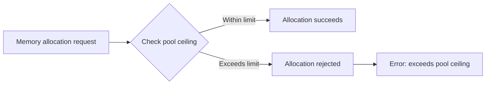
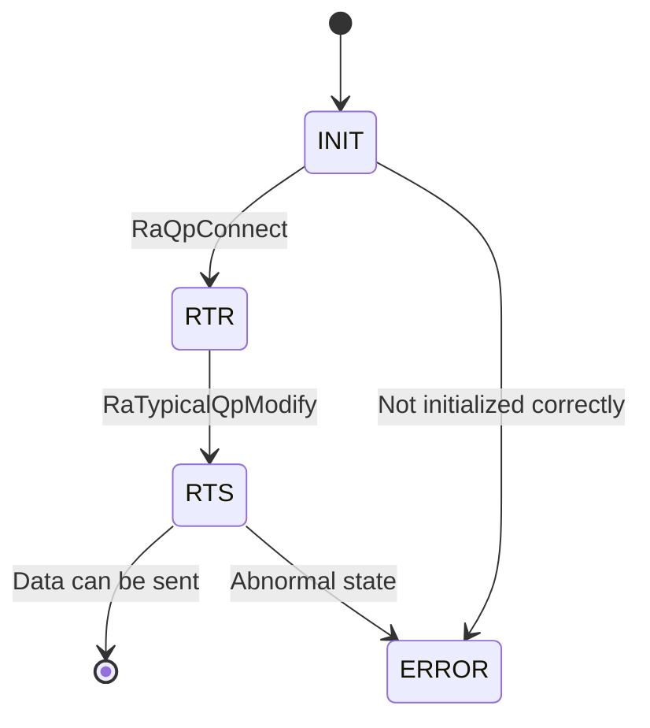
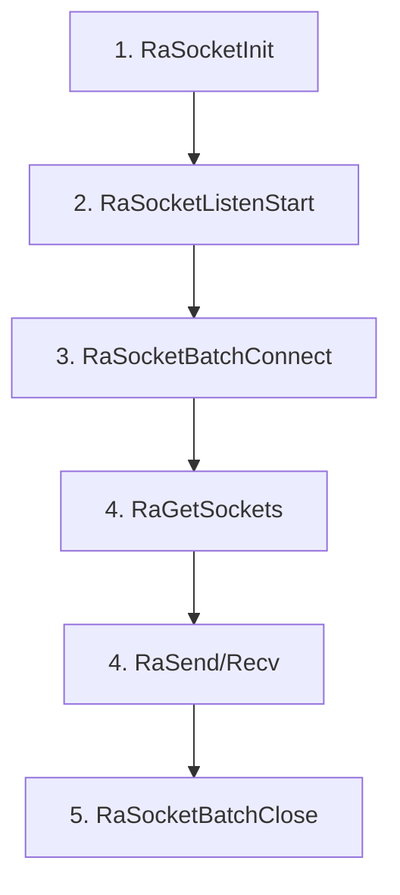
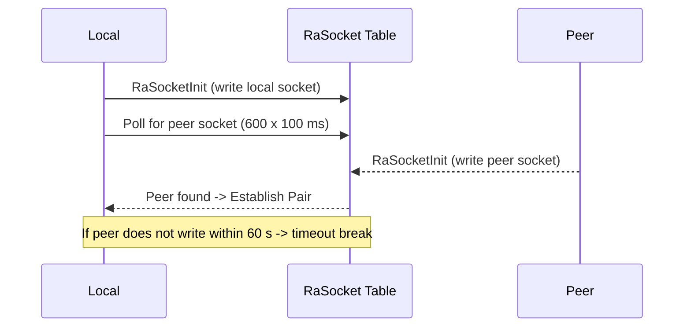

# HCCL-VM FAQ Test Document

> This document tests the FAQ HTML generation framework.

---

## Module: CANN Package Installation and WSL Environment Configuration

---

### FAQ-C001

**Title:** WSL Environment Configuration

**Error Code:**

```text
NA (4)
```

**Error Function:**

```text
NA
```

**Key Log:**

```text
[ 85%] Building CXX object src/legacy/ascend910/framework/CMakeFiles/hcomm.dir/common/src/config/env_config_host.cc.o
{standard input}: Assembler messages:
{standard input}:61985: Warning: end of file not at end of a line; newline inserted
{standard input}:61986: Error: expecting operand after ','; got nothing
{standard input}: Error: open CFI at the end of file; missing .cfi_endproc directive
c++: fatal error: Killed signal terminated program cc1plus
compilation terminated.
gmake[2]: *** [src/legacy/ascend910/framework/CMakeFiles/hcomm.dir/build.make:160: src/legacy/ascend910/framework/CMakeFiles/hcomm.dir/common/src/topo/topoinfo_ranktableParser.cc.o] Error 1
gmake[2]: *** Waiting for unfinished jobs....
gmake[1]: *** [CMakeFiles/Makefile2:6400: src/legacy/ascend910/framework/CMakeFiles/hcomm.dir/all] Error 2
gmake: *** [Makefile:156: all] Error 2
  Full log: /home/zhf/workspace/.hccl_vm_install_logs/build-pkg-20260705-234844.log
  You can also run manually: bash /home/zhf/workspace/hcomm/test/hccl_vm/build_pkg.sh --tool_path /home/zhf/workspace/hcomm/test/hccl_vm
[ERROR] Sub-package compilation failed. Check the log and retry.
```

**Symptom:** The one-click command or manual compilation of the hcomm sub-package in the WSL environment produces the error above.

**Diagnosis Guide:**

```text
[Possible Causes]
Compiling the hcomm sub-package has specific requirements for the WSL virtual Linux environment.
1. Ensure the WSL system version is Ubuntu 22.04 or Ubuntu 24.04.
2. Ensure the WSL settings meet the following conditions: available memory >= 8 GB, swap space >= 4 GB. Configure these through WSL settings.
```

---

## Module: HCCL-VM

### Submodule: Command Line

---

#### FAQ-E001

**Title:** Communication Domain Not Configured

**Error Code:**

```text
NA (4)
```

**Error Function:**

```text
db_sim_runner_common.cc::GetDeviceByRankId()
```

**Key Log:**

```text
[error][PID:173579][TID:173579][db_sim_runner_common.cc][GetDeviceByRankId] cannot find rank by rank id 0
[error][PID:173579][TID:173579][aclrt_device_stub.cc][aclrtSetDevice] [DEVICE_STUB]device not found by rankId:0
acl interface return err ./common/src/hccl_test_common.cc:861, retcode: 100000.
This is an error in device_init.
```

**Symptom:** The business case reports that the device with rank id 0 is not found.

**Diagnosis Guide:**

```text
[Possible Causes]
Before running the business case, determine the communication domain size for the current operator. Configure the communication domain using the hccl-vm mock-comm aa command. The aa.yaml file is located at $HCCL_VM_INSTALL_DIR/config/topo_meta/aa.yaml.
```

---

#### FAQ-E002

**Title:** RANK_TABLE_FILE Not Set

**Error Code:**

```text
HCCL_SIM_E_PARA (1)
```

**Error Function:**

```text
hccl_comm_stub.cc::HcclCommInitRootInfo()
```

**Key Log:**

```text
RANK_TABLE_FILE env not set, please check your config.
```

**Symptom:** The communication domain initialization cannot find the rank table configuration file.

**Diagnosis Guide:**

```text
[Possible Causes]
1. The environment variable is not set.
2. The file path is incorrect.

[Solution]
export RANK_TABLE_FILE=/path/to/rank_table.json
```

---

#### FAQ-E003

**Title:** HCCL_VM_INSTALL_DIR Not Set

**Error Code:**

```text
HCCL_SIM_E_INTERNAL (4)
```

**Error Function:**

```text
hccl_op_stub.cc::VirtualExecuteAivKernel()
```

**Key Log:**

```text
[virtual-aiv] env HCCL_VM_INSTALL_DIR is not set, can not locate <path> for kernel <name>
```

**Symptom:** AIV kernel virtual execution fails. The corresponding .so file is not found.

**Diagnosis Guide:**

```text
[Solution]
export HCCL_VM_INSTALL_DIR=/path/to/hccl_vm/install/dir
```

---

#### FAQ-E004

**Title:** Repeated Start Command in Sub-shell

**Error Code:**

```text
NA (No error code, WARNING only)
```

**Error Function:**

```text
subcmd_start.cc::StartCommand::Execute()
```

**Key Log:**

```text
[warning][PID:<PID>][TID:<TID>][subcmd_start.cc][Execute] hccl-vm has already started. Please do not start it again in a sub-bash.
```

**Symptom:** Running `hccl-vm start` again inside the hvm sub-shell triggers a started notification. The system ignores the operation.

**Diagnosis Guide:**

```text
[Possible Causes]
`hccl-vm start` forks a child bash process. When the user enters `hccl-vm start` again inside that sub-bash (prompt `(hvm)$>`), the system rejects the duplicate start.

[Solution]
Do not run `hccl-vm start` repeatedly inside the sub-shell. To restart the simulation environment, exit the current sub-shell first (type `exit`), then run `hccl-vm start` again.
```

---

#### FAQ-E005

**Title:** Child Process Fork Failure

**Error Code:**

```text
HCCL_SIM_HOST_ERROR_CMD (No standard error code)
```

**Error Function:**

```text
cmd_base_utils.cc::StartHvmCmd()
```

**Key Log:**

```text
fork failed: Resource temporarily unavailable
```

**Symptom:** The `hccl-vm start` command fails to create a sub-shell process. The simulation environment fails to start.

**Diagnosis Guide:**

```text
[Possible Causes]
1. The system user process limit is reached (ulimit -u).
2. The system memory is insufficient to allocate resources for a new process.
3. PID resources are exhausted (/proc/sys/kernel/pid_max).

[Troubleshooting Steps]
ulimit -u
cat /proc/sys/kernel/pid_max
free -m
ps -eLf | wc -l

[Solution]
1. Increase the user process limit: `ulimit -u <larger_value>`.
2. Clean up residual zombie processes in the system.
3. Check whether other programs consume excessive system resources.
```

---

#### FAQ-E006

**Title:** Plugin Name Format Error

**Error Code:**

```text
NA (CLI parameter validation)
```

**Error Function:**

```text
subcmd_plugin.cc::PluginCommand::Setup()
```

**Key Log:**

```text
[HVM] [ERROR] Install plugin : Invalid format! Plugin name must start with '@' (e.g., @myplugin).
[HVM] [ERROR] Uninstall plugin : Invalid format! Plugin name must start with '@' (e.g., @myplugin).
[HVM] [ERROR] Run plugin : Invalid format! Plugin name must start with '@' (e.g., @myplugin).
```

**Symptom:** The `hccl-vm plugin install/run/uninstall` command fails CLI parameter validation and refuses to execute.

**Diagnosis Guide:**

```text
[Possible Causes]
The plugin name does not start with the `@` symbol. For example, the user enters `hccl-vm plugin install runner` instead of `hccl-vm plugin install @runner`.

[Solution]
Ensure the plugin name starts with `@`. For example:
hccl-vm plugin install @runner
hccl-vm plugin install @checker
hccl-vm plugin uninstall @runner
```

---

#### FAQ-E007

**Title:** Topology Configuration File Not Found

**Error Code:**

```text
NA (CLI parameter validation)
```

**Error Function:**

```text
cmd_base_utils.cc::FileInModelDir()
```

**Key Log:**

```text
[HVM] model File not found: <install_path>/config/topo_meta/<name>.yaml
```

**Symptom:** The `hccl-vm mock-comm <name>` command reports that the specified topology YAML configuration file does not exist. CLI parameter validation rejects the request. The communication domain configuration file describes the communication domain size for operator execution (such as the number of supernodes, the number of servers, and which cards each server uses; see the file description for details).

**Diagnosis Guide:**

```text
[Possible Causes]
1. The specified topology name has a spelling error.
2. The corresponding YAML file is not placed in the `$HCCL_VM_INSTALL_DIR/config/topo_meta/` directory.
3. The file extension is incorrect (the extension must be `.yaml`).

[Troubleshooting Steps]
ls $HCCL_VM_INSTALL_DIR/config/topo_meta/

[Solution]
Confirm that the topology YAML file is placed in the correct directory and that the file name matches the command argument. For example, running `hccl-vm mock-comm 121` requires the file `config/topo_meta/121.yaml` to exist.
```

---

#### FAQ-E008

**Title:** YAML Topology File Parsing Exception

**Error Code:**

```text
NA (Runtime parsing error)
```

**Error Function:**

```text
cmd_cluster_model_utils.cc::ParseYamlTopoImpl()
```

**Key Log:**

```text
[error][PID:<PID>][TID:<TID>][cmd_cluster_model_utils.cc][ParseYamlTopoImpl] Exception when parsing YAML: <detail>
```

**Symptom:** The `hccl-vm mock-comm <name>` command fails to parse the YAML topology configuration file. Communication domain initialization is interrupted.

**Diagnosis Guide:**

```text
[Possible Causes]
1. The YAML file contains syntax errors (such as incorrect indentation, missing space after a colon, or illegal characters).
2. The YAML file contains unsupported field types or formats.
3. The YAML file encoding is not UTF-8.

[Troubleshooting Steps]
# Validate YAML format using python
python3 -c "import yaml; yaml.safe_load(open('$HCCL_VM_INSTALL_DIR/config/topo_meta/<name>.yaml'))"

[Solution]
Fix the YAML file syntax errors based on the `<detail>` information in the log. Common issues include:
1. Indentation must use spaces, not tabs.
2. A space is required after the colon in key-value pairs.
3. List items (`-`) must be indented consistently with their nesting level.
```

---

### Submodule: Memory Management

---

#### FAQ-M001

**Title:** Device Memory Allocation Exceeds Limit

**Error Code:**

```text
HCCL_SIM_E_MEMORY (3)
```

**Error Function:**

```text
store_sim_device_memory_manager.cc::AllocPhyMem()
```

**Key Log:**

```text
dev:<N> alloc phy mem:<ADDR> size:<SIZE> exceeds pool ceiling:<CEILING>, reject
```

**Symptom:** The device memory allocation request exceeds the simulated memory pool ceiling.

**Diagram:**



---

#### FAQ-M002

**Title:** Shared Memory Creation Failure

**Error Code:**

```text
HCCL_SIM_E_SYSCALL (8)
```

**Error Function:**

```text
store_sim_shm_ops.cc::ShmCreate()
```

**Key Log:**

```text
[SHM_OPS] create: shm_open failed, name: <name>
[SHM_OPS] create: ftruncate failed, name: <name>
[SHM_OPS] create: mmap failed, name: <name>
```

**Symptom:** The system cannot create a shared memory segment.

**Diagnosis Guide:**

```text
[Possible Causes]
1. `/dev/shm` space is insufficient.
2. Permissions are insufficient.
3. A shared memory segment with the same name already exists and causes a conflict.

[Troubleshooting Steps]
df -h /dev/shm
ls /dev/shm/ | grep hccl
```

---

#### FAQ-M003

**Title:** Communication Memory Allocation Failure

**Error Code:**

```text
HCCL_SIM_E_NOT_FOUND (6)
```

**Error Function:**

```text
store_sim_comm_memory_manager.cc
```

**Key Log:**

```text
[COMM_MEM] alloc failed, name: <name>
[COMM_MEM] acquire failed, name: <name>
[COMM_MEM] write size too large, size: <N>, max: <MAX>
```

**Symptom:** Cross-process communication memory operations fail.

---

#### FAQ-M004

**Title:** BUS Error Crash When Operating Device Memory

**Error Code:** `NA`

**Error Function:** `CommunicationMemoryManager::WriteCommMem`

**Key Log:**

```text
Bus error
```

**Symptom:** The business process crashes with a bus error.

**Possible Cause:** `/dev/shm` has no available space. Check using `df -h /dev/shm`.

---

### Submodule: Stub Proxy

---

#### FAQ-PX001

**Title:** AIV Kernel Virtual Execution Failure

**Error Code:**

```text
HCCL_SIM_E_INTERNAL (4)
```

**Error Function:**

```text
hccl_op_stub.cc::VirtualExecuteAivKernel()
```

**Key Log:**

```text
[virtual-aiv] env HCCL_VM_INSTALL_DIR is not set
[virtual-aiv] missing aiv stub shared library, kernel=<name>
[virtual-aiv] dlopen <so> failed, err = <error>
[virtual-aiv] dlsym <symbol> from <so> failed, err = <error>
```

**Symptom:** AIV kernel execution fails in the virtual environment.

**Diagnosis Guide:**

```text
[Troubleshooting Steps]
echo $HCCL_VM_INSTALL_DIR
ls -la $HCCL_VM_INSTALL_DIR/lib/aiv/
nm -D $HCCL_VM_INSTALL_DIR/lib/aiv/<kernel>.so | grep <symbol>
```

---

#### FAQ-PX002

**Title:** Operator Database Recording Failure

**Error Code:**

```text
HCCL_SIM_E_INTERNAL (4)
```

**Error Function:**

```text
hccl_op_stub.cc::RecordOpDbInfo()
```

**Key Log:**

```text
[RecordOpDbInfo] insert op detail+mem failed
[HcclAllReduce] record op db info failed
```

**Symptom:** The HCCL collective communication operator parameters cannot be written to the simulation database.

**Affected Operators:** AlltoAll, AlltoAllV, AllGather, Broadcast, AllReduce, Scatter, Reduce, ReduceScatter

---

#### FAQ-PX003

**Title:** QP Not Found or State Error

**Error Code:**

```text
HCCL_SIM_E_NOT_FOUND (6)
```

**Error Function:**

```text
hccp_stub.cc::RaSendWr()
```

**Key Log:**

```text
[HCCP] RaSendWr: QP <N> not found
[HCCP] RaSendWr: QP <N> not in RTS state, current state:<N>
```

**Symptom:** RDMA QP operations fail. The QP does not exist or has not reached the RTS state.

**Diagram:**



---

#### FAQ-PX004

**Title:** EndPoint Lookup Failure

**Error Code:**

```text
HCCL_SIM_E_NOT_FOUND (6)
```

**Error Function:**

```text
hccp_stub.cc::RaCtxQpImport()
```

**Key Log:**

```text
[HCCP] cannot find endpoint addr:<IP>
Get remote endpoint failed. ip:<IP>, eid:<EID>
```

**Symptom:** The network endpoint lookup fails.

**Diagnosis Guide:**

```text
[Possible Causes]
The IP address is not in the endpoint list configured in the rank table.
```

---

#### FAQ-PX005

**Title:** CCU Microcode Loading Failure

**Error Code:**

```text
HCCL_SIM_E_INTERNAL (4)
```

**Error Function:**

```text
hccp_ccu_stub.cc::LoadMicrocodeInstruction()
```

**Key Log:**

```text
[LoadMicrocodeInstruction] get device by logic id <N> failed.
[LoadMicrocodeInstruction] get ccu from device by die id <N> failed.
[LoadMicrocodeInstruction] insert instr failed
```

**Symptom:** CCU microcode instruction loading into the simulator fails.

---

#### FAQ-PX006

**Title:** Unable to Get Current Context

**Error Code:**

```text
HCCL_SIM_E_NOT_FOUND (6)
```

**Error Function:**

```text
hccp_stub.cc::RaRdevInit()
```

**Key Log:**

```text
[error][PID:<PID>][TID:<TID>][hccp_stub.cc][RaRdevInit] can not get CurrContext: <N>
```

**Symptom:** During RDMA device initialization, the current Runner cannot obtain the active Context. RDMA device creation fails.

**Diagnosis Guide:**

```text
[Possible Causes]
1. The application layer did not call `aclrtSetDevice`/`aclrtCreateContext` to initialize the device and context.
2. The Context was destroyed prematurely.
3. The current_ctx_id in the Runner TLS (Thread Local Storage) is invalid.
4. The application layer called other runtime interfaces to obtain the context before calling `aclrtSetDevice` to initialize the device context.

[Troubleshooting Steps]
# Check the Context table
hccl-vm table show Context
# Check the current_ctx_id in the Runner table
hccl-vm table show Runner

[Solution]
Confirm that the application layer called `aclrtSetDevice` and `aclrtCreateContext` correctly before invoking RDMA operations, and that the Context was not destroyed prematurely.
```

---

#### FAQ-PX007

**Title:** AICPU Binary File Not Found

**Error Code:**

```text
ACL_ERROR_RT_FEATURE_NOT_SUPPORT
```

**Error Function:**

```text
aclrt_kernel_stub.cc::aclrtDestroyBinary()
```

**Key Log:**

```text
[error][PID:<PID>][TID:<TID>][aclrt_kernel_stub.cc][aclrtDestroyBinary] can not find this binary
```

**Symptom:** When destroying an AICPU binary object, the corresponding binary handle is not found in the global kernel binary registry.

**Diagnosis Guide:**

```text
[Possible Causes]
1. The binary file was not loaded correctly (`aclrtLoadBinary` was not executed or failed).
2. The binary handle was destroyed twice (double-free).
3. The binary object was operated on concurrently in a multi-threaded environment, causing state inconsistency.

[Troubleshooting Steps]
# Check for duplicate destroy calls
# Confirm the return value of aclrtLoadBinary

[Solution]
Ensure `aclrtLoadBinary` returns successfully before calling `aclrtDestroyBinary`. Do not destroy the same binary object more than once.
```

---

#### FAQ-PX008

**Title:** AICPU Device Process Abnormal Exit

**Error Code:**

```text
NA (Process-level error)
```

**Error Function:**

```text
aclrt_kernel_stub.cc::WaitAicpuProcess()
```

**Key Log:**

```text
[error][PID:<PID>][TID:<TID>][aclrt_kernel_stub.cc][WaitAicpuProcess] device process[<PID>] exited with status <N>
[error][PID:<PID>][TID:<TID>][aclrt_kernel_stub.cc][WaitAicpuProcess] device process[<PID>] killed by signal <N>
```

**Symptom:** The AICPU device child process exits abnormally or is killed by a signal. The main process then also exits (`exit(EXIT_FAILURE)`).

**Diagnosis Guide:**

```text
[Possible Causes]
1. An uncaught exception or segmentation fault occurs inside the AICPU process.
2. System resources are insufficient (memory, file descriptors, and so on), and the OOM killer terminates the child process.
3. The AICPU binary file itself contains a bug.
4. Shared libraries required by the child process are missing.

[Troubleshooting Steps]
# Check system logs for OOM records
dmesg | grep -i "oom\|killed"
# Confirm the AICPU binary file is complete
ls -la $HCCL_VM_INSTALL_DIR/bin/
# Check system resources
ulimit -a
free -m

[Solution]
1. Check whether the AICPU binary file is compiled and deployed correctly.
2. Confirm that system resources are sufficient (memory, file descriptor limits, and so on).
3. If a signal killed the process, use the signal number (for example, 11=SIGSEGV, 9=SIGKILL) to locate the root cause.
```

---

#### FAQ-PX009

**Title:** No Rank Found During CCU Microcode Loading

**Error Code:**

```text
HCCL_SIM_E_NOT_FOUND (6)
```

**Error Function:**

```text
hccp_ccu_stub.cc::LoadMicrocodeInstruction()
```

**Key Log:**

```text
[error][PID:<PID>][TID:<TID>][hccp_ccu_stub.cc][LoadMicrocodeInstruction] can not find any rank
```

**Symptom:** During CCU microcode instruction loading, no rank record is found in the Rank table corresponding to the current device.

**Diagnosis Guide:**

```text
[Possible Causes]
1. The communication domain was not initialized using the `mock-comm` command. The Rank table is empty.
2. The current device ID does not exist in the communication domain configuration.

[Troubleshooting Steps]
# Check whether the Rank table contains data
hccl-vm table show Rank
# Check the Device table
hccl-vm table show Device

[Solution]
Ensure that the communication domain is initialized correctly using the `hccl-vm mock-comm` command before performing CCU-related operations, and that the communication domain configuration covers the current device.
```

---

#### FAQ-PX010

**Title:** Device Lookup by rankId Failure

**Error Code:**

```text
HCCL_E_NOT_FOUND
```

cc

```text
aclrt_device_stub.cc::hrtSetDevice()
```

**Key Log:**

```text
[error][PID:<PID>][TID:<TID>][aclrt_device_stub.cc][hrtSetDevice] device not found by rankId:<N>
```

**Symptom:** When calling `aclrtSetDevice` to set the current device, the lookup for the corresponding device by rankId fails.

**Diagnosis Guide:**

```text
[Possible Causes]
1. The rankId exceeds the actual rank range in the communication domain. For example, the communication domain configures 4 NPUs, but mpirun launches 6 NPU processes. Rank IDs 4 and 5 both report device not found.
2. The communication domain is not initialized (the `mock-comm` command was not executed). [High probability] The Rank table is initialized internally only after the communication domain is initialized.
3. The ranktable configuration does not match the actual number of ranks in use. The `RANK_TABLE_FILE` may point to an incorrect file path.

[Troubleshooting Steps]
# Check whether rankId is within the valid range
hccl-vm table show Rank

[Solution]
Confirm that the rankId is within the valid range of the communication domain configuration (0 to rank_count-1), and that the `RANK_TABLE_FILE` environment variable points to the correct ranktable.json file.
```

---

#### FAQ-PX011

**Title:** Stub Interface Not Yet Implemented

**Error Code:**

```text
HCCL_SIM_E_INTERNAL (4) or NA
```

**Error Function:**

```text
Multiple stub function files (hccp_stub.cc, ascend_hal_stub.cc, aclrt_kernel_stub.cc, and so on)
```

**Key Log:**

```text
[warning][PID:<PID>][TID:<TID>][ascend_hal_stub.cc][*] [STUB] is empty
[warning][PID:<PID>][TID:<TID>][hccp_stub.cc][*] [STUB] is empty
[error][PID:<PID>][TID:<TID>][hccp_stub.cc][RaCtxGetAuxInfo] Not support yet
[error][PID:<PID>][TID:<TID>][hccp_stub.cc][RaCtxGetCrErrInfoList] Not support yet
```

**Symptom:** The application layer calls a low-level driver or runtime interface that the simulator has not yet implemented. The log shows `[STUB] is empty` or `Not support yet` warnings or errors. These stub functions return default values (typically 0 or success) directly and perform no actual operation.

**Diagnosis Guide:**

```text
[Possible Causes]
The current simulator version implements only the core interface subset required for HCCL collective communication. Some low-level driver interfaces (such as drvGetDeviceCapability, RaCtxGetAuxInfo, and drvMemPrefetch) are not on the core HCCL communication path. Therefore, the stub function bodies are empty or marked as unsupported.
  In general, the workflows supported by the HCCL-VM tool do not call these interfaces, so these warnings do not appear. If the user calls incorrect application layer interfaces or enters an incorrect HCCL workflow, these warnings may appear.

[Solution]
1. These warnings typically do not affect HCCL operator correctness simulation and can be safely ignored.
2. If the warning is accompanied by functional anomalies, the application depends on an unimplemented interface. Report this to the simulator development team.
3. If a stub implementation for a specific interface is needed, contact the development team for priority adaptation.
```

**Main Interface Types Involved:**

1. **Driver layer interfaces** (`ascend_hal_stub.cc`): drvGetDeviceCapability, drvMemPrefetch, drvStreamQuery, and approximately 315 other interfaces
2. **RDMA interfaces** (`hccp_stub.cc`): RaRestoreSnapshot, RaRdevInitWithBackup, RaCtxGetAuxInfo, and approximately 44 other interfaces
3. **Runtime adaptation layer** (`adapter_rts_stub.cc`): Some aclrt extension interfaces
4. **TSD client** (`tsd_client_stub.cc`): TSD-related interfaces

---

#### FAQ-PX012

**Title:** Socket Retrieval Failure

**Error Code:** `NA`

**Error Function:** `hccp_ra_socket_stub.cc::RaGetSockets()`

**Key Log:**

```text
[RASOCKET_STUB]get socket failed local:socketFd peerAddr:ipaddr role:0
```

**Symptom:** The system fails to obtain the expected connection socket handle.

**Possible Causes:**

1. The peer socket did not call RaSocketInit.
2. The peer socket did not call RaSocketBatchConnect.
3. The peer socket already called RaSocketBatchClose.

**Diagram:**



---

#### FAQ-PX013

**Title:** Socket Buffer Allocation Failure

**Error Code:** `NA`

**Error Function:** `hccp_ra_socket_stub.cc::RaSocketBatchConnect()`

**Key Log:**

```text
[RASOCKET_STUB] alloc sock name ra_sock_1_c2s mem failed
```

**Symptom:** The socket fails to allocate link buffer memory.

**Possible Cause:** Residual socket buffers may not be cleared. Run `ls /dev/shm/` to check.

---

#### FAQ-PX014

**Title:** waitpid Failure Waiting for AICPU Device Process

**Error Code:**

```text
NA (Process-level error)
```

**Error Function:**

```text
aclrt_kernel_stub.cc::WaitAicpuProcess()
```

**Key Log:**

```text
[error][PID:<PID>][TID:<TID>][aclrt_kernel_stub.cc][WaitAicpuProcess] waitpid failed for pid <PID>, errno: <N> (<description>)
```

**Symptom:** The main process calls `waitpid` to wait for the AICPU device child process to exit. The `waitpid` system call does not return the target device process PID. The main process then calls `exit(EXIT_FAILURE)` to exit, and the simulation is interrupted. Unlike FAQ-PX008, in this scenario the exit status of the device child process is not collected successfully (waitpid itself fails), rather than the child process crashing actively.

**Diagnosis Guide:**

```text
[Possible Causes]
The waitpid return value is incorrect. Common errno causes:
1. ECHILD (10): The current process has no child process to wait for. The device child process was already reaped by another thread or process, or the fork parent-child relationship is incorrect (for example, a signal handler already reaped the child using wait4).
2. EINVAL (22): The options or signal parameter passed is invalid (typically a code logic bug).
3. EINTR (4): waitpid was interrupted by a signal and did not auto-restart (rare; waitpid retries on EINTR by default, but some call paths do not handle this).

[Troubleshooting Steps]
# Confirm whether the target PID exists and whether its parent process is the current process
ps -eo pid,ppid,stat,cmd | grep <PID>
# Check system logs for abnormal process reaping or signal handling
dmesg | grep -i "process\|killed"
# Confirm whether duplicate WaitAicpuProcess calls or multi-thread race conditions exist for child process reaping
# (Code side) Check whether a SIGCHLD handler is registered that internally calls wait/waitpid

```

---

#### FAQ-PX015

**Title:** Remote IP Endpoint Not Found During Socket Connection

**Error Code:**

```text
NA (Returns -1, no standard error code)
```

**Error Function:**

```text
hccp_ra_socket_stub.cc::RaSocketInit()
hccp_ra_socket_stub.cc::RaSocketBatchConnect()
```

**Key Log:**

```text
[RASOCKET_STUB] get device by phy id <N> failed
[RASOCKET_STUB] cannot find remote ip <IP>
```

**Symptom:** `RaSocketInit` resolves the IP from `rdevInfo.localIp`, or `RaSocketBatchConnect` resolves the IP from `conn[i].remoteIp`. The corresponding endpoint is not found in the EndPoint table. Socket initialization or connection returns -1 and is interrupted. The `<IP>` in the log is typically an IPv6 string with the prefix removed.

**Diagnosis Guide:**

```text
[Possible Causes]
1. The ranktable.json does not configure an endpoint for this IP (the EndPoint table is missing this entry).
2. The communication domain is not initialized (`mock-comm` was not executed). The EndPoint table is empty.
3. The IP address does not match. The IP configured in the ranktable differs from the IP delivered at runtime (for example, IPv6 address abbreviation or prefix mapping differences).
4. The server_count or device_list count in the ranktable is insufficient. The IPs of some ranks are not included in the endpoint table.

[Troubleshooting Steps]
# Check whether the endpoint table contains this IP
hccl-vm table show EndPoint
# Confirm the ranktable configuration
echo $RANK_TABLE_FILE
cat $RANK_TABLE_FILE | python3 -m json.tool
# Confirm whether the communication domain is initialized
hccl-vm table show Rank

```

---

#### FAQ-PX016

**Title:** Peer Not Ready During Socket Connection Timeout

**Error Code:**

```text
NA (Function returns 0, but this connection does not establish a pair. Subsequent RaGetSockets triggers FAQ-PX012)
```

**Error Function:**

```text
hccp_ra_socket_stub.cc::RaSocketBatchConnect()
```

**Key Log:**

```text
[RASOCKET_STUB] can not find remote dev:<N>, endpoint:<N>
[RASOCKET_STUB] can not get break dev:<N> sock:<N> connect dev:<N> ip addr:<IP> tag:<tag>
```

**Symptom:** `RaSocketBatchConnect` polls for the peer record in the RaSocket table. After 600 iterations at 100 ms each (60 seconds total), the record is still not found. The connection times out with a `break`. This connection does not establish an RaSocketPair. Subsequent `RaGetSockets` cannot retrieve the socket and reports FAQ-PX012.

**Diagnosis Guide:**

```text
[Possible Causes]
1. The peer rank process is not started, or has not yet called `RaSocketInit`/`RaSocketListenStart`.
2. Multi-rank startup order is incorrect. The peer has not completed socket initialization when BatchConnect is initiated.
3. The device_id/endpoint_id of the peer does not match the local query condition (ranktable endpoint configuration is inconsistent).
4. The peer process exited abnormally. The RaSocket record was not written to the DB.

[Troubleshooting Steps]
# Check the RaSocket table to confirm whether the peer created socket records
hccl-vm table show RaSocket
# Confirm all rank processes are started
ps -ef | grep <business_process_name>
# Confirm the rank count in the communication domain matches the process count
hccl-vm table show Rank

```

**Diagram:**



---

#### FAQ-PX017

**Title:** socketHandle Not Found in RaSocket Table

**Error Code:**

```text
NA (Returns -1)
```

**Error Function:**

```text
hccp_ra_socket_stub.cc::RaSocketListenStart()
hccp_ra_socket_stub.cc::RaSocketListenStop()
hccp_ra_socket_stub.cc::RaSocketBatchConnect()
hccp_ra_socket_stub.cc::RaGetSockets()
```

**Key Log:**

```text
[RASOCKET_STUB] can not get Socket:<N>
[RASOCKET_STUB] can not get Local RA Socket:<N>
[RASOCKET_STUB] can not get local socket fd:<N>
```

**Symptom:** When calling `RaSocketListenStart`/`RaSocketListenStop`/`RaSocketBatchConnect`/`RaGetSockets`, the provided `socketHandle` is not found in the RaSocket table by `GetById`. The corresponding operation fails and returns -1.

**Diagnosis Guide:**

```text
[Possible Causes]
1. The socketHandle was already deleted by `RaSocketDeinit` (Deinit was called before usage).
2. The socketHandle value is invalid. It comes from uninitialized memory or from another process.
3. The handle was passed across processes. The simulator RaSocket table is a per-process DB. Handles are not shared across processes. If the business layer passes file descriptors between processes, the peer process cannot find the handle.
4. RaSocketInit returned a failure (such as FAQ-PX015). The caller did not check the return value and still uses the null handle.

[Troubleshooting Steps]
# Confirm whether the handle exists in the RaSocket table
hccl-vm table show RaSocket
# Confirm the call order. Check whether the handle is still used after Deinit.
# Confirm the handle source. Check whether RaSocketInit returned it successfully.

```

---

#### FAQ-PX018

**Title:** Socket Link Send/Recv Read/Write Failure

**Error Code:**

```text
NA (Returns -1)
```

**Error Function:**

```text
hccp_ra_socket_stub.cc::RaSocketSend()
hccp_ra_socket_stub.cc::RaSocketRecv()
hccp_ra_socket_stub.cc::RaSocketRecvAsync()
```

**Key Log:**

```text
[RASOCKET_STUB] cannot pair socket:<N> role:<N>, key=<key>
[RASOCKET_STUB] socket pair:<N> role:<N>, key=<key> recv failed
[RASOCKET_STUB] socket pair:<N> role:<N>, key=<key> read try again
```

**Symptom:** `RaSocketSend` calls `WriteCommMem` to write to c2s/s2c shared memory and fails, returning -1. Or `RaSocketRecv`/`RaSocketRecvAsync` calls `ReadCommMem` and returns -1. Link data transmission is interrupted. The `read try again` message is a WARN indicating no data is available for reading (the peer has not sent yet). The function sleeps and retries, returning 0. This case is not within the scope of this FAQ.

**Diagnosis Guide:**

```text
[Possible Causes]
1. The c2s/s2c shared memory of the pair was already released by `RaSocketBatchClose`. After ref_cnt reaches zero, `DestoryRaSocketBufKeyByPairId` deletes the buffer, but a thread is still calling Send/Recv.
2. /dev/shm space is insufficient, or residual ra_sock_* old buffers cause memory segment conflicts.
3. The shared memory segment for the key does not exist (`GenRaSocketBufKeyByPairId` failed during pair creation, but the pair record already exists).
4. The caller passed an incorrect fdHandle. The pairId parsing is wrong, and the corresponding key was never created.

[Troubleshooting Steps]
# Check /dev/shm for residual ra_sock_* buffers
ls /dev/shm/ | grep ra_sock
# Check /dev/shm space
df -h /dev/shm
# Check RaSocketPair status and buf_status
hccl-vm table show RaSocketPair

```

---

### Submodule: Networking

---

#### FAQ-N001

**Title:** Ranktable Environment Variable Configuration Error

**Error Code:**

```text
NA (1)
```

**Error Function:**

```text
param_check_v2.cc::RanktableRealPath
```

**Key Log:**

```text
[error][PID:172019][TID:172019][log_stub.cc][DlogPrintStub] [HCCL_LOG][param_check_v2.cc:457][172019]RanktableRealPath: /home/teamserver/workspace/CheckerL2_2128/hccl_vm_install/ranktable.json is not a valid real path

[info][PID:172021][TID:172021][log_stub.cc][DlogPrintStub] [HCCL_LOG][adapter_rts.cc:234] [172021][hrtGetDeviceRefresh]deviceLogicId[3]
[error][PID:172020][TID:172020][log_stub.cc][DlogPrintStub] [HCCL_LOG][param_check_v2.cc:457][172020]RanktableRealPath: /home/teamserver/workspace/CheckerL2_2128/hccl_vm_install/ranktable.json is not a valid real path

[info][PID:172018][TID:172018][log_stub.cc][DlogPrintStub] [HCCL_LOG][adapter_rts.cc:234] [172018][hrtGetDeviceRefresh]deviceLogicId[0]
[error][PID:172019][TID:172019][log_stub.cc][DlogPrintStub] [HCCL_LOG][op_base_v2.cc:294][172019][HcclCommInitClusterInfoV2]call trace: hcclRet -> 1

[error][PID:172019][TID:172019][log_stub.cc][DlogPrintStub] [HCCL_LOG][op_base.cc:811] [172019][operator()]call trace: hcclRet -> 1
```

**Symptom:** The test case runs, and communication domain initialization fails.

**Diagnosis Guide:**

```text
[Possible Causes]
The ranktable.json file path is configured incorrectly. Check the RANK_TABLE_FILE environment variable configuration. The tool generates ranktable.json at $HCCL_VM_INSTALL_DIR/data/ranktable.json.

[Troubleshooting Steps]
echo $RANK_TABLE_FILE

[Solution]
Confirm that the RANK_TABLE_FILE environment variable is configured correctly and points to the ranktable.json file path.
```

---

#### FAQ-N002

**Title:** topo.json Path Configuration Error

**Error Code:**

```text
NA (1)
```

**Error Function:**

```text
communicator_impl.cc::GetTopoFilePath
```

**Key Log:**

```text
[error][PID:172635][TID:172635][log_stub.cc][DlogPrintStub] [HCCL_LOG][communicator_impl.cc:1339][172635][GetTopoFilePath] topo_file_path[/home/teamserver/workspace/CheckerL2_2128/hccl_vm_install/topo.json] is not a valid real path
```

**Symptom:** The test case runs, and communication domain initialization fails.

**Diagnosis Guide:**

```text
[Possible Causes]
The topo.json file path is configured incorrectly in the /etc/hccl_rootinfo.json file. Check the topo_file_path field. The tool generates topo.json at $HCCL_VM_INSTALL_DIR/data/topo.json.

[Troubleshooting Steps]
echo $TOPO_FILE_PATH

[Solution]
Confirm that the TOPO_FILE_PATH environment variable is configured correctly and points to the topo.json file path.
```

---

#### FAQ-N003

**Title:** mock-comm Command Error

**Error Code:**

```text
NA
```

**Error Function:**

```text
db_sim_runner_ops.cc::GetServerKeyById
```

**Key Log:**

```text
(hvm)$> hccl-vm mock-comm 144
[error][PID:172799][TID:172875][db_sim_runner_ops.cc][GetServerKeyById] can not find server by id: 0, 2
[error][PID:172799][TID:172875][topo_ascend_cluster_parser.cc][InitDynamicModelData] cannot find device by physical id 0
[error][PID:172799][TID:172875][cmd_base_utils.cc][InitHvmCommEnv] [HVM] InitHvmCommEnv failed
[error][PID:172799][TID:172875][subcmd_mock_comm.cc][Execute] [HVM] Failed to initialize mock communication environment. Cleaning up environment.
```

**Symptom:** Before running the test case, the mock-comm command fails to configure the communication domain.

**Diagnosis Guide:**

```text
[Possible Causes]
The communication domain 144 configured by the mock-comm command exceeds the cluster configuration started by the tool. For example, the cluster started by the tool has only 2 servers per supernode, but communication domain 144 specifies 4 servers under that supernode.

[Troubleshooting Steps]
Confirm the cluster configuration file used when the tool starts and the communication domain configuration file used by the mock-comm command.

[Solution]
Check the cluster configuration started by the tool. Confirm the number of servers under each supernode. If communication domain 144 is required, ensure the tool starts with a larger cluster networking configuration.
Ensure the communication domain configured by the mock-comm command does not exceed the cluster configuration started by the tool.
```

---

#### FAQ-N004

**Title:** EndPoint IP Lookup Failure

**Error Code:**

```text
HCCL_SIM_E_NOT_FOUND (6)
```

**Error Function:**

```text
topo_ascend_cluster_parser.cc::AddLinkInfo()
```

**Key Log:**

```text
cannot find endPoint by ip <IP_ADDR>
```

**Symptom:** The IP address referenced in the network link configuration does not exist in the topology.

---

#### FAQ-N005

**Title:** Superpod Index Out of Range

**Error Code:**

```text
HCCL_SIM_E_NOT_FOUND (6)
```

**Error Function:**

```text
topo_ascend_cluster_parser.cc::InitDynamicModelData()
```

**Key Log:**

```text
[InitDynamicModelData] superpod index <N> out of range
```

**Symptom:** When parsing the ranktable to generate ranktable.json, the referenced superpod index exceeds the actual number of superpods in the cluster. Initialization fails.

**Diagnosis Guide:**

```text
[Possible Causes]
The number of superpods referenced by the devices configured in the ranktable exceeds the cluster networking configuration started by the tool. For example, the cluster has only 1 superpod, but the ranktable references a second superpod.

[Troubleshooting Steps]
1. Check the cluster networking configuration (topo_meta/*.yaml) used when the tool starts. Confirm the number of superpods.
2. Check the ranktable configuration ($HCCL_VM_INSTALL_DIR/data/ranktable.json). Confirm whether the referenced superpod index exceeds the range.

[Solution]
Ensure the communication domain configured by the mock-comm command does not reference more superpods than the cluster networking configuration allows. If more superpods are needed, select a larger cluster networking configuration when starting the tool.
```

---

#### FAQ-N006

**Title:** Server Index Out of Range

**Error Code:**

```text
HCCL_SIM_E_NOT_FOUND (6)
```

**Error Function:**

```text
topo_ascend_cluster_parser.cc::InitDynamicModelData()
```

**Key Log:**

```text
[InitDynamicModelData] server index <N> out of range in superpod <M>
```

**Symptom:** When parsing the ranktable to generate ranktable.json, the referenced server index exceeds the actual number of servers within the superpod. Initialization fails.

**Diagnosis Guide:**

```text
[Possible Causes]
The number of servers under a superpod configured in the ranktable exceeds the number of servers under that superpod in the cluster networking configuration started by the tool. For example, the cluster networking has 2 servers per superpod, but the ranktable references a third server.

[Troubleshooting Steps]
1. Check the cluster networking configuration (topo_meta/*.yaml) used when the tool starts. Confirm the number of servers under each superpod.
2. Check the ranktable configuration ($HCCL_VM_INSTALL_DIR/data/ranktable.json). Confirm whether the referenced server index exceeds the range.

[Solution]
Ensure the communication domain configured by the mock-comm command does not have more servers per superpod than the cluster networking configuration allows. If more servers are needed, select a larger cluster networking configuration when starting the tool.
```

---

#### FAQ-N007

**Title:** Device Lookup by Physical ID Failure

**Error Code:**

```text
HCCL_SIM_E_NOT_FOUND (6)
```

**Error Function:**

```text
topo_ascend_cluster_parser.cc::InitDynamicModelData()
```

**Key Log:**

```text
[InitDynamicModelData] cannot find device by physical id <N>
```

**Symptom:** When parsing the ranktable, the device lookup by physical device ID fails. This typically occurs during mock-comm communication domain configuration.

**Diagnosis Guide:**

```text
[Possible Causes]
The physical device ID (physical id) referenced in the communication domain configured by the mock-comm command exceeds the actual device range in the cluster networking. For example, the cluster has only 2 devices (physical id 0 and 1), but the communication domain configuration references physical id 2.

[Troubleshooting Steps]
1. Check the cluster networking configuration (topo_meta/*.yaml) used when the tool starts. Confirm the number of devices under each server.
2. Check the ranktable configuration ($HCCL_VM_INSTALL_DIR/data/ranktable.json). Confirm whether the referenced device_id exceeds the range.

[Solution]
Ensure the physical device IDs referenced in the communication domain configured by the mock-comm command do not exceed the device range in the cluster networking configuration. If more devices are needed, select a larger cluster networking configuration when starting the tool.
```

---

### Submodule: Database

---

#### FAQ-DB001

**Title:** SQLite Database Connection Failure

**Error Code:**

```text
HCCL_SIM_E_OPEN_FILE_FAILURE (10)
```

**Error Function:**

```text
db_hccl_db_sqlite.cc::Connect()
```

**Key Log:**

```text
[dbInit] Connect database failed
Connect database:<path> failed
```

**Symptom:** The system cannot connect to the SQLite database file.

**Diagnosis Guide:**

```text
[Possible Causes]
1. The database file does not exist.
2. File permissions are insufficient.
3. The file is locked by another process.
```

---

#### FAQ-DB002

**Title:** Database Backup File Not Found

**Error Code:**

```text
HCCL_SIM_E_OPEN_FILE_FAILURE (10)
```

**Error Function:**

```text
sim_loader.cc::BackupDatabase()
```

**Key Log:**

```text
[Loader] Backup database file not found: <dbPath>
```

**Symptom:** The Loader cannot find the simulation database file.

**Diagnosis Guide:**

```text
[Possible Causes]
1. The simulation data file path is configured incorrectly.
2. The simulation data has not been generated yet.
3. File permissions are insufficient.

[Troubleshooting Steps]
ls -la <dbPath>
```

---

#### FAQ-DB003

**Title:** SQLite Query Failure

**Error Code:**

```text
HCCL_SIM_E_INTERNAL (4)
```

**Error Function:**

```text
db_hccl_db_sqlite.cc
```

**Key Log:**

```text
Prepare failed: <error> sql:<SQL>
Step failed: <error>, sql:<SQL>
```

**Symptom:** SQL query execution fails.

**Diagnosis Guide:**

```text
[Possible Causes]
1. The database table structure does not match (version incompatibility).
2. The database file is corrupted.
3. Disk space is insufficient.
```

---

## Module: Plugin

### Submodule: checker

> The Checker plugin error codes (101-902) have been moved to the [Checker Error Code FAQ](checker_faq.md). This document no longer lists them. Only items that do not belong to the V3 error code system are retained below.

---

#### FAQ-C008

**Title:** Binary File Magic Number Mismatch

**Error Function:**

```text
binary_data_operator.cc::FileHeaderRead()
```

**Key Log:**

```text
[FileHeaderRead] Unmatched magic number:0x<N>≠0x<M>
```

**Symptom:** When reading the simulation data file, the magic number in the file header does not match.

**Diagnosis Guide:**

```text
[Possible Causes]
1. The data file version is incompatible with the tool version.
2. The file is corrupted.
```

---

## Appendix: Error Code Quick Reference Table

| Error Code | Enum Value | Meaning |
|------------|------------|---------|
| 0 | HCCL_SIM_SUCCESS | Success |
| 1 | HCCL_SIM_E_PARA | Parameter error |
| 2 | HCCL_SIM_E_PTR | Null pointer |
| 3 | HCCL_SIM_E_MEMORY | Memory error |
| 4 | HCCL_SIM_E_INTERNAL | Internal error |
| 5 | HCCL_SIM_E_NOT_SUPPORT | Unsupported feature |
| 6 | HCCL_SIM_E_NOT_FOUND | Resource not found |
| 8 | HCCL_SIM_E_SYSCALL | System call error |
| 9 | HCCL_SIM_E_TIMEOUT | Timeout |
| 10 | HCCL_SIM_E_OPEN_FILE_FAILURE | File open failure |
