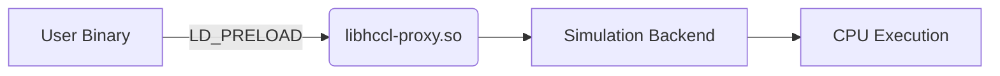
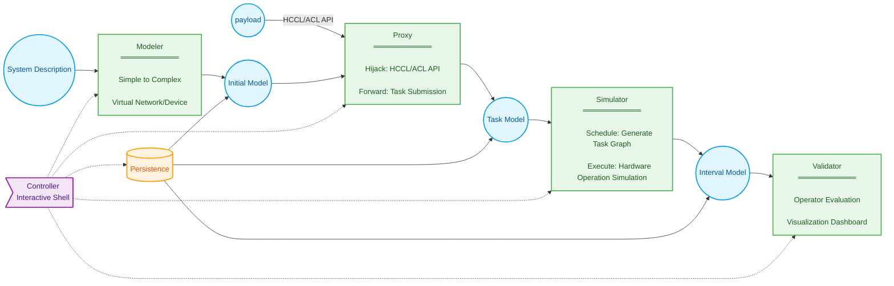
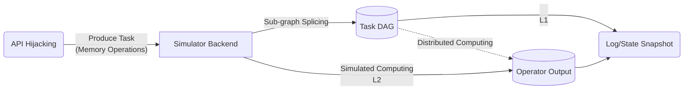
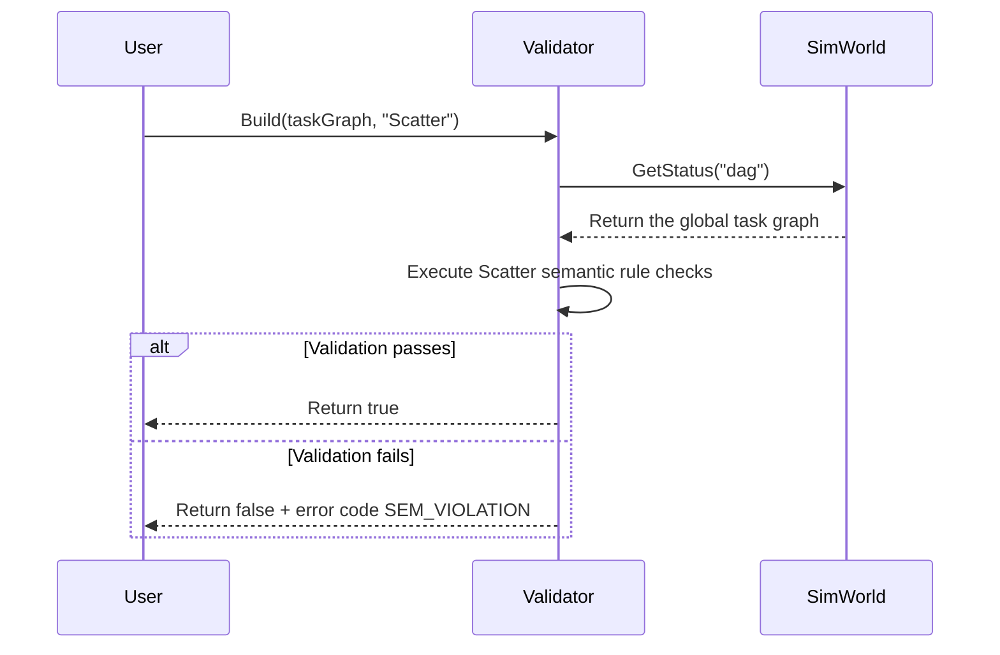
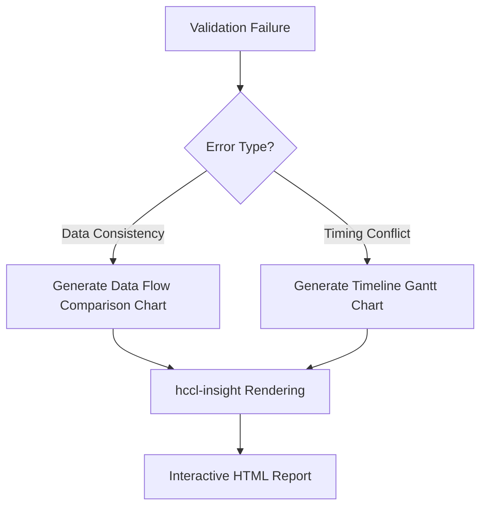

# HCCL Simulator Requirements Analysis

## 1 Requirements Background

### 1.1 Purpose

Provide an **offline, scalable, and highly deterministic** testing framework for the cluster communication module:

- **New algorithm research and development**.
  Support design verification of custom communication operators (for example, scatter variants) and provide algorithm visualization analysis.
- **Base package quality assurance**.
  Enable offline rapid regression of HCCL cases through Runtime/Driver/Net HAL interfaces.
- **Architecture verification (long-term)**.
  Verify physical compatibility of algorithms with hardware topologies (HCCS/RoCE).

### 1.2 Scope

Implement layered simulation depth:

| Level | Capability | Phase |
|------|------|------|
| L1 | Communication semantic validation | ✅ Current |
| L2 | Logical function reproduction | ⚠️ Challenge |
| L3 | Network performance modeling | ⏳ Long-term |
| L4 | Fault injection diagnosis | ⏳ Long-term |

#### 1.2.1 Usage Scenarios

| Role | Purpose |
| -------- | -------------------------- |
| Open source contribution | Validate new operator/algorithm semantics |
| Testing | Run HCCL API test cases |
| Development | Execute Runtime/Driver level cases |

#### 1.2.2 Input Formats

- **Configuration driven**
  YAML defines hardware topology (Appendix B)
- **API hijacking**
  Redirect hcclInitComm/aclrtMalloc and other calls to the simulation backend.

#### 1.2.3 Output Formats

| Type | Purpose |
| -------- | --------------------- |
| Program logs | User standard output |
| Validation results | External validator reports |
| State snapshots | Binary buffer files |
| Visualization | hccl-insight rendering analysis |

---

## 2 System Context (Ignored)

---

## 3 Requirements Overview

### 3.1 Core Architecture

#### 3.1.1 Design Philosophy

**Non-invasive runtime hijacking**:



**Core advantages**:

1. **High fidelity**: The real binary execution path runs.
2. **Zero invasion**: The user does not modify user code.
3. **Strong extensibility**: The system supports any HCCL/ACL program.

**Determinism guarantee**:

- L1: Communication semantic checks (no concurrent communication domains/ operators)
- L2: Global event serialization.
- L3/L4: Fixed-seed random sources or a unified clock.

### 3.2 Typical Workflow

#### 3.2.1 Open Source Contributor Custom Operator Verification Process (LLT)

1. **Prepare the environment**

   - Clone the `hccl_ops` operator repository.
   - Build and run the preset **scatter operator case** following the contribution guide.

2. **Develop the operator**

   - Implement the **CustomAllreduce operator** using the scatter operator as a reference.
   - Complete operator compilation and verify successful execution.

3. **Execute validation cases**
   Run Checker cases in the code project (sample logic):

   ```python
   model = SimWorld("./topologies/cloud_matrix.yaml")  # Initialize the simulation model

   # Simulate each rank in a single-thread loop
   foreach rank in rankGraph:
      HcclInitComm(...)
      ret = HcclScatter(rankGraph, scatter, array, 'root:0')  # Execute the original operator

   # Generate the task graph
   taskGraph = model.GetStatus('taskGraph')

   # Validate operator semantics
   checker = Validator<Scatter>().Build(taskGraph)
   EXPECT(checker.CheckSemantic(), 'success')  # Verify the result
   ```

4. **Validate the custom operator**.
   Replace `HcclScatter` with `CustomAllreduce` in the code above and re-execute the case.

#### 3.2.2 Developer Local Development: Rapid Iteration on the Simulation System Before Code Submission

1. **Launch the simulator:** Run the `hccl-vm` command as root and specify the topology.

   ```bash
   root%> hccl-vm --topology=atlas900
   ```

   - **System feedback:** `info: entered hccl-vm` _(Simulator: Create the simulation model)_.
   - **System state:** The prompt changes to `hccl-vm%>` _(Simulator: Start the interactive shell)_.

2. **Execute the communication program:** Run the `scatter.bin` program in the simulator shell (use MPI/slurm or other launchers).

   ```bash
   hccl-vm%> ./scatter.bin
   ```

3. **Repeat operations:** Execute the communication domain initialization case individually in the simulator shell as needed.

   ```bash
   hccl-vm%> ./test_init_comm
   ```

4. **Exit the simulator:** Enter the `exit` command in the simulator shell.

   ```bash
   hccl-vm%> exit
   ```

   - **System feedback:** `info: exit hccl-vm` _(Simulator: Clean up resources and exit)_.
   - **System state:** The prompt changes back to `root%>`.

#### 3.2.3 Tester Runs Multi-Server Cases on Multiple Servers

1. **Log in to Server1:** Start the simulator as root.

   - **System state:** The prompt changes to `hccl-vm%>` _(Simulator: Start the interactive shell)_.

2. **Execute the communication program:** Run the `scatter.bin` program in the simulator shell.

   ```bash
   hccl-vm%> py3 allreduce.py --host 90.91.103.38 --data-sample large-b16 --serverid 0 --deviceid 8 --op sum
   hccl-vm%> py3 allreduce.py --host 90.91.103.38 --data-sample small-b16 --serverid 1 --deviceid 1 --op sum
   ```

3. **Log in to other servers:** Repeat steps 1-2 _(Simulator: Start the interactive shell)_.

4. **View program logs in the command-line interface of a server:**

   ```bash
   hccl-vm%> ...
   hccl-vm%> ...
   ```

### 3.3 Conventions

#### 3.3.1 Terminology

- hccl-vm: The controller program delivered by the simulator (interactive shell + backend process)
- libhccl-vm.so: The core library delivered by the simulator.
- libhccl-proxy.so: The hijacking library (LD_PRELOAD)
- IPC: libhccl-proxy.so communicates with the hccl-vm backend through shared memory to execute the payload (task) constructed after hijacking ACL/HCCL

#### 3.3.2 Key Mechanisms

- CLI:
  1. hccl-vm --topology=`describe-file-path`
  2. Enter the interactive shell and execute user commands.
- Environment variables: LD_PRELOAD points to libhccl-proxy.so. The hccl-vm program sets this variable and it takes effect in child processes.
- Process model: hccl-vm executes user commands using fork+exec. The OS loader loads libhccl-proxy.so with priority.

---

## 4 System Functional Requirements Breakdown



The delivery matrix organized by project progress is as follows:

| Phase | Modeler | Proxy | Simulator | Validator | Persistence | Controller |
| ------- | --------- | ---------- | -------- | ------------- | ------------ | -------- |
| L1 | A3 Simplified | HCCL-AICPU | Task Graph Generation | Checker Port | - | - |
| L2 | A2/5 Full Series | HCCL/ACL | Sequential Execution | A5 Plugin Port | ✅ | ✅ |
| L2 Challenge | Distributed | Batch Forwarding | Parallel Computing | Visualization | High Concurrency IO Library | Cluster Management |

- **L1 phase**: Deliver the simulator core library.
  `libhccl-vm.so` (A3/AICPU modeling simulation + validator) + `libhccl-proxy.so` (simplified proxy)
  Users achieve communication semantic validation through LLT (FR2.1→FR3)
- **L2 phase**: Deliver the independent controller.
  `hccl-vm` (FR5) + complete modeler (FR1) + persistence (FR4)
  Support command-line startup of the non-invasive environment for logical function reproduction.
- **L2 challenge**: Run the original distributed test cases from the test team directly.

### 4.1 FR1 Construct the Collective Communication Simulation Environment

**Constraints**:

- ✅ Support only dynamic linking (acl/aclRt/hccl-base)
- ❌ Do not support setuid/setgid programs.

**Core capability**:

> Add/Query: collective communication simulation model.

```python
# Sample
model = SimWorld("./topologies/cloud_matrix.yaml")
device = model.GetStatus("device0")
```

**Interaction flow**:

| Step | Action | Result |
|------|-------|------|
| 1 | Load the YAML configuration | Generate the initial model |
| 2 | Call `SimWorld()` | Return the model handle |
| 3 | Query `GetStatus()` | Obtain the specified state data |

**Failure scenario**: The configuration file contains errors. The system prints parsing details.

### 4.2 FR2 Simulate and Execute Collective Communication Operators



#### 4.2.1 **Core Capability Description (Completed Automatically in Background)**

| Phase | Function | User (Developer) Visible Effect |
| -------- | ----------------------- | ----------------------- |
| **Hijacking** | Dynamically redirect HCCL/ACL API | Modify link options in original LLT cases |
| **Forwarding** | Wrap communication task metadata | ~~Invisible~~ |
| **Simulation** | Generate the global DAG task graph | Obtain this state from the modeling interface |
| **Execution** | Simulate memory transfer and state migration | Obtain this state from the modeling interface |

**Development prerequisites**:

1. The developer has already developed a scatter operator variant program `./my_scatter.bin`.
2. `./my_scatter.bin` uses the `lib-vm.so` interface to complete simulation modeling.

**Success scenario 1**: Link the proxy library using `-lhccl-proxy` and run.

```bash
# Link at compilation time (illustrative)
ld ./scatter.bin -lhccl-proxy -lhccl-vm
# Execute from the command line
./scatter.bin
```

**Success scenario 2**: Hijack the proxy library using LD_PRELOAD.

```bash
# Single-machine execution (automatic hijacking to simulation)
LD_PRELOAD=libhccl-proxy.so ./scatter.bin
```

**Feature evolution, scenarios unchanged**:

| Phase | Capability | User Operation Change |
| ------- | -------------------- | ----------------------- |
| L1 | Single-process multi-rank simulation | ~~No change~~ |
| L2 | Multi-process single-server simulation | ~~No change~~ |

### 4.3 **FR3 Semantic Validation of Operator Results in the Simulation Environment**

#### 4.3.1 **Core Capabilities**

1. **Operator semantic validation**.
   - Support communication semantic validation for built-in operators (AllReduce/Scatter and so on).
   - Provide a plugin-based extension interface.
2. **Visualization analysis**
   - Generate interactive communication topology graphs.
   - Mark semantic violation points.
3. **Validation report generation**.
   - Structured error diagnosis (data consistency/timing conflicts)

### 4.4 **Success Scenarios**

#### 4.4.1 **Scenario 1: Basic Operator Semantic Validation**



**User operations**:

```python
# Load the task graph
task_graph = model.GetStatus('taskGraph')

# Create the validator
scatter_validator = Validator<Scatter>()
scatter_validator.Build(task_graph)

# Execute validation
if scatter_validator.CheckSemantic():
   print("Scatter semantic validation passed")
```

#### 4.4.2 **Scenario 2: Custom Operator Hot-Swap**

```bash
# In the hccl-vm interactive environment
hccl-vm%> validator install ./custom_allreduce_validator.so
[System] Success: Validator 'CustomAllReduce' registered

# Code invocation
validator = Validator<CustomAllReduce>()
validator.Build(task_graph)
validator.CheckSemantic()
```

#### 4.4.3 **Scenario 3: Visualization Diagnosis**



**Output sample**:

| Error Type | Node | Expected Value | Actual Value |
| ---------- | ----- | -------------- | ------------ |
| Data inconsistency | Rank1 | 0x7f8e (32782) | 0x0000 (0) |
| Deadlock risk | Rank2 | Waiting for Rank3 | Timeout (>200ms) |

---

### 4.4 **Failure Scenarios**

#### 4.4.1 **Scenario 1: Validation Plugin Load Failure**

**Trigger conditions**:

- The plugin ABI version is incompatible.
- The plugin does not export the `Validator_CreateInstance` symbol.

**System response**:

```bash
hccl-vm%> validator install ./broken_validator.so
[ERROR] Plugin load failed:
  - ABI version mismatch (expected v3, got v2)
  - Symbol 'Validator_CreateInstance' not found
[Suggestion] Use validator check-abi ./broken_validator.so to check compatibility
```

#### 4.4.2 **Scenario 2: Invalid Task Graph Input**

**Trigger conditions**:

```python
# Pass a non-DAG structure
validator.Build("invalid_data")
```

**System response**:

```python
Traceback (most recent call last):
  File "test.py", line 12, in <module>
    validator.Build("invalid_data")
hccl.error.InvalidGraphError:
    Expected TaskGraph object, got <class 'str'>
```

#### 4.4.3 **Scenario 3: Runtime State Conflict**

**Trigger conditions**:

```python
# Attempt validation during communication execution
while HcclAllReduceInner(is_running=True):
    validator.CheckSemantic()  # Illegal call!
```

**System response**:

```text
[FATAL] Validator state conflict:
  - Operation not allowed during HcclAllReduceInner execution
  - Call GetStatus('idle') before validation
```

---

### 4.5 **Constraints and Evolution**

| Capability | L1 Phase | L2 Phase |
| ---------------- | -------- | ------------------- |
| **Built-in validators** | Scatter | All HCCL operators |
| **Plugin mechanism** | Static linking | Dynamic loading (.so) |
| **Visualization** | Text reports | Interactive topology graph + timeline |
| **Error localization precision** | Node level | Buffer byte offset |

**Key evolution path**:

1. Provide the `validator-template` code generator (L2);
2. Support distributed validation coordination (L2 challenge phase);
3. Integrate memory access trace tracking (L3).

### 4.6 FR4 Persistence

#### 4.6.1 `L2 Phase` Story: The simulator provides persistence interfaces so developers can quickly locate issues after testing ends

### 4.7 FR5 Controller

The user generally uses HCCL test programs in a terminal for ease of use. Therefore, the controller runs through a command-line instance program.

#### 4.7.1 Controller Conventions

- The command-line runtime does not support topology switching.
- The following descriptions use `shell` instead of `command line`.

#### 4.7.2 `L2 Phase` Story: The user launches the simulator through an interactive `shell`, which automatically creates a virtual communication cluster in the background. The user expects to repeatedly test and validate HCCL programs in this interactive `shell` environment.

##### `shell` Startup Prerequisites

- The simulator ships with multiple system configuration files in a sibling directory (such as `./topologies`) during installation, for example: `cloud_matrix.yaml`, `atlas900.yaml`.
- The system configuration files are read-only and are not corrupted.

##### Success Scenario: System Model Discovery

1. The user runs `hccl-vm --list-topologies` to view supported simulation systems.
2. The command prints a list of all built-in system models such as cloud_matrix and atlas900, but does not launch the simulator.

##### Success Scenario: Successfully Launch the Simulator and Hijack the Application

1. The user launches the `hccl-vm` main program, specifies the topology configuration file, and enters the interactive shell.
2. `hccl-vm` parses and loads the corresponding system configuration file, calls the modeler, creates the initial system model, and indicates successful simulator creation.
3. The user executes `./scatter_perf` in the `shell`, for example:
4. `hccl-vm` sets `LD_PRELOAD=libhccl-proxy.so` for the child process and runs `fork/exec`.
5. The OS loader loads `libhccl-proxy.so` with priority. The application gets hijacked when it calls CUDA/NCCL APIs.
6. `libhccl-proxy.so` delegates execution to the `hccl-vm` backend through IPC for simulation.
7. The application completes and replays standard output/error to the user. The return code passes through to the hccl-vm interactive shell.
8. The user can run `exit` to leave the shell. The sim_run return code is 0. The interaction flow sample is as follows.

   ```bash
   root%>hccl-vm --topology=atlas900
   info: entered hccl-vm
   hccl-vm%>
   hccl-vm%>./scatter_perf
   hccl-vm%>exit
   info: exit hccl-vm
   root%>
   ```

##### Success Scenario: Launch with the Default System Model

1. The user launches the simulator by running `hccl-vm` without any parameters.
2. `hccl-vm` searches its preset directory and locates the `cloud_matrix.yaml` file.
3. The subsequent flow matches `Success Scenario: Successfully Launch the Simulator and Hijack the Application` exactly.

##### Failure Scenario: The Specified System Configuration Name Does Not Exist

1. The user executes `hccl-vm --topology=non_existent_topo`.
2. `hccl-vm` outputs an error message and terminates normally, such as "Error: System named 'non_existent_topo' not found. Available systems: cloud_matrix, atlas900".

##### Failure Scenario: The Topology Configuration File Has Format Errors

1. The topology configuration file content does not conform to YAML specifications or lacks required fields, causing `hccl-vm` to fail parsing during initialization.
2. The simulator outputs a clear error message to standard error, such as "Error: Failed to parse topology file a.yaml, reason: ...", and immediately terminates the entire program.

##### Failure Scenario: The Topology Configuration File Does Not Exist or Is Not Readable

#### 4.7.3 `L2 Phase` Story: The user can quickly configure the system model description file and launch the simulator. Refer to **Appendix B** for the format.

#### 4.7.4 `L2 Phase` Story: The user manages validator plugins through `shell` subcommands

##### Success Scenario: The user installs a custom validator plugin and completes validation successfully

##### Success Scenario: The user views available validator plugins

##### Failure Scenario: The validator plugin and simulator version do not match

##### Failure Scenario: Multiple validator plugin conflict causes installation failure

#### 4.7.5 `L2 Phase` Story: The developer can export simulation environment state (such as specific device memory buffer contents) to files through controller subcommands for subsequent analysis or visualization

##### Subcommand System State Viewing Constraints

- The test program is running in the `hccl-vm` interactive shell.
- The export operation triggers synchronously at any point during the test program.
- The export captures an instant snapshot of the current `hccl-vm` system model.

##### Success Scenario: Successfully Export the Simulated Device State Buffer

1. The user executes the export subcommand in the interactive `shell`.
   For example: `hccl-vm%> snapshot --path=/tmp/hccl_vm_state`
2. `hccl-vm` calls the persistence interface and writes the system model state to the `hccl_vm_state` file.
3. After the write operation completes, `hccl-vm` prints a success message to standard output, for example: "Snapshot exported successfully: /tmp/global_sim_state.bin".
4. The user can find the `hccl_vm_state` file in the `/tmp/` directory and view the current memory of the simulated device.

##### Success Scenario: Overwrite When the Output File Already Exists

1. The user executes the snapshot command and specifies an output file path that already exists.
2. `hccl-vm` notifies the user that the file exists and asks whether to overwrite it.
3. The user confirms the overwrite.
4. `hccl-vm` overwrites the file and prints a success message.

##### Failure Scenario: Insufficient Disk Space

1. `hccl-vm` outputs a clear error message to standard error, such as "Error: Insufficient disk space to write snapshot file: ...", and terminates the write operation.

##### Failure Scenario: No Write Permission or Directory Does Not Exist

1. `hccl-vm` outputs a clear error message to standard error, such as "Error: No permission to write file or directory does not exist: ...", and terminates the write operation.

#### 4.7.6 `L2 Phase` Story: In the interactive shell, the user can activate a validator plugin and then view algorithm results visually through the visualization subcommand

##### Validation Result Visualization Preparation

- `hccl-vm` has the `scatter` operator validator plugin installed.
- `hccl-vm` integrates the `hccl-insight` command-line visualization tool.
- A simulator run completes and successfully exports one or more binary algorithm validation result files (for example `rank0_output.bin`) through the persistence API.
- The snapshot file `rank0_output.bin` contains an 8x8 float32 matrix.

##### Success Scenario: Render Single-Device Memory Data as a Heatmap

1. The user runs the visualization tool on the exported snapshot file in the interactive `shell`. The user must provide file metadata (data type and shape) for correct parsing, for example:

   ```bash
   hccl-insight --file=rank0_output.bin --dtype=float32 --shape=8x8
   ```

2. `hccl-insight` (Go program) starts and parses the command-line arguments.
3. The program reads the binary content of the `rank0_output.bin` file.
4. Based on the `--dtype=float32` and `--shape=8x8` parameters, the program parses the binary stream into a two-dimensional array.
5. The program starts a built-in web server on a locally available random port (for example `:9527`).
6. The program prints a message to standard output: "Visualization service started, open http://localhost:9527 in your browser".
7. (Optional) The program automatically calls the system command to open the URL in the default browser.
8. The user sees a Vue/JS rendered page in the browser. The page displays an 8x8 heatmap where each cell color represents its corresponding numerical value. The user can hover over cells to view exact values.

##### Failure Scenario: The Snapshot File Does Not Exist

1. The `--file` parameter points to a file that does not exist.
2. The `hccl-insight` tool fails when attempting to open the file.
3. The tool outputs a clear error message to standard error, such as "Error: File 'xxx.bin' not found", and exits with a non-zero status code.

##### Failure Scenario: File Size Does Not Match Metadata

1. The user specifies `--shape=8x8` and `--dtype=float32` (requires 8_8_4 = 256 bytes), but the actual `rank0_output.bin` file is only 100 bytes.
2. The `hccl-insight` tool reads the file and finds the file size does not match the expected size calculated from metadata.
3. The tool outputs a clear error message to standard error, such as "Error: Data format mismatch. Based on shape(8x8) and dtype(float32), 256 bytes are required, but the file size is only 100 bytes", and exits with a non-zero status code.

##### Failure Scenario: Required Metadata Parameters Are Missing

1. The user executes `hccl-insight --file=rank0_output.bin` without providing `--dtype` or `--shape`.
2. The `hccl-insight` tool command-line parser detects missing required parameters.
3. The tool outputs usage help information to standard error, indicates that the user must provide these parameters, and exits with a non-zero status code.

#### 4.7.7 `L2 Phase` Story: The user can switch between L1/L2 proxies to select different simulator speeds

- `hccl-vm` integrates multiple versions of the simulator core library, for example:
  - `libhccl-proxy-l1.so`: Performs only NCCL communication operator semantic-level simulation.
  - `libhccl-proxy-l2.so`: Runtime/Driver/Net level logical function simulation (default)
- `hccl-vm` integrates validator plugins.
- Launch `hccl-vm` to enter the interactive `shell`.

##### Success Scenario (Default): The controller uses the L2 proxy to hijack the user program at the HAL layer and attempts to simulate memory transfer operations, writing algorithm results to simulated device buffers

##### Success Scenario (Full Feature): The controller uses the L2 proxy to simulate low-level algorithm operations while invoking validator plugins, outputting validation results and visualization files

##### Success Scenario (Lightest): The controller uses the L1 proxy without executing memory transfer. The user manually views the task graph of algorithm orchestration through persistence commands

##### Success Scenario (Commonly Used for Operator Research): The controller uses the L1 proxy without executing memory transfer, with preset validator plugins, outputting validation results

1. Specify the simulation depth through the proxy control subcommand.
2. `hccl-vm` determines the core library to load as `libhccl-proxy-l1.so` based on the subcommand parameter `L1`.
3. `hccl-vm` sets the `LD_PRELOAD` environment variable to the full path of `libhccl-proxy-l1.so`.
4. The test program starts and gets hijacked by `libhccl-proxy-l2.so`. When `ncclMemcpyWrite` executes, the validator only infers task semantics and does not simulate the complete data transfer operation.
5. The program completes execution and outputs semantic validation. The total time is much faster than using `L2`.

   The complete command sequence may look as follows:

   ```bash
   hccl-vm%>validator install scatter
   hccl-vm%>proxy -l1
   hccl-vm%>./scatter_perf.bin
   info[validator]: scatter checking finished, result is ...
   ```

##### Failure Scenario: A Non-Existent Subcommand or Parameter Is Specified

### 4.8 Distributed Controller (NFR)

Board-level test programs run on real devices. The user must start the same test program on multiple servers manually or through scripts. Running the simulator requires a simulator controller on each server that runs the test program. The simulator performs unified modeling of the entire network topology and hardware environment. Therefore, the controller requires a distributed design.

#### 4.8.1 `L2 Phase` Story: The user can run real HCCL cases collaboratively on multiple servers through cluster management software such as k8s

## 5 **Appendix**

### 5.1 **Appendix A: API Support Plan**

Convention: The simulator provides Host offline implementations for the APIs listed below. For API calls not in this list, the default simulator behavior is to print a warning message and return `0` without performing any actual operation.

#### 5.1.1 `L1 Phase`

- HCCL communication domain management (25 APIs)
- HCCL control plane programming (23 APIs)
- HCCL AICPU programming (8 APIs)

#### 5.1.2 `L2 Phase`

### 5.2 **Appendix B: Topology Configuration File Format (Schema)**

The topology configuration file uses YAML format and describes the simulated hardware environment. The file must contain the following fields:

- `gpus` (integer, required): The total number of GPUs.
- `links` (list, required): A list describing point-to-point physical connections.

Each `link` object contains:

- `peer` (list of 2 integers, required): The IDs of the two GPUs that connect to each other.
- `type` (string, optional): The connection type, such as "HCCS" or "PCIe". In the current L1 phase, this field serves only as a comment and does not affect logic.

**Sample: `my_topo.yaml`**

```yaml
## Describe a 4-NPU ring connection topology
npus: 4
links:
  - peer: [0, 1]
    type: "HCCS"
  - peer: [1, 2]
    type: "HCCS"
  - peer: [2, 3]
    type: "HCCS"
  - peer: [3, 0]
    type: "HCCS"
```

### 5.3 **Appendix C: Validation Plugin Interface (API) Definition**

To create a valid validation plugin, the user must implement and export one or more callback functions that conform to the following specification. The simulator locates these symbols through `dlsym`.

#### 5.3.1 **Data Structures**

```c++
// sim_validator_api.h

// Describe HCCL data types, consistent with real HCCL
typedef enum { hcclInt8 = 0, ..., hcclFloat64 = 7 } SimHcclDataType_t;

// Context information passed to callback functions
struct SimCommContext {
    int world_size;             // The number of ranks in the communication domain
    void** rank_output_buffers; // Pointer array containing the simulated memory addresses of output buffers for each rank
    size_t element_count;       // The number of elements in the buffer
    SimHcclDataType_t datatype;   // The data type
};

// Plugin return value
struct SimValidationResult {
    bool success;               // Whether validation passes
    char error_message[256];    // Error message if validation fails
};
```

##### 5.3.2 **Callback Function Signatures**

The plugin must implement C functions with the following naming format as needed:
`SimValidationResult post_<hccl_function_name>_hook(const SimCommContext* context);`

##### 5.3.3 **Sample: AllReduce Validation Function**

```c++
// Function to implement in allreduce_validator.so
extern "C" SimValidationResult post_HcclAllReduceInner_hook(const SimCommContext* context) {
    // 1. Determine the data type based on context->datatype
    // 2. Allocate CPU memory and copy all rank_output_buffers contents
    // 3. Implement AllReduce mathematical logic validation (for example, check whether all rank outputs are consistent)
    // 4. Return SimValidationResult
}
```

### 5.4 **Appendix D: System Models**
