# HCCL Simulator Runner Data Model Design

## 1. Software and Hardware Resource Interaction Modeling

Data flow interaction diagram.

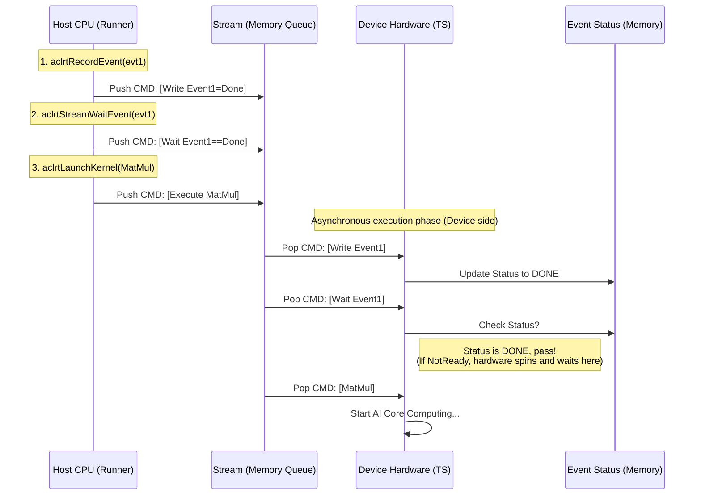
```mermaid
sequenceDiagram
    participant HostThread as Host CPU (Runner)
    participant StreamQueue as Stream (Memory Queue)
    participant DeviceScheduler as Device Hardware (TS)
    participant EventMem as Event Status (Memory)

    Note over HostThread: 1. aclrtRecordEvent(evt1)
    HostThread->>StreamQueue: Push CMD: [Write Event1=Done]
  
    Note over HostThread: 2. aclrtStreamWaitEvent(evt1)
    HostThread->>StreamQueue: Push CMD: [Wait Event1==Done]
  
    Note over HostThread: 3. aclrtLaunchKernel(MatMul)
    HostThread->>StreamQueue: Push CMD: [Execute MatMul]
  
    Note over DeviceScheduler: Asynchronous execution phase (Device side)
  
    StreamQueue->>DeviceScheduler: Pop CMD: [Write Event1]
    DeviceScheduler->>EventMem: Update Status to DONE
  
    StreamQueue->>DeviceScheduler: Pop CMD: [Wait Event1]
    DeviceScheduler->>EventMem: Check Status?
    Note right of DeviceScheduler: Status is DONE, pass!<br/>(If NotReady, hardware spins and waits here)
  
    StreamQueue->>DeviceScheduler: Pop CMD: [MatMul]
    DeviceScheduler->>DeviceScheduler: Start AI Core Computing...
```

The Device hardware executes everything pushed into the Stream.

## 2. Device, Context, Stream and Hardware Resource Relationship Modeling

The relationship among Device, Context, Stream and user host threads.

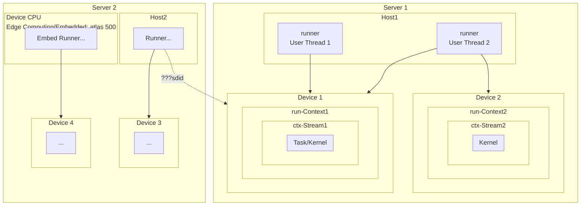
```mermaid
graph TD
    subgraph Server1[Server 1]
        Host1
        Device
        Device2
    end

    subgraph Server2[Server 2]
        Host3
        Host2
        Device3
        Device4
      
    end

    subgraph Host1[Host1]
        Runner1[runner<br>User Thread 1]
        Runner2[runner<br>User Thread 2]
    end

    subgraph Host2[Host2]
        Runner3[Runner...]
    end

    subgraph Host3[Device CPU<br>Edge Computing/Embedded: atlas 500]
        embedRunner[Embed Runner...]
    end

    subgraph Device[Device 1]
        Context1
    end

    subgraph Context1[run-Context1]
        Stream1
    end

    subgraph Stream1[ctx-Stream1]
        TaskKernel
    end

    subgraph TaskKernel[Task/Kernel]

    end

    subgraph Device2[Device 2]
        Context2
    end

    subgraph Context2[run-Context2]
        Stream2
    end

    subgraph Stream2[ctx-Stream2]
        Kernel
    end

    subgraph Kernel[Kernel]
    end

    subgraph Device3[Device 3]
        ctxM[...]
    end

    subgraph Device4[Device 4]
        ctxN[...]
    end

    Runner1-->Device
    Runner2-->Device
    Runner2-->Device2
    Runner3-->Device3
    Runner3-.->|???sdid|Device
    embedRunner-->Device4
 
```

### 2.1 Basic Device Relationship Modeling

#### 2.1.1 Hierarchy Overview

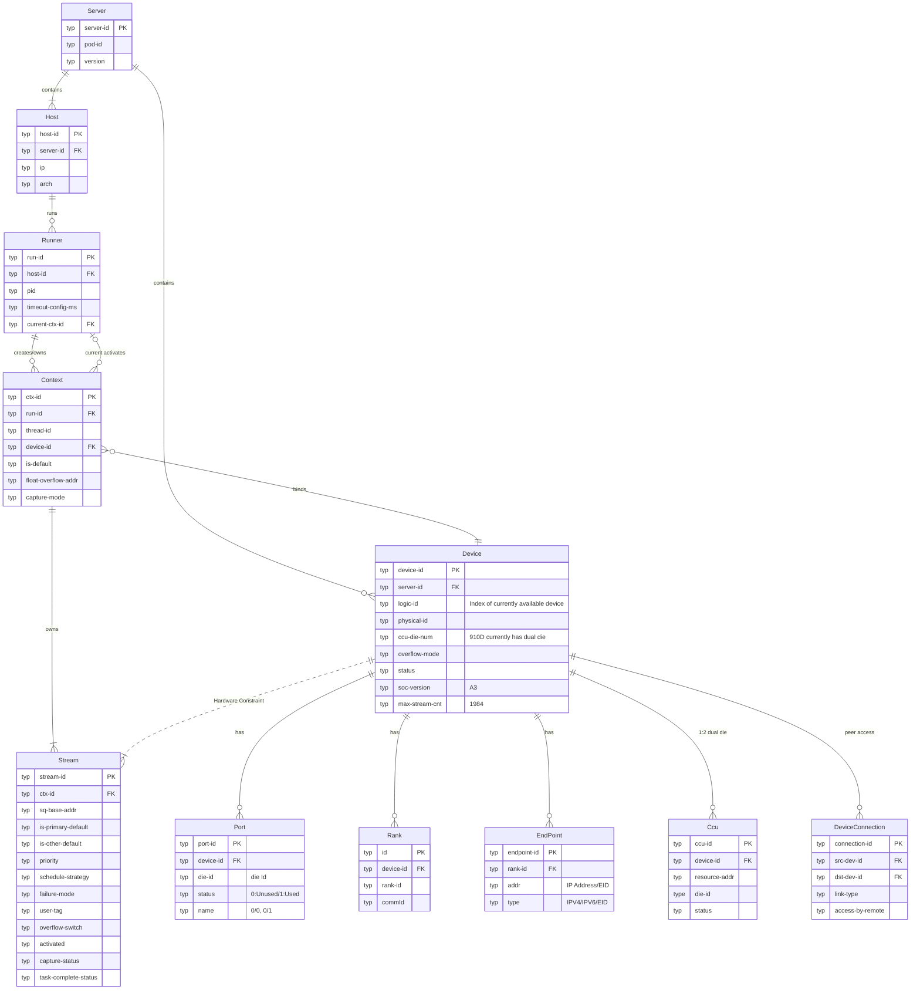
```mermaid
erDiagram
    %% ==========================================
    %% Layer 1: Physical Topology Layer (Server -> Host/Device)
    %% ==========================================
    Server {
        typ server-id PK
        typ pod-id
        typ version
    }
    Host {
        typ host-id PK
        typ server-id FK
        typ ip
        typ arch
    }
    Device {
        typ device-id PK
        typ server-id FK
        typ logic-id "Index of currently available device"
        typ physical-id
        typ ccu-die-num "910D currently has dual die"
        typ overflow-mode
        typ status
        typ soc-version "A3"
        typ max-stream-cnt "1984"
    }
    Server ||--|{ Host : contains
    Server ||--o{ Device : contains

    %% ==========================================
    %% Layer 2: Process and Context Layer (Runner -> Context -> Stream)
    %% ==========================================
    Runner {
        typ run-id PK
        typ host-id FK
        typ pid
        typ timeout-config-ms
        typ current-ctx-id FK
    }
    Context {
        typ ctx-id PK
        typ run-id FK
        typ thread-id
        typ device-id FK
        typ is-default
        typ float-overflow-addr
        typ capture-mode
    }
    Stream {
        typ stream-id PK
        typ ctx-id FK
        typ sq-base-addr
        typ is-primary-default
        typ is-other-default
        typ priority
        typ schedule-strategy
        typ failure-mode
        typ user-tag
        typ overflow-switch
        typ activated
        typ capture-status
        typ task-complete-status
    }
    Host ||--o{ Runner : runs
    Runner ||--o{ Context : "creates/owns"
    Runner |o--o{ Context : "current activates"
    Context }o--|| Device : binds
    Context ||--|{ Stream : owns
    Device ||..|{ Stream : "Hardware Constraint"

    %% ==========================================
    %% Layer 3: Device Internal Resource Layer (Port/EndPoint/Ccu)
    %% ==========================================
    Port {
        typ port-id PK
        typ device-id FK
        typ die-id "die Id"
        typ status "0:Unused/1:Used"
        typ name "0/0, 0/1"
    }
    Rank {
        typ id PK
        typ device-id FK
        typ rank-id
        typ commId
    }
    EndPoint {
        typ endpoint-id PK
        typ rank-id FK
        typ addr "IP Address/EID"
        typ type "IPV4/IPV6/EID"
    }
    Ccu {
        typ ccu-id PK
        typ device-id FK
        typ resource-addr
        type die-id
        typ status
    }
    DeviceConnection {
        typ connection-id PK
        typ src-dev-id FK
        typ dst-dev-id FK
        typ link-type
        typ access-by-remote
    }
    Device ||--o{ Port : "has"
    Device ||--o{ Rank : "has"
    Device ||--o{ EndPoint : "has"
    Device ||--o{ Ccu : "1:2 dual die"
    Device ||--o{ DeviceConnection : "peer access"
```

#### 2.1.2 Network Communication Resources

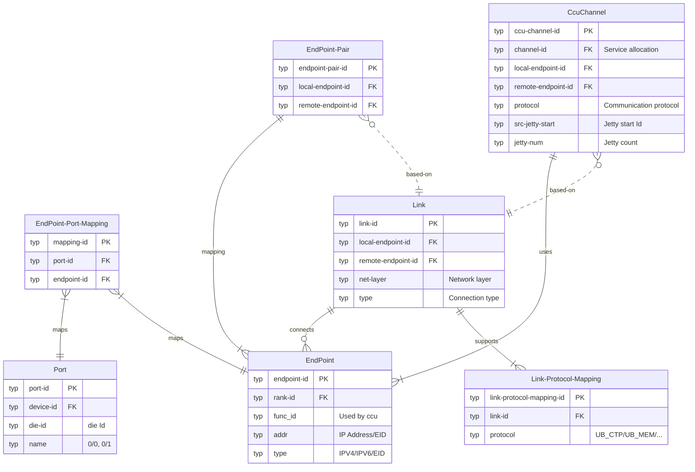
```mermaid
erDiagram
    %% ==========================================
    %% Network Topology and Connection Layer
    %% ==========================================
    EndPoint {
        typ endpoint-id PK
        typ rank-id FK
        typ func_id "Used by ccu"
        typ addr "IP Address/EID"
        typ type "IPV4/IPV6/EID"
    }
    Port {
        typ port-id PK
        typ device-id FK
        typ die-id "die Id"
        typ name "0/0, 0/1"
    }
    EndPoint-Port-Mapping {
        typ mapping-id PK
        typ port-id FK
        typ endpoint-id FK
    }
    %% Physical connections defined by topo.json
    Link {
        typ link-id PK
        typ local-endpoint-id FK
        typ remote-endpoint-id FK
        typ net-layer "Network layer"
        typ type "Connection type"
    }
    Link-Protocol-Mapping {
        typ link-protocol-mapping-id PK
        typ link-id FK
        typ protocol "UB_CTP/UB_MEM/..."
    }
    %% 
    EndPoint-Pair {
        typ endpoint-pair-id PK
        typ local-endpoint-id FK
        typ remote-endpoint-id FK
    }
    CcuChannel {
        typ ccu-channel-id PK
        typ channel-id FK   "Service allocation"
        typ local-endpoint-id FK
        typ remote-endpoint-id FK
        typ protocol "Communication protocol"
        typ src-jetty-start "Jetty start Id"
        typ jetty-num "Jetty count"
    }

    EndPoint-Port-Mapping }|--|| Port : maps
    EndPoint-Port-Mapping }|--|| EndPoint : maps
    Link ||--o{ EndPoint : connects
    Link ||--|{ Link-Protocol-Mapping : "supports"
    EndPoint-Pair ||--|{ EndPoint : mapping
    EndPoint-Pair }o..|| Link : "based-on"
    CcuChannel ||--|{ EndPoint : uses
    CcuChannel }o..|| Link : "based-on"
```

#### 2.1.3 Key Relationship Description

##### Layer 1: Physical Topology Layer

| Relationship | Meaning | Description/Precautions |
| --- | --- | --- |
| Server → Host | A Server may contain multiple Host instances | For example, multi-socket CPU or virtualized environments |
| Server → Device | A Server contains multiple AI devices | Corresponds to /dev/davinci0, /dev/davinci1, and so on |

##### Layer 2: Process and Context Layer

| Relationship | Meaning | Description/Precautions |
| --- | --- | --- |
| Host → Runner | Each host runs multiple application threads (Runner) | Each Runner can create multiple Contexts |
| Runner → Context | A thread creates or switches to different Contexts | Use aclrtCreateContext() and aclrtSetCurrentContext() |
| Context → Device | A Context binds to a Device | The binding is fixed after creation and cannot cross devices |
| Context → Stream | Each Context can create multiple Streams | Corresponds to aclrtCreateStream() |
| Runner ↔ Context (current) | Current context activation state | aclrtGetCurrentContext(), aclrtSetCurrentContext() |
| Device .. Stream | Resource upper limit constraint | Stream count is limited by hardware (max-stream-cnt) |

##### Layer 3: Device Internal Resource Layer

| Relationship | Meaning | Description/Precautions |
| --- | --- | --- |
| Device → Port | A device contains multiple communication ports | Used for network topology connections, format such as "0/0, 0/1" |
| Device → Rank | A device associates with communication Ranks | A Rank is a participant node identifier in a communication domain |
| Device → EndPoint | A device contains multiple endpoints | IP address/EID addressing identifiers for network communication |
| Device → Ccu | A device contains multiple CCU units | 910D uses a dual-die architecture, one CCU per die |
| Device → DeviceConnection | Inter-device communication channels | aclrtDeviceCanAccessPeer(), aclrtDeviceEnablePeerAccess() |

##### Network Communication Resource Layer

| Relationship | Meaning | Description/Precautions |
| --- | --- | --- |
| EndPoint ↔ Port | Endpoint to port mapping | EndPoint-Port-Mapping implements many-to-many mapping |
| Link → EndPoint | Physical connection associates with endpoints | Defined by topo.json, describes physical topology |
| Link → Link-Protocol-Mapping | Protocols supported by a connection | A Link can support multiple protocols (UB_CTP/UB_MEM, and so on) |

#### 2.1.4 API Mapping Table

##### Basic and Device Layer (Device / Server)

| Entity/Attribute                  | Key API Interfaces                                                                                       |
| --------------------------------- | -------------------------------------------------------------------------------------------------------- |
| Server/Host                       | `aclInit`, `aclFinalize`                                                                                 |
| Runner.pid                        | `rtDeviceGetBareTgid`                                                                                    |
| Device                            | `rtGetDeviceCount`                                                                                       |
| Device.logic-id                   | `rtSetDevice`,`rtResetDevice`,`rtGetDevice`,`rtsGetLogicDevIdByPhyDevId`                                 |
| Device.physical-id                | `rtGetPhyDevIdByLogicDevId`                                                                              |
| Device.soc-name                   | `rtGetSocName`                                                                                           |
| Device.overflow-mode              | `rtSetDeviceSatMode`,`rtGetDeviceSatMode`                                                                |
| DeviceConnection                  | `rtGetDevicesTopo`,`rtDeviceDisablePeerAccess`,`rtDeviceEnablePeerAccess`,`rtDevicePeerAccessStatus`     |
| Context.context-id                | `rtCreateContext`,`rtDestroyContext`                                                                     |
| Context.is-default                | `rtSetCurrentContext`,`rtGetCurrentContext`                                                              |
| Context.float-overflow-addr       | `rtCtxGetFloatOverflowAddr`                                                                              |
| Stream table                      | `aclrtGetStreamAvailableNum`                                                                             |
| Stream.stream-id                  | `rtCreateStream`,`rtCreateStreamWithConfig`,`rtDestroyStream`,`rtDestroyStreamForce`                     |
| Stream.task-complete-status       | `rtSynchronizeStream`, `rtSynchronizeStreamWithTimeout`                                                  |
| Stream.activated                  | `rtStreamStop`                                                                                           |
| Stream.failure-mode               | `rtSetStreamAttribute`,`rtGetStreamAttribute`                                                            |

### 2.2 Basic Memory Management Relationship Modeling

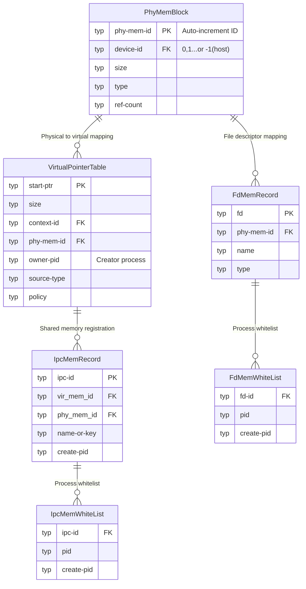
```mermaid
erDiagram
    PhyMemBlock ||--o{ VirtualPointerTable : "Physical to virtual mapping"
    PhyMemBlock ||--o{ FdMemRecord : "File descriptor mapping"
    PhyMemBlock {
        typ phy-mem-id PK "Auto-increment ID"
        typ device-id FK "0,1...or -1(host)"
        typ size
        typ type 
        typ ref-count
    }

    VirtualPointerTable {
        typ start-ptr PK
        typ size
        typ context-id FK
        typ phy-mem-id FK
        typ owner-pid  "Creator process"
        typ source-type ""
        typ policy
    }

    VirtualPointerTable ||--o{ IpcMemRecord : "Shared memory registration"
    IpcMemRecord {
        typ ipc-id PK
        typ vir_mem_id FK
        typ phy_mem_id FK
        typ name-or-key
        typ create-pid
    }

    IpcMemRecord ||--o{ IpcMemWhiteList : "Process whitelist"
    IpcMemWhiteList {
        typ ipc-id FK
        typ pid
        typ create-pid
    }

    FdMemRecord {
        typ fd PK
        typ phy-mem-id FK
        typ name
        typ type
    }

    FdMemRecord ||--o{ FdMemWhiteList : "Process whitelist"
    FdMemWhiteList {
        typ fd-id FK
        typ pid
        typ create-pid
    }

    %%VirtualPointerTable ||--o{ MemMapRecord : "Mapping relationship"
    %%MemMapRecord {
    %%    typ ptr FK
    %%    typ phy-mem-id FK
    %%}
```

#### 2.2.1 Key Relationship Description (Basic Memory Management Relationship Modeling)

1. **Physical memory is the core entity**.
   `PhyMemBlock` serves as the base entity and associates with all other entities through `phy_mem_id`. This design reflects the Ascend physical memory pooling philosophy [3].
2. **Three-layer mapping system**:

   - Physical to virtual (`VirtualPointerTable`)
   - Physical to IPC shared (`IpcMemRecord`)
   - Physical to file descriptor (`fdMemRecord`)
3. **Security control**:
   `IpcMemWhiteList` implements secure sharing for Huawei HCCS (Huawei Collective Communication Service) through process PID whitelists [3].
4. **Special mapping types**:
   `MemMapRecord` records dual virtual address mapping scenarios (such as mappings produced by `aclrtMapMem`). This supports zero-copy data transfer on the NPU [3].

#### 2.1.2 API Mapping Table (Basic Memory Management Relationship Modeling)

| Entity                         | Key Management Interfaces                                                                                                                           |
| ------------------------------ | --------------------------------------------------------------------------------------------------------------------------------------------------- |
| PhyMemBlock                    | `rtMallocPhysical`, `rtFreePhysical`                                                                                                                |
| VirtualPointerTable            | `rtMallocWithCfg`,`rtMallocForTaskScheduler`,`rtMallocHostWithCfg`,`rtFree`,`rtReserveMemAddress`,`ReleaseMemAddress`, `rtMapMem`, `rtUnmapMem`      |
| VirtualPointerTable.context-id | `rtPointerGetAttributes`                                                                                                                            |
| FdMemRecord.fd                 | `rtMemExportToShareableHandle`, `rtMemImportFromShareableHandle`                                                                                    |
| FdMemWhiteList.pid             | `rtMemSetPidToShareableHandle`                                                                                                                      |
| IpcMemRecord.name-or-key       | `rtIpcMemGetExportKey`                                                                                                                              |
| IpcMemRecord.ipc-id            | `rtIpcMemImportByKey`,`IpcMemClose`                                                                                                                 |
| IpcMemWhiteList.pid            | `rtIpcMemSetImportPid`                                                                                                                              |
| MemMapRecord                   | `rtHostRegister`, `rtHostUnRegister`                                                                                                                |

## 3. Data Task Model Extension on the Base Model

### 3.1 Data / Task Flow Modeling

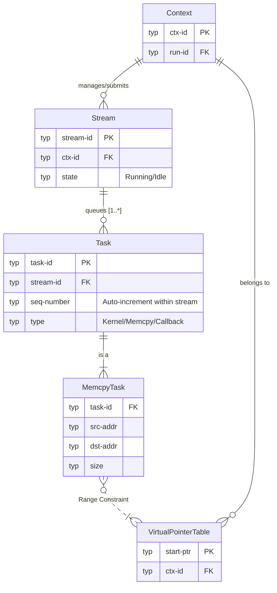
```mermaid
erDiagram
    Context {
        typ ctx-id PK
        typ run-id FK
    }

    Stream {
        typ stream-id PK
        typ ctx-id FK
        typ state "Running/Idle"
    }

    %% Stream contains an ordered task list
    Context ||--o{ Stream : "manages/submits"
    Stream ||--o{ Task : "queues [1..*]"

    Task {
        typ task-id PK
        typ stream-id FK
        typ seq-number "Auto-increment within stream"
        typ type "Kernel/Memcpy/Callback"
    }

    %% Various concrete Task types (logical inheritance)
    MemcpyTask {
        typ task-id FK
        typ src-addr
        typ dst-addr
        typ size
    }

    %% Inheritance expression (Task has multiple subtypes)
    Task ||--|{ MemcpyTask : "is a"

    %% MemcpyTask addresses must be addressable in VirtualPointerTable
    MemcpyTask }o..|{ VirtualPointerTable : "Range Constraint"
    VirtualPointerTable {
        typ start-ptr PK
        typ ctx-id FK
    }

    VirtualPointerTable }o--|| Context : "belongs to"

```

### 3.2 CCU Resource Modeling

An NPU device contains 2 CCUs, die0 and die1 respectively.

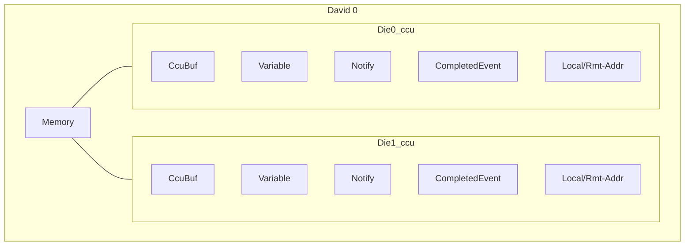
```mermaid
graph RL
    subgraph DavidDevice0[David 0]
        direction RL
        Memory0[Memory]
        David0Die0[Die0_ccu]
        David0Die1[Die1_ccu]
    end

    subgraph David0Die0[Die0_ccu]

        CcuBuf00[CcuBuf]
        Variable00[Variable]
        Notify00[Notify]
        CompletedEvent00[CompletedEvent]
        Local/Rmt-Addr00[Local/Rmt-Addr]
    end

    subgraph David0Die1[Die1_ccu]

        CcuBuf01[CcuBuf]
        Variable01[Variable]
        Notify01[Notify]
        CompletedEvent01[CompletedEvent]
        Local/Rmt-Addr01[Local/Rmt-Addr]
    end

    David0Die0---Memory0
    David0Die1---Memory0

```

#### 3.2.1 API Mapping Table (CCU Resource Modeling)

| Entity             | Key Management Interfaces                                |
| ------------------ | -------------------------------------------------------- |
| CcuBuf             | `rtCcuBufAlloc`, `rtCcuBufFree`, `rtCcuBufGetAddr`       |
| Variable           | `rtVariableCreate`, `rtVariableDestroy`, `rtVariableSet` |
| Notify             | `rtCreateNotify`, `rtDestroyNotify`                      |
| CompletedEvent     | `rtCreateEvent`, `rtDestroyEvent`                        |
| Local/Rmt-Addr     | `rtGetDeviceLocalAddr`, `rtGetDeviceRemoteAddr`          |
| CCU resource query | `rtGetCcudieInfo`, `rtGetCcudieNum`                      |

#### 3.2.2 CCU Resource Lifecycle Description

**CCU initialization flow**:

1. Two CCUs (die0/die1) initialize automatically when the Device starts.
2. Each CCU allocates independent CcuBuf, Variable, and Notify resource pools.
3. CompletedEvent notifies task completion status.

**Resource constraints**:

- Each CCU has a limited CcuBuf count (related to Device.soc-version)
- Variable stores shared variables during communication.
- Notify provides cross-CCU synchronization notifications.
- Local/Rmt-Addr handles address translation for cross-die communication.

### 3.3 Asynchronous / Synchronous Execution Modeling

#### 3.3.1 [Notify Resource Management](https://www.hiascend.com/document/detail/zh/CANNCommunityEdition/850alpha001/appdevg/acldevg/aclcppdevg_000524.html)

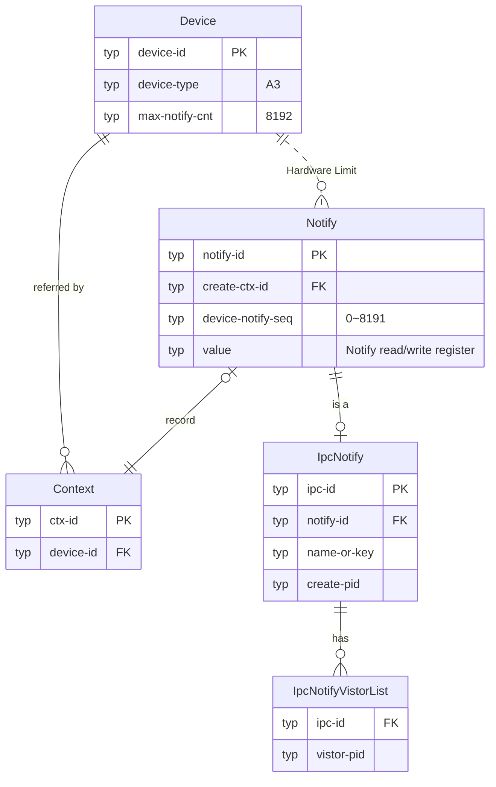
```mermaid
erDiagram
    Device ||..o{ Notify : "Hardware Limit"
    Device ||--o{ Context : "referred by"
    Device {
        typ device-id PK
        typ device-type "A3"
        typ max-notify-cnt "8192"
    }
    Context {
        typ ctx-id PK
        typ device-id FK
    }

    Notify ||--o| IpcNotify : "is a"
    Notify o|--|| Context : "record"
    Notify {
        typ notify-id PK
        typ create-ctx-id FK
        typ device-notify-seq "0~8191"
        typ value "Notify read/write register"
    }

    IpcNotify {
        typ ipc-id PK
        typ notify-id FK
        typ name-or-key
        typ create-pid
    }

    IpcNotify ||--o{ IpcNotifyVistorList : "has"
    IpcNotifyVistorList {
        typ ipc-id FK
        typ vistor-pid
    }
```

##### Key Relationship Description ([Notify Resource Management](https://www.hiascend.com/document/detail/zh/CANNCommunityEdition/850alpha001/appdevg/acldevg/aclcppdevg_000524.html))

**Notify and Device hardware constraints**:

- Each Device has a maximum Notify count of `max-notify-cnt` (for example, the A3 chip supports 8192)
- `device-notify-seq` is the physical sequence number of the Notify within the Device (0~8191)
- Notify creation requires a Context, and the Context binds to a specific Device.

**Notify IPC sharing mechanism**:

- `IpcNotify` allows cross-process sharing of Notify instances.
- `name-or-key` is the sharing identifier, obtained through `rtNotifyGetExportKey`.
- Other processes import and use the Notify through `rtNotifyImportByKey`.
- `IpcNotifyVistorList` records the PIDs of processes that have access to the Notify.

**Notify state management**:

- The `value` field maps to a hardware register for read/write status.
- `rtWaitAndResetNotify` waits for the Notify to reach Ready state and resets it.
- Notify is used for inter-Stream synchronization and cross-process synchronization.

##### API Mapping Table ([Notify Resource Management](https://www.hiascend.com/document/detail/zh/CANNCommunityEdition/850alpha001/appdevg/acldevg/aclcppdevg_000524.html))

| Entity                     | Key Management Interfaces                          |
| -------------------------- | --------------------------------------------------- |
| Notify.notify-id           | `rtCreateNotify`,`rtDestroyNotify`,`rtGetNotifyId`  |
| Notify.state               | `lrtWaitAndResetNotify`, `rtWaitAndResetNotify`     |
| IpcNotify.name-or-key      | `rtNotifyGetExportKey`,`rtNotifyImportByKey`        |
| IpcNotifyVistorList.ipc-id | `rtNotifySetImportPid`                              |

#### 3.3.2 Notify Synchronization Control

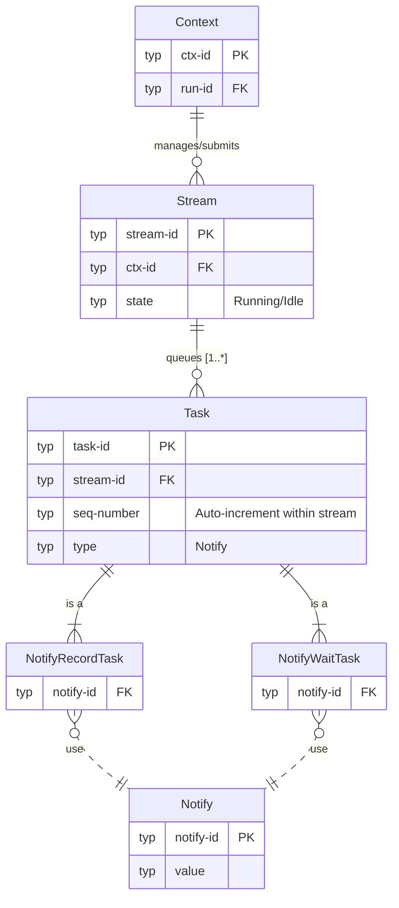
```mermaid
erDiagram
    Context {
        typ ctx-id PK
        typ run-id FK
    }

    Stream {
        typ stream-id PK
        typ ctx-id FK
        typ state "Running/Idle"
    }

    %% Stream contains an ordered task list
    Context ||--o{ Stream : "manages/submits"
    Stream ||--o{ Task : "queues [1..*]"

    Task {
        typ task-id PK
        typ stream-id FK
        typ seq-number "Auto-increment within stream"
        typ type "Notify"
    }

    %% Various concrete Task types (logical inheritance)
    NotifyRecordTask {
        typ notify-id  FK

    }

    NotifyWaitTask {
        typ notify-id FK
    }

    NotifyRecordTask }o..|| Notify : "use"
    NotifyWaitTask }o..|| Notify : "use"
    Notify {
        typ notify-id  PK
        typ value
    }
    %% Inheritance expression (Task has multiple subtypes)
    Task ||--|{ NotifyRecordTask : "is a"
    Task ||--|{ NotifyWaitTask : "is a"
```

##### Key Relationship Description (Notify Synchronization Control)

**Notify task types**:

- `NotifyRecordTask`: Sets the Notify state to Ready, indicating that an event has completed.
- `NotifyWaitTask`: Waits for the Notify state to become Ready, achieving inter-Stream synchronization.

**Task execution order**:

- NotifyRecordTask executes in StreamA and sets the Notify to Ready.
- NotifyWaitTask executes in StreamB and waits for the same Notify.
- StreamB subsequent tasks continue only after the Notify becomes Ready.

**Cross-Stream synchronization sample**:

```text
StreamA: Task1 -> NotifyRecordTask(notify-id=1) -> Task2
StreamB: NotifyWaitTask(notify-id=1) -> Task3
// Task3 must wait for Task1 to complete before execution
```

##### API Mapping Table (Notify Synchronization Control)

| Entity           | Key Management Interfaces |
| ---------------- | ------------------------- |
| NotifyRecordTask | `rtRecordNotify`          |
| NotifyWaitTask   | `lrtWaitAndResetNotify`   |

#### 3.3.3 Event Resource Management

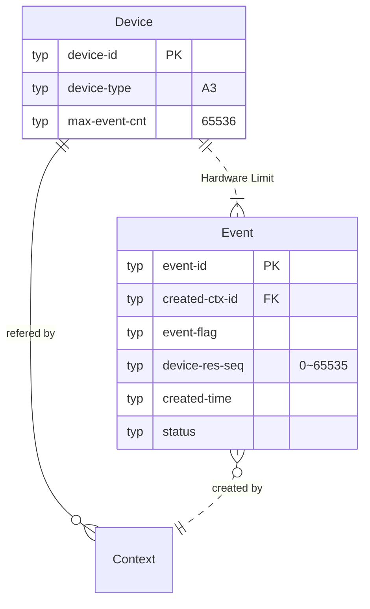
```mermaid
erDiagram
    Device ||..|{ Event : "Hardware Limit"
    Device ||--o{ Context : "refered by"
    Device {
        typ device-id PK
        typ device-type "A3"
        typ max-event-cnt "65536"
    }

    Event }o..|| Context : "created by"
    Event {
        typ event-id PK
        typ created-ctx-id FK
        typ event-flag
        typ device-res-seq "0~65535"
        typ created-time
        typ status
    }
```

##### Key Relationship Description (Event Resource Management)

**Event and Device hardware constraints**:

- Each Device has a maximum Event count of `max-event-cnt` (for example, the A3 chip supports 65536)
- `device-res-seq` is the physical sequence number of the Event within the Device (0~65535)
- Event creation requires a Context, and the Context binds to a specific Device.

**Event and Context relationship**:

- `created-ctx-id` records the Context that created the Event.
- An Event can be shared across multiple Streams but must belong to the same Context.
- Cross-Context Event sharing requires the IPC mechanism (similar to Notify)

**Event state management**:

- The `status` field represents the current Event state: NotRecorded/Recorded/Completed.
- `event-flag` controls Event behavior (such as auto-reset)
- `created-time` is used for performance statistics.

##### API Mapping Table (Event Resource Management)

| Entity         | Key Management Interfaces                                          |
| -------------- | ------------------------------------------------------------------- |
| Event.event-id | `rtCreateEvent`, `rtCreateEventWithFlag`,`rtDestroyEvent`,`rtGetEventId` |
| Event.status   | `rtRecordEvent`,`rtQueryEventStatus`                                |

#### 3.3.4 Event Flow Control

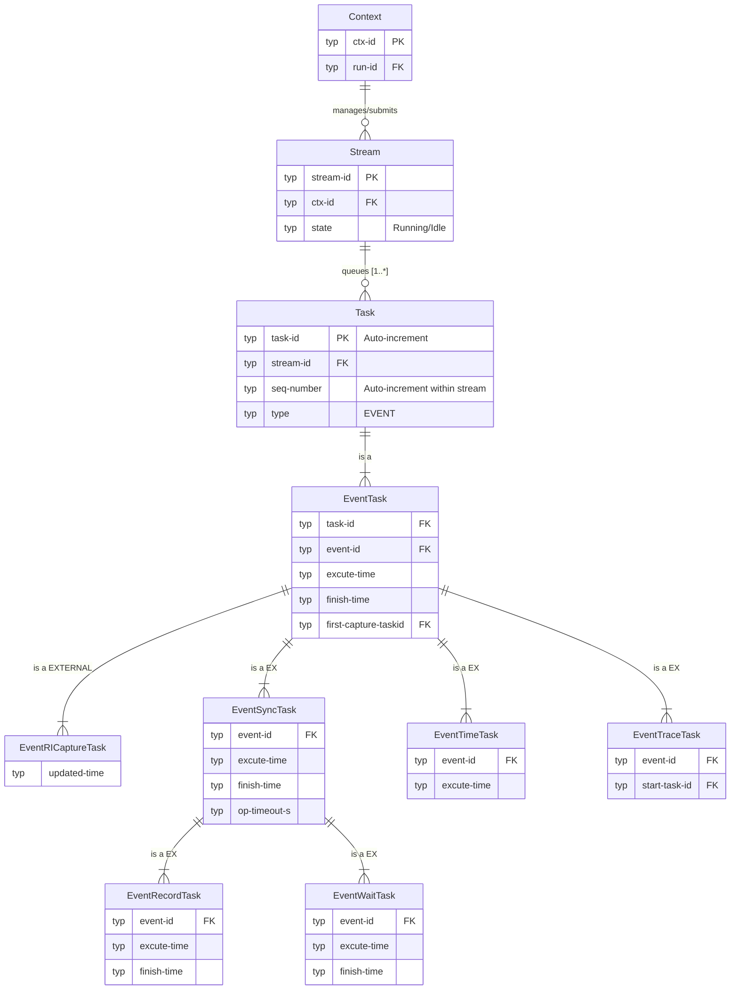
```mermaid
erDiagram
    Context {
        typ ctx-id PK
        typ run-id FK
    }

    Stream {
        typ stream-id PK
        typ ctx-id FK
        typ state "Running/Idle"
    }

    %% Stream contains an ordered task list
    Context ||--o{ Stream : "manages/submits"
    Stream ||--o{ Task : "queues [1..*]"

    Task {
        typ task-id PK "Auto-increment"
        typ stream-id FK
        typ seq-number "Auto-increment within stream"
        typ type "EVENT"
    }

    %% Various concrete Task types (logical inheritance)
    EventTask {
        typ task-id FK
        typ event-id FK
        typ excute-time
        typ finish-time 
        typ first-capture-taskid  FK  
    }

    EventRICaptureTask {
        typ updated-time   
    }  

    EventSyncTask {
        typ event-id FK
        typ excute-time
        typ finish-time 
        typ op-timeout-s 
    }
    EventRecordTask {
        typ event-id FK
        typ excute-time
        typ finish-time 
    }
    EventWaitTask {
        typ event-id FK
        typ excute-time
        typ finish-time 
    }    
    EventTimeTask {
        typ event-id FK
        typ excute-time     
    }
    EventTraceTask {
        typ event-id FK
        typ start-task-id  FK  
    }      

    %% Inheritance expression (Task has multiple subtypes)
    Task ||--|{ EventTask : "is a "
    EventTask ||--|{ EventRICaptureTask : "is a EXTERNAL"
    EventTask ||--|{ EventSyncTask : "is a EX"
    EventTask ||--|{ EventTimeTask : "is a EX"
    EventTask ||--|{ EventTraceTask : "is a EX"
    EventSyncTask ||--|{ EventRecordTask : "is a EX"
    EventSyncTask ||--|{ EventWaitTask : "is a EX"
```

##### Key Relationship Description (Event Flow Control)

**Event task type classification**:

- `EventRecordTask`: Sets the Event state to Recorded/Completed.
- `EventWaitTask`: Waits for the Event state to become Completed.
- `EventSyncTask`: Synchronously waits for Event completion (blocking call)
- `EventRICaptureTask`: A special record task in RI Capture mode.
- `EventTimeTask`: Records timestamp-related tasks.
- `EventTraceTask`: Records tasks for performance tracing.

**Event task inheritance hierarchy**:

- `EventTask` is the base class and contains task-id, event-id, execute-time, and finish-time.
- `EventSyncTask` inherits EventTask and adds the op-timeout-s timeout parameter.
- `EventRecordTask` and `EventWaitTask` inherit EventSyncTask.
- `EventRICaptureTask`, `EventTimeTask`, and `EventTraceTask` inherit EventTask directly.

**Event execution flow**:

```text
StreamA: KernelTask -> EventRecordTask(event-id=1)
StreamB: EventWaitTask(event-id=1) -> KernelTask2
// KernelTask2 in StreamB must wait for KernelTask in StreamA to complete
```

**Task tracing relationships**:

- `first-capture-task-id` records the Task ID of the first Capture.
- `EventTraceTask.start-task-id` associates with the tracing start task.
- EventRecordTask achieves cross-Stream synchronization through EventWaitTask mapping.

##### API Mapping Table (Event Flow Control)

| Entity          | Key Management Interfaces                              |
| --------------- | ------------------------------------------------------ |
| EventTask       | `rtRecordEvent`, `rtResetEvent`,`rtSynchronizeEvent`   |
| EventRecordTask | `rtRecordEvent`, `rtResetEvent`                        |
| EventWaitTask   | `rtStreamWaitEvent`, `rtQueryEventWaitStatus`          |
| EventTimeTask   | `rtResetEvent`, `rtRecordEvent`                        |
| EventTraceTask  | `rtResetEvent`, `rtRecordEvent`                        |

## 4. Communication Domain Modeling

Cross-server communication involves multi-domain hybrid task orchestration.
The communication domain is a multi-card network topology maintained by HCCL at the framework layer through the link establishment capability provided by Rdma_Agent. The topology is stored in the host process.

### 4.1 Communication Domain Core Concepts

The Communicator is the fundamental abstraction of HCCL collective communication. Each communication domain defines a set of participating Ranks and their topology relationships.

#### 4.1.1 Communication Domain Basic Definition

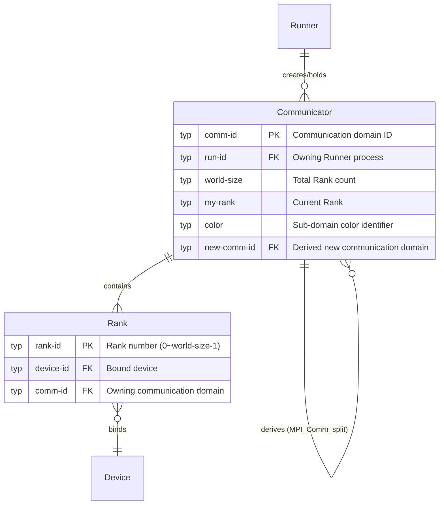
```mermaid
erDiagram
    %% ==========================================
    %% Communication Domain Definition (HCCL Communicator)
    %% ==========================================
    Communicator {
        typ comm-id PK "Communication domain ID"
        typ run-id FK "Owning Runner process"
        typ world-size "Total Rank count"
        typ my-rank "Current Rank"
        typ color "Sub-domain color identifier"
        typ new-comm-id FK "Derived new communication domain"
    }
    Rank {
        typ rank-id PK "Rank number (0~world-size-1)"
        typ device-id FK "Bound device"
        typ comm-id FK "Owning communication domain"
    }
    Runner ||--o{ Communicator : "creates/holds"
    Communicator ||--|{ Rank : "contains"
    Rank }o--|| Device : "binds"
    Communicator ||--o{ Communicator : "derives (MPI_Comm_split)"
```

#### 4.1.2 Control Plane: Socket Communication

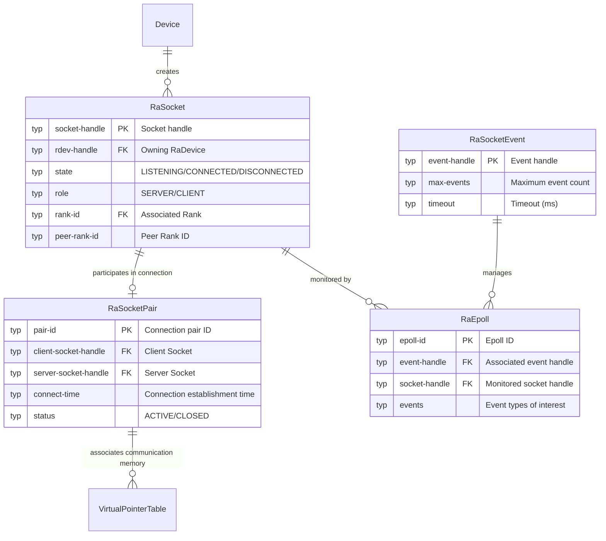
```mermaid
erDiagram
    %% ==========================================
    %% Socket Communication (RaSocket Series Interfaces)
    %% ==========================================
    Device ||--o{ RaSocket : creates
    RaSocket {
        typ socket-handle PK "Socket handle"
        typ rdev-handle FK "Owning RaDevice"
        typ state "LISTENING/CONNECTED/DISCONNECTED"
        typ role "SERVER/CLIENT"
        typ rank-id FK "Associated Rank"
        typ peer-rank-id "Peer Rank ID"
    }
    RaSocketPair {
        typ pair-id PK "Connection pair ID"
        typ client-socket-handle FK "Client Socket"
        typ server-socket-handle FK "Server Socket"
        typ connect-time "Connection establishment time"
        typ status "ACTIVE/CLOSED"
    }
    RaSocket ||--o| RaSocketPair : "participates in connection"
    RaSocketPair ||--o{ VirtualPointerTable : "associates communication memory"
    
    %% Socket event management (Epoll mechanism)
    RaSocketEvent {
        typ event-handle PK "Event handle"
        typ max-events "Maximum event count"
        typ timeout "Timeout (ms)"
    }
    RaEpoll {
        typ epoll-id PK "Epoll ID"
        typ event-handle FK "Associated event handle"
        typ socket-handle FK "Monitored socket handle"
        typ events "Event types of interest"
    }
    RaSocketEvent ||--o{ RaEpoll : "manages"
    RaSocket ||--o{ RaEpoll : "monitored by"
```

#### 4.1.3 Data Plane: RDMA Communication

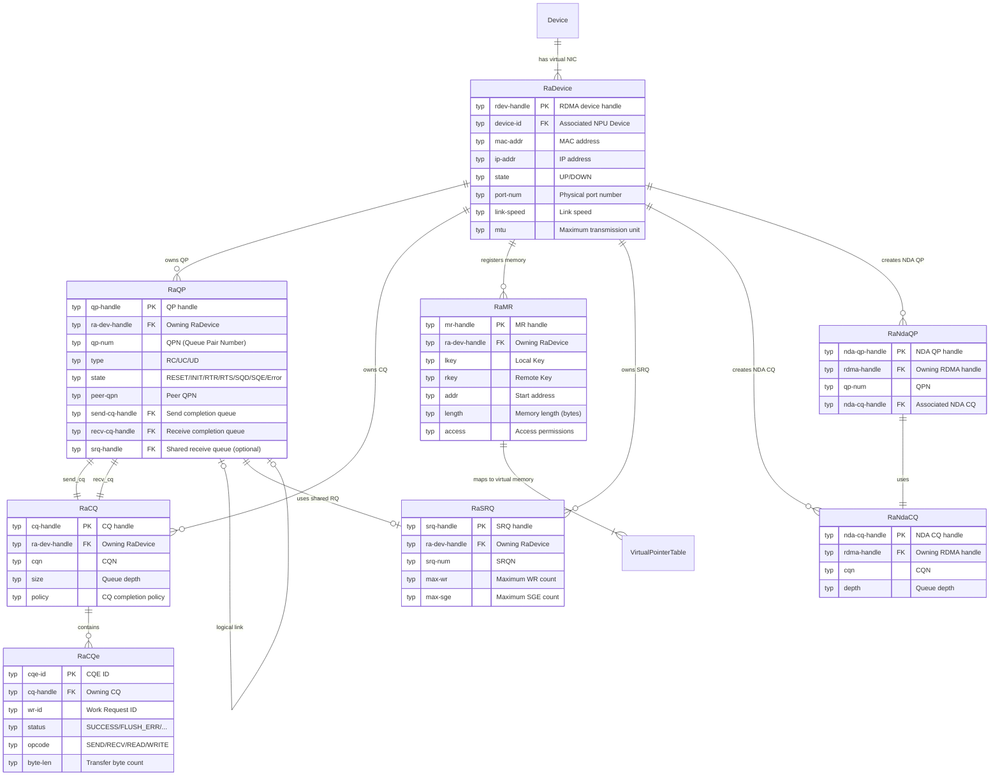
```mermaid
erDiagram
    %% ==========================================
    %% RDMA Device and Resources (RaRdev, RaQp, RaMr Interfaces)
    %% ==========================================
    Device ||--|{ RaDevice : "has virtual NIC"
    RaDevice {
        typ rdev-handle PK "RDMA device handle"
        typ device-id FK "Associated NPU Device"
        typ mac-addr "MAC address"
        typ ip-addr "IP address"
        typ state "UP/DOWN"
        typ port-num "Physical port number"
        typ link-speed "Link speed"
        typ mtu "Maximum transmission unit"
    }
    
    %% RDMA core: QP (Queue Pair)
    RaQP {
        typ qp-handle PK "QP handle"
        typ ra-dev-handle FK "Owning RaDevice"
        typ qp-num "QPN (Queue Pair Number)"
        typ type "RC/UC/UD"
        typ state "RESET/INIT/RTR/RTS/SQD/SQE/Error"
        typ peer-qpn "Peer QPN"
        typ send-cq-handle FK "Send completion queue"
        typ recv-cq-handle FK "Receive completion queue"
        typ srq-handle FK "Shared receive queue (optional)"
    }
    RaDevice ||--o{ RaQP : "owns QP"
    RaQP ||--|| RaCQ : "send_cq"
    RaQP ||--|| RaCQ : "recv_cq"
    RaQP |o--o| RaQP : "logical link"
    RaQP ||--o| RaSRQ : "uses shared RQ"
    
    %% Completion Queue CQ
    RaCQ {
        typ cq-handle PK "CQ handle"
        typ ra-dev-handle FK "Owning RaDevice"
        typ cqn "CQN"
        typ size "Queue depth"
        typ policy "CQ completion policy"
    }
    RaCQe {
        typ cqe-id PK "CQE ID"
        typ cq-handle FK "Owning CQ"
        typ wr-id "Work Request ID"
        typ status "SUCCESS/FLUSH_ERR/..."
        typ opcode "SEND/RECV/READ/WRITE"
        typ byte-len "Transfer byte count"
    }
    RaDevice ||--o{ RaCQ : "owns CQ"
    RaCQ ||--o{ RaCQe : "contains"
    
    %% Memory Registration MR
    RaMR {
        typ mr-handle PK "MR handle"
        typ ra-dev-handle FK "Owning RaDevice"
        typ lkey "Local Key"
        typ rkey "Remote Key"
        typ addr "Start address"
        typ length "Memory length (bytes)"
        typ access "Access permissions"
    }
    RaDevice ||--o{ RaMR : "registers memory"
    RaMR ||--|{ VirtualPointerTable : "maps to virtual memory"
    
    %% Shared Receive Queue SRQ
    RaSRQ {
        typ srq-handle PK "SRQ handle"
        typ ra-dev-handle FK "Owning RaDevice"
        typ srq-num "SRQN"
        typ max-wr "Maximum WR count"
        typ max-sge "Maximum SGE count"
    }
    RaDevice ||--o{ RaSRQ : "owns SRQ"
    
    %% NDA direct access
    RaNdaCQ {
        typ nda-cq-handle PK "NDA CQ handle"
        typ rdma-handle FK "Owning RDMA handle"
        typ cqn "CQN"
        typ depth "Queue depth"
    }
    RaNdaQP {
        typ nda-qp-handle PK "NDA QP handle"
        typ rdma-handle FK "Owning RDMA handle"
        typ qp-num "QPN"
        typ nda-cq-handle FK "Associated NDA CQ"
    }
    RaDevice ||--o{ RaNdaCQ : "creates NDA CQ"
    RaDevice ||--o{ RaNdaQP : "creates NDA QP"
    RaNdaQP ||--|| RaNdaCQ : "uses"
```

#### 4.1.4 Data Plane: UB Unified Bus

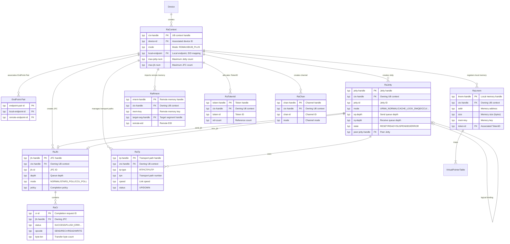
```mermaid
erDiagram
    %% ==========================================
    %% UB Context (RaContext Series Interfaces)
    %% ==========================================
    Device ||--o{ RaContext : creates
    RaContext {
        typ ctx-handle PK "UB context handle"
        typ device-id FK "Associated device ID"
        typ mode "Mode: RDMA/UB/UB_PLUS"
        typ local-endpoint FK "Local endpoint, EID mapping"
        typ max-jetty-num "Maximum Jetty count"
        typ max-jfc-num "Maximum JFC count"
    }
    
    EndPoint-Pair {
        typ endpoint-pair-id PK
        typ local-endpoint-id FK
        typ remote-endpoint-id FK
    }

    %% UB core resources
    RaContext ||--o{ RaJetty : "creates Jetty"
    RaContext ||--o{ RaJfc : "creates JFC"
    RaContext ||--o{ RaLmem : "registers local memory"
    RaContext ||--o{ RaRmem : "imports remote memory"
    RaContext ||--o{ RaTp : "manages transport paths"
    RaContext ||--o{ RaTokenId : "allocates TokenID"
    RaContext ||--o{ RaChan : "creates channel"
    RaContext ||--o{ EndPoint-Pair : "associates EndPoint-Pair"

    %% Jetty (QP equivalent)
    RaJetty {
        typ jetty-handle PK "Jetty handle"
        typ ctx-handle FK "Owning UB context"
        typ jetty-id "Jetty ID"
        typ mode "URMA_NORMAL/CACHE_LOCK_DWQE/CCU/..."
        typ sq-depth "Send queue depth"
        typ rq-depth "Receive queue depth"
        typ state "RESET/READY/SUSPENDED/ERROR"
        typ peer-jetty-handle FK "Peer Jetty"
    }
    RaJetty ||--o| RaJfc : "send_jfc"
    RaJetty ||--o| RaJfc : "recv_jfc"
    RaJetty |o--o| RaJetty : "logical binding"
    
    %% JFC (CQ equivalent)
    RaJfc {
        typ jfc-handle PK "JFC handle"
        typ ctx-handle FK "Owning UB context"
        typ jfc-id "JFC ID"
        typ depth "Queue depth"
        typ mode "NORMAL/STARS_POLL/CCU_POLL"
        typ policy "Completion policy"
    }
    RaCr {
        typ cr-id PK "Completion request ID"
        typ jfc-handle FK "Owning JFC"
        typ status "SUCCESS/FLUSH_ERR/..."
        typ opcode "SEND/RECV/READ/WRITE"
        typ byte-len "Transfer byte count"
    }
    RaJfc ||--o{ RaCr : "contains"
    
    %% Local memory registration
    RaLmem {
        typ lmem-handle PK "Local memory handle"
        typ ctx-handle FK "Owning UB context"
        typ addr "Memory address"
        typ size "Memory size (bytes)"
        typ mem-key "Memory key"
        typ token-id FK "Associated TokenID"
    }
    RaLmem ||--|{ VirtualPointerTable : "maps"
    
    %% Remote memory import
    RaRmem {
        typ rmem-handle PK "Remote memory handle"
        typ ctx-handle FK "Owning UB context"
        typ mem-key "Remote memory key"
        typ target-seg-handle FK "Target segment handle"
        typ remote-eid "Remote EID"
    }
    
    %% Transport path
    RaTp {
        typ tp-handle PK "Transport path handle"
        typ ctx-handle FK "Owning UB context"
        typ tp-type "RTP/CTP/UTP"
        typ tpn "Transport path number"
        typ speed "Link speed"
        typ status "UP/DOWN"
    }
    RaJetty ||--o{ RaTp : "uses"
    
    %% TokenID
    RaTokenId {
        typ token-handle PK "Token handle"
        typ ctx-handle FK "Owning UB context"
        typ token-id "Token ID"
        typ ref-count "Reference count"
    }
    
    %% 
    RaChan {
        typ chan-handle PK "Channel handle"
        typ ctx-handle FK "Owning UB context"
        typ chan-id "Channel ID"
        typ mode "Channel mode"
    }
```

#### 4.1.5 Asynchronous Request Management

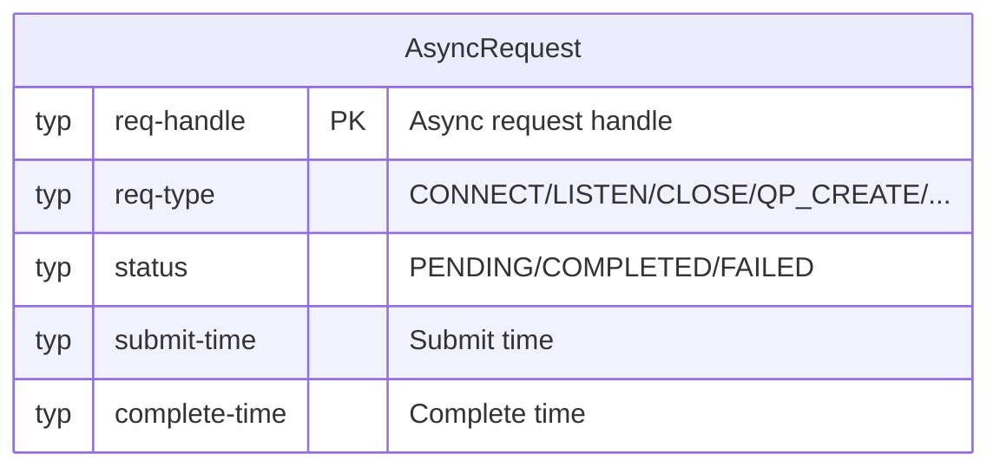
```mermaid
erDiagram
    AsyncRequest {
        typ req-handle PK "Async request handle"
        typ req-type "CONNECT/LISTEN/CLOSE/QP_CREATE/..."
        typ status "PENDING/COMPLETED/FAILED"
        typ submit-time "Submit time"
        typ complete-time "Complete time"
    }
```

#### 4.1.6 Communication Domain Architecture Summary

```text
┌─────────────────────────────────────────────────────────────────┐
│                    HCCL Communication Domain Architecture        │
├─────────────────────────────────────────────────────────────────┤
│  Application Layer                                               │
│  ┌──────────────────────────────────────────────────────────┐   │
│  │  Communicator (Communication Domain)                       │   │
│  │  └── Rank[0..N] (Participant nodes, each bound to a Device)│   │
│  └──────────────────────────────────────────────────────────┘   │
├─────────────────────────────────────────────────────────────────┤
│  Control Plane (Link Establishment/Handshake)                    │
│  ┌──────────────────────────────────────────────────────────┐   │
│  │  RaSocket (Socket Communication)                           │   │
│  │  ├── RaSocketPair (Connection Pair)                        │   │
│  │  └── RaEpoll (Event Monitoring)                            │   │
│  └──────────────────────────────────────────────────────────┘   │
├─────────────────────────────────────────────────────────────────┤
│  Data Plane (Data Transfer)                                      │
│  ┌─────────────────────┐    ┌─────────────────────┐            │
│  │  RDMA (Legacy Mode)   │    │  UB (Unified Bus)    │            │
│  │  ├── RaDevice        │    │  ├── RaContext      │            │
│  │  ├── RaQP (Queue Pair)│    │  ├── RaJetty (QP)   │            │
│  │  ├── RaCQ (Comp Queue)│    │  ├── RaJfc (CQ)     │            │
│  │  ├── RaMR (Mem Reg)   │    │  ├── RaLmem/Rmem    │            │
│  │  └── RaSRQ (Shared RQ)│    │  └── RaTp (Trans Path)│            │
│  └─────────────────────┘    └─────────────────────┘            │
└─────────────────────────────────────────────────────────────────┘
```

#### 4.1.7 Key Entity Comparison Table

| Concept | RDMA Mode | UB Mode | Description |
| --- | --- | --- | --- |
| Context | RaDevice | RaContext | Device/context handle |
| Queue Pair | RaQP | RaJetty | Data transfer channel |
| Completion Queue | RaCQ | RaJfc | Completion notification |
| Completion Element | RaCQe | RaCr | Completion status |
| Local Memory | RaMR | RaLmem | Memory registration |
| Remote Memory | - | RaRmem | Remote memory import |
| Transport Path | - | RaTp | Physical path management |
| Security Token | - | RaTokenId | Access control |

#### 4.1.8 HCCP Interface Classification

```text
HCCP Network API
├── Control Plane (Socket Communication)
|   ├── Initialization: RaSocketInit/RaSocketDeinit (Socket)
│   ├── Connection Management: RaSocketBatchConnect/Close/Abort
│   ├── Listen Management: RaSocketListenStart/Stop
│   ├── Data Send/Receive: RaSocketSend/Recv
│   ├── Status Query: RaGetSockets
│   └── Event Management: RaEpollCtlAdd/Mod/Del
├── Data Plane - RDMA
|   ├── Initialization: RaRdevInit/RaRdevDeinit (RDMA Device)
│   ├── QP Management: RaQpCreate/Destroy/ConnectAsync
│   ├── CQ Management: RaCqCreate/Destroy
│   ├── MR Management: RaMrReg/Dereg
│   ├── Work Request: RaSendWr/RaRecvWrlist
│   └── Completion Polling: RaPollCq
├── Data Plane - UB
|   ├── Initialization: RaCtxInit/RaCtxDeinit (Unified Context)
│   ├── Jetty Management: RaCtxQpCreate/Destroy/Import/Bind
│   ├── JFC Management: RaCtxCqCreate/Destroy
│   ├── Memory Management: RaCtxLmemRegister/RmemImport
│   ├── Token Management: RaCtxTokenIdAlloc/Free
│   └── Work Request: RaBatchSendWr
├── Asynchronous Operations
│   ├── RaSocketBatchConnectAsync
│   ├── RaCtxQpCreateAsync/DestroyAsync
│   └── RaGetAsyncReqResult
├── Network Diagnostics
|   ├── RaPingInit/RaPingDeinit (Ping)
│   ├── RaPingTargetAdd/Del
│   ├── RaPingTaskStart/Stop
│   └── RaPingGetResults
└── TLV Messages
|   ├── RaTlvInit/RaTlvDeinit (TLV)
    └── RaTlvRequest
```

##### Socket Communication Interfaces

| Interface              | Function                | Key Parameters                                                               |
| ---------------------- | ----------------------- | ---------------------------------------------------------------------------- |
| `RaSocketInit`         | Socket initialization   | `mode`, `rdevInfo`, `socketHandle`                                           |
| `RaSocketDeinit`       | Socket deinitialization | `socketHandle`                                                               |
| `RaSocketBatchConnect` | Batch connect           | `SocketConnectInfoT[]`, `num`                                                |
| `RaSocketBatchClose`   | Batch close             | `SocketCloseInfoT[]`, `num`                                                  |
| `RaSocketBatchAbort`   | Batch abort             | `SocketConnectInfoT[]`, `num`                                                |
| `RaSocketListenStart`  | Start listening         | `SocketListenInfoT[]`, `num`                                                 |
| `RaSocketListenStop`   | Stop listening          | `SocketListenInfoT[]`, `num`                                                 |
| `RaGetSockets`         | Get Socket status       | `role`, `SocketInfoT[]`, `num`, `connectedNum`                               |
| `RaSocketSend`         | Send data               | `fdHandle`, `data`, `size`, `sentSize`                                       |
| `RaSocketRecv`         | Receive data            | `fdHandle`, `data`, `size`, `receivedSize`                                   |
| `RaEpollCtlAdd`        | Add Epoll event         | `fdHandle`, `event`                                                          |
| `RaEpollCtlMod`        | Modify Epoll event      | `fdHandle`, `event`                                                          |
| `RaEpollCtlDel`        | Delete Epoll event      | `fdHandle`                                                                   |
| `RaCreateEventHandle`  | Create event handle     | `eventHandle`                                                                |
| `RaWaitEventHandle`    | Wait for event          | `eventHandle`, `SocketEventInfoT[]`, `timeout`, `maxevents`, `eventsNum`     |
| `RaDestroyEventHandle` | Destroy event handle    | `eventHandle`                                                                |
| `RaSocketWhiteListAdd` | Add whitelist           | `socketHandle`, `SocketWlistInfoT[]`, `num`                                  |
| `RaSocketWhiteListDel` | Delete whitelist        | `socketHandle`, `SocketWlistInfoT[]`, `num`                                  |

###### RDMA Operation Interfaces

| Interface             | Function                          | Key Parameters                                                              |
| --------------------- | --------------------------------- | --------------------------------------------------------------------------- |
| `RaRdevInit`           | RDMA device initialization        | `mode`, `notifyType`, `rdevInfo`, `rdmaHandle`          |
| `RaRdevInitV2`         | RDMA device initialization (extended) | `RdevInitInfo`, `rdevInfo`, `rdmaHandle`            |
| `RaRdevInitWithBackup` | Initialization with backup        | `initInfo`, `rdevInfo`, `backupRdevInfo`            |
| `RaRdevDeinit`         | RDMA device deinitialization      | `rdmaHandle`, `notifyType`                          |
| `RaQpCreate`          | Create QP                         | `rdevHandle`, `flag`, `qpMode`, `qpHandle`                              |
| `RaQpCreateWithAttrs` | Create QP (with attributes)       | `rdevHandle`, `QpExtAttrs`, `qpHandle`                                  |
| `RaAiQpCreate`        | Create AI QP                      | `rdevHandle`, `QpExtAttrs`, `AiQpInfo`, `qpHandle`                      |
| `RaLoopbackQpCreate`  | Create loopback QP                | `rdevHandle`, `LoopbackQpPair`, `qpHandle`                              |
| `RaTypicalQpCreate`   | Create typical QP                 | `rdevHandle`, `flag`, `qpMode`, `TypicalQp`, `qpHandle`                 |
| `RaQpDestroy`         | Destroy QP                        | `qpHandle`                                                              |
| `RaQpConnectAsync`    | Connect QP asynchronously         | `qpHandle`, `fdHandle`                                                  |
| `RaGetQpStatus`       | Get QP status                     | `qpHandle`, `status`                                                    |
| `RaTypicalQpModify`   | Modify typical QP                 | `qpHandle`, `localQpInfo`, `remoteQpInfo`                               |
| `RaMrReg`             | Register MR                       | `qpHandle`, `MrInfoT`                                                   |
| `RaMrDereg`           | Deregister MR                     | `qpHandle`, `MrInfoT`                                                   |
| `RaRegisterMr`        | Register MR independently         | `rdmaHandle`, `MrInfoT`, `mrHandle`                                     |
| `RaDeregisterMr`      | Deregister MR independently       | `rdmaHandle`, `mrHandle`                                                |
| `RaRemapMr`           | Remap MR                          | `rdmaHandle`, `MemRemapInfo[]`, `num`                                   |
| `RaGetNotifyMrInfo`   | Get notify MR info                | `rdevHandle`, `MrInfoT`                                                 |
| `RaSendWr`            | Send work request                 | `qpHandle`, `SendWr`, `SendWrRsp`                                       |
| `RaSendWrV2`          | Send work request V2              | `qpHandle`, `SendWrV2`, `SendWrRsp`                                     |
| `RaSendWrlist`        | Batch send                        | `qpHandle`, `SendWrlistData[]`, `SendWrRsp[]`, `sendNum`, `completeNum` |
| `RaRecvWrlist`        | Batch receive                     | `qpHandle`, `RecvWrlistData`, `recvNum`, `completeNum`                  |
| `RaPollCq`            | Poll CQ                           | `qpHandle`, `isSendCq`, `numEntries`, `wc`                              |
| `RaCqCreate`          | Create CQ                         | `rdevHandle`, `CqAttr`                                                  |
| `RaCqDestroy`         | Destroy CQ                        | `rdevHandle`, `CqAttr`                                                  |
| `RaCreateSrq`         | Create SRQ                        | `rdmaHandle`, `SrqAttr`                                                 |
| `RaDestroySrq`        | Destroy SRQ                       | `rdmaHandle`, `SrqAttr`                                                 |
| `RaSetQpAttrQos`      | Set QP QoS                        | `qpHandle`, `QosAttr`                                                   |
| `RaSetQpAttrTimeout`  | Set QP timeout                    | `qpHandle`, `timeout`                                                   |
| `RaSetQpAttrRetryCnt` | Set QP retry count                | `qpHandle`, `retryCnt`                                                  |
| `RaGetQpAttr`         | Get QP attributes                 | `qpHandle`, `QpAttr`                                                    |
| `RaGetQpContext`      | Get QP context                    | `qpHandle`, `qp`, `sendCq`, `recvCq`                                    |

###### UB Unified Bus Interfaces

| Interface               | Function                     | Key Parameters                                                       |
| ----------------------- | ---------------------------- | -------------------------------------------------------------------- |
| `RaCtxInit`            | Context initialization       | `CtxInitCfg`, `CtxInitAttr`, `ctxHandle`            |
| `RaCtxDeinit`          | Context deinitialization     | `ctxHandle`                                         |
| `RaGetDevEidInfoNum`    | Get EID count                | `RaInfo`, `num`                                                  |
| `RaGetDevEidInfoList`   | Get EID list                 | `RaInfo`, `HccpDevEidInfo[]`, `num`                              |
| `RaGetEidByIp`          | Get EID by IP                | `ctxHandle`, `IpInfo[]`, `HccpEid[]`, `num`                      |
| `RaGetDevBaseAttr`      | Get device attributes        | `ctxHandle`, `DevBaseAttr`                                       |
| `RaCtxGetAsyncEvents`   | Get async events             | `ctxHandle`, `AsyncEvent[]`, `num`                               |
| `RaCtxTokenIdAlloc`     | Allocate TokenID             | `ctxHandle`, `HccpTokenId`, `tokenIdHandle`                      |
| `RaCtxTokenIdFree`      | Free TokenID                 | `ctxHandle`, `tokenIdHandle`                                     |
| `RaCtxLmemRegister`     | Register local memory        | `ctxHandle`, `MrRegInfoT`, `lmemHandle`                          |
| `RaCtxLmemUnregister`   | Unregister local memory      | `ctxHandle`, `lmemHandle`                                        |
| `RaCtxRmemImport`       | Import remote memory         | `ctxHandle`, `MrImportInfoT`, `rmemHandle`                       |
| `RaCtxRmemUnimport`     | Unimport remote memory       | `ctxHandle`, `rmemHandle`                                        |
| `RaCtxChanCreate`       | Create channel               | `ctxHandle`, `ChanInfoT`, `chanHandle`                           |
| `RaCtxChanDestroy`      | Destroy channel              | `ctxHandle`, `chanHandle`                                        |
| `RaCtxCqCreate`         | Create CQ                    | `ctxHandle`, `CqInfoT`, `cqHandle`                               |
| `RaCtxCqDestroy`        | Destroy CQ                   | `ctxHandle`, `cqHandle`                                          |
| `RaCtxQpCreate`         | Create QP/Jetty              | `ctxHandle`, `QpCreateAttr`, `QpCreateInfo`, `qpHandle`          |
| `RaCtxQpQueryBatch`     | Batch query QP               | `qpHandle[]`, `JettyAttr[]`, `num`                               |
| `RaCtxQpDestroy`        | Destroy QP/Jetty             | `qpHandle`                                                       |
| `RaCtxQpImport`         | Import Jetty                 | `ctxHandle`, `QpImportInfoT`, `remQpHandle`                      |
| `RaCtxQpUnimport`       | Unimport Jetty               | `ctxHandle`, `remQpHandle`                                       |
| `RaCtxQpBind`           | Bind Jetty                   | `qpHandle`, `remQpHandle`                                        |
| `RaCtxQpUnbind`         | Unbind Jetty                 | `qpHandle`                                                       |
| `RaBatchSendWr`         | Batch send                   | `qpHandle`, `SendWrData[]`, `SendWrResp[]`, `num`, `completeNum` |
| `RaCtxUpdateCi`         | Update CI                    | `qpHandle`, `ci`                                                 |
| `RaCtxGetAuxInfo`       | Get auxiliary info           | `ctxHandle`, `HccpAuxInfoIn`, `HccpAuxInfoOut`                   |
| `RaCtxGetCrErrInfoList` | Get CR error info            | `ctxHandle`, `CrErrInfo[]`, `num`                                |

###### Asynchronous Operation Interfaces

| Interface                     | Function                  | Key Parameters                                                         |
| ----------------------------- | ------------------------- | ---------------------------------------------------------------------- |
| `RaGetAsyncReqResult`         | Get async result          | `reqHandle`, `reqResult`                                               |
| `RaSocketBatchConnectAsync`   | Async batch connect       | `SocketConnectInfoT[]`, `num`, `reqHandle`                             |
| `RaSocketListenStartAsync`    | Async start listening     | `SocketListenInfoT[]`, `num`, `reqHandle`                              |
| `RaSocketListenStopAsync`     | Async stop listening      | `SocketListenInfoT[]`, `num`, `reqHandle`                              |
| `RaSocketBatchCloseAsync`     | Async batch close         | `SocketCloseInfoT[]`, `num`, `reqHandle`                               |
| `RaSocketSendAsync`           | Async send                | `fdHandle`, `data`, `size`, `sentSize`, `reqHandle`                    |
| `RaSocketRecvAsync`           | Async receive             | `fdHandle`, `data`, `size`, `receivedSize`, `reqHandle`                |
| `RaCtxLmemRegisterAsync`      | Async register memory     | `ctxHandle`, `MrRegInfoT`, `lmemHandle`, `reqHandle`                   |
| `RaCtxLmemUnregisterAsync`    | Async unregister memory   | `ctxHandle`, `lmemHandle`, `reqHandle`                                 |
| `RaCtxQpCreateAsync`          | Async create QP           | `ctxHandle`, `QpCreateAttr`, `QpCreateInfo`, `qpHandle`, `reqHandle`   |
| `RaCtxQpDestroyAsync`         | Async destroy QP          | `qpHandle`, `reqHandle`                                                |
| `RaCtxQpDestroyBatchAsync`    | Async batch destroy       | `ctxHandle`, `qpHandle[]`, `num`, `reqHandle`                          |
| `RaCtxQpImportAsync`          | Async import Jetty        | `ctxHandle`, `QpImportInfoT`, `remQpHandle`, `reqHandle`               |
| `RaGetTpInfoListAsync`        | Async get TP info         | `ctxHandle`, `GetTpCfg`, `HccpTpInfo[]`, `num`, `reqHandle`            |
| `RaGetEidByIpAsync`           | Async get EID by IP       | `ctxHandle`, `IpInfo[]`, `HccpEid[]`, `num`, `reqHandle`               |
| `RaGetTpAttrAsync`            | Async get TP attributes   | `ctxHandle`, `tpHandle`, `attrBitmap`, `TpAttr`, `reqHandle`           |
| `RaSetTpAttrAsync`            | Async set TP attributes   | `ctxHandle`, `tpHandle`, `attrBitmap`, `TpAttr`, `reqHandle`           |

###### Network Diagnostic Interfaces

| Interface          | Function              | Key Parameters                                   |
| ------------------ | --------------------- | -------------------------------------------------|
| `RaPingInit`       | Ping initialization   | `PingInitAttr`, `PingInitInfo`, `pingHandle`      |
| `RaPingDeinit`     | Ping deinitialization | `pingHandle`                                      |
| `RaPingTargetAdd`  | Add Ping target       | `pingHandle`, `PingTargetInfo[]`, `num`           |
| `RaPingTargetDel`  | Delete Ping target    | `pingHandle`, `PingTargetCommInfo[]`, `num`       |
| `RaPingTaskStart`  | Start Ping task       | `pingHandle`, `PingTaskAttr`                      |
| `RaPingTaskStop`   | Stop Ping task        | `pingHandle`                                      |
| `RaPingGetResults` | Get Ping results      | `pingHandle`, `PingTargetResult[]`, `num`         |

###### TLV Message Interfaces

| Interface      | Function               | Key Parameters                                    |
| -------------- | ---------------------- | ------------------------------------------------- |
| `RaTlvInit`    | TLV initialization     | `TlvInitInfo`, `bufferSize`, `tlvHandle`          |
| `RaTlvDeinit`  | TLV deinitialization   | `tlvHandle`                                       |
| `RaTlvRequest` | TLV request processing | `tlvHandle`, `moduleType`, `TlvMsg`, `TlvMsg`     |

###### NDA (Network Direct Access) Direct Access Interfaces

| Interface            | Function                  | Key Parameters                                             |
| -------------------- | ------------------------- | ---------------------------------------------------------- |
| `RaNdaGetDirectFlag` | Get direct access flag    | `rdmaHandle`, `directFlag`                                 |
| `RaNdaCqCreate`      | Create NDA CQ             | `rdmaHandle`, `NdaCqInitAttr`, `NdaCqInfo`, `cqHandle`     |
| `RaNdaCqDestroy`     | Destroy NDA CQ            | `rdmaHandle`, `cqHandle`                                   |
| `RaNdaQpCreate`      | Create NDA QP             | `rdmaHandle`, `NdaQpInitAttr`, `NdaQpInfo`, `qpHandle`     |

###### General Query Interfaces

| Interface                | Function                  | Key Parameters                                     |
| ------------------------ | ------------------------- | ---------------------------------------------------|
| `RaGetIfnum`             | Get interface count       | `RaGetIfattr`, `num`                               |
| `RaGetIfaddrs`           | Get interface addresses   | `RaGetIfattr`, `InterfaceInfo[]`, `num`            |
| `RaSocketGetVnicIpInfos` | Get virtual NIC IP info   | `phyId`, `IdType`, `ids[]`, `num`, `IpInfo[]`      |
| `RaGetTlsEnable`         | Get TLS status            | `RaInfo`, `tlsEnable`                              |
| `RaGetHccnCfg`           | Get HCCN configuration   | `RaInfo`, `HccnCfgKey`, `value`, `valueLen`        |
| `RaGetInterfaceVersion`  | Get interface version     | `phyId`, `interfaceOpcode`, `interfaceVersion`     |
| `RaRdevGetHandle`        | Get Rdev handle           | `phyId`, `rdmaHandle`                              |
| `RaRdevGetSupportLite`   | Get Lite support          | `rdmaHandle`, `supportLite`                        |
| `RaSaveSnapshot`         | Save snapshot             | `RaInfo`, `SaveSnapshotAction`                     |
| `RaRestoreSnapshot`      | Restore snapshot          | `RaInfo`                                           |
| `RaGetSecRandom`         | Get secure random number  | `RaInfo`, `value`                                  |

##### Key Relationship Description (HCCP Interface Classification)

**Communication domain hierarchy**:

- `Communicator` is the core abstraction of HCCL collective communication and defines a set of participating Ranks.
- `Rank` is a participant node in the communication domain, and each Rank binds to a specific Device.
- A parent communication domain derives child communication domains (for example, the `color` attribute implements grouping)

**Control plane and data plane separation**:

- **Control Plane (Socket)**: Handles link establishment, QP information exchange, and control signaling. It uses the TCP protocol.
- **Data Plane (RDMA/UB)**: Handles high-performance data transfer. It uses RDMA Verbs or the UB protocol.

**RDMA resource hierarchy**:

- `RaDevice` is a virtual NIC abstraction. A Device can create multiple RaDevice instances.
- `RaQP` is a queue pair that contains a Send Queue and a Receive Queue.
- `RaCQ` is a completion queue for polling WR completion status.
- `RaMR` is memory registration that maps virtual memory to RDMA-accessible physical memory.
- `RaSRQ` is a shared receive queue. Multiple QPs can share the same SRQ to improve resource utilization.

**UB resource hierarchy**:

- `RaContext` is the UB unified context and replaces the RaDevice device abstraction.
- `RaJetty` is the QP equivalent and supports multiple modes (URMA_NORMAL/CCU, and so on)
- `RaJfc` is the CQ equivalent for completion request management.
- `RaLmem/RaRmem` handle local/remote memory management and replace RaMR.
- `RaTp` manages transport paths and supports three types: RTP/CTP/UTP.
- `RaTokenId` is a secure communication token for cross-process memory access control.

**Entity association key points**:

1. `RaSocketPair` requires two `RaSocket` instances (client side and server side) to establish a connection.
2. `RaQP.state` must transition through RESET to INIT to RTR to RTS before normal communication begins.
3. `RaMR.lkey` is for local access. `RaMR.rkey` is for remote RDMA access.
4. `RaJetty` establishes a logical connection with the peer Jetty through the `Bind` operation.
5. `RaLmem` must be registered before `RaRmem` can import and access memory from the peer side.

**NDA (Network Direct Access) direct access mechanism**:

- `RaNdaQP` and `RaNdaCQ` are QP/CQ variants for network direct access.
- NDA mode bypasses parts of the protocol stack to reduce latency.
- `RaNdaGetDirectFlag` checks whether the device supports NDA mode.

**Asynchronous request management**:

- `AsyncRequest` manages request handles for all asynchronous operations uniformly.
- Asynchronous operations include connection, listening, QP creation/destruction, memory registration, and so on.
- `RaGetAsyncReqResult` polls asynchronous operation results.

**Socket event mechanism**:

- `RaSocketEvent` is the handle for the event waiting mechanism.
- `RaEpoll` implements an event monitoring mechanism similar to Linux Epoll.
- The system supports adding, modifying, and deleting monitored Socket events.

**Network interfaces and configuration**:

- `InterfaceInfo` describes network interface attributes such as IP/MAC/MTU.
- `HccnConfig` stores HCCN network configuration key-value pairs.
- `Snapshot` supports saving and restoring device state.

##### Control Plane vs Data Plane

| Dimension            | Control Plane                                                 | Data Plane                                 |
| -------------------- | ------------------------------------------------------------- | ------------------------------------------ |
| **Core Function**    | Link establishment, QP info exchange, control signaling       | Data transfer, RDMA operations             |
| **Key Entities**     | RaSocket, SocketConnection, RaEpoll                           | RaQP, RaCQ, RaMR, RaJetty                  |
| **Key Interfaces**   | `RaSocketBatchConnect`, `RaSocketListenStart`, `RaGetSockets` | `RaSendWr`, `RaPollCq`, `RaQpConnectAsync` |
| **Communication**    | TCP Socket                                                    | RDMA Verbs / UB                            |

##### RDMA Mode vs UB Mode

| Comparison Item      | RDMA Mode        | UB Mode                |
| -------------------- | ---------------- | ---------------------- |
| **Device Abstraction** | RaDevice       | RaContext              |
| **Queue Pair**       | RaQP (QP)        | RaJetty (Jetty)        |
| **Completion Queue** | RaCQ (CQ)        | RaJfc (JFC)            |
| **Memory Registration** | RaMR (lkey/rkey) | RaLmem/RaRmem (MemKey) |
| **Address Identifier** | IP + GID        | EID (Endpoint ID)      |
| **Transport Path**   | QPN + GID        | RaTp (TPN)             |

##### Key Points Description

1. **RaContext/RaDevice**: A unified context entity that supports both RDMA and UB modes.
2. **RaJetty/RaJfc/RaQP/RaCQ**: QP/CQ equivalents in UB mode.
3. **RaLmem/RaRmem/RaMR**: Local/remote memory management in UB mode.
4. **RaTp**: UB transport path management.
5. **RaTokenId**: Secure communication token.

##### Key Attribute Supplement

- **QP Mode**: `NOR` (normal), `GDR_TMPL` (template), `OP` (operation), `GDR_ASYN` (asynchronous GDR)
- **Transport Mode**: `RC` (reliable connection), `RM` (reliable message, UB only)
- **Jetty Mode**: `URMA_NORMAL`, `CACHE_LOCK_DWQE`, `CCU`, `USER_CTL_NORMAL`
- **JFC Mode**: `NORMAL`, `STARS_POLL`, `CCU_POLL`

##### API Mapping Table (HCCP Interface Classification)

| Entity           | Initialization Interfaces        | Creation Interfaces                                          | Operation Interfaces                           | Destruction/Cleanup Interfaces                  |
| ---------------- | -------------------------------- | ------------------------------------------------------------ | ---------------------------------------------- | ----------------------------------------------- |
| **Communicator** | -                                | `HcclCommInitRankInfo`, `HcclCommInitClusterInfo`            | `HcclGetRankId`, `HcclGetRankSize`             | `HcclCommDestroy`                               |
| **Rank**         | -                                | -                                                | -                       | -                             |
| **RaSocket**     | `RaSocketInit`                   | `RaSocketBatchConnect`                                   | `RaSocketSend`, `RaSocketRecv`, `RaGetSockets` | `RaSocketDeinit`, `RaSocketBatchClose`, `RaSocketBatchAbort` |
| **RaSocketPair** | -                                | `RaSocketBatchConnect`                                   | `RaGetSockets`                             | `RaSocketBatchClose`                       |
| **RaSocketEvent** | `RaCreateEventHandle`           | -                                                        | `RaWaitEventHandle`                        | `RaDestroyEventHandle`                     |
| **RaEpoll**      | -                                | `RaEpollCtlAdd`                                          | `RaEpollCtlMod`                            | `RaEpollCtlDel`                            |
| **RaDevice**     | `RaRdevInit`, `RaRdevInitV2`, `RaRdevInitWithBackup` | -                                                        | `RaRdevGetHandle`, `RaRdevGetSupportLite`  | `RaRdevDeinit`                             |
| **RaQP**         | -                                | `RaQpCreate`, `RaQpCreateWithAttrs`, `RaTypicalQpCreate`, `RaAiQpCreate`, `RaLoopbackQpCreate` | `RaQpConnectAsync`, `RaSendWr`, `RaSendWrV2`, `RaSendWrlist`, `RaRecvWrlist`, `RaPollCq`, `RaGetQpStatus`, `RaTypicalQpModify` | `RaQpDestroy`                              |
| **RaCQ**         | -                                | `RaCqCreate`                                             | `RaPollCq`                                 | `RaCqDestroy`                              |
| **RaSRQ**        | -                                | `RaCreateSrq`                                            | `RaModifySrq`                              | `RaDestroySrq`                             |
| **RaMR**         | -                                | `RaMrReg`, `RaRegisterMr`                                | `RaRemapMr`, `RaGetNotifyMrInfo`           | `RaMrDereg`, `RaDeregisterMr`              |
| **RaCQe**        | -                                | -                                                        | `RaPollCq`                                 | -                                          |
| **RaQPAttr**     | -                                | -                                                        | `RaGetQpAttr`, `RaSetQpAttrQos`, `RaSetQpAttrTimeout`, `RaSetQpAttrRetryCnt`, `RaGetQpContext` | -                                          |
| **RaNdaQP**      | -                                | `RaNdaQpCreate`                                          | -                                          | -                                          |
| **RaNdaCQ**      | -                                | `RaNdaCqCreate`                                          | -                                          | `RaNdaCqDestroy`                           |
| **RaContext**    | `RaCtxInit`                      | -                                                        | `RaGetDevBaseAttr`, `RaGetDevEidInfoList`, `RaGetDevEidInfoNum`, `RaGetEidByIp`, `RaCtxGetAsyncEvents` | `RaCtxDeinit`                              |
| **RaJetty**      | -                                | `RaCtxQpCreate`                                          |  `RaBatchSendWr`, `RaCtxUpdateCi`, `RaCtxQpQueryBatch` | `RaCtxQpDestroy`        |
| **EndPointPair**      | -                            | -                                         | `RaCtxQpBind`, `RaCtxQpUnbind`, `RaCtxQpImport`, `RaCtxQpUnimport` | - |
| **RaJfc**        | -                                | `RaCtxCqCreate`                                          | `RaCtxGetAuxInfo`, `RaCtxGetCrErrInfoList` | `RaCtxCqDestroy`                           |
| **RaCr**         | -                                | -                                                        | `RaCtxGetAuxInfo`                          | -                                          |
| **RaLmem**       | -                                | `RaCtxLmemRegister`                                      | -                                          | `RaCtxLmemUnregister`                      |
| **RaRmem**       | -                                | `RaCtxRmemImport`                                        | -                                          | `RaCtxRmemUnimport`                        |
| **RaTp**         | -                                | `RaGetTpInfoListAsync`                                   | `RaGetTpAttrAsync`, `RaSetTpAttrAsync`     | -                                          |
| **RaTokenId**    | -                                | `RaCtxTokenIdAlloc`                                      | -                                          | `RaCtxTokenIdFree`                         |
| **RaChan**       | -                                | `RaCtxChanCreate`                                        | -                                          | `RaCtxChanDestroy`                         |
| **RaPing**       | `RaPingInit`                     | `RaPingTargetAdd`                                        | `RaPingTaskStart`, `RaPingGetResults`      | `RaPingDeinit`, `RaPingTargetDel`          |
| **RaTlv**        | `RaTlvInit`                      | -                                                        | `RaTlvRequest`                             | `RaTlvDeinit`                              |
| **AsyncRequest** | -                                | `RaSocketBatchConnectAsync`, `RaCtxQpCreateAsync`, `RaCtxQpDestroyAsync`, `RaCtxQpDestroyBatchAsync`, `RaCtxQpImportAsync`, `RaCtxLmemRegisterAsync`, `RaSocketListenStartAsync`, `RaSocketListenStopAsync`, `RaSocketBatchCloseAsync`, `RaSocketSendAsync`, `RaSocketRecvAsync`, `RaGetTpInfoListAsync`, `RaGetEidByIpAsync`, `RaGetTpAttrAsync`, `RaSetTpAttrAsync` | `RaGetAsyncReqResult` | - |
| **InterfaceInfo** | -                               | -                                                        | `RaGetIfnum`, `RaGetIfaddrs`, `RaSocketGetVnicIpInfos` | -                                          |
| **HccnConfig**   | -                                | -                                                        | `RaGetHccnCfg`, `RaGetTlsEnable`, `RaGetInterfaceVersion`, `RaGetSecRandom` | -                                          |
| **Snapshot**     | -                                | -                                                        | `RaSaveSnapshot`, `RaRestoreSnapshot`      | -                                          |

##### Entity Attribute and Interface Mapping Supplement Table

| Entity Attribute               | Corresponding Interface                                                |
| ------------------------------ | ---------------------------------------------------------------------- |
| RaSocket.state                 | `RaGetSockets` returns status                                          |
| RaSocket.white-list            | `RaSocketWhiteListAdd`, `RaSocketWhiteListDel`                         |
| RaQP.peer-qpn/peer-lid         | `RaQpConnectAsync` exchanges peer information                          |
| RaQP.attr                      | `RaGetQpAttr`, `RaSetQpAttrQos`, `RaSetQpAttrTimeout`, `RaSetQpAttrRetryCnt` |
| RaQP.context                   | `RaGetQpContext` returns send_cq and recv_cq of the QP                 |
| RaCQe.wr-id                    | `RaSendWr`, `RaSendWrV2`, `RaSendWrlist`, `RaRecvWrlist` set this      |
| RaCQe.status                   | `RaPollCq` returns this                                                |
| RaJetty.state                  | `RaCtxQpQueryBatch` returns this                                       |
| RaJetty.peer-jetty-handle      | `RaCtxQpBind`, `RaCtxQpImport` set this                                |
| RaMR.access                    | `RaMrReg` parameter sets this                                          |
| RaLmem.token-id                | `RaCtxTokenIdAlloc` pre-allocates this                                 |
| RaTp.tp-type                   | `RaGetTpInfoListAsync` returns this                                    |
| RaContext.local-eid            | `RaGetDevEidInfoList`, `RaGetEidByIp` retrieve this                    |
| RaContext.mode                 | `RaGetDevBaseAttr` returns this                                        |
| AsyncRequest.status            | `RaGetAsyncReqResult` returns this                                     |
| InterfaceInfo.*                | `RaGetIfnum`, `RaGetIfaddrs`, `RaSocketGetVnicIpInfos` retrieve this   |
| HccnConfig.value               | `RaGetHccnCfg` retrieves this                                          |
| RaNdaQP.nda-direct-flag        | `RaNdaGetDirectFlag` checks NDA support                                |
| Snapshot.data                  | `RaSaveSnapshot` saves, `RaRestoreSnapshot` restores                   |
| RaSocketEvent.events           | `RaEpollCtlAdd`, `RaEpollCtlMod`, `RaEpollCtlDel` manage these        |
| RaDevice.direct-flag           | `RaNdaGetDirectFlag` checks NDA support                                |

## 5. Callback and Report Relationship Modeling

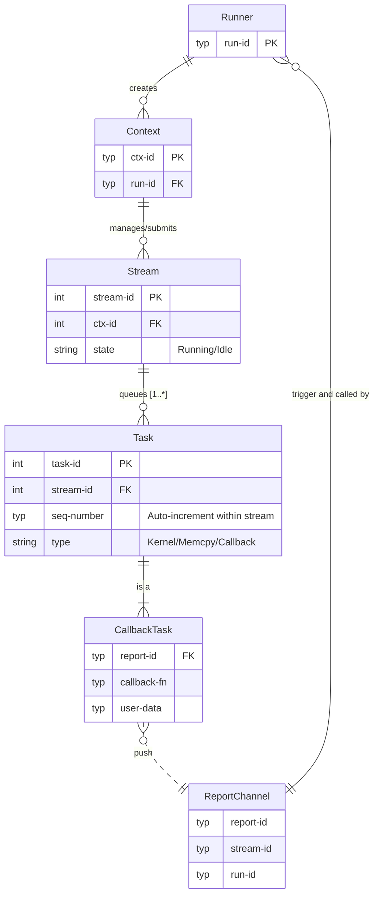
```mermaid
erDiagram
    Runner ||--o{ Context: "creates"
    Runner {
        typ run-id PK
    }

    Context {
        typ ctx-id PK
        typ run-id FK
    }

    Stream {
        int stream-id PK
        int ctx-id FK
        string state "Running/Idle"
    }

    %% Stream contains an ordered task list
    Context ||--o{ Stream : "manages/submits"
    Stream ||--o{ Task : "queues [1..*]"

    Task {
        int task-id PK
        int stream-id FK
        typ seq-number "Auto-increment within stream"
        string type "Kernel/Memcpy/Callback"
    }

    %% Various concrete Task types (logical inheritance)
    CallbackTask {
        typ report-id FK
        typ callback-fn
        typ user-data
    }  

    %% Inheritance expression (Task has multiple subtypes)
    Task ||--|{ CallbackTask : "is a"

    ReportChannel {
        typ report-id
        typ stream-id
        typ run-id
    }  

    CallbackTask }o ..|| ReportChannel : "push"  
    ReportChannel ||--o{ Runner : "trigger and called by"

```

### 5.1 Key Relationship Description (Callback and Report Relationship Modeling)

When the ==**Device**== executes a CallbackTask, it triggers the Host Runner thread to run the callback.

#### 5.1.1 API Mapping Table (Callback and Report Relationship Modeling)

| Entity        | Key Management Interfaces                                         |
| ------------- | ----------------------------------------------------------------- |
| CallbackTask  | `rtSetExceptionInfoCallback`, `rtLaunchCallback`,`rtSynchronizeEvent` |
| ReportChannel | `rtSubscribeReport`, `rtUnSubscribeReport`                        |
| Runner        | `rtProcessReport`                                                 |

## 6. Basic `Device` Model Fine-Grained Low-Level Extension

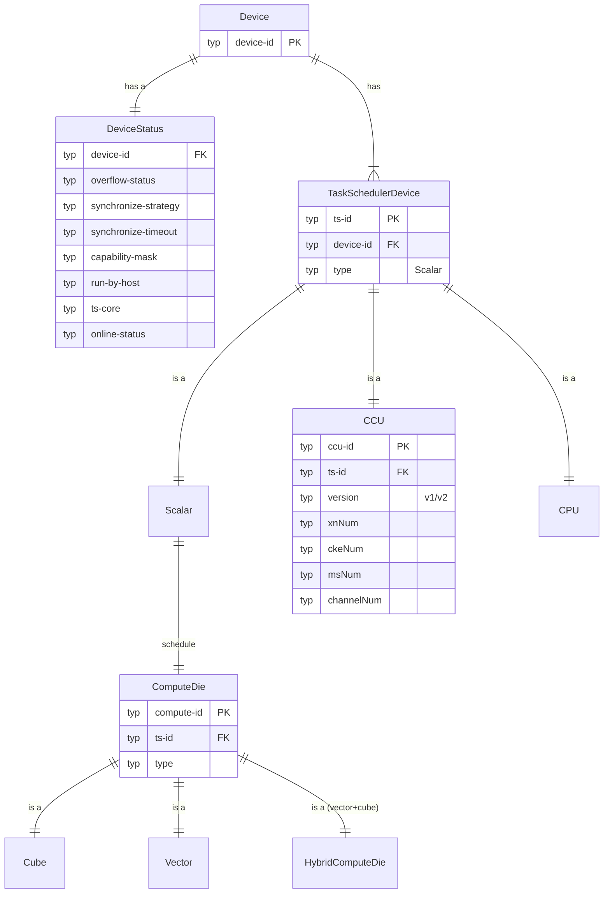
```mermaid
erDiagram

    Device ||--|| DeviceStatus : "has a"
    Device ||--|{ TaskSchedulerDevice : "has "
    Device {
        typ device-id PK
    }
    DeviceStatus {
        typ device-id FK
        typ overflow-status
        typ synchronize-strategy
        typ synchronize-timeout
        typ capability-mask
        typ run-by-host
        typ ts-core
        typ online-status
    }

    TaskSchedulerDevice  ||--|| Scalar :"is a"
    TaskSchedulerDevice  ||--|| CCU :"is a"
    TaskSchedulerDevice  ||--|| CPU :"is a"
    TaskSchedulerDevice {
        typ ts-id PK
        typ device-id FK
        typ type "Scalar"
    }

   CPU {
   }  

   Scalar ||--|| ComputeDie :"schedule"
   Scalar {
   }

   CCU {
        typ ccu-id PK
        typ ts-id FK
        typ version "v1/v2"
        typ xnNum
        typ ckeNum
        typ msNum
        typ channelNum
    }

    ComputeDie  ||--|| Cube :"is a"
    ComputeDie  ||--|| Vector :"is a"
    ComputeDie  ||--|| HybridComputeDie :"is a  (vector+cube)"
    ComputeDie {
        typ compute-id PK
        typ ts-id FK
        typ type
    }  
    Cube {
    }
    Vector {
    }
```

### 6.1 Key Relationship Description (Basic `Device` Model Fine-Grained Low-Level Extension)

**Device scheduler hierarchy**:

- `TaskSchedulerDevice` is the abstraction for device schedulers. A Device can contain multiple schedulers.
- Scheduler types include: `Scalar` (scalar processor), `CCU` (collective communication unit), `CPU` (AI CPU)
- Different scheduler types handle different computation task types.

**ComputeDie computation units**:

- `ComputeDie` is the abstraction for computation units. The inheritance hierarchy represents computation unit types.
- `Vector`: Vector computation unit that handles vector operations.
- `Cube`: Cube computation unit that handles matrix operations.
- `HybridComputeDie`: Hybrid computation unit that supports both Vector and Cube.

**CCU internal structure**:

- `xnNum`: XN node count (cross-node communication)
- `ckeNum`: CKE engine count (Checksum engine)
- `msNum`: MS module count (Memory Scheduler)
- `channelNum`: Communication channel count.
- `version`: CCU version (v1/v2, determines feature differences)

**DeviceStatus state management**:

- `overflow-status`: Overflow status.
- `synchronize-strategy`: Synchronization strategy configuration.
- `synchronize-timeout`: Synchronization timeout setting.
- `capability-mask`: Device capability mask.
- `run-by-host`: Whether the device runs in Host mode.
- `ts-core`: Scheduler core count.
- `online-status`: Device online status.

**Scalar scheduling relationship**:

- The `Scalar` scheduler manages `ComputeDie` execution.
- Different ComputeDie types correspond to different computation workloads.

#### 6.1.1 API Mapping Table (Basic Device Model Fine-Grained Low-Level Extension)

| Entity              | Key Management Interfaces        |
| ------------------- | -------------------------------- |
| TaskSchedulerDevice | `rtGetDeviceInfo`, `rtSetTsDevice` |
| DeviceStatus        | `rtGetRunMode`                   |

## 7. Kernel Runtime Relationship Modeling

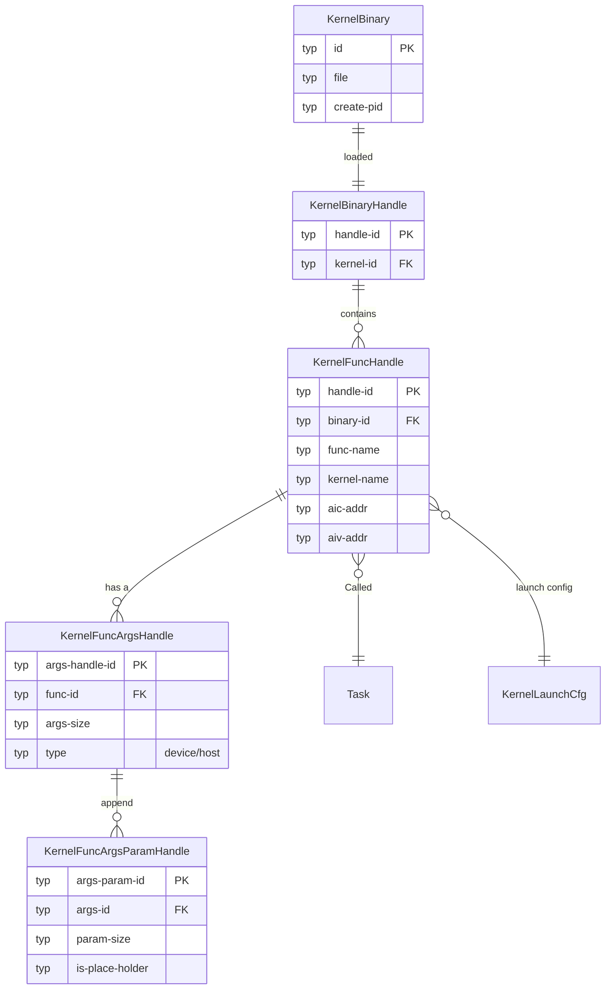
```mermaid
erDiagram
    KernelBinary {
        typ id PK
        typ file
        typ create-pid
    }

    KernelBinary  ||--|| KernelBinaryHandle :"loaded"
    KernelBinaryHandle  ||--o{ KernelFuncHandle :"contains"
    KernelBinaryHandle {
        typ handle-id PK
        typ kernel-id FK
    }

    KernelFuncHandle  ||--o{ KernelFuncArgsHandle :"has a"
    KernelFuncHandle  }o--|| Task :"Called "
    KernelFuncHandle  }o--|| KernelLaunchCfg :"launch config"
    KernelFuncHandle {
        typ handle-id PK
        typ binary-id FK
        typ func-name
        typ kernel-name
        typ aic-addr
        typ aiv-addr
    }

    KernelFuncArgsHandle  ||--o{ KernelFuncArgsParamHandle :"append"
    KernelFuncArgsHandle {
        typ args-handle-id PK
        typ func-id FK
        typ args-size
        typ type "device/host"
    }

    KernelFuncArgsParamHandle {
        typ args-param-id PK
        typ args-id FK
        typ param-size
        typ is-place-holder
    }
```

### 7.1 Key Relationship Description (Kernel Runtime Relationship Modeling)

**KernelBinary loading flow**:

1. `KernelBinary` stores the file path of .o/.so binary files and the creator process PID.
2. `rtBinaryLoadFromFile` or `rtBinaryLoadFromData` loads the binary into device memory.
3. Loading produces a `KernelBinaryHandle` that contains handle-id and kernel-id.
4. `KernelFuncHandle` represents a specific function in the binary and contains func-name, kernel-name, and address information.

**Kernel function call relationships**:

- `aic-addr` is the AI Core function address.
- `aiv-addr` is the AI Vector function address.
- `KernelFuncArgsHandle` stores function argument information.
- `KernelFuncArgsParamHandle` records parameter size and whether the parameter is a placeholder.
- `KernelLaunchCfg` configures Kernel launch parameters (block/grid, and so on)

**Kernel lifecycle**:

```text
rtCreateBinary -> rtBinaryLoad -> rtBinaryGetFunction 
                -> rtLaunchKernel(funcHandle, argsHandle, cfg)
                -> rtBinaryUnLoad -> rtDestroyBinary
```

**Parameter management mechanism**:

- args-handle supports both device and host types.
- is-place-holder identifies whether a parameter is a placeholder (deferred binding)
- param-size records the size of a single parameter.

#### 7.1.1 API Mapping Table (Kernel Runtime Relationship Modeling)

| Entity             | Key Management Interfaces                                                                                         |
| ------------------ | ----------------------------------------------------------------------------------------------------------------- |
| KernelBinary       | `rtCreateBinary`, `rtDestroyBinary`                                                                               |
| KernelBinaryHandle | `rtBinaryLoad`, `rtBinaryUnLoad`,`rtBinaryLoadFromFile`,`rtBinaryLoadFromData`                                    |
| KernelFuncHandle   | `rtBinaryGetFunction`, `rtBinaryGetFunctionByEntry`,`rtGetFunctionAddr`,`rtGetFunctionName`,`rtRegisterCpuFunc`   |

## 8. Model Loading Relationship Modeling
